<!-- README.md is generated from README.Rmd. Please edit that file -->

`iNEXT.seq` (iNterpolation and EXTrapolation for UniFrac distance) is an
R package. In this document, we provide a quick introduction
demonstrating how to run `iNEXT.seq`. Detailed information about
`iNEXT.seq` functions is provided in the iNEXT.seq manual, also
available in [CRAN](https://cran.r-project.org/package=iNEXT.seq). An
online version of
[iNEXT.seq-online](http://chao.stat.nthu.edu.tw/wordpress/software_download/iNEXT.seq-online/)
is also available for users without an R background.

`iNEXT.seq` introduces a novel method for measuring UniFrac distance by
applying dissimilarity measures based on the multiple-assemblage
decomposition approaches of Chiu, Jost, and Chao (2014), as well as
Routledge (1979). It primarily considers three measures of Hill numbers:
species richness (`q = 0`), Shannon diversity (`q = 1`, the exponential
of Shannon entropy), and Simpson diversity (`q = 2`, the inverse of
Simpson concentration).

Utilizing the observed sample of OTU count data (the “reference
sample”), `iNEXT.seq` calculates UniFrac distance estimates and
associated confidence intervals for coverage-based rarefaction and
extrapolation (R/E) curves. By performing a monotonic transformation on
phylogenetic beta diversity for rarefied and extrapolated samples, based
on standardized levels of sample completeness (measured by sample
coverage), `iNEXT.seq` plots diversity estimates against sample coverage
on a coverage-based sampling curve. In addition, `iNEXT.seq` provides
asymptotic estimates phylogenetic diversity and dissimilarity for
multiple-assemblage and hierarchical decompositions under Chiu’s et
al.’s (2014) and Routledge’s (1979) framework, as well as diversity
profiles for order q.

`iNEXT.seq` features two statistical analyses for multiple assemblages
(non-asymptotic and asymptotic), and asymptotic statistical analysis for
hierarchical structure data:

1)  A non-asymptotic approach based on interpolation and extrapolation
    for multiple-assemblage phylogenetic diversity

For abundance data, two types of R/E (rarefaction/extrapolation)
sampling curves are available:

Two types of R/E sampling curves:

- **Sample-size-based (or size-based) R/E curves**: This type of
  sampling curve plots standardized phylogenetic gamma and alpha
  diversity with respect to sample size.
- **Coverage‐based R/E sampling curves**: This type of sampling curve
  plots standardized phylogenetic gamma, alpha, and beta diversity as
  well as four classes of dissimilarity measures with respect to sample
  coverage (an objective measure of sample completeness).

Both curve types support two decomposition approaches:

Relative: Based on Routledge’s (1979) method, which compares node
relative abundances using size-weighted assemblages.

Absolute: Based on Chiu et al.’s (2014) method, which compares node raw
abundances without applying assemblage size weights.

For incidence data, based on the framework of Chiu et al. (2015),
iNEXT.seq also provides rarefaction and extrapolation of phylogenetic
diversity via two types of sampling curves:

- **Sample-size-based (or size-based) R/E curves**: This type of
  sampling curve plots standardized phylogenetic gamma and alpha
  diversity with respect to sample size.
- **Coverage‐based R/E sampling curves**: This type of sampling curve
  plots standardized phylogenetic gamma, alpha, and beta diversity as
  well as four classes of dissimilarity measures with respect to sample
  coverage (an objective measure of sample completeness).

2)  An asymptotic approach to infer asymptotic phylogenetic diversity
    for multiple-assemblage data

iNEXT.seq computes the estimated asymptotic phylogenetic gamma, alpha,
and beta diversity as well as four classes of dissimilarity measures and
also plots profiles (q-profiles) for order q between 0 and 2 (by
default), in comparison with the observed diversity and dissimilarity
measures. Additionally, two types of beta diversity decomposition
calculations are provided:

- **Relative**: Routledge’s (1979) approach for comparing node relative
  abundances for size-weighted assemblages.
- **Absolute**: Chiu et al.’s (2014) approach for comparing node raw
  abundances.

3)  An asymptotic approach to infer asymptotic phylogenetic diversity
    for hierarchical structure data

Based on above asymptotic approach for multiple assemblages, we
introduce a hierarchical structural estimation, calculate the
hierarchical phylogenetic diversity and dissimilarity measures, and also
plots profiles (q-profiles) for order q.

Note that sufficient data are needed to run iNEXT.seq. If your data
comprises only a few species and their phylogenies, it is probable that
the data lack sufficient information to run iNEXT.seq.

## HOW TO CITE iNEXT.seq

If you publish your work based on the results from the `iNEXT.seq`
package, you should make references to the following methodology paper:

- Routledge, R. (1979). Diversity indices: which ones are admissible?
  *Journal of Theoretical Biology*, 76(4), 503-515.
- Chiu, C.-H., Jost, L. and Chao\*, A. (2014). Phylogenetic beta
  diversity, similarity, and differentiation measures based on Hill
  numbers. *Ecological Monographs*, 84, 21-44.
- Chao, A., Chiu, C.-H., Hsieh, T. C., Davis, T., Nipperess, D., and
  Faith, D. (2015) Rarefaction and extrapolation of phylogenetic
  diversity.*Methods in Ecology and Evolution*, 6, 380-388.

## SOFTWARE NEEDED TO RUN iNEXT.seq IN R

- Required: [R](https://cran.r-project.org/)
- Suggested: [RStudio
  IDE](https://www.rstudio.com/products/RStudio/#Desktop)

## HOW TO RUN iNEXT.seq:

The `iNEXT.seq` package is available from
[CRAN](https://cran.r-project.org/package=iNEXT.seq) and can be
downloaded with a standard R installation procedure or can be downloaded
from Anne Chao’s
[iNEXT.seq_github](https://github.com/yayunteng/iNEXT.seq) using the
following commands. For a first-time installation, an additional
visualization extension package (`ggplot2`) must be installed and
loaded.

``` r
## install iNEXT.seq package from CRAN
install.packages("iNEXT.seq")
## install the latest version from github
install.packages('devtools')
library(devtools)
install_github('YUCHIAO-SHIH/iNEXT.seq')
## import packages
library(iNEXT.seq)
```

Here are eight main functions we provide in this package :

four functions for non-asymptotic analysis for multiple-assemblage
phylogenetic diversity with graphical displays:

- **iNEXTseq** : Computes standardized phylogenetic diversity estimates
  of order q = 0, 1 and 2 for rarefied and extrapolated samples at
  specified sample coverage values and sample sizes.

- **ggiNEXTseq** : Visualizing the output from the function `iNEXTseq`

- **iNEXT_seq_Relative** : Computes standardized phylogenetic diversity
  estimates of order q = 0, 1 and 2 for rarefied and extrapolated
  samples at specified sample coverage values and sample sizes.

- **ggiNEXT_seq_Relative** : Visualizing the output from the function
  `iNEXTseq`

Two functions for asymptotic analysis for multiple-assemblage
phylogenetic diversity with graphical displays:

- **ObsAsyPD** : Computes observed and asymptotic diversity of order q
  between 0 and 2 (in increments of 0.2) for multiple-assemblage
  phylogenetic diversity.
- **ggObsAsyPD** : Visualizing the output from the function `ObsAsyPD`

Two functions for asymptotic analysis for hierarchical phylogenetic
diversity with graphical displays:

- **hierPD** : Computes observed and asymptotic diversity of order q
  between 0 and 2 (in increments of 0.2) for hierarchical phylogenetic
  diversity.
- **gghierPD** : Visualizing the output from the function `hierPD`

## MAIN FUNCTION: iNEXTseq()

We first describe the main function `iNEXTseq()` with default arguments:

``` r
iNEXTseq(data, q=c(0,1,2), base = "coverage", datatype = "abundance",level = NULL, nboot = 10, conf = 0.95, PDtree = NULL, PDreftime = NULL, PDtype = 'meanPD')
```

The arguments of this function are briefly described below and will be
further explained through illustrative examples in the following text.
This main function computes gamma, alpha, and beta diversity estimates
of order q at specified sample coverage or sample size, based on the
multiple-assemblage diversity decomposition proposed by Chiu et
al. (2014).

By default, if <code>base = “size”</code> and <code>level = NULL</code>,
the function computes gamma and alpha diversity estimates up to twice
the reference sample size in each region. If <code>base =
“coverage”</code> and <code>level = NULL</code>, the function computes
gamma, alpha, beta diversity, and four dissimilarity/turnover indices up
to coverage = 1 (for <code>q = 1, 2</code>) or up to the coverage
corresponding to double the reference sample size (for <code>q =
0</code>).

<table style="width:100%;">

<colgroup>

<col width="20%">

<col width="80%">

</colgroup>

<thead>

<tr class="header">

<th align="center">

Argument
</th>

<th align="left">

Description
</th>

</tr>

</thead>

<tbody>

<tr class="odd">

<td align="center">

<code>data</code>
</td>

<td align="left">

OTU count data can be input as a <code>matrix/data.frame</code> (species
by assemblages), or a list of <code>matrices/data.frames</code>, each
matrix represents species-by-assemblages abundance matrix.
</td>

</tr>

<tr class="even">

<td align="center">

<code>q</code>
</td>

<td align="left">

a numerical vector specifying the diversity orders. Default is
<code>c(0, 1, 2)</code>.
</td>

<tr class="odd">

<td align="center">

<code>datatype</code>
</td>

<td align="left">

a character string specifying the data type: <code>“abundance”</code>
(individual-based OTU count data) or <code>“incidence_raw”</code>
(sampling-unit-based incidence data). <br> For <code>“abundance”</code>,
input should be a <code>matrix/data.frame</code> or a list of such
matrices (species-by-assemblages). <br> For
<code>“incidence_raw”</code>, input should be a list of lists, where
each element represents a dataset, and each dataset contains a list of
species-by-sampling-unit incidence matrices (one per assemblage).
</td>

</tr>

</tr>

<tr class="odd">

<td align="center">

<code>base</code>
</td>

<td align="left">

Sample-sized-based rarefaction and extrapolation for gamma and alpha
diversity (<code>base = “size”</code>) or coverage-based rarefaction and
extrapolation for gamma, alpha and beta diversity (<code>base =
“coverage”</code>). Default is <code>base = “coverage”</code>.
</td>

</tr>

<tr class="even">

<td align="center">

<code>level</code>
</td>

<td align="left">

A numerical vector specifying the particular value of sample coverage
(between 0 and 1 when <code>base = “coverage”</code>) or sample size
(<code>base = “size”</code>). <code>level = 1</code> (<code>base =
“coverage”</code>) means complete coverage (the corresponding diversity
represents asymptotic diversity).

If <code>base = “size”</code> and <code>level = NULL</code>, then this
function computes the gamma and alpha diversity estimates up to double
the reference sample size.

If <code>base = “coverage”</code> and <code>level = NULL</code>, then
this function computes the gamma and alpha diversity estimates up to one
(for <code>q = 1, 2</code>) or up to the coverage of double the
reference sample size (for <code>q = 0</code>); the corresponding beta
diversity and dissimilarity are computed up to the same maximum coverage
as the alpha diversity.
</td>

</tr>

<tr class="odd">

<td align="center">

<code>nboot</code>
</td>

<td align="left">

a positive integer specifying the number of bootstrap replications when
assessing sampling uncertainty and constructing confidence intervals.
Bootstrap replications are generally time consuming. Enter
<code>0</code> to skip the bootstrap procedures. Default is
<code>10</code>. Note that large bootstrap replication needs more run
time.
</td>

</tr>

<tr class="even">

<td align="center">

<code>conf</code>
</td>

<td align="left">

a positive number \< 1 specifying the level of confidence interval.
Default is <code>0.95</code>.
</td>

</tr>

<tr class="odd">

<td align="center">

<code>PDtree</code>
</td>

<td align="left">

a <code>phylo</code>, a phylogenetic tree in Newick format for all
observed species in the pooled assemblage.
</td>

</tr>

<tr class="even">

<td align="center">

<code>PDreftime</code>
</td>

<td align="left">

a numerical value specifying reference time for PD. Default is
<code>NULL</code> (i.e., the age of the root of PDtree).
</td>

<tr class="odd">

<td align="center">

<code>PDtype</code>
</td>

<td align="left">

Type of phylogenetic diversity (PD) to report: <code>“meanPD”</code>
(default), which reports the mean diversity per unit of reference time,
or <code>“PD”</code>, which reports total phylogenetic diversity
accumulated up to the specified reference time.
</td>

</tr>

</tbody>

</table>

This function returns an `"iNEXTseq"` object which can be further used
to make plots using the function `ggiNEXTseq()` to be described below.

## DATA FORMAT/INFORMATION

Input data for each data set with several assemblages/sites include
samples species abundances in an empirical sample of n individuals
(“reference sample”). When there are N assemblages in a data set, input
data consist of a list with an S by N abundance matrix; For M data sets
consisting N assemblages, input data should be M lists of S by N
abundance matrix.

A data set (a small example dataset from a human esophageal community)
is included in `iNEXT.seq` package for illustration. The data consist a
list with four species-by-assemblage data.frames (“T03T04”, “T09T10”).
For the data, the following commands display how to compute estimate at
specified sample coverage.

Run the following code to view first list of `fungi` OTU count data:
(Here we only show the first ten rows for the matrix)

``` r
data("fungi")
fungi[1]
```

    #> $T03T04
    #>           T03 T04
    #> OTU_00013 261  15
    #> OTU_00001 164   7
    #> OTU_00004   4  39
    #> OTU_00005   2   0
    #> OTU_00020   0   0
    #> OTU_00017   3  29
    #> OTU_00009   1  70
    #> OTU_00003  11  19
    #> OTU_00006   0  16
    #> OTU_00002   0   6

This function returns an `"iNEXTseq"` object which can be further used
to make plots using the function `ggiNEXTseq()` to be described below.

When `base = 'coverage'`, the `iNEXTseq()` function returns the
`"iNEXTseq"` object including seven data frames for each data sets:

- gamma
- alpha
- beta
- 1-C (Sorensen-type non-overlap )
- 1-U (Jaccard-type non-overlap )
- 1-V (Sorensen-type turnover )
- 1-S (Jaccard-type turnover )

When `base = 'size'`, the `iNEXTseq()` function returns the `"iNEXTseq"`
object including two data frames for each data sets:

- gamma
- alpha

## Rarefaction/Extrapolation Via Examples

Run the `iNEXTseq()` function with `fungi` data to compute
multiple-assemblage phylogenetic diversity standardized by sample
coverage. (Here we only show the first six rows for each output data
frame)

``` r
data("fungi")
data("fungi_tree")

out = iNEXTseq(data = fungi[1], q = c(0, 1, 2), nboot = 10, datatype ="abundance",
               PDtree = fungi_tree, PDreftime = NULL)
```

    #> ℹ invalid tbl_tree object. Missing column: label.
    #> ℹ invalid tbl_tree object. Missing column: parent,node,label.
    #> ℹ invalid tbl_tree object. Missing column: parent,node,label.
    #> ℹ invalid tbl_tree object. Missing column: parent,node,label.
    #> ℹ invalid tbl_tree object. Missing column: parent,node,label.
    #> ℹ invalid tbl_tree object. Missing column: parent,node,label.
    #> ℹ invalid tbl_tree object. Missing column: parent,node,label.
    #> ℹ invalid tbl_tree object. Missing column: parent,node,label.
    #> ℹ invalid tbl_tree object. Missing column: parent,node,label.
    #> ℹ invalid tbl_tree object. Missing column: parent,node,label.
    #> ℹ invalid tbl_tree object. Missing column: parent,node,label.
    #> ℹ invalid tbl_tree object. Missing column: parent,node,label.
    #> ℹ invalid tbl_tree object. Missing column: parent,node,label.
    #> ℹ invalid tbl_tree object. Missing column: parent,node,label.
    #> ℹ invalid tbl_tree object. Missing column: parent,node,label.
    #> ℹ invalid tbl_tree object. Missing column: parent,node,label.
    #> ℹ invalid tbl_tree object. Missing column: parent,node,label.
    #> ℹ invalid tbl_tree object. Missing column: parent,node,label.
    #> ℹ invalid tbl_tree object. Missing column: parent,node,label.
    #> ℹ invalid tbl_tree object. Missing column: parent,node,label.
    #> ℹ invalid tbl_tree object. Missing column: parent,node,label.
    #> ℹ invalid tbl_tree object. Missing column: parent,node,label.
    #> ℹ invalid tbl_tree object. Missing column: parent,node,label.
    #> ℹ invalid tbl_tree object. Missing column: parent,node,label.
    #> ℹ invalid tbl_tree object. Missing column: parent,node,label.
    #> ℹ invalid tbl_tree object. Missing column: parent,node,label.
    #> ℹ invalid tbl_tree object. Missing column: parent,node,label.
    #> ℹ invalid tbl_tree object. Missing column: parent,node,label.
    #> ℹ invalid tbl_tree object. Missing column: parent,node,label.
    #> ℹ invalid tbl_tree object. Missing column: parent,node,label.
    #> ℹ invalid tbl_tree object. Missing column: parent,node,label.
    #> ℹ invalid tbl_tree object. Missing column: parent,node,label.
    #> ℹ invalid tbl_tree object. Missing column: parent,node,label.
    #> ℹ invalid tbl_tree object. Missing column: parent,node,label.
    #> ℹ invalid tbl_tree object. Missing column: parent,node,label.
    #> ℹ invalid tbl_tree object. Missing column: parent,node,label.
    #> ℹ invalid tbl_tree object. Missing column: parent,node,label.
    #> ℹ invalid tbl_tree object. Missing column: parent,node,label.
    #> ℹ invalid tbl_tree object. Missing column: parent,node,label.
    #> ℹ invalid tbl_tree object. Missing column: parent,node,label.
    #> ℹ invalid tbl_tree object. Missing column: parent,node,label.
    #> ℹ invalid tbl_tree object. Missing column: parent,node,label.
    #> ℹ invalid tbl_tree object. Missing column: parent,node,label.
    #> ℹ invalid tbl_tree object. Missing column: parent,node,label.
    #> ℹ invalid tbl_tree object. Missing column: parent,node,label.
    #> ℹ invalid tbl_tree object. Missing column: parent,node,label.
    #> ℹ invalid tbl_tree object. Missing column: parent,node,label.
    #> ℹ invalid tbl_tree object. Missing column: parent,node,label.
    #> ℹ invalid tbl_tree object. Missing column: parent,node,label.
    #> ℹ invalid tbl_tree object. Missing column: parent,node,label.
    #> ℹ invalid tbl_tree object. Missing column: parent,node,label.
    #> ℹ invalid tbl_tree object. Missing column: parent,node,label.
    #> ℹ invalid tbl_tree object. Missing column: parent,node,label.
    #> ℹ invalid tbl_tree object. Missing column: parent,node,label.
    #> ℹ invalid tbl_tree object. Missing column: parent,node,label.
    #> ℹ invalid tbl_tree object. Missing column: parent,node,label.
    #> ℹ invalid tbl_tree object. Missing column: parent,node,label.
    #> ℹ invalid tbl_tree object. Missing column: parent,node,label.
    #> ℹ invalid tbl_tree object. Missing column: parent,node,label.
    #> ℹ invalid tbl_tree object. Missing column: parent,node,label.
    #> ℹ invalid tbl_tree object. Missing column: parent,node,label.
    #> ℹ invalid tbl_tree object. Missing column: parent,node,label.
    #> ℹ invalid tbl_tree object. Missing column: parent,node,label.
    #> ℹ invalid tbl_tree object. Missing column: parent,node,label.
    #> ℹ invalid tbl_tree object. Missing column: parent,node,label.
    #> ℹ invalid tbl_tree object. Missing column: parent,node,label.
    #> ℹ invalid tbl_tree object. Missing column: parent,node,label.
    #> ℹ invalid tbl_tree object. Missing column: parent,node,label.
    #> ℹ invalid tbl_tree object. Missing column: parent,node,label.
    #> ℹ invalid tbl_tree object. Missing column: parent,node,label.
    #> ℹ invalid tbl_tree object. Missing column: parent,node,label.
    #> ℹ invalid tbl_tree object. Missing column: parent,node,label.
    #> ℹ invalid tbl_tree object. Missing column: parent,node,label.
    #> ℹ invalid tbl_tree object. Missing column: parent,node,label.
    #> ℹ invalid tbl_tree object. Missing column: parent,node,label.
    #> ℹ invalid tbl_tree object. Missing column: parent,node,label.
    #> ℹ invalid tbl_tree object. Missing column: parent,node,label.
    #> ℹ invalid tbl_tree object. Missing column: parent,node,label.
    #> ℹ invalid tbl_tree object. Missing column: parent,node,label.
    #> ℹ invalid tbl_tree object. Missing column: parent,node,label.
    #> ℹ invalid tbl_tree object. Missing column: parent,node,label.
    #> ℹ invalid tbl_tree object. Missing column: parent,node,label.
    #> ℹ invalid tbl_tree object. Missing column: parent,node,label.
    #> ℹ invalid tbl_tree object. Missing column: parent,node,label.
    #> ℹ invalid tbl_tree object. Missing column: parent,node,label.
    #> ℹ invalid tbl_tree object. Missing column: parent,node,label.
    #> ℹ invalid tbl_tree object. Missing column: parent,node,label.
    #> ℹ invalid tbl_tree object. Missing column: parent,node,label.
    #> ℹ invalid tbl_tree object. Missing column: parent,node,label.
    #> ℹ invalid tbl_tree object. Missing column: parent,node,label.
    #> ℹ invalid tbl_tree object. Missing column: label.
    #> ℹ invalid tbl_tree object. Missing column: parent,node,label.
    #> ℹ invalid tbl_tree object. Missing column: parent,node,label.
    #> ℹ invalid tbl_tree object. Missing column: parent,node,label.
    #> ℹ invalid tbl_tree object. Missing column: parent,node,label.
    #> ℹ invalid tbl_tree object. Missing column: parent,node,label.
    #> ℹ invalid tbl_tree object. Missing column: parent,node,label.
    #> ℹ invalid tbl_tree object. Missing column: parent,node,label.
    #> ℹ invalid tbl_tree object. Missing column: parent,node,label.
    #> ℹ invalid tbl_tree object. Missing column: parent,node,label.
    #> ℹ invalid tbl_tree object. Missing column: parent,node,label.
    #> ℹ invalid tbl_tree object. Missing column: parent,node,label.
    #> ℹ invalid tbl_tree object. Missing column: parent,node,label.
    #> ℹ invalid tbl_tree object. Missing column: parent,node,label.
    #> ℹ invalid tbl_tree object. Missing column: parent,node,label.
    #> ℹ invalid tbl_tree object. Missing column: parent,node,label.
    #> ℹ invalid tbl_tree object. Missing column: parent,node,label.
    #> ℹ invalid tbl_tree object. Missing column: parent,node,label.
    #> ℹ invalid tbl_tree object. Missing column: parent,node,label.
    #> ℹ invalid tbl_tree object. Missing column: parent,node,label.
    #> ℹ invalid tbl_tree object. Missing column: parent,node,label.
    #> ℹ invalid tbl_tree object. Missing column: parent,node,label.
    #> ℹ invalid tbl_tree object. Missing column: parent,node,label.
    #> ℹ invalid tbl_tree object. Missing column: parent,node,label.
    #> ℹ invalid tbl_tree object. Missing column: parent,node,label.
    #> ℹ invalid tbl_tree object. Missing column: parent,node,label.
    #> ℹ invalid tbl_tree object. Missing column: parent,node,label.
    #> ℹ invalid tbl_tree object. Missing column: parent,node,label.
    #> ℹ invalid tbl_tree object. Missing column: parent,node,label.
    #> ℹ invalid tbl_tree object. Missing column: parent,node,label.
    #> ℹ invalid tbl_tree object. Missing column: parent,node,label.
    #> ℹ invalid tbl_tree object. Missing column: parent,node,label.
    #> ℹ invalid tbl_tree object. Missing column: parent,node,label.
    #> ℹ invalid tbl_tree object. Missing column: parent,node,label.
    #> ℹ invalid tbl_tree object. Missing column: parent,node,label.
    #> ℹ invalid tbl_tree object. Missing column: parent,node,label.
    #> ℹ invalid tbl_tree object. Missing column: parent,node,label.
    #> ℹ invalid tbl_tree object. Missing column: parent,node,label.
    #> ℹ invalid tbl_tree object. Missing column: parent,node,label.
    #> ℹ invalid tbl_tree object. Missing column: parent,node,label.
    #> ℹ invalid tbl_tree object. Missing column: parent,node,label.
    #> ℹ invalid tbl_tree object. Missing column: parent,node,label.
    #> ℹ invalid tbl_tree object. Missing column: parent,node,label.
    #> ℹ invalid tbl_tree object. Missing column: parent,node,label.
    #> ℹ invalid tbl_tree object. Missing column: label.
    #> ℹ invalid tbl_tree object. Missing column: parent,node,label.
    #> ℹ invalid tbl_tree object. Missing column: parent,node,label.
    #> ℹ invalid tbl_tree object. Missing column: parent,node,label.
    #> ℹ invalid tbl_tree object. Missing column: parent,node,label.
    #> ℹ invalid tbl_tree object. Missing column: parent,node,label.
    #> ℹ invalid tbl_tree object. Missing column: parent,node,label.
    #> ℹ invalid tbl_tree object. Missing column: parent,node,label.
    #> ℹ invalid tbl_tree object. Missing column: parent,node,label.
    #> ℹ invalid tbl_tree object. Missing column: parent,node,label.
    #> ℹ invalid tbl_tree object. Missing column: parent,node,label.
    #> ℹ invalid tbl_tree object. Missing column: parent,node,label.
    #> ℹ invalid tbl_tree object. Missing column: parent,node,label.
    #> ℹ invalid tbl_tree object. Missing column: parent,node,label.
    #> ℹ invalid tbl_tree object. Missing column: parent,node,label.
    #> ℹ invalid tbl_tree object. Missing column: parent,node,label.
    #> ℹ invalid tbl_tree object. Missing column: parent,node,label.
    #> ℹ invalid tbl_tree object. Missing column: parent,node,label.
    #> ℹ invalid tbl_tree object. Missing column: parent,node,label.
    #> ℹ invalid tbl_tree object. Missing column: parent,node,label.
    #> ℹ invalid tbl_tree object. Missing column: parent,node,label.
    #> ℹ invalid tbl_tree object. Missing column: parent,node,label.
    #> ℹ invalid tbl_tree object. Missing column: parent,node,label.
    #> ℹ invalid tbl_tree object. Missing column: parent,node,label.
    #> ℹ invalid tbl_tree object. Missing column: parent,node,label.
    #> ℹ invalid tbl_tree object. Missing column: parent,node,label.
    #> ℹ invalid tbl_tree object. Missing column: parent,node,label.
    #> ℹ invalid tbl_tree object. Missing column: parent,node,label.
    #> ℹ invalid tbl_tree object. Missing column: parent,node,label.
    #> ℹ invalid tbl_tree object. Missing column: parent,node,label.
    #> ℹ invalid tbl_tree object. Missing column: parent,node,label.
    #> ℹ invalid tbl_tree object. Missing column: parent,node,label.
    #> ℹ invalid tbl_tree object. Missing column: parent,node,label.
    #> ℹ invalid tbl_tree object. Missing column: parent,node,label.
    #> ℹ invalid tbl_tree object. Missing column: parent,node,label.
    #> ℹ invalid tbl_tree object. Missing column: parent,node,label.
    #> ℹ invalid tbl_tree object. Missing column: parent,node,label.
    #> ℹ invalid tbl_tree object. Missing column: parent,node,label.
    #> ℹ invalid tbl_tree object. Missing column: parent,node,label.
    #> ℹ invalid tbl_tree object. Missing column: parent,node,label.
    #> ℹ invalid tbl_tree object. Missing column: parent,node,label.
    #> ℹ invalid tbl_tree object. Missing column: parent,node,label.
    #> ℹ invalid tbl_tree object. Missing column: parent,node,label.
    #> ℹ invalid tbl_tree object. Missing column: parent,node,label.
    #> ℹ invalid tbl_tree object. Missing column: parent,node,label.
    #> ℹ invalid tbl_tree object. Missing column: parent,node,label.
    #> ℹ invalid tbl_tree object. Missing column: parent,node,label.
    #> ℹ invalid tbl_tree object. Missing column: parent,node,label.
    #> ℹ invalid tbl_tree object. Missing column: parent,node,label.
    #> ℹ invalid tbl_tree object. Missing column: parent,node,label.
    #> ℹ invalid tbl_tree object. Missing column: parent,node,label.
    #> ℹ invalid tbl_tree object. Missing column: parent,node,label.
    #> ℹ invalid tbl_tree object. Missing column: parent,node,label.
    #> ℹ invalid tbl_tree object. Missing column: parent,node,label.
    #> ℹ invalid tbl_tree object. Missing column: parent,node,label.
    #> ℹ invalid tbl_tree object. Missing column: parent,node,label.
    #> ℹ invalid tbl_tree object. Missing column: parent,node,label.
    #> ℹ invalid tbl_tree object. Missing column: parent,node,label.
    #> ℹ invalid tbl_tree object. Missing column: parent,node,label.
    #> ℹ invalid tbl_tree object. Missing column: parent,node,label.
    #> ℹ invalid tbl_tree object. Missing column: label.
    #> ℹ invalid tbl_tree object. Missing column: parent,node,label.
    #> ℹ invalid tbl_tree object. Missing column: parent,node,label.
    #> ℹ invalid tbl_tree object. Missing column: parent,node,label.
    #> ℹ invalid tbl_tree object. Missing column: parent,node,label.
    #> ℹ invalid tbl_tree object. Missing column: parent,node,label.
    #> ℹ invalid tbl_tree object. Missing column: parent,node,label.
    #> ℹ invalid tbl_tree object. Missing column: parent,node,label.
    #> ℹ invalid tbl_tree object. Missing column: parent,node,label.
    #> ℹ invalid tbl_tree object. Missing column: parent,node,label.
    #> ℹ invalid tbl_tree object. Missing column: parent,node,label.
    #> ℹ invalid tbl_tree object. Missing column: parent,node,label.
    #> ℹ invalid tbl_tree object. Missing column: parent,node,label.
    #> ℹ invalid tbl_tree object. Missing column: parent,node,label.
    #> ℹ invalid tbl_tree object. Missing column: parent,node,label.
    #> ℹ invalid tbl_tree object. Missing column: parent,node,label.
    #> ℹ invalid tbl_tree object. Missing column: parent,node,label.
    #> ℹ invalid tbl_tree object. Missing column: parent,node,label.
    #> ℹ invalid tbl_tree object. Missing column: parent,node,label.
    #> ℹ invalid tbl_tree object. Missing column: parent,node,label.
    #> ℹ invalid tbl_tree object. Missing column: parent,node,label.
    #> ℹ invalid tbl_tree object. Missing column: parent,node,label.
    #> ℹ invalid tbl_tree object. Missing column: parent,node,label.
    #> ℹ invalid tbl_tree object. Missing column: parent,node,label.
    #> ℹ invalid tbl_tree object. Missing column: parent,node,label.
    #> ℹ invalid tbl_tree object. Missing column: parent,node,label.
    #> ℹ invalid tbl_tree object. Missing column: parent,node,label.
    #> ℹ invalid tbl_tree object. Missing column: parent,node,label.
    #> ℹ invalid tbl_tree object. Missing column: parent,node,label.
    #> ℹ invalid tbl_tree object. Missing column: parent,node,label.
    #> ℹ invalid tbl_tree object. Missing column: parent,node,label.
    #> ℹ invalid tbl_tree object. Missing column: parent,node,label.
    #> ℹ invalid tbl_tree object. Missing column: parent,node,label.
    #> ℹ invalid tbl_tree object. Missing column: parent,node,label.
    #> ℹ invalid tbl_tree object. Missing column: parent,node,label.
    #> ℹ invalid tbl_tree object. Missing column: parent,node,label.
    #> ℹ invalid tbl_tree object. Missing column: parent,node,label.
    #> ℹ invalid tbl_tree object. Missing column: parent,node,label.
    #> ℹ invalid tbl_tree object. Missing column: parent,node,label.
    #> ℹ invalid tbl_tree object. Missing column: parent,node,label.
    #> ℹ invalid tbl_tree object. Missing column: parent,node,label.
    #> ℹ invalid tbl_tree object. Missing column: parent,node,label.
    #> ℹ invalid tbl_tree object. Missing column: parent,node,label.
    #> ℹ invalid tbl_tree object. Missing column: parent,node,label.
    #> ℹ invalid tbl_tree object. Missing column: label.
    #> ℹ invalid tbl_tree object. Missing column: parent,node,label.
    #> ℹ invalid tbl_tree object. Missing column: parent,node,label.
    #> ℹ invalid tbl_tree object. Missing column: parent,node,label.
    #> ℹ invalid tbl_tree object. Missing column: parent,node,label.
    #> ℹ invalid tbl_tree object. Missing column: parent,node,label.
    #> ℹ invalid tbl_tree object. Missing column: parent,node,label.
    #> ℹ invalid tbl_tree object. Missing column: parent,node,label.
    #> ℹ invalid tbl_tree object. Missing column: parent,node,label.
    #> ℹ invalid tbl_tree object. Missing column: parent,node,label.
    #> ℹ invalid tbl_tree object. Missing column: parent,node,label.
    #> ℹ invalid tbl_tree object. Missing column: parent,node,label.
    #> ℹ invalid tbl_tree object. Missing column: parent,node,label.
    #> ℹ invalid tbl_tree object. Missing column: parent,node,label.
    #> ℹ invalid tbl_tree object. Missing column: parent,node,label.
    #> ℹ invalid tbl_tree object. Missing column: parent,node,label.
    #> ℹ invalid tbl_tree object. Missing column: parent,node,label.
    #> ℹ invalid tbl_tree object. Missing column: parent,node,label.
    #> ℹ invalid tbl_tree object. Missing column: parent,node,label.
    #> ℹ invalid tbl_tree object. Missing column: parent,node,label.
    #> ℹ invalid tbl_tree object. Missing column: parent,node,label.
    #> ℹ invalid tbl_tree object. Missing column: parent,node,label.
    #> ℹ invalid tbl_tree object. Missing column: parent,node,label.
    #> ℹ invalid tbl_tree object. Missing column: parent,node,label.
    #> ℹ invalid tbl_tree object. Missing column: parent,node,label.
    #> ℹ invalid tbl_tree object. Missing column: parent,node,label.
    #> ℹ invalid tbl_tree object. Missing column: parent,node,label.
    #> ℹ invalid tbl_tree object. Missing column: parent,node,label.
    #> ℹ invalid tbl_tree object. Missing column: parent,node,label.
    #> ℹ invalid tbl_tree object. Missing column: parent,node,label.
    #> ℹ invalid tbl_tree object. Missing column: parent,node,label.
    #> ℹ invalid tbl_tree object. Missing column: parent,node,label.
    #> ℹ invalid tbl_tree object. Missing column: parent,node,label.
    #> ℹ invalid tbl_tree object. Missing column: parent,node,label.
    #> ℹ invalid tbl_tree object. Missing column: parent,node,label.
    #> ℹ invalid tbl_tree object. Missing column: parent,node,label.
    #> ℹ invalid tbl_tree object. Missing column: parent,node,label.
    #> ℹ invalid tbl_tree object. Missing column: parent,node,label.
    #> ℹ invalid tbl_tree object. Missing column: parent,node,label.
    #> ℹ invalid tbl_tree object. Missing column: parent,node,label.
    #> ℹ invalid tbl_tree object. Missing column: parent,node,label.
    #> ℹ invalid tbl_tree object. Missing column: parent,node,label.
    #> ℹ invalid tbl_tree object. Missing column: parent,node,label.
    #> ℹ invalid tbl_tree object. Missing column: parent,node,label.
    #> ℹ invalid tbl_tree object. Missing column: parent,node,label.
    #> ℹ invalid tbl_tree object. Missing column: parent,node,label.
    #> ℹ invalid tbl_tree object. Missing column: parent,node,label.
    #> ℹ invalid tbl_tree object. Missing column: parent,node,label.
    #> ℹ invalid tbl_tree object. Missing column: parent,node,label.
    #> ℹ invalid tbl_tree object. Missing column: parent,node,label.
    #> ℹ invalid tbl_tree object. Missing column: parent,node,label.
    #> ℹ invalid tbl_tree object. Missing column: parent,node,label.
    #> ℹ invalid tbl_tree object. Missing column: parent,node,label.
    #> ℹ invalid tbl_tree object. Missing column: parent,node,label.
    #> ℹ invalid tbl_tree object. Missing column: parent,node,label.
    #> ℹ invalid tbl_tree object. Missing column: parent,node,label.
    #> ℹ invalid tbl_tree object. Missing column: parent,node,label.
    #> ℹ invalid tbl_tree object. Missing column: parent,node,label.
    #> ℹ invalid tbl_tree object. Missing column: parent,node,label.
    #> ℹ invalid tbl_tree object. Missing column: parent,node,label.
    #> ℹ invalid tbl_tree object. Missing column: label.
    #> ℹ invalid tbl_tree object. Missing column: parent,node,label.
    #> ℹ invalid tbl_tree object. Missing column: parent,node,label.
    #> ℹ invalid tbl_tree object. Missing column: parent,node,label.
    #> ℹ invalid tbl_tree object. Missing column: parent,node,label.
    #> ℹ invalid tbl_tree object. Missing column: parent,node,label.
    #> ℹ invalid tbl_tree object. Missing column: parent,node,label.
    #> ℹ invalid tbl_tree object. Missing column: parent,node,label.
    #> ℹ invalid tbl_tree object. Missing column: parent,node,label.
    #> ℹ invalid tbl_tree object. Missing column: parent,node,label.
    #> ℹ invalid tbl_tree object. Missing column: parent,node,label.
    #> ℹ invalid tbl_tree object. Missing column: parent,node,label.
    #> ℹ invalid tbl_tree object. Missing column: parent,node,label.
    #> ℹ invalid tbl_tree object. Missing column: parent,node,label.
    #> ℹ invalid tbl_tree object. Missing column: parent,node,label.
    #> ℹ invalid tbl_tree object. Missing column: parent,node,label.
    #> ℹ invalid tbl_tree object. Missing column: parent,node,label.
    #> ℹ invalid tbl_tree object. Missing column: parent,node,label.
    #> ℹ invalid tbl_tree object. Missing column: parent,node,label.
    #> ℹ invalid tbl_tree object. Missing column: parent,node,label.
    #> ℹ invalid tbl_tree object. Missing column: parent,node,label.
    #> ℹ invalid tbl_tree object. Missing column: parent,node,label.
    #> ℹ invalid tbl_tree object. Missing column: parent,node,label.
    #> ℹ invalid tbl_tree object. Missing column: parent,node,label.
    #> ℹ invalid tbl_tree object. Missing column: parent,node,label.
    #> ℹ invalid tbl_tree object. Missing column: parent,node,label.
    #> ℹ invalid tbl_tree object. Missing column: parent,node,label.
    #> ℹ invalid tbl_tree object. Missing column: parent,node,label.
    #> ℹ invalid tbl_tree object. Missing column: parent,node,label.
    #> ℹ invalid tbl_tree object. Missing column: parent,node,label.
    #> ℹ invalid tbl_tree object. Missing column: parent,node,label.
    #> ℹ invalid tbl_tree object. Missing column: parent,node,label.
    #> ℹ invalid tbl_tree object. Missing column: parent,node,label.
    #> ℹ invalid tbl_tree object. Missing column: parent,node,label.
    #> ℹ invalid tbl_tree object. Missing column: parent,node,label.
    #> ℹ invalid tbl_tree object. Missing column: parent,node,label.
    #> ℹ invalid tbl_tree object. Missing column: parent,node,label.
    #> ℹ invalid tbl_tree object. Missing column: parent,node,label.
    #> ℹ invalid tbl_tree object. Missing column: label.
    #> ℹ invalid tbl_tree object. Missing column: parent,node,label.
    #> ℹ invalid tbl_tree object. Missing column: parent,node,label.
    #> ℹ invalid tbl_tree object. Missing column: parent,node,label.
    #> ℹ invalid tbl_tree object. Missing column: parent,node,label.
    #> ℹ invalid tbl_tree object. Missing column: parent,node,label.
    #> ℹ invalid tbl_tree object. Missing column: parent,node,label.
    #> ℹ invalid tbl_tree object. Missing column: parent,node,label.
    #> ℹ invalid tbl_tree object. Missing column: parent,node,label.
    #> ℹ invalid tbl_tree object. Missing column: parent,node,label.
    #> ℹ invalid tbl_tree object. Missing column: parent,node,label.
    #> ℹ invalid tbl_tree object. Missing column: parent,node,label.
    #> ℹ invalid tbl_tree object. Missing column: parent,node,label.
    #> ℹ invalid tbl_tree object. Missing column: parent,node,label.
    #> ℹ invalid tbl_tree object. Missing column: parent,node,label.
    #> ℹ invalid tbl_tree object. Missing column: parent,node,label.
    #> ℹ invalid tbl_tree object. Missing column: parent,node,label.
    #> ℹ invalid tbl_tree object. Missing column: parent,node,label.
    #> ℹ invalid tbl_tree object. Missing column: parent,node,label.
    #> ℹ invalid tbl_tree object. Missing column: parent,node,label.
    #> ℹ invalid tbl_tree object. Missing column: parent,node,label.
    #> ℹ invalid tbl_tree object. Missing column: parent,node,label.
    #> ℹ invalid tbl_tree object. Missing column: parent,node,label.
    #> ℹ invalid tbl_tree object. Missing column: parent,node,label.
    #> ℹ invalid tbl_tree object. Missing column: parent,node,label.
    #> ℹ invalid tbl_tree object. Missing column: parent,node,label.
    #> ℹ invalid tbl_tree object. Missing column: parent,node,label.
    #> ℹ invalid tbl_tree object. Missing column: parent,node,label.
    #> ℹ invalid tbl_tree object. Missing column: parent,node,label.
    #> ℹ invalid tbl_tree object. Missing column: parent,node,label.
    #> ℹ invalid tbl_tree object. Missing column: parent,node,label.
    #> ℹ invalid tbl_tree object. Missing column: parent,node,label.
    #> ℹ invalid tbl_tree object. Missing column: parent,node,label.
    #> ℹ invalid tbl_tree object. Missing column: parent,node,label.
    #> ℹ invalid tbl_tree object. Missing column: parent,node,label.
    #> ℹ invalid tbl_tree object. Missing column: parent,node,label.
    #> ℹ invalid tbl_tree object. Missing column: parent,node,label.
    #> ℹ invalid tbl_tree object. Missing column: parent,node,label.
    #> ℹ invalid tbl_tree object. Missing column: parent,node,label.
    #> ℹ invalid tbl_tree object. Missing column: parent,node,label.
    #> ℹ invalid tbl_tree object. Missing column: parent,node,label.
    #> ℹ invalid tbl_tree object. Missing column: parent,node,label.
    #> ℹ invalid tbl_tree object. Missing column: parent,node,label.
    #> ℹ invalid tbl_tree object. Missing column: parent,node,label.
    #> ℹ invalid tbl_tree object. Missing column: parent,node,label.
    #> ℹ invalid tbl_tree object. Missing column: label.
    #> ℹ invalid tbl_tree object. Missing column: parent,node,label.
    #> ℹ invalid tbl_tree object. Missing column: parent,node,label.
    #> ℹ invalid tbl_tree object. Missing column: parent,node,label.
    #> ℹ invalid tbl_tree object. Missing column: parent,node,label.
    #> ℹ invalid tbl_tree object. Missing column: parent,node,label.
    #> ℹ invalid tbl_tree object. Missing column: parent,node,label.
    #> ℹ invalid tbl_tree object. Missing column: parent,node,label.
    #> ℹ invalid tbl_tree object. Missing column: parent,node,label.
    #> ℹ invalid tbl_tree object. Missing column: parent,node,label.
    #> ℹ invalid tbl_tree object. Missing column: parent,node,label.
    #> ℹ invalid tbl_tree object. Missing column: parent,node,label.
    #> ℹ invalid tbl_tree object. Missing column: parent,node,label.
    #> ℹ invalid tbl_tree object. Missing column: parent,node,label.
    #> ℹ invalid tbl_tree object. Missing column: parent,node,label.
    #> ℹ invalid tbl_tree object. Missing column: parent,node,label.
    #> ℹ invalid tbl_tree object. Missing column: parent,node,label.
    #> ℹ invalid tbl_tree object. Missing column: parent,node,label.
    #> ℹ invalid tbl_tree object. Missing column: parent,node,label.
    #> ℹ invalid tbl_tree object. Missing column: parent,node,label.
    #> ℹ invalid tbl_tree object. Missing column: parent,node,label.
    #> ℹ invalid tbl_tree object. Missing column: parent,node,label.
    #> ℹ invalid tbl_tree object. Missing column: parent,node,label.
    #> ℹ invalid tbl_tree object. Missing column: parent,node,label.
    #> ℹ invalid tbl_tree object. Missing column: parent,node,label.
    #> ℹ invalid tbl_tree object. Missing column: parent,node,label.
    #> ℹ invalid tbl_tree object. Missing column: parent,node,label.
    #> ℹ invalid tbl_tree object. Missing column: parent,node,label.
    #> ℹ invalid tbl_tree object. Missing column: parent,node,label.
    #> ℹ invalid tbl_tree object. Missing column: parent,node,label.
    #> ℹ invalid tbl_tree object. Missing column: parent,node,label.
    #> ℹ invalid tbl_tree object. Missing column: parent,node,label.
    #> ℹ invalid tbl_tree object. Missing column: parent,node,label.
    #> ℹ invalid tbl_tree object. Missing column: parent,node,label.
    #> ℹ invalid tbl_tree object. Missing column: parent,node,label.
    #> ℹ invalid tbl_tree object. Missing column: parent,node,label.
    #> ℹ invalid tbl_tree object. Missing column: parent,node,label.
    #> ℹ invalid tbl_tree object. Missing column: parent,node,label.
    #> ℹ invalid tbl_tree object. Missing column: parent,node,label.
    #> ℹ invalid tbl_tree object. Missing column: parent,node,label.
    #> ℹ invalid tbl_tree object. Missing column: parent,node,label.
    #> ℹ invalid tbl_tree object. Missing column: parent,node,label.
    #> ℹ invalid tbl_tree object. Missing column: parent,node,label.
    #> ℹ invalid tbl_tree object. Missing column: parent,node,label.
    #> ℹ invalid tbl_tree object. Missing column: parent,node,label.
    #> ℹ invalid tbl_tree object. Missing column: parent,node,label.
    #> ℹ invalid tbl_tree object. Missing column: parent,node,label.
    #> ℹ invalid tbl_tree object. Missing column: parent,node,label.
    #> ℹ invalid tbl_tree object. Missing column: parent,node,label.
    #> ℹ invalid tbl_tree object. Missing column: parent,node,label.
    #> ℹ invalid tbl_tree object. Missing column: parent,node,label.
    #> ℹ invalid tbl_tree object. Missing column: parent,node,label.
    #> ℹ invalid tbl_tree object. Missing column: parent,node,label.
    #> ℹ invalid tbl_tree object. Missing column: parent,node,label.
    #> ℹ invalid tbl_tree object. Missing column: parent,node,label.
    #> ℹ invalid tbl_tree object. Missing column: parent,node,label.
    #> ℹ invalid tbl_tree object. Missing column: parent,node,label.
    #> ℹ invalid tbl_tree object. Missing column: parent,node,label.
    #> ℹ invalid tbl_tree object. Missing column: parent,node,label.
    #> ℹ invalid tbl_tree object. Missing column: parent,node,label.
    #> ℹ invalid tbl_tree object. Missing column: parent,node,label.
    #> ℹ invalid tbl_tree object. Missing column: parent,node,label.
    #> ℹ invalid tbl_tree object. Missing column: parent,node,label.
    #> ℹ invalid tbl_tree object. Missing column: parent,node,label.
    #> ℹ invalid tbl_tree object. Missing column: parent,node,label.
    #> ℹ invalid tbl_tree object. Missing column: parent,node,label.
    #> ℹ invalid tbl_tree object. Missing column: parent,node,label.
    #> ℹ invalid tbl_tree object. Missing column: parent,node,label.
    #> ℹ invalid tbl_tree object. Missing column: parent,node,label.
    #> ℹ invalid tbl_tree object. Missing column: parent,node,label.
    #> ℹ invalid tbl_tree object. Missing column: parent,node,label.
    #> ℹ invalid tbl_tree object. Missing column: parent,node,label.
    #> ℹ invalid tbl_tree object. Missing column: parent,node,label.
    #> ℹ invalid tbl_tree object. Missing column: parent,node,label.
    #> ℹ invalid tbl_tree object. Missing column: label.
    #> ℹ invalid tbl_tree object. Missing column: parent,node,label.
    #> ℹ invalid tbl_tree object. Missing column: parent,node,label.
    #> ℹ invalid tbl_tree object. Missing column: parent,node,label.
    #> ℹ invalid tbl_tree object. Missing column: parent,node,label.
    #> ℹ invalid tbl_tree object. Missing column: parent,node,label.
    #> ℹ invalid tbl_tree object. Missing column: parent,node,label.
    #> ℹ invalid tbl_tree object. Missing column: parent,node,label.
    #> ℹ invalid tbl_tree object. Missing column: parent,node,label.
    #> ℹ invalid tbl_tree object. Missing column: parent,node,label.
    #> ℹ invalid tbl_tree object. Missing column: parent,node,label.
    #> ℹ invalid tbl_tree object. Missing column: parent,node,label.
    #> ℹ invalid tbl_tree object. Missing column: parent,node,label.
    #> ℹ invalid tbl_tree object. Missing column: parent,node,label.
    #> ℹ invalid tbl_tree object. Missing column: parent,node,label.
    #> ℹ invalid tbl_tree object. Missing column: parent,node,label.
    #> ℹ invalid tbl_tree object. Missing column: parent,node,label.
    #> ℹ invalid tbl_tree object. Missing column: parent,node,label.
    #> ℹ invalid tbl_tree object. Missing column: parent,node,label.
    #> ℹ invalid tbl_tree object. Missing column: parent,node,label.
    #> ℹ invalid tbl_tree object. Missing column: parent,node,label.
    #> ℹ invalid tbl_tree object. Missing column: parent,node,label.
    #> ℹ invalid tbl_tree object. Missing column: parent,node,label.
    #> ℹ invalid tbl_tree object. Missing column: parent,node,label.
    #> ℹ invalid tbl_tree object. Missing column: parent,node,label.
    #> ℹ invalid tbl_tree object. Missing column: parent,node,label.
    #> ℹ invalid tbl_tree object. Missing column: parent,node,label.
    #> ℹ invalid tbl_tree object. Missing column: parent,node,label.
    #> ℹ invalid tbl_tree object. Missing column: parent,node,label.
    #> ℹ invalid tbl_tree object. Missing column: parent,node,label.
    #> ℹ invalid tbl_tree object. Missing column: parent,node,label.
    #> ℹ invalid tbl_tree object. Missing column: parent,node,label.
    #> ℹ invalid tbl_tree object. Missing column: parent,node,label.
    #> ℹ invalid tbl_tree object. Missing column: parent,node,label.
    #> ℹ invalid tbl_tree object. Missing column: parent,node,label.
    #> ℹ invalid tbl_tree object. Missing column: parent,node,label.
    #> ℹ invalid tbl_tree object. Missing column: parent,node,label.
    #> ℹ invalid tbl_tree object. Missing column: parent,node,label.
    #> ℹ invalid tbl_tree object. Missing column: parent,node,label.
    #> ℹ invalid tbl_tree object. Missing column: label.
    #> ℹ invalid tbl_tree object. Missing column: parent,node,label.
    #> ℹ invalid tbl_tree object. Missing column: parent,node,label.
    #> ℹ invalid tbl_tree object. Missing column: parent,node,label.
    #> ℹ invalid tbl_tree object. Missing column: parent,node,label.
    #> ℹ invalid tbl_tree object. Missing column: parent,node,label.
    #> ℹ invalid tbl_tree object. Missing column: parent,node,label.
    #> ℹ invalid tbl_tree object. Missing column: parent,node,label.
    #> ℹ invalid tbl_tree object. Missing column: parent,node,label.
    #> ℹ invalid tbl_tree object. Missing column: parent,node,label.
    #> ℹ invalid tbl_tree object. Missing column: parent,node,label.
    #> ℹ invalid tbl_tree object. Missing column: parent,node,label.
    #> ℹ invalid tbl_tree object. Missing column: parent,node,label.
    #> ℹ invalid tbl_tree object. Missing column: parent,node,label.
    #> ℹ invalid tbl_tree object. Missing column: parent,node,label.
    #> ℹ invalid tbl_tree object. Missing column: parent,node,label.
    #> ℹ invalid tbl_tree object. Missing column: parent,node,label.
    #> ℹ invalid tbl_tree object. Missing column: parent,node,label.
    #> ℹ invalid tbl_tree object. Missing column: parent,node,label.
    #> ℹ invalid tbl_tree object. Missing column: parent,node,label.
    #> ℹ invalid tbl_tree object. Missing column: parent,node,label.
    #> ℹ invalid tbl_tree object. Missing column: parent,node,label.
    #> ℹ invalid tbl_tree object. Missing column: parent,node,label.
    #> ℹ invalid tbl_tree object. Missing column: parent,node,label.
    #> ℹ invalid tbl_tree object. Missing column: parent,node,label.
    #> ℹ invalid tbl_tree object. Missing column: parent,node,label.
    #> ℹ invalid tbl_tree object. Missing column: parent,node,label.
    #> ℹ invalid tbl_tree object. Missing column: parent,node,label.
    #> ℹ invalid tbl_tree object. Missing column: parent,node,label.
    #> ℹ invalid tbl_tree object. Missing column: parent,node,label.
    #> ℹ invalid tbl_tree object. Missing column: parent,node,label.
    #> ℹ invalid tbl_tree object. Missing column: parent,node,label.
    #> ℹ invalid tbl_tree object. Missing column: parent,node,label.
    #> ℹ invalid tbl_tree object. Missing column: parent,node,label.
    #> ℹ invalid tbl_tree object. Missing column: parent,node,label.
    #> ℹ invalid tbl_tree object. Missing column: parent,node,label.
    #> ℹ invalid tbl_tree object. Missing column: parent,node,label.
    #> ℹ invalid tbl_tree object. Missing column: parent,node,label.
    #> ℹ invalid tbl_tree object. Missing column: parent,node,label.
    #> ℹ invalid tbl_tree object. Missing column: parent,node,label.
    #> ℹ invalid tbl_tree object. Missing column: parent,node,label.
    #> ℹ invalid tbl_tree object. Missing column: parent,node,label.
    #> ℹ invalid tbl_tree object. Missing column: parent,node,label.
    #> ℹ invalid tbl_tree object. Missing column: parent,node,label.
    #> ℹ invalid tbl_tree object. Missing column: parent,node,label.
    #> ℹ invalid tbl_tree object. Missing column: parent,node,label.
    #> ℹ invalid tbl_tree object. Missing column: label.
    #> ℹ invalid tbl_tree object. Missing column: parent,node,label.
    #> ℹ invalid tbl_tree object. Missing column: parent,node,label.
    #> ℹ invalid tbl_tree object. Missing column: parent,node,label.
    #> ℹ invalid tbl_tree object. Missing column: parent,node,label.
    #> ℹ invalid tbl_tree object. Missing column: parent,node,label.
    #> ℹ invalid tbl_tree object. Missing column: parent,node,label.
    #> ℹ invalid tbl_tree object. Missing column: parent,node,label.
    #> ℹ invalid tbl_tree object. Missing column: parent,node,label.
    #> ℹ invalid tbl_tree object. Missing column: parent,node,label.
    #> ℹ invalid tbl_tree object. Missing column: parent,node,label.
    #> ℹ invalid tbl_tree object. Missing column: parent,node,label.
    #> ℹ invalid tbl_tree object. Missing column: parent,node,label.
    #> ℹ invalid tbl_tree object. Missing column: parent,node,label.
    #> ℹ invalid tbl_tree object. Missing column: parent,node,label.
    #> ℹ invalid tbl_tree object. Missing column: parent,node,label.
    #> ℹ invalid tbl_tree object. Missing column: parent,node,label.
    #> ℹ invalid tbl_tree object. Missing column: parent,node,label.
    #> ℹ invalid tbl_tree object. Missing column: parent,node,label.
    #> ℹ invalid tbl_tree object. Missing column: parent,node,label.
    #> ℹ invalid tbl_tree object. Missing column: parent,node,label.
    #> ℹ invalid tbl_tree object. Missing column: parent,node,label.
    #> ℹ invalid tbl_tree object. Missing column: parent,node,label.
    #> ℹ invalid tbl_tree object. Missing column: parent,node,label.
    #> ℹ invalid tbl_tree object. Missing column: parent,node,label.
    #> ℹ invalid tbl_tree object. Missing column: parent,node,label.
    #> ℹ invalid tbl_tree object. Missing column: parent,node,label.
    #> ℹ invalid tbl_tree object. Missing column: parent,node,label.
    #> ℹ invalid tbl_tree object. Missing column: parent,node,label.
    #> ℹ invalid tbl_tree object. Missing column: parent,node,label.
    #> ℹ invalid tbl_tree object. Missing column: parent,node,label.
    #> ℹ invalid tbl_tree object. Missing column: parent,node,label.
    #> ℹ invalid tbl_tree object. Missing column: parent,node,label.
    #> ℹ invalid tbl_tree object. Missing column: parent,node,label.
    #> ℹ invalid tbl_tree object. Missing column: parent,node,label.
    #> ℹ invalid tbl_tree object. Missing column: parent,node,label.
    #> ℹ invalid tbl_tree object. Missing column: parent,node,label.
    #> ℹ invalid tbl_tree object. Missing column: parent,node,label.
    #> ℹ invalid tbl_tree object. Missing column: parent,node,label.
    #> ℹ invalid tbl_tree object. Missing column: parent,node,label.
    #> ℹ invalid tbl_tree object. Missing column: parent,node,label.
    #> ℹ invalid tbl_tree object. Missing column: parent,node,label.
    #> ℹ invalid tbl_tree object. Missing column: parent,node,label.
    #> ℹ invalid tbl_tree object. Missing column: parent,node,label.
    #> ℹ invalid tbl_tree object. Missing column: label.
    #> ℹ invalid tbl_tree object. Missing column: parent,node,label.
    #> ℹ invalid tbl_tree object. Missing column: parent,node,label.
    #> ℹ invalid tbl_tree object. Missing column: parent,node,label.
    #> ℹ invalid tbl_tree object. Missing column: parent,node,label.
    #> ℹ invalid tbl_tree object. Missing column: parent,node,label.
    #> ℹ invalid tbl_tree object. Missing column: parent,node,label.
    #> ℹ invalid tbl_tree object. Missing column: parent,node,label.
    #> ℹ invalid tbl_tree object. Missing column: parent,node,label.
    #> ℹ invalid tbl_tree object. Missing column: parent,node,label.
    #> ℹ invalid tbl_tree object. Missing column: parent,node,label.
    #> ℹ invalid tbl_tree object. Missing column: parent,node,label.
    #> ℹ invalid tbl_tree object. Missing column: parent,node,label.
    #> ℹ invalid tbl_tree object. Missing column: parent,node,label.
    #> ℹ invalid tbl_tree object. Missing column: parent,node,label.
    #> ℹ invalid tbl_tree object. Missing column: parent,node,label.
    #> ℹ invalid tbl_tree object. Missing column: parent,node,label.
    #> ℹ invalid tbl_tree object. Missing column: parent,node,label.
    #> ℹ invalid tbl_tree object. Missing column: parent,node,label.
    #> ℹ invalid tbl_tree object. Missing column: parent,node,label.
    #> ℹ invalid tbl_tree object. Missing column: parent,node,label.
    #> ℹ invalid tbl_tree object. Missing column: parent,node,label.
    #> ℹ invalid tbl_tree object. Missing column: parent,node,label.
    #> ℹ invalid tbl_tree object. Missing column: parent,node,label.
    #> ℹ invalid tbl_tree object. Missing column: parent,node,label.
    #> ℹ invalid tbl_tree object. Missing column: parent,node,label.
    #> ℹ invalid tbl_tree object. Missing column: parent,node,label.
    #> ℹ invalid tbl_tree object. Missing column: parent,node,label.
    #> ℹ invalid tbl_tree object. Missing column: parent,node,label.
    #> ℹ invalid tbl_tree object. Missing column: parent,node,label.
    #> ℹ invalid tbl_tree object. Missing column: parent,node,label.
    #> ℹ invalid tbl_tree object. Missing column: parent,node,label.
    #> ℹ invalid tbl_tree object. Missing column: parent,node,label.
    #> ℹ invalid tbl_tree object. Missing column: parent,node,label.
    #> ℹ invalid tbl_tree object. Missing column: parent,node,label.
    #> ℹ invalid tbl_tree object. Missing column: parent,node,label.
    #> ℹ invalid tbl_tree object. Missing column: parent,node,label.
    #> ℹ invalid tbl_tree object. Missing column: parent,node,label.
    #> ℹ invalid tbl_tree object. Missing column: parent,node,label.
    #> ℹ invalid tbl_tree object. Missing column: parent,node,label.
    #> ℹ invalid tbl_tree object. Missing column: parent,node,label.
    #> ℹ invalid tbl_tree object. Missing column: parent,node,label.
    #> ℹ invalid tbl_tree object. Missing column: parent,node,label.
    #> ℹ invalid tbl_tree object. Missing column: parent,node,label.
    #> ℹ invalid tbl_tree object. Missing column: parent,node,label.
    #> ℹ invalid tbl_tree object. Missing column: parent,node,label.
    #> ℹ invalid tbl_tree object. Missing column: parent,node,label.
    #> ℹ invalid tbl_tree object. Missing column: parent,node,label.
    #> ℹ invalid tbl_tree object. Missing column: parent,node,label.
    #> ℹ invalid tbl_tree object. Missing column: parent,node,label.
    #> ℹ invalid tbl_tree object. Missing column: parent,node,label.
    #> ℹ invalid tbl_tree object. Missing column: parent,node,label.
    #> ℹ invalid tbl_tree object. Missing column: parent,node,label.
    #> ℹ invalid tbl_tree object. Missing column: parent,node,label.
    #> ℹ invalid tbl_tree object. Missing column: parent,node,label.
    #> ℹ invalid tbl_tree object. Missing column: parent,node,label.
    #> ℹ invalid tbl_tree object. Missing column: parent,node,label.
    #> ℹ invalid tbl_tree object. Missing column: parent,node,label.
    #> ℹ invalid tbl_tree object. Missing column: parent,node,label.
    #> ℹ invalid tbl_tree object. Missing column: parent,node,label.
    #> ℹ invalid tbl_tree object. Missing column: label.
    #> ℹ invalid tbl_tree object. Missing column: parent,node,label.
    #> ℹ invalid tbl_tree object. Missing column: parent,node,label.
    #> ℹ invalid tbl_tree object. Missing column: parent,node,label.
    #> ℹ invalid tbl_tree object. Missing column: parent,node,label.
    #> ℹ invalid tbl_tree object. Missing column: parent,node,label.
    #> ℹ invalid tbl_tree object. Missing column: parent,node,label.
    #> ℹ invalid tbl_tree object. Missing column: parent,node,label.
    #> ℹ invalid tbl_tree object. Missing column: parent,node,label.
    #> ℹ invalid tbl_tree object. Missing column: parent,node,label.
    #> ℹ invalid tbl_tree object. Missing column: parent,node,label.
    #> ℹ invalid tbl_tree object. Missing column: parent,node,label.
    #> ℹ invalid tbl_tree object. Missing column: parent,node,label.
    #> ℹ invalid tbl_tree object. Missing column: parent,node,label.
    #> ℹ invalid tbl_tree object. Missing column: parent,node,label.
    #> ℹ invalid tbl_tree object. Missing column: parent,node,label.
    #> ℹ invalid tbl_tree object. Missing column: parent,node,label.
    #> ℹ invalid tbl_tree object. Missing column: parent,node,label.
    #> ℹ invalid tbl_tree object. Missing column: parent,node,label.
    #> ℹ invalid tbl_tree object. Missing column: parent,node,label.
    #> ℹ invalid tbl_tree object. Missing column: parent,node,label.
    #> ℹ invalid tbl_tree object. Missing column: parent,node,label.
    #> ℹ invalid tbl_tree object. Missing column: parent,node,label.
    #> ℹ invalid tbl_tree object. Missing column: parent,node,label.
    #> ℹ invalid tbl_tree object. Missing column: parent,node,label.
    #> ℹ invalid tbl_tree object. Missing column: parent,node,label.
    #> ℹ invalid tbl_tree object. Missing column: parent,node,label.
    #> ℹ invalid tbl_tree object. Missing column: parent,node,label.
    #> ℹ invalid tbl_tree object. Missing column: parent,node,label.
    #> ℹ invalid tbl_tree object. Missing column: parent,node,label.
    #> ℹ invalid tbl_tree object. Missing column: parent,node,label.
    #> ℹ invalid tbl_tree object. Missing column: parent,node,label.
    #> ℹ invalid tbl_tree object. Missing column: parent,node,label.
    #> ℹ invalid tbl_tree object. Missing column: parent,node,label.
    #> ℹ invalid tbl_tree object. Missing column: parent,node,label.
    #> ℹ invalid tbl_tree object. Missing column: parent,node,label.
    #> ℹ invalid tbl_tree object. Missing column: parent,node,label.
    #> ℹ invalid tbl_tree object. Missing column: parent,node,label.
    #> ℹ invalid tbl_tree object. Missing column: parent,node,label.
    #> ℹ invalid tbl_tree object. Missing column: parent,node,label.
    #> ℹ invalid tbl_tree object. Missing column: label.
    #> ℹ invalid tbl_tree object. Missing column: parent,node,label.
    #> ℹ invalid tbl_tree object. Missing column: parent,node,label.
    #> ℹ invalid tbl_tree object. Missing column: parent,node,label.
    #> ℹ invalid tbl_tree object. Missing column: parent,node,label.
    #> ℹ invalid tbl_tree object. Missing column: parent,node,label.
    #> ℹ invalid tbl_tree object. Missing column: parent,node,label.
    #> ℹ invalid tbl_tree object. Missing column: parent,node,label.
    #> ℹ invalid tbl_tree object. Missing column: parent,node,label.
    #> ℹ invalid tbl_tree object. Missing column: parent,node,label.
    #> ℹ invalid tbl_tree object. Missing column: parent,node,label.
    #> ℹ invalid tbl_tree object. Missing column: parent,node,label.
    #> ℹ invalid tbl_tree object. Missing column: parent,node,label.
    #> ℹ invalid tbl_tree object. Missing column: parent,node,label.
    #> ℹ invalid tbl_tree object. Missing column: parent,node,label.
    #> ℹ invalid tbl_tree object. Missing column: parent,node,label.
    #> ℹ invalid tbl_tree object. Missing column: parent,node,label.
    #> ℹ invalid tbl_tree object. Missing column: parent,node,label.
    #> ℹ invalid tbl_tree object. Missing column: parent,node,label.
    #> ℹ invalid tbl_tree object. Missing column: parent,node,label.
    #> ℹ invalid tbl_tree object. Missing column: parent,node,label.
    #> ℹ invalid tbl_tree object. Missing column: parent,node,label.
    #> ℹ invalid tbl_tree object. Missing column: parent,node,label.
    #> ℹ invalid tbl_tree object. Missing column: parent,node,label.
    #> ℹ invalid tbl_tree object. Missing column: parent,node,label.
    #> ℹ invalid tbl_tree object. Missing column: parent,node,label.
    #> ℹ invalid tbl_tree object. Missing column: parent,node,label.
    #> ℹ invalid tbl_tree object. Missing column: parent,node,label.
    #> ℹ invalid tbl_tree object. Missing column: parent,node,label.
    #> ℹ invalid tbl_tree object. Missing column: parent,node,label.
    #> ℹ invalid tbl_tree object. Missing column: parent,node,label.
    #> ℹ invalid tbl_tree object. Missing column: parent,node,label.
    #> ℹ invalid tbl_tree object. Missing column: parent,node,label.
    #> ℹ invalid tbl_tree object. Missing column: parent,node,label.
    #> ℹ invalid tbl_tree object. Missing column: parent,node,label.
    #> ℹ invalid tbl_tree object. Missing column: parent,node,label.
    #> ℹ invalid tbl_tree object. Missing column: parent,node,label.
    #> ℹ invalid tbl_tree object. Missing column: parent,node,label.
    #> ℹ invalid tbl_tree object. Missing column: parent,node,label.
    #> ℹ invalid tbl_tree object. Missing column: parent,node,label.
    #> ℹ invalid tbl_tree object. Missing column: parent,node,label.
    #> ℹ invalid tbl_tree object. Missing column: parent,node,label.
    #> ℹ invalid tbl_tree object. Missing column: parent,node,label.
    #> ℹ invalid tbl_tree object. Missing column: parent,node,label.
    #> ℹ invalid tbl_tree object. Missing column: parent,node,label.
    #> ℹ invalid tbl_tree object. Missing column: parent,node,label.
    #> ℹ invalid tbl_tree object. Missing column: parent,node,label.
    #> ℹ invalid tbl_tree object. Missing column: label.
    #> ℹ invalid tbl_tree object. Missing column: parent,node,label.
    #> ℹ invalid tbl_tree object. Missing column: parent,node,label.
    #> ℹ invalid tbl_tree object. Missing column: parent,node,label.
    #> ℹ invalid tbl_tree object. Missing column: parent,node,label.
    #> ℹ invalid tbl_tree object. Missing column: parent,node,label.
    #> ℹ invalid tbl_tree object. Missing column: parent,node,label.
    #> ℹ invalid tbl_tree object. Missing column: parent,node,label.
    #> ℹ invalid tbl_tree object. Missing column: parent,node,label.
    #> ℹ invalid tbl_tree object. Missing column: parent,node,label.
    #> ℹ invalid tbl_tree object. Missing column: parent,node,label.
    #> ℹ invalid tbl_tree object. Missing column: parent,node,label.
    #> ℹ invalid tbl_tree object. Missing column: parent,node,label.
    #> ℹ invalid tbl_tree object. Missing column: parent,node,label.
    #> ℹ invalid tbl_tree object. Missing column: parent,node,label.
    #> ℹ invalid tbl_tree object. Missing column: parent,node,label.
    #> ℹ invalid tbl_tree object. Missing column: parent,node,label.
    #> ℹ invalid tbl_tree object. Missing column: parent,node,label.
    #> ℹ invalid tbl_tree object. Missing column: parent,node,label.
    #> ℹ invalid tbl_tree object. Missing column: parent,node,label.
    #> ℹ invalid tbl_tree object. Missing column: parent,node,label.
    #> ℹ invalid tbl_tree object. Missing column: parent,node,label.
    #> ℹ invalid tbl_tree object. Missing column: parent,node,label.
    #> ℹ invalid tbl_tree object. Missing column: parent,node,label.
    #> ℹ invalid tbl_tree object. Missing column: parent,node,label.
    #> ℹ invalid tbl_tree object. Missing column: parent,node,label.
    #> ℹ invalid tbl_tree object. Missing column: parent,node,label.
    #> ℹ invalid tbl_tree object. Missing column: parent,node,label.
    #> ℹ invalid tbl_tree object. Missing column: parent,node,label.
    #> ℹ invalid tbl_tree object. Missing column: parent,node,label.
    #> ℹ invalid tbl_tree object. Missing column: parent,node,label.
    #> ℹ invalid tbl_tree object. Missing column: parent,node,label.
    #> ℹ invalid tbl_tree object. Missing column: parent,node,label.
    #> ℹ invalid tbl_tree object. Missing column: parent,node,label.
    #> ℹ invalid tbl_tree object. Missing column: parent,node,label.
    #> ℹ invalid tbl_tree object. Missing column: parent,node,label.
    #> ℹ invalid tbl_tree object. Missing column: parent,node,label.
    #> ℹ invalid tbl_tree object. Missing column: parent,node,label.
    #> ℹ invalid tbl_tree object. Missing column: parent,node,label.
    #> ℹ invalid tbl_tree object. Missing column: parent,node,label.
    #> ℹ invalid tbl_tree object. Missing column: parent,node,label.
    #> ℹ invalid tbl_tree object. Missing column: parent,node,label.
    #> ℹ invalid tbl_tree object. Missing column: parent,node,label.
    #> ℹ invalid tbl_tree object. Missing column: parent,node,label.
    #> ℹ invalid tbl_tree object. Missing column: parent,node,label.
    #> ℹ invalid tbl_tree object. Missing column: parent,node,label.
    #> ℹ invalid tbl_tree object. Missing column: parent,node,label.
    #> ℹ invalid tbl_tree object. Missing column: parent,node,label.
    #> ℹ invalid tbl_tree object. Missing column: parent,node,label.
    #> ℹ invalid tbl_tree object. Missing column: parent,node,label.
    #> ℹ invalid tbl_tree object. Missing column: parent,node,label.
    #> ℹ invalid tbl_tree object. Missing column: parent,node,label.
    #> ℹ invalid tbl_tree object. Missing column: parent,node,label.
    #> ℹ invalid tbl_tree object. Missing column: parent,node,label.
    #> ℹ invalid tbl_tree object. Missing column: parent,node,label.
    #> ℹ invalid tbl_tree object. Missing column: parent,node,label.
    #> ℹ invalid tbl_tree object. Missing column: parent,node,label.
    #> ℹ invalid tbl_tree object. Missing column: parent,node,label.
    #> ℹ invalid tbl_tree object. Missing column: parent,node,label.
    #> ℹ invalid tbl_tree object. Missing column: parent,node,label.
    #> ℹ invalid tbl_tree object. Missing column: parent,node,label.
    #> ℹ invalid tbl_tree object. Missing column: parent,node,label.
    #> ℹ invalid tbl_tree object. Missing column: parent,node,label.
    #> ℹ invalid tbl_tree object. Missing column: parent,node,label.
    #> ℹ invalid tbl_tree object. Missing column: parent,node,label.
    #> ℹ invalid tbl_tree object. Missing column: parent,node,label.
    #> ℹ invalid tbl_tree object. Missing column: parent,node,label.
    #> ℹ invalid tbl_tree object. Missing column: parent,node,label.
    #> ℹ invalid tbl_tree object. Missing column: parent,node,label.
    #> ℹ invalid tbl_tree object. Missing column: parent,node,label.
    #> ℹ invalid tbl_tree object. Missing column: parent,node,label.
    #> ℹ invalid tbl_tree object. Missing column: parent,node,label.
    #> ℹ invalid tbl_tree object. Missing column: parent,node,label.
    #> ℹ invalid tbl_tree object. Missing column: parent,node,label.
    #> ℹ invalid tbl_tree object. Missing column: parent,node,label.
    #> ℹ invalid tbl_tree object. Missing column: parent,node,label.
    #> ℹ invalid tbl_tree object. Missing column: parent,node,label.
    #> ℹ invalid tbl_tree object. Missing column: label.
    #> ℹ invalid tbl_tree object. Missing column: parent,node,label.
    #> ℹ invalid tbl_tree object. Missing column: parent,node,label.
    #> ℹ invalid tbl_tree object. Missing column: parent,node,label.
    #> ℹ invalid tbl_tree object. Missing column: parent,node,label.
    #> ℹ invalid tbl_tree object. Missing column: parent,node,label.
    #> ℹ invalid tbl_tree object. Missing column: parent,node,label.
    #> ℹ invalid tbl_tree object. Missing column: parent,node,label.
    #> ℹ invalid tbl_tree object. Missing column: parent,node,label.
    #> ℹ invalid tbl_tree object. Missing column: parent,node,label.
    #> ℹ invalid tbl_tree object. Missing column: parent,node,label.
    #> ℹ invalid tbl_tree object. Missing column: parent,node,label.
    #> ℹ invalid tbl_tree object. Missing column: parent,node,label.
    #> ℹ invalid tbl_tree object. Missing column: parent,node,label.
    #> ℹ invalid tbl_tree object. Missing column: parent,node,label.
    #> ℹ invalid tbl_tree object. Missing column: parent,node,label.
    #> ℹ invalid tbl_tree object. Missing column: parent,node,label.
    #> ℹ invalid tbl_tree object. Missing column: parent,node,label.
    #> ℹ invalid tbl_tree object. Missing column: parent,node,label.
    #> ℹ invalid tbl_tree object. Missing column: parent,node,label.
    #> ℹ invalid tbl_tree object. Missing column: parent,node,label.
    #> ℹ invalid tbl_tree object. Missing column: parent,node,label.
    #> ℹ invalid tbl_tree object. Missing column: parent,node,label.
    #> ℹ invalid tbl_tree object. Missing column: parent,node,label.
    #> ℹ invalid tbl_tree object. Missing column: parent,node,label.
    #> ℹ invalid tbl_tree object. Missing column: parent,node,label.
    #> ℹ invalid tbl_tree object. Missing column: parent,node,label.
    #> ℹ invalid tbl_tree object. Missing column: parent,node,label.
    #> ℹ invalid tbl_tree object. Missing column: parent,node,label.
    #> ℹ invalid tbl_tree object. Missing column: parent,node,label.
    #> ℹ invalid tbl_tree object. Missing column: parent,node,label.
    #> ℹ invalid tbl_tree object. Missing column: parent,node,label.
    #> ℹ invalid tbl_tree object. Missing column: parent,node,label.
    #> ℹ invalid tbl_tree object. Missing column: parent,node,label.
    #> ℹ invalid tbl_tree object. Missing column: parent,node,label.
    #> ℹ invalid tbl_tree object. Missing column: parent,node,label.
    #> ℹ invalid tbl_tree object. Missing column: parent,node,label.
    #> ℹ invalid tbl_tree object. Missing column: parent,node,label.
    #> ℹ invalid tbl_tree object. Missing column: parent,node,label.
    #> ℹ invalid tbl_tree object. Missing column: parent,node,label.
    #> ℹ invalid tbl_tree object. Missing column: parent,node,label.
    #> ℹ invalid tbl_tree object. Missing column: label.
    #> ℹ invalid tbl_tree object. Missing column: parent,node,label.
    #> ℹ invalid tbl_tree object. Missing column: parent,node,label.
    #> ℹ invalid tbl_tree object. Missing column: parent,node,label.
    #> ℹ invalid tbl_tree object. Missing column: parent,node,label.
    #> ℹ invalid tbl_tree object. Missing column: parent,node,label.
    #> ℹ invalid tbl_tree object. Missing column: parent,node,label.
    #> ℹ invalid tbl_tree object. Missing column: parent,node,label.
    #> ℹ invalid tbl_tree object. Missing column: parent,node,label.
    #> ℹ invalid tbl_tree object. Missing column: parent,node,label.
    #> ℹ invalid tbl_tree object. Missing column: parent,node,label.
    #> ℹ invalid tbl_tree object. Missing column: parent,node,label.
    #> ℹ invalid tbl_tree object. Missing column: parent,node,label.
    #> ℹ invalid tbl_tree object. Missing column: parent,node,label.
    #> ℹ invalid tbl_tree object. Missing column: parent,node,label.
    #> ℹ invalid tbl_tree object. Missing column: parent,node,label.
    #> ℹ invalid tbl_tree object. Missing column: parent,node,label.
    #> ℹ invalid tbl_tree object. Missing column: parent,node,label.
    #> ℹ invalid tbl_tree object. Missing column: parent,node,label.
    #> ℹ invalid tbl_tree object. Missing column: parent,node,label.
    #> ℹ invalid tbl_tree object. Missing column: parent,node,label.
    #> ℹ invalid tbl_tree object. Missing column: parent,node,label.
    #> ℹ invalid tbl_tree object. Missing column: parent,node,label.
    #> ℹ invalid tbl_tree object. Missing column: parent,node,label.
    #> ℹ invalid tbl_tree object. Missing column: parent,node,label.
    #> ℹ invalid tbl_tree object. Missing column: parent,node,label.
    #> ℹ invalid tbl_tree object. Missing column: parent,node,label.
    #> ℹ invalid tbl_tree object. Missing column: parent,node,label.
    #> ℹ invalid tbl_tree object. Missing column: parent,node,label.
    #> ℹ invalid tbl_tree object. Missing column: parent,node,label.
    #> ℹ invalid tbl_tree object. Missing column: parent,node,label.
    #> ℹ invalid tbl_tree object. Missing column: parent,node,label.
    #> ℹ invalid tbl_tree object. Missing column: parent,node,label.
    #> ℹ invalid tbl_tree object. Missing column: parent,node,label.
    #> ℹ invalid tbl_tree object. Missing column: parent,node,label.
    #> ℹ invalid tbl_tree object. Missing column: parent,node,label.
    #> ℹ invalid tbl_tree object. Missing column: parent,node,label.
    #> ℹ invalid tbl_tree object. Missing column: parent,node,label.
    #> ℹ invalid tbl_tree object. Missing column: parent,node,label.
    #> ℹ invalid tbl_tree object. Missing column: parent,node,label.
    #> ℹ invalid tbl_tree object. Missing column: parent,node,label.
    #> ℹ invalid tbl_tree object. Missing column: parent,node,label.
    #> ℹ invalid tbl_tree object. Missing column: parent,node,label.
    #> ℹ invalid tbl_tree object. Missing column: parent,node,label.
    #> ℹ invalid tbl_tree object. Missing column: parent,node,label.
    #> ℹ invalid tbl_tree object. Missing column: parent,node,label.
    #> ℹ invalid tbl_tree object. Missing column: parent,node,label.
    #> ℹ invalid tbl_tree object. Missing column: parent,node,label.
    #> ℹ invalid tbl_tree object. Missing column: label.
    #> ℹ invalid tbl_tree object. Missing column: parent,node,label.
    #> ℹ invalid tbl_tree object. Missing column: parent,node,label.
    #> ℹ invalid tbl_tree object. Missing column: parent,node,label.
    #> ℹ invalid tbl_tree object. Missing column: parent,node,label.
    #> ℹ invalid tbl_tree object. Missing column: parent,node,label.
    #> ℹ invalid tbl_tree object. Missing column: parent,node,label.
    #> ℹ invalid tbl_tree object. Missing column: parent,node,label.
    #> ℹ invalid tbl_tree object. Missing column: parent,node,label.
    #> ℹ invalid tbl_tree object. Missing column: parent,node,label.
    #> ℹ invalid tbl_tree object. Missing column: parent,node,label.
    #> ℹ invalid tbl_tree object. Missing column: parent,node,label.
    #> ℹ invalid tbl_tree object. Missing column: parent,node,label.
    #> ℹ invalid tbl_tree object. Missing column: parent,node,label.
    #> ℹ invalid tbl_tree object. Missing column: parent,node,label.
    #> ℹ invalid tbl_tree object. Missing column: parent,node,label.
    #> ℹ invalid tbl_tree object. Missing column: parent,node,label.
    #> ℹ invalid tbl_tree object. Missing column: parent,node,label.
    #> ℹ invalid tbl_tree object. Missing column: parent,node,label.
    #> ℹ invalid tbl_tree object. Missing column: parent,node,label.
    #> ℹ invalid tbl_tree object. Missing column: parent,node,label.
    #> ℹ invalid tbl_tree object. Missing column: parent,node,label.
    #> ℹ invalid tbl_tree object. Missing column: parent,node,label.
    #> ℹ invalid tbl_tree object. Missing column: parent,node,label.
    #> ℹ invalid tbl_tree object. Missing column: parent,node,label.
    #> ℹ invalid tbl_tree object. Missing column: parent,node,label.
    #> ℹ invalid tbl_tree object. Missing column: parent,node,label.
    #> ℹ invalid tbl_tree object. Missing column: parent,node,label.
    #> ℹ invalid tbl_tree object. Missing column: parent,node,label.
    #> ℹ invalid tbl_tree object. Missing column: parent,node,label.
    #> ℹ invalid tbl_tree object. Missing column: parent,node,label.
    #> ℹ invalid tbl_tree object. Missing column: parent,node,label.
    #> ℹ invalid tbl_tree object. Missing column: parent,node,label.
    #> ℹ invalid tbl_tree object. Missing column: parent,node,label.
    #> ℹ invalid tbl_tree object. Missing column: parent,node,label.
    #> ℹ invalid tbl_tree object. Missing column: parent,node,label.
    #> ℹ invalid tbl_tree object. Missing column: parent,node,label.
    #> ℹ invalid tbl_tree object. Missing column: parent,node,label.
    #> ℹ invalid tbl_tree object. Missing column: parent,node,label.
    #> ℹ invalid tbl_tree object. Missing column: parent,node,label.
    #> ℹ invalid tbl_tree object. Missing column: parent,node,label.
    #> ℹ invalid tbl_tree object. Missing column: parent,node,label.
    #> ℹ invalid tbl_tree object. Missing column: parent,node,label.
    #> ℹ invalid tbl_tree object. Missing column: parent,node,label.
    #> ℹ invalid tbl_tree object. Missing column: label.
    #> ℹ invalid tbl_tree object. Missing column: parent,node,label.
    #> ℹ invalid tbl_tree object. Missing column: parent,node,label.
    #> ℹ invalid tbl_tree object. Missing column: parent,node,label.
    #> ℹ invalid tbl_tree object. Missing column: parent,node,label.
    #> ℹ invalid tbl_tree object. Missing column: parent,node,label.
    #> ℹ invalid tbl_tree object. Missing column: parent,node,label.
    #> ℹ invalid tbl_tree object. Missing column: parent,node,label.
    #> ℹ invalid tbl_tree object. Missing column: parent,node,label.
    #> ℹ invalid tbl_tree object. Missing column: parent,node,label.
    #> ℹ invalid tbl_tree object. Missing column: parent,node,label.
    #> ℹ invalid tbl_tree object. Missing column: parent,node,label.
    #> ℹ invalid tbl_tree object. Missing column: parent,node,label.
    #> ℹ invalid tbl_tree object. Missing column: parent,node,label.
    #> ℹ invalid tbl_tree object. Missing column: parent,node,label.
    #> ℹ invalid tbl_tree object. Missing column: parent,node,label.
    #> ℹ invalid tbl_tree object. Missing column: parent,node,label.
    #> ℹ invalid tbl_tree object. Missing column: parent,node,label.
    #> ℹ invalid tbl_tree object. Missing column: parent,node,label.
    #> ℹ invalid tbl_tree object. Missing column: parent,node,label.
    #> ℹ invalid tbl_tree object. Missing column: parent,node,label.
    #> ℹ invalid tbl_tree object. Missing column: parent,node,label.
    #> ℹ invalid tbl_tree object. Missing column: parent,node,label.
    #> ℹ invalid tbl_tree object. Missing column: parent,node,label.
    #> ℹ invalid tbl_tree object. Missing column: parent,node,label.
    #> ℹ invalid tbl_tree object. Missing column: parent,node,label.
    #> ℹ invalid tbl_tree object. Missing column: parent,node,label.
    #> ℹ invalid tbl_tree object. Missing column: parent,node,label.
    #> ℹ invalid tbl_tree object. Missing column: parent,node,label.
    #> ℹ invalid tbl_tree object. Missing column: parent,node,label.
    #> ℹ invalid tbl_tree object. Missing column: parent,node,label.
    #> ℹ invalid tbl_tree object. Missing column: parent,node,label.
    #> ℹ invalid tbl_tree object. Missing column: parent,node,label.
    #> ℹ invalid tbl_tree object. Missing column: parent,node,label.
    #> ℹ invalid tbl_tree object. Missing column: parent,node,label.
    #> ℹ invalid tbl_tree object. Missing column: parent,node,label.
    #> ℹ invalid tbl_tree object. Missing column: parent,node,label.
    #> ℹ invalid tbl_tree object. Missing column: parent,node,label.
    #> ℹ invalid tbl_tree object. Missing column: parent,node,label.
    #> ℹ invalid tbl_tree object. Missing column: parent,node,label.
    #> ℹ invalid tbl_tree object. Missing column: parent,node,label.
    #> ℹ invalid tbl_tree object. Missing column: parent,node,label.
    #> ℹ invalid tbl_tree object. Missing column: parent,node,label.
    #> ℹ invalid tbl_tree object. Missing column: parent,node,label.
    #> ℹ invalid tbl_tree object. Missing column: parent,node,label.
    #> ℹ invalid tbl_tree object. Missing column: parent,node,label.
    #> ℹ invalid tbl_tree object. Missing column: parent,node,label.
    #> ℹ invalid tbl_tree object. Missing column: parent,node,label.
    #> ℹ invalid tbl_tree object. Missing column: parent,node,label.
    #> ℹ invalid tbl_tree object. Missing column: parent,node,label.
    #> ℹ invalid tbl_tree object. Missing column: parent,node,label.
    #> ℹ invalid tbl_tree object. Missing column: parent,node,label.
    #> ℹ invalid tbl_tree object. Missing column: parent,node,label.
    #> ℹ invalid tbl_tree object. Missing column: parent,node,label.
    #> ℹ invalid tbl_tree object. Missing column: parent,node,label.
    #> ℹ invalid tbl_tree object. Missing column: parent,node,label.
    #> ℹ invalid tbl_tree object. Missing column: parent,node,label.
    #> ℹ invalid tbl_tree object. Missing column: parent,node,label.
    #> ℹ invalid tbl_tree object. Missing column: parent,node,label.
    #> ℹ invalid tbl_tree object. Missing column: parent,node,label.
    #> ℹ invalid tbl_tree object. Missing column: label.
    #> ℹ invalid tbl_tree object. Missing column: parent,node,label.
    #> ℹ invalid tbl_tree object. Missing column: parent,node,label.
    #> ℹ invalid tbl_tree object. Missing column: parent,node,label.
    #> ℹ invalid tbl_tree object. Missing column: parent,node,label.
    #> ℹ invalid tbl_tree object. Missing column: parent,node,label.
    #> ℹ invalid tbl_tree object. Missing column: parent,node,label.
    #> ℹ invalid tbl_tree object. Missing column: parent,node,label.
    #> ℹ invalid tbl_tree object. Missing column: parent,node,label.
    #> ℹ invalid tbl_tree object. Missing column: parent,node,label.
    #> ℹ invalid tbl_tree object. Missing column: parent,node,label.
    #> ℹ invalid tbl_tree object. Missing column: parent,node,label.
    #> ℹ invalid tbl_tree object. Missing column: parent,node,label.
    #> ℹ invalid tbl_tree object. Missing column: parent,node,label.
    #> ℹ invalid tbl_tree object. Missing column: parent,node,label.
    #> ℹ invalid tbl_tree object. Missing column: parent,node,label.
    #> ℹ invalid tbl_tree object. Missing column: parent,node,label.
    #> ℹ invalid tbl_tree object. Missing column: parent,node,label.
    #> ℹ invalid tbl_tree object. Missing column: parent,node,label.
    #> ℹ invalid tbl_tree object. Missing column: parent,node,label.
    #> ℹ invalid tbl_tree object. Missing column: parent,node,label.
    #> ℹ invalid tbl_tree object. Missing column: parent,node,label.
    #> ℹ invalid tbl_tree object. Missing column: parent,node,label.
    #> ℹ invalid tbl_tree object. Missing column: parent,node,label.
    #> ℹ invalid tbl_tree object. Missing column: parent,node,label.
    #> ℹ invalid tbl_tree object. Missing column: parent,node,label.
    #> ℹ invalid tbl_tree object. Missing column: parent,node,label.
    #> ℹ invalid tbl_tree object. Missing column: parent,node,label.
    #> ℹ invalid tbl_tree object. Missing column: parent,node,label.
    #> ℹ invalid tbl_tree object. Missing column: parent,node,label.
    #> ℹ invalid tbl_tree object. Missing column: parent,node,label.
    #> ℹ invalid tbl_tree object. Missing column: parent,node,label.
    #> ℹ invalid tbl_tree object. Missing column: parent,node,label.
    #> ℹ invalid tbl_tree object. Missing column: parent,node,label.
    #> ℹ invalid tbl_tree object. Missing column: label.
    #> ℹ invalid tbl_tree object. Missing column: parent,node,label.
    #> ℹ invalid tbl_tree object. Missing column: parent,node,label.
    #> ℹ invalid tbl_tree object. Missing column: parent,node,label.
    #> ℹ invalid tbl_tree object. Missing column: parent,node,label.
    #> ℹ invalid tbl_tree object. Missing column: parent,node,label.
    #> ℹ invalid tbl_tree object. Missing column: parent,node,label.
    #> ℹ invalid tbl_tree object. Missing column: parent,node,label.
    #> ℹ invalid tbl_tree object. Missing column: parent,node,label.
    #> ℹ invalid tbl_tree object. Missing column: parent,node,label.
    #> ℹ invalid tbl_tree object. Missing column: parent,node,label.
    #> ℹ invalid tbl_tree object. Missing column: parent,node,label.
    #> ℹ invalid tbl_tree object. Missing column: parent,node,label.
    #> ℹ invalid tbl_tree object. Missing column: parent,node,label.
    #> ℹ invalid tbl_tree object. Missing column: parent,node,label.
    #> ℹ invalid tbl_tree object. Missing column: parent,node,label.
    #> ℹ invalid tbl_tree object. Missing column: parent,node,label.
    #> ℹ invalid tbl_tree object. Missing column: parent,node,label.
    #> ℹ invalid tbl_tree object. Missing column: parent,node,label.
    #> ℹ invalid tbl_tree object. Missing column: parent,node,label.
    #> ℹ invalid tbl_tree object. Missing column: parent,node,label.
    #> ℹ invalid tbl_tree object. Missing column: parent,node,label.
    #> ℹ invalid tbl_tree object. Missing column: parent,node,label.
    #> ℹ invalid tbl_tree object. Missing column: parent,node,label.
    #> ℹ invalid tbl_tree object. Missing column: parent,node,label.
    #> ℹ invalid tbl_tree object. Missing column: parent,node,label.
    #> ℹ invalid tbl_tree object. Missing column: parent,node,label.
    #> ℹ invalid tbl_tree object. Missing column: parent,node,label.
    #> ℹ invalid tbl_tree object. Missing column: parent,node,label.
    #> ℹ invalid tbl_tree object. Missing column: parent,node,label.
    #> ℹ invalid tbl_tree object. Missing column: parent,node,label.
    #> ℹ invalid tbl_tree object. Missing column: parent,node,label.
    #> ℹ invalid tbl_tree object. Missing column: parent,node,label.
    #> ℹ invalid tbl_tree object. Missing column: parent,node,label.
    #> ℹ invalid tbl_tree object. Missing column: parent,node,label.
    #> ℹ invalid tbl_tree object. Missing column: parent,node,label.
    #> ℹ invalid tbl_tree object. Missing column: parent,node,label.
    #> ℹ invalid tbl_tree object. Missing column: parent,node,label.
    #> ℹ invalid tbl_tree object. Missing column: parent,node,label.
    #> ℹ invalid tbl_tree object. Missing column: parent,node,label.
    #> ℹ invalid tbl_tree object. Missing column: parent,node,label.
    #> ℹ invalid tbl_tree object. Missing column: parent,node,label.
    #> ℹ invalid tbl_tree object. Missing column: parent,node,label.
    #> ℹ invalid tbl_tree object. Missing column: parent,node,label.
    #> ℹ invalid tbl_tree object. Missing column: parent,node,label.
    #> ℹ invalid tbl_tree object. Missing column: parent,node,label.
    #> ℹ invalid tbl_tree object. Missing column: parent,node,label.
    #> ℹ invalid tbl_tree object. Missing column: parent,node,label.
    #> ℹ invalid tbl_tree object. Missing column: parent,node,label.
    #> ℹ invalid tbl_tree object. Missing column: parent,node,label.
    #> ℹ invalid tbl_tree object. Missing column: parent,node,label.
    #> ℹ invalid tbl_tree object. Missing column: parent,node,label.
    #> ℹ invalid tbl_tree object. Missing column: parent,node,label.
    #> ℹ invalid tbl_tree object. Missing column: parent,node,label.
    #> ℹ invalid tbl_tree object. Missing column: label.
    #> ℹ invalid tbl_tree object. Missing column: parent,node,label.
    #> ℹ invalid tbl_tree object. Missing column: parent,node,label.
    #> ℹ invalid tbl_tree object. Missing column: parent,node,label.
    #> ℹ invalid tbl_tree object. Missing column: parent,node,label.
    #> ℹ invalid tbl_tree object. Missing column: parent,node,label.
    #> ℹ invalid tbl_tree object. Missing column: parent,node,label.
    #> ℹ invalid tbl_tree object. Missing column: parent,node,label.
    #> ℹ invalid tbl_tree object. Missing column: parent,node,label.
    #> ℹ invalid tbl_tree object. Missing column: parent,node,label.
    #> ℹ invalid tbl_tree object. Missing column: parent,node,label.
    #> ℹ invalid tbl_tree object. Missing column: parent,node,label.
    #> ℹ invalid tbl_tree object. Missing column: parent,node,label.
    #> ℹ invalid tbl_tree object. Missing column: parent,node,label.
    #> ℹ invalid tbl_tree object. Missing column: parent,node,label.
    #> ℹ invalid tbl_tree object. Missing column: parent,node,label.
    #> ℹ invalid tbl_tree object. Missing column: parent,node,label.
    #> ℹ invalid tbl_tree object. Missing column: parent,node,label.
    #> ℹ invalid tbl_tree object. Missing column: parent,node,label.
    #> ℹ invalid tbl_tree object. Missing column: parent,node,label.
    #> ℹ invalid tbl_tree object. Missing column: parent,node,label.
    #> ℹ invalid tbl_tree object. Missing column: parent,node,label.
    #> ℹ invalid tbl_tree object. Missing column: parent,node,label.
    #> ℹ invalid tbl_tree object. Missing column: parent,node,label.
    #> ℹ invalid tbl_tree object. Missing column: parent,node,label.
    #> ℹ invalid tbl_tree object. Missing column: parent,node,label.
    #> ℹ invalid tbl_tree object. Missing column: parent,node,label.
    #> ℹ invalid tbl_tree object. Missing column: parent,node,label.
    #> ℹ invalid tbl_tree object. Missing column: parent,node,label.
    #> ℹ invalid tbl_tree object. Missing column: parent,node,label.
    #> ℹ invalid tbl_tree object. Missing column: parent,node,label.
    #> ℹ invalid tbl_tree object. Missing column: parent,node,label.
    #> ℹ invalid tbl_tree object. Missing column: parent,node,label.
    #> ℹ invalid tbl_tree object. Missing column: parent,node,label.
    #> ℹ invalid tbl_tree object. Missing column: parent,node,label.
    #> ℹ invalid tbl_tree object. Missing column: parent,node,label.
    #> ℹ invalid tbl_tree object. Missing column: parent,node,label.
    #> ℹ invalid tbl_tree object. Missing column: parent,node,label.
    #> ℹ invalid tbl_tree object. Missing column: parent,node,label.
    #> ℹ invalid tbl_tree object. Missing column: parent,node,label.
    #> ℹ invalid tbl_tree object. Missing column: parent,node,label.
    #> ℹ invalid tbl_tree object. Missing column: parent,node,label.
    #> ℹ invalid tbl_tree object. Missing column: parent,node,label.
    #> ℹ invalid tbl_tree object. Missing column: parent,node,label.
    #> ℹ invalid tbl_tree object. Missing column: parent,node,label.
    #> ℹ invalid tbl_tree object. Missing column: parent,node,label.
    #> ℹ invalid tbl_tree object. Missing column: parent,node,label.
    #> ℹ invalid tbl_tree object. Missing column: parent,node,label.
    #> ℹ invalid tbl_tree object. Missing column: parent,node,label.
    #> ℹ invalid tbl_tree object. Missing column: parent,node,label.
    #> ℹ invalid tbl_tree object. Missing column: parent,node,label.
    #> ℹ invalid tbl_tree object. Missing column: parent,node,label.
    #> ℹ invalid tbl_tree object. Missing column: parent,node,label.
    #> ℹ invalid tbl_tree object. Missing column: parent,node,label.
    #> ℹ invalid tbl_tree object. Missing column: parent,node,label.
    #> ℹ invalid tbl_tree object. Missing column: parent,node,label.
    #> ℹ invalid tbl_tree object. Missing column: parent,node,label.
    #> ℹ invalid tbl_tree object. Missing column: parent,node,label.
    #> ℹ invalid tbl_tree object. Missing column: parent,node,label.
    #> ℹ invalid tbl_tree object. Missing column: parent,node,label.
    #> ℹ invalid tbl_tree object. Missing column: parent,node,label.
    #> ℹ invalid tbl_tree object. Missing column: parent,node,label.
    #> ℹ invalid tbl_tree object. Missing column: parent,node,label.
    #> ℹ invalid tbl_tree object. Missing column: parent,node,label.
    #> ℹ invalid tbl_tree object. Missing column: parent,node,label.
    #> ℹ invalid tbl_tree object. Missing column: parent,node,label.
    #> ℹ invalid tbl_tree object. Missing column: parent,node,label.
    #> ℹ invalid tbl_tree object. Missing column: parent,node,label.
    #> ℹ invalid tbl_tree object. Missing column: parent,node,label.
    #> ℹ invalid tbl_tree object. Missing column: parent,node,label.
    #> ℹ invalid tbl_tree object. Missing column: parent,node,label.
    #> ℹ invalid tbl_tree object. Missing column: parent,node,label.
    #> ℹ invalid tbl_tree object. Missing column: parent,node,label.
    #> ℹ invalid tbl_tree object. Missing column: parent,node,label.
    #> ℹ invalid tbl_tree object. Missing column: parent,node,label.
    #> ℹ invalid tbl_tree object. Missing column: parent,node,label.
    #> ℹ invalid tbl_tree object. Missing column: parent,node,label.
    #> ℹ invalid tbl_tree object. Missing column: label.
    #> ℹ invalid tbl_tree object. Missing column: parent,node,label.
    #> ℹ invalid tbl_tree object. Missing column: parent,node,label.
    #> ℹ invalid tbl_tree object. Missing column: parent,node,label.
    #> ℹ invalid tbl_tree object. Missing column: parent,node,label.
    #> ℹ invalid tbl_tree object. Missing column: parent,node,label.
    #> ℹ invalid tbl_tree object. Missing column: parent,node,label.
    #> ℹ invalid tbl_tree object. Missing column: parent,node,label.
    #> ℹ invalid tbl_tree object. Missing column: parent,node,label.
    #> ℹ invalid tbl_tree object. Missing column: parent,node,label.
    #> ℹ invalid tbl_tree object. Missing column: parent,node,label.
    #> ℹ invalid tbl_tree object. Missing column: parent,node,label.
    #> ℹ invalid tbl_tree object. Missing column: parent,node,label.
    #> ℹ invalid tbl_tree object. Missing column: parent,node,label.
    #> ℹ invalid tbl_tree object. Missing column: parent,node,label.
    #> ℹ invalid tbl_tree object. Missing column: parent,node,label.
    #> ℹ invalid tbl_tree object. Missing column: parent,node,label.
    #> ℹ invalid tbl_tree object. Missing column: parent,node,label.
    #> ℹ invalid tbl_tree object. Missing column: parent,node,label.
    #> ℹ invalid tbl_tree object. Missing column: parent,node,label.
    #> ℹ invalid tbl_tree object. Missing column: parent,node,label.
    #> ℹ invalid tbl_tree object. Missing column: parent,node,label.
    #> ℹ invalid tbl_tree object. Missing column: parent,node,label.
    #> ℹ invalid tbl_tree object. Missing column: parent,node,label.
    #> ℹ invalid tbl_tree object. Missing column: parent,node,label.
    #> ℹ invalid tbl_tree object. Missing column: parent,node,label.
    #> ℹ invalid tbl_tree object. Missing column: parent,node,label.
    #> ℹ invalid tbl_tree object. Missing column: parent,node,label.
    #> ℹ invalid tbl_tree object. Missing column: parent,node,label.
    #> ℹ invalid tbl_tree object. Missing column: parent,node,label.
    #> ℹ invalid tbl_tree object. Missing column: parent,node,label.
    #> ℹ invalid tbl_tree object. Missing column: parent,node,label.
    #> ℹ invalid tbl_tree object. Missing column: parent,node,label.
    #> ℹ invalid tbl_tree object. Missing column: parent,node,label.
    #> ℹ invalid tbl_tree object. Missing column: parent,node,label.
    #> ℹ invalid tbl_tree object. Missing column: label.
    #> ℹ invalid tbl_tree object. Missing column: parent,node,label.
    #> ℹ invalid tbl_tree object. Missing column: parent,node,label.
    #> ℹ invalid tbl_tree object. Missing column: parent,node,label.
    #> ℹ invalid tbl_tree object. Missing column: parent,node,label.
    #> ℹ invalid tbl_tree object. Missing column: parent,node,label.
    #> ℹ invalid tbl_tree object. Missing column: parent,node,label.
    #> ℹ invalid tbl_tree object. Missing column: parent,node,label.
    #> ℹ invalid tbl_tree object. Missing column: parent,node,label.
    #> ℹ invalid tbl_tree object. Missing column: parent,node,label.
    #> ℹ invalid tbl_tree object. Missing column: parent,node,label.
    #> ℹ invalid tbl_tree object. Missing column: parent,node,label.
    #> ℹ invalid tbl_tree object. Missing column: parent,node,label.
    #> ℹ invalid tbl_tree object. Missing column: parent,node,label.
    #> ℹ invalid tbl_tree object. Missing column: parent,node,label.
    #> ℹ invalid tbl_tree object. Missing column: parent,node,label.
    #> ℹ invalid tbl_tree object. Missing column: parent,node,label.
    #> ℹ invalid tbl_tree object. Missing column: parent,node,label.
    #> ℹ invalid tbl_tree object. Missing column: parent,node,label.
    #> ℹ invalid tbl_tree object. Missing column: parent,node,label.
    #> ℹ invalid tbl_tree object. Missing column: parent,node,label.
    #> ℹ invalid tbl_tree object. Missing column: parent,node,label.
    #> ℹ invalid tbl_tree object. Missing column: parent,node,label.
    #> ℹ invalid tbl_tree object. Missing column: parent,node,label.
    #> ℹ invalid tbl_tree object. Missing column: parent,node,label.
    #> ℹ invalid tbl_tree object. Missing column: parent,node,label.
    #> ℹ invalid tbl_tree object. Missing column: parent,node,label.
    #> ℹ invalid tbl_tree object. Missing column: parent,node,label.
    #> ℹ invalid tbl_tree object. Missing column: parent,node,label.
    #> ℹ invalid tbl_tree object. Missing column: parent,node,label.
    #> ℹ invalid tbl_tree object. Missing column: parent,node,label.
    #> ℹ invalid tbl_tree object. Missing column: parent,node,label.
    #> ℹ invalid tbl_tree object. Missing column: parent,node,label.
    #> ℹ invalid tbl_tree object. Missing column: parent,node,label.
    #> ℹ invalid tbl_tree object. Missing column: parent,node,label.
    #> ℹ invalid tbl_tree object. Missing column: parent,node,label.
    #> ℹ invalid tbl_tree object. Missing column: parent,node,label.
    #> ℹ invalid tbl_tree object. Missing column: parent,node,label.
    #> ℹ invalid tbl_tree object. Missing column: parent,node,label.
    #> ℹ invalid tbl_tree object. Missing column: parent,node,label.
    #> ℹ invalid tbl_tree object. Missing column: parent,node,label.
    #> ℹ invalid tbl_tree object. Missing column: parent,node,label.
    #> ℹ invalid tbl_tree object. Missing column: parent,node,label.
    #> ℹ invalid tbl_tree object. Missing column: parent,node,label.
    #> ℹ invalid tbl_tree object. Missing column: parent,node,label.
    #> ℹ invalid tbl_tree object. Missing column: parent,node,label.
    #> ℹ invalid tbl_tree object. Missing column: parent,node,label.
    #> ℹ invalid tbl_tree object. Missing column: parent,node,label.
    #> ℹ invalid tbl_tree object. Missing column: parent,node,label.
    #> ℹ invalid tbl_tree object. Missing column: parent,node,label.
    #> ℹ invalid tbl_tree object. Missing column: parent,node,label.
    #> ℹ invalid tbl_tree object. Missing column: parent,node,label.
    #> ℹ invalid tbl_tree object. Missing column: parent,node,label.
    #> ℹ invalid tbl_tree object. Missing column: parent,node,label.
    #> ℹ invalid tbl_tree object. Missing column: parent,node,label.
    #> ℹ invalid tbl_tree object. Missing column: label.
    #> ℹ invalid tbl_tree object. Missing column: parent,node,label.
    #> ℹ invalid tbl_tree object. Missing column: parent,node,label.
    #> ℹ invalid tbl_tree object. Missing column: parent,node,label.
    #> ℹ invalid tbl_tree object. Missing column: parent,node,label.
    #> ℹ invalid tbl_tree object. Missing column: parent,node,label.
    #> ℹ invalid tbl_tree object. Missing column: parent,node,label.
    #> ℹ invalid tbl_tree object. Missing column: parent,node,label.
    #> ℹ invalid tbl_tree object. Missing column: parent,node,label.
    #> ℹ invalid tbl_tree object. Missing column: parent,node,label.
    #> ℹ invalid tbl_tree object. Missing column: parent,node,label.
    #> ℹ invalid tbl_tree object. Missing column: parent,node,label.
    #> ℹ invalid tbl_tree object. Missing column: parent,node,label.
    #> ℹ invalid tbl_tree object. Missing column: parent,node,label.
    #> ℹ invalid tbl_tree object. Missing column: parent,node,label.
    #> ℹ invalid tbl_tree object. Missing column: parent,node,label.
    #> ℹ invalid tbl_tree object. Missing column: parent,node,label.
    #> ℹ invalid tbl_tree object. Missing column: parent,node,label.
    #> ℹ invalid tbl_tree object. Missing column: parent,node,label.
    #> ℹ invalid tbl_tree object. Missing column: parent,node,label.
    #> ℹ invalid tbl_tree object. Missing column: parent,node,label.
    #> ℹ invalid tbl_tree object. Missing column: parent,node,label.
    #> ℹ invalid tbl_tree object. Missing column: parent,node,label.
    #> ℹ invalid tbl_tree object. Missing column: parent,node,label.
    #> ℹ invalid tbl_tree object. Missing column: parent,node,label.
    #> ℹ invalid tbl_tree object. Missing column: parent,node,label.
    #> ℹ invalid tbl_tree object. Missing column: parent,node,label.
    #> ℹ invalid tbl_tree object. Missing column: parent,node,label.
    #> ℹ invalid tbl_tree object. Missing column: parent,node,label.
    #> ℹ invalid tbl_tree object. Missing column: parent,node,label.
    #> ℹ invalid tbl_tree object. Missing column: parent,node,label.
    #> ℹ invalid tbl_tree object. Missing column: parent,node,label.
    #> ℹ invalid tbl_tree object. Missing column: parent,node,label.
    #> ℹ invalid tbl_tree object. Missing column: parent,node,label.
    #> ℹ invalid tbl_tree object. Missing column: parent,node,label.
    #> ℹ invalid tbl_tree object. Missing column: parent,node,label.
    #> ℹ invalid tbl_tree object. Missing column: parent,node,label.
    #> ℹ invalid tbl_tree object. Missing column: parent,node,label.
    #> ℹ invalid tbl_tree object. Missing column: parent,node,label.
    #> ℹ invalid tbl_tree object. Missing column: parent,node,label.
    #> ℹ invalid tbl_tree object. Missing column: parent,node,label.
    #> ℹ invalid tbl_tree object. Missing column: parent,node,label.
    #> ℹ invalid tbl_tree object. Missing column: parent,node,label.
    #> ℹ invalid tbl_tree object. Missing column: parent,node,label.
    #> ℹ invalid tbl_tree object. Missing column: label.
    #> ℹ invalid tbl_tree object. Missing column: parent,node,label.
    #> ℹ invalid tbl_tree object. Missing column: parent,node,label.
    #> ℹ invalid tbl_tree object. Missing column: parent,node,label.
    #> ℹ invalid tbl_tree object. Missing column: parent,node,label.
    #> ℹ invalid tbl_tree object. Missing column: parent,node,label.
    #> ℹ invalid tbl_tree object. Missing column: parent,node,label.
    #> ℹ invalid tbl_tree object. Missing column: parent,node,label.
    #> ℹ invalid tbl_tree object. Missing column: parent,node,label.
    #> ℹ invalid tbl_tree object. Missing column: parent,node,label.
    #> ℹ invalid tbl_tree object. Missing column: parent,node,label.
    #> ℹ invalid tbl_tree object. Missing column: parent,node,label.
    #> ℹ invalid tbl_tree object. Missing column: parent,node,label.
    #> ℹ invalid tbl_tree object. Missing column: parent,node,label.
    #> ℹ invalid tbl_tree object. Missing column: parent,node,label.
    #> ℹ invalid tbl_tree object. Missing column: parent,node,label.
    #> ℹ invalid tbl_tree object. Missing column: parent,node,label.
    #> ℹ invalid tbl_tree object. Missing column: parent,node,label.
    #> ℹ invalid tbl_tree object. Missing column: parent,node,label.
    #> ℹ invalid tbl_tree object. Missing column: parent,node,label.
    #> ℹ invalid tbl_tree object. Missing column: parent,node,label.
    #> ℹ invalid tbl_tree object. Missing column: parent,node,label.
    #> ℹ invalid tbl_tree object. Missing column: parent,node,label.
    #> ℹ invalid tbl_tree object. Missing column: parent,node,label.
    #> ℹ invalid tbl_tree object. Missing column: parent,node,label.
    #> ℹ invalid tbl_tree object. Missing column: parent,node,label.
    #> ℹ invalid tbl_tree object. Missing column: parent,node,label.
    #> ℹ invalid tbl_tree object. Missing column: parent,node,label.
    #> ℹ invalid tbl_tree object. Missing column: parent,node,label.
    #> ℹ invalid tbl_tree object. Missing column: parent,node,label.
    #> ℹ invalid tbl_tree object. Missing column: parent,node,label.
    #> ℹ invalid tbl_tree object. Missing column: parent,node,label.
    #> ℹ invalid tbl_tree object. Missing column: parent,node,label.
    #> ℹ invalid tbl_tree object. Missing column: parent,node,label.
    #> ℹ invalid tbl_tree object. Missing column: parent,node,label.
    #> ℹ invalid tbl_tree object. Missing column: parent,node,label.
    #> ℹ invalid tbl_tree object. Missing column: parent,node,label.
    #> ℹ invalid tbl_tree object. Missing column: parent,node,label.
    #> ℹ invalid tbl_tree object. Missing column: parent,node,label.
    #> ℹ invalid tbl_tree object. Missing column: parent,node,label.
    #> ℹ invalid tbl_tree object. Missing column: parent,node,label.
    #> ℹ invalid tbl_tree object. Missing column: parent,node,label.
    #> ℹ invalid tbl_tree object. Missing column: parent,node,label.
    #> ℹ invalid tbl_tree object. Missing column: parent,node,label.
    #> ℹ invalid tbl_tree object. Missing column: parent,node,label.
    #> ℹ invalid tbl_tree object. Missing column: parent,node,label.
    #> ℹ invalid tbl_tree object. Missing column: parent,node,label.
    #> ℹ invalid tbl_tree object. Missing column: parent,node,label.
    #> ℹ invalid tbl_tree object. Missing column: parent,node,label.
    #> ℹ invalid tbl_tree object. Missing column: parent,node,label.
    #> ℹ invalid tbl_tree object. Missing column: parent,node,label.
    #> ℹ invalid tbl_tree object. Missing column: parent,node,label.
    #> ℹ invalid tbl_tree object. Missing column: parent,node,label.
    #> ℹ invalid tbl_tree object. Missing column: parent,node,label.
    #> ℹ invalid tbl_tree object. Missing column: parent,node,label.
    #> ℹ invalid tbl_tree object. Missing column: parent,node,label.
    #> ℹ invalid tbl_tree object. Missing column: parent,node,label.
    #> ℹ invalid tbl_tree object. Missing column: parent,node,label.
    #> ℹ invalid tbl_tree object. Missing column: parent,node,label.
    #> ℹ invalid tbl_tree object. Missing column: parent,node,label.
    #> ℹ invalid tbl_tree object. Missing column: label.
    #> ℹ invalid tbl_tree object. Missing column: parent,node,label.
    #> ℹ invalid tbl_tree object. Missing column: parent,node,label.
    #> ℹ invalid tbl_tree object. Missing column: parent,node,label.
    #> ℹ invalid tbl_tree object. Missing column: parent,node,label.
    #> ℹ invalid tbl_tree object. Missing column: parent,node,label.
    #> ℹ invalid tbl_tree object. Missing column: parent,node,label.
    #> ℹ invalid tbl_tree object. Missing column: parent,node,label.
    #> ℹ invalid tbl_tree object. Missing column: parent,node,label.
    #> ℹ invalid tbl_tree object. Missing column: parent,node,label.
    #> ℹ invalid tbl_tree object. Missing column: parent,node,label.
    #> ℹ invalid tbl_tree object. Missing column: parent,node,label.
    #> ℹ invalid tbl_tree object. Missing column: parent,node,label.
    #> ℹ invalid tbl_tree object. Missing column: parent,node,label.
    #> ℹ invalid tbl_tree object. Missing column: parent,node,label.
    #> ℹ invalid tbl_tree object. Missing column: parent,node,label.
    #> ℹ invalid tbl_tree object. Missing column: parent,node,label.
    #> ℹ invalid tbl_tree object. Missing column: parent,node,label.
    #> ℹ invalid tbl_tree object. Missing column: parent,node,label.
    #> ℹ invalid tbl_tree object. Missing column: parent,node,label.
    #> ℹ invalid tbl_tree object. Missing column: parent,node,label.
    #> ℹ invalid tbl_tree object. Missing column: parent,node,label.
    #> ℹ invalid tbl_tree object. Missing column: parent,node,label.
    #> ℹ invalid tbl_tree object. Missing column: parent,node,label.
    #> ℹ invalid tbl_tree object. Missing column: parent,node,label.
    #> ℹ invalid tbl_tree object. Missing column: parent,node,label.
    #> ℹ invalid tbl_tree object. Missing column: parent,node,label.
    #> ℹ invalid tbl_tree object. Missing column: parent,node,label.
    #> ℹ invalid tbl_tree object. Missing column: parent,node,label.
    #> ℹ invalid tbl_tree object. Missing column: parent,node,label.
    #> ℹ invalid tbl_tree object. Missing column: parent,node,label.
    #> ℹ invalid tbl_tree object. Missing column: parent,node,label.
    #> ℹ invalid tbl_tree object. Missing column: parent,node,label.
    #> ℹ invalid tbl_tree object. Missing column: parent,node,label.
    #> ℹ invalid tbl_tree object. Missing column: parent,node,label.
    #> ℹ invalid tbl_tree object. Missing column: parent,node,label.
    #> ℹ invalid tbl_tree object. Missing column: parent,node,label.
    #> ℹ invalid tbl_tree object. Missing column: parent,node,label.
    #> ℹ invalid tbl_tree object. Missing column: label.
    #> ℹ invalid tbl_tree object. Missing column: parent,node,label.
    #> ℹ invalid tbl_tree object. Missing column: parent,node,label.
    #> ℹ invalid tbl_tree object. Missing column: parent,node,label.
    #> ℹ invalid tbl_tree object. Missing column: parent,node,label.
    #> ℹ invalid tbl_tree object. Missing column: parent,node,label.
    #> ℹ invalid tbl_tree object. Missing column: parent,node,label.
    #> ℹ invalid tbl_tree object. Missing column: parent,node,label.
    #> ℹ invalid tbl_tree object. Missing column: parent,node,label.
    #> ℹ invalid tbl_tree object. Missing column: parent,node,label.
    #> ℹ invalid tbl_tree object. Missing column: parent,node,label.
    #> ℹ invalid tbl_tree object. Missing column: parent,node,label.
    #> ℹ invalid tbl_tree object. Missing column: parent,node,label.
    #> ℹ invalid tbl_tree object. Missing column: parent,node,label.
    #> ℹ invalid tbl_tree object. Missing column: parent,node,label.
    #> ℹ invalid tbl_tree object. Missing column: parent,node,label.
    #> ℹ invalid tbl_tree object. Missing column: parent,node,label.
    #> ℹ invalid tbl_tree object. Missing column: parent,node,label.
    #> ℹ invalid tbl_tree object. Missing column: parent,node,label.
    #> ℹ invalid tbl_tree object. Missing column: parent,node,label.
    #> ℹ invalid tbl_tree object. Missing column: parent,node,label.
    #> ℹ invalid tbl_tree object. Missing column: parent,node,label.
    #> ℹ invalid tbl_tree object. Missing column: parent,node,label.
    #> ℹ invalid tbl_tree object. Missing column: parent,node,label.
    #> ℹ invalid tbl_tree object. Missing column: parent,node,label.
    #> ℹ invalid tbl_tree object. Missing column: parent,node,label.
    #> ℹ invalid tbl_tree object. Missing column: parent,node,label.
    #> ℹ invalid tbl_tree object. Missing column: parent,node,label.
    #> ℹ invalid tbl_tree object. Missing column: parent,node,label.
    #> ℹ invalid tbl_tree object. Missing column: parent,node,label.
    #> ℹ invalid tbl_tree object. Missing column: parent,node,label.
    #> ℹ invalid tbl_tree object. Missing column: parent,node,label.
    #> ℹ invalid tbl_tree object. Missing column: parent,node,label.
    #> ℹ invalid tbl_tree object. Missing column: parent,node,label.
    #> ℹ invalid tbl_tree object. Missing column: parent,node,label.
    #> ℹ invalid tbl_tree object. Missing column: parent,node,label.
    #> ℹ invalid tbl_tree object. Missing column: parent,node,label.
    #> ℹ invalid tbl_tree object. Missing column: parent,node,label.
    #> ℹ invalid tbl_tree object. Missing column: parent,node,label.
    #> ℹ invalid tbl_tree object. Missing column: parent,node,label.
    #> ℹ invalid tbl_tree object. Missing column: parent,node,label.
    #> ℹ invalid tbl_tree object. Missing column: parent,node,label.
    #> ℹ invalid tbl_tree object. Missing column: parent,node,label.
    #> ℹ invalid tbl_tree object. Missing column: parent,node,label.
    #> ℹ invalid tbl_tree object. Missing column: parent,node,label.
    #> ℹ invalid tbl_tree object. Missing column: parent,node,label.
    #> ℹ invalid tbl_tree object. Missing column: parent,node,label.
    #> ℹ invalid tbl_tree object. Missing column: parent,node,label.
    #> ℹ invalid tbl_tree object. Missing column: parent,node,label.
    #> ℹ invalid tbl_tree object. Missing column: parent,node,label.
    #> ℹ invalid tbl_tree object. Missing column: parent,node,label.
    #> ℹ invalid tbl_tree object. Missing column: parent,node,label.
    #> ℹ invalid tbl_tree object. Missing column: parent,node,label.
    #> ℹ invalid tbl_tree object. Missing column: parent,node,label.
    #> ℹ invalid tbl_tree object. Missing column: parent,node,label.
    #> ℹ invalid tbl_tree object. Missing column: label.
    #> ℹ invalid tbl_tree object. Missing column: parent,node,label.
    #> ℹ invalid tbl_tree object. Missing column: parent,node,label.
    #> ℹ invalid tbl_tree object. Missing column: parent,node,label.
    #> ℹ invalid tbl_tree object. Missing column: parent,node,label.
    #> ℹ invalid tbl_tree object. Missing column: parent,node,label.
    #> ℹ invalid tbl_tree object. Missing column: parent,node,label.
    #> ℹ invalid tbl_tree object. Missing column: parent,node,label.
    #> ℹ invalid tbl_tree object. Missing column: parent,node,label.
    #> ℹ invalid tbl_tree object. Missing column: parent,node,label.
    #> ℹ invalid tbl_tree object. Missing column: parent,node,label.
    #> ℹ invalid tbl_tree object. Missing column: parent,node,label.
    #> ℹ invalid tbl_tree object. Missing column: parent,node,label.
    #> ℹ invalid tbl_tree object. Missing column: parent,node,label.
    #> ℹ invalid tbl_tree object. Missing column: parent,node,label.
    #> ℹ invalid tbl_tree object. Missing column: parent,node,label.
    #> ℹ invalid tbl_tree object. Missing column: parent,node,label.
    #> ℹ invalid tbl_tree object. Missing column: parent,node,label.
    #> ℹ invalid tbl_tree object. Missing column: parent,node,label.
    #> ℹ invalid tbl_tree object. Missing column: parent,node,label.
    #> ℹ invalid tbl_tree object. Missing column: parent,node,label.
    #> ℹ invalid tbl_tree object. Missing column: parent,node,label.
    #> ℹ invalid tbl_tree object. Missing column: parent,node,label.
    #> ℹ invalid tbl_tree object. Missing column: parent,node,label.
    #> ℹ invalid tbl_tree object. Missing column: parent,node,label.
    #> ℹ invalid tbl_tree object. Missing column: parent,node,label.
    #> ℹ invalid tbl_tree object. Missing column: parent,node,label.
    #> ℹ invalid tbl_tree object. Missing column: parent,node,label.
    #> ℹ invalid tbl_tree object. Missing column: parent,node,label.
    #> ℹ invalid tbl_tree object. Missing column: parent,node,label.
    #> ℹ invalid tbl_tree object. Missing column: parent,node,label.
    #> ℹ invalid tbl_tree object. Missing column: parent,node,label.
    #> ℹ invalid tbl_tree object. Missing column: parent,node,label.
    #> ℹ invalid tbl_tree object. Missing column: parent,node,label.
    #> ℹ invalid tbl_tree object. Missing column: parent,node,label.
    #> ℹ invalid tbl_tree object. Missing column: parent,node,label.
    #> ℹ invalid tbl_tree object. Missing column: parent,node,label.
    #> ℹ invalid tbl_tree object. Missing column: parent,node,label.
    #> ℹ invalid tbl_tree object. Missing column: parent,node,label.
    #> ℹ invalid tbl_tree object. Missing column: parent,node,label.
    #> ℹ invalid tbl_tree object. Missing column: parent,node,label.
    #> ℹ invalid tbl_tree object. Missing column: parent,node,label.
    #> ℹ invalid tbl_tree object. Missing column: parent,node,label.
    #> ℹ invalid tbl_tree object. Missing column: parent,node,label.
    #> ℹ invalid tbl_tree object. Missing column: parent,node,label.
    #> ℹ invalid tbl_tree object. Missing column: parent,node,label.
    #> ℹ invalid tbl_tree object. Missing column: parent,node,label.
    #> ℹ invalid tbl_tree object. Missing column: parent,node,label.
    #> ℹ invalid tbl_tree object. Missing column: parent,node,label.
    #> ℹ invalid tbl_tree object. Missing column: parent,node,label.
    #> ℹ invalid tbl_tree object. Missing column: parent,node,label.
    #> ℹ invalid tbl_tree object. Missing column: parent,node,label.
    #> ℹ invalid tbl_tree object. Missing column: parent,node,label.
    #> ℹ invalid tbl_tree object. Missing column: parent,node,label.
    #> ℹ invalid tbl_tree object. Missing column: parent,node,label.
    #> ℹ invalid tbl_tree object. Missing column: parent,node,label.
    #> ℹ invalid tbl_tree object. Missing column: parent,node,label.
    #> ℹ invalid tbl_tree object. Missing column: parent,node,label.
    #> ℹ invalid tbl_tree object. Missing column: parent,node,label.
    #> ℹ invalid tbl_tree object. Missing column: parent,node,label.
    #> ℹ invalid tbl_tree object. Missing column: parent,node,label.
    #> ℹ invalid tbl_tree object. Missing column: parent,node,label.
    #> ℹ invalid tbl_tree object. Missing column: parent,node,label.
    #> ℹ invalid tbl_tree object. Missing column: parent,node,label.
    #> ℹ invalid tbl_tree object. Missing column: parent,node,label.
    #> ℹ invalid tbl_tree object. Missing column: parent,node,label.
    #> ℹ invalid tbl_tree object. Missing column: parent,node,label.
    #> ℹ invalid tbl_tree object. Missing column: parent,node,label.
    #> ℹ invalid tbl_tree object. Missing column: parent,node,label.
    #> ℹ invalid tbl_tree object. Missing column: parent,node,label.
    #> ℹ invalid tbl_tree object. Missing column: parent,node,label.
    #> ℹ invalid tbl_tree object. Missing column: parent,node,label.
    #> ℹ invalid tbl_tree object. Missing column: parent,node,label.
    #> ℹ invalid tbl_tree object. Missing column: parent,node,label.
    #> ℹ invalid tbl_tree object. Missing column: parent,node,label.
    #> ℹ invalid tbl_tree object. Missing column: parent,node,label.
    #> ℹ invalid tbl_tree object. Missing column: parent,node,label.
    #> ℹ invalid tbl_tree object. Missing column: parent,node,label.
    #> ℹ invalid tbl_tree object. Missing column: parent,node,label.
    #> ℹ invalid tbl_tree object. Missing column: parent,node,label.
    #> ℹ invalid tbl_tree object. Missing column: parent,node,label.
    #> ℹ invalid tbl_tree object. Missing column: parent,node,label.
    #> ℹ invalid tbl_tree object. Missing column: parent,node,label.
    #> ℹ invalid tbl_tree object. Missing column: parent,node,label.
    #> ℹ invalid tbl_tree object. Missing column: label.
    #> ℹ invalid tbl_tree object. Missing column: parent,node,label.
    #> ℹ invalid tbl_tree object. Missing column: parent,node,label.
    #> ℹ invalid tbl_tree object. Missing column: parent,node,label.
    #> ℹ invalid tbl_tree object. Missing column: parent,node,label.
    #> ℹ invalid tbl_tree object. Missing column: parent,node,label.
    #> ℹ invalid tbl_tree object. Missing column: parent,node,label.
    #> ℹ invalid tbl_tree object. Missing column: parent,node,label.
    #> ℹ invalid tbl_tree object. Missing column: parent,node,label.
    #> ℹ invalid tbl_tree object. Missing column: parent,node,label.
    #> ℹ invalid tbl_tree object. Missing column: parent,node,label.
    #> ℹ invalid tbl_tree object. Missing column: parent,node,label.
    #> ℹ invalid tbl_tree object. Missing column: parent,node,label.
    #> ℹ invalid tbl_tree object. Missing column: parent,node,label.
    #> ℹ invalid tbl_tree object. Missing column: parent,node,label.
    #> ℹ invalid tbl_tree object. Missing column: parent,node,label.
    #> ℹ invalid tbl_tree object. Missing column: parent,node,label.
    #> ℹ invalid tbl_tree object. Missing column: parent,node,label.
    #> ℹ invalid tbl_tree object. Missing column: parent,node,label.
    #> ℹ invalid tbl_tree object. Missing column: parent,node,label.
    #> ℹ invalid tbl_tree object. Missing column: parent,node,label.
    #> ℹ invalid tbl_tree object. Missing column: parent,node,label.
    #> ℹ invalid tbl_tree object. Missing column: parent,node,label.
    #> ℹ invalid tbl_tree object. Missing column: parent,node,label.
    #> ℹ invalid tbl_tree object. Missing column: parent,node,label.
    #> ℹ invalid tbl_tree object. Missing column: parent,node,label.
    #> ℹ invalid tbl_tree object. Missing column: parent,node,label.
    #> ℹ invalid tbl_tree object. Missing column: parent,node,label.
    #> ℹ invalid tbl_tree object. Missing column: parent,node,label.
    #> ℹ invalid tbl_tree object. Missing column: parent,node,label.
    #> ℹ invalid tbl_tree object. Missing column: parent,node,label.
    #> ℹ invalid tbl_tree object. Missing column: parent,node,label.
    #> ℹ invalid tbl_tree object. Missing column: parent,node,label.
    #> ℹ invalid tbl_tree object. Missing column: parent,node,label.
    #> ℹ invalid tbl_tree object. Missing column: parent,node,label.
    #> ℹ invalid tbl_tree object. Missing column: parent,node,label.
    #> ℹ invalid tbl_tree object. Missing column: parent,node,label.
    #> ℹ invalid tbl_tree object. Missing column: parent,node,label.
    #> ℹ invalid tbl_tree object. Missing column: parent,node,label.
    #> ℹ invalid tbl_tree object. Missing column: label.
    #> ℹ invalid tbl_tree object. Missing column: parent,node,label.
    #> ℹ invalid tbl_tree object. Missing column: parent,node,label.
    #> ℹ invalid tbl_tree object. Missing column: parent,node,label.
    #> ℹ invalid tbl_tree object. Missing column: parent,node,label.
    #> ℹ invalid tbl_tree object. Missing column: parent,node,label.
    #> ℹ invalid tbl_tree object. Missing column: parent,node,label.
    #> ℹ invalid tbl_tree object. Missing column: parent,node,label.
    #> ℹ invalid tbl_tree object. Missing column: parent,node,label.
    #> ℹ invalid tbl_tree object. Missing column: parent,node,label.
    #> ℹ invalid tbl_tree object. Missing column: parent,node,label.
    #> ℹ invalid tbl_tree object. Missing column: parent,node,label.
    #> ℹ invalid tbl_tree object. Missing column: parent,node,label.
    #> ℹ invalid tbl_tree object. Missing column: parent,node,label.
    #> ℹ invalid tbl_tree object. Missing column: parent,node,label.
    #> ℹ invalid tbl_tree object. Missing column: parent,node,label.
    #> ℹ invalid tbl_tree object. Missing column: parent,node,label.
    #> ℹ invalid tbl_tree object. Missing column: parent,node,label.
    #> ℹ invalid tbl_tree object. Missing column: parent,node,label.
    #> ℹ invalid tbl_tree object. Missing column: parent,node,label.
    #> ℹ invalid tbl_tree object. Missing column: parent,node,label.
    #> ℹ invalid tbl_tree object. Missing column: parent,node,label.
    #> ℹ invalid tbl_tree object. Missing column: parent,node,label.
    #> ℹ invalid tbl_tree object. Missing column: parent,node,label.
    #> ℹ invalid tbl_tree object. Missing column: parent,node,label.
    #> ℹ invalid tbl_tree object. Missing column: parent,node,label.
    #> ℹ invalid tbl_tree object. Missing column: parent,node,label.
    #> ℹ invalid tbl_tree object. Missing column: parent,node,label.
    #> ℹ invalid tbl_tree object. Missing column: parent,node,label.
    #> ℹ invalid tbl_tree object. Missing column: parent,node,label.
    #> ℹ invalid tbl_tree object. Missing column: parent,node,label.
    #> ℹ invalid tbl_tree object. Missing column: parent,node,label.
    #> ℹ invalid tbl_tree object. Missing column: parent,node,label.
    #> ℹ invalid tbl_tree object. Missing column: parent,node,label.
    #> ℹ invalid tbl_tree object. Missing column: parent,node,label.
    #> ℹ invalid tbl_tree object. Missing column: parent,node,label.
    #> ℹ invalid tbl_tree object. Missing column: parent,node,label.
    #> ℹ invalid tbl_tree object. Missing column: parent,node,label.
    #> ℹ invalid tbl_tree object. Missing column: parent,node,label.
    #> ℹ invalid tbl_tree object. Missing column: parent,node,label.
    #> ℹ invalid tbl_tree object. Missing column: parent,node,label.
    #> ℹ invalid tbl_tree object. Missing column: parent,node,label.
    #> ℹ invalid tbl_tree object. Missing column: parent,node,label.
    #> ℹ invalid tbl_tree object. Missing column: parent,node,label.
    #> ℹ invalid tbl_tree object. Missing column: parent,node,label.
    #> ℹ invalid tbl_tree object. Missing column: parent,node,label.
    #> ℹ invalid tbl_tree object. Missing column: parent,node,label.
    #> ℹ invalid tbl_tree object. Missing column: parent,node,label.
    #> ℹ invalid tbl_tree object. Missing column: parent,node,label.
    #> ℹ invalid tbl_tree object. Missing column: parent,node,label.
    #> ℹ invalid tbl_tree object. Missing column: parent,node,label.
    #> ℹ invalid tbl_tree object. Missing column: parent,node,label.
    #> ℹ invalid tbl_tree object. Missing column: parent,node,label.
    #> ℹ invalid tbl_tree object. Missing column: parent,node,label.
    #> ℹ invalid tbl_tree object. Missing column: parent,node,label.
    #> ℹ invalid tbl_tree object. Missing column: parent,node,label.
    #> ℹ invalid tbl_tree object. Missing column: label.
    #> ℹ invalid tbl_tree object. Missing column: parent,node,label.
    #> ℹ invalid tbl_tree object. Missing column: parent,node,label.
    #> ℹ invalid tbl_tree object. Missing column: parent,node,label.
    #> ℹ invalid tbl_tree object. Missing column: parent,node,label.
    #> ℹ invalid tbl_tree object. Missing column: parent,node,label.
    #> ℹ invalid tbl_tree object. Missing column: parent,node,label.
    #> ℹ invalid tbl_tree object. Missing column: parent,node,label.
    #> ℹ invalid tbl_tree object. Missing column: parent,node,label.
    #> ℹ invalid tbl_tree object. Missing column: parent,node,label.
    #> ℹ invalid tbl_tree object. Missing column: parent,node,label.
    #> ℹ invalid tbl_tree object. Missing column: parent,node,label.
    #> ℹ invalid tbl_tree object. Missing column: parent,node,label.
    #> ℹ invalid tbl_tree object. Missing column: parent,node,label.
    #> ℹ invalid tbl_tree object. Missing column: parent,node,label.
    #> ℹ invalid tbl_tree object. Missing column: parent,node,label.
    #> ℹ invalid tbl_tree object. Missing column: parent,node,label.
    #> ℹ invalid tbl_tree object. Missing column: parent,node,label.
    #> ℹ invalid tbl_tree object. Missing column: parent,node,label.
    #> ℹ invalid tbl_tree object. Missing column: parent,node,label.
    #> ℹ invalid tbl_tree object. Missing column: parent,node,label.
    #> ℹ invalid tbl_tree object. Missing column: parent,node,label.
    #> ℹ invalid tbl_tree object. Missing column: parent,node,label.
    #> ℹ invalid tbl_tree object. Missing column: parent,node,label.
    #> ℹ invalid tbl_tree object. Missing column: parent,node,label.
    #> ℹ invalid tbl_tree object. Missing column: parent,node,label.
    #> ℹ invalid tbl_tree object. Missing column: parent,node,label.
    #> ℹ invalid tbl_tree object. Missing column: parent,node,label.
    #> ℹ invalid tbl_tree object. Missing column: parent,node,label.
    #> ℹ invalid tbl_tree object. Missing column: parent,node,label.
    #> ℹ invalid tbl_tree object. Missing column: parent,node,label.
    #> ℹ invalid tbl_tree object. Missing column: parent,node,label.
    #> ℹ invalid tbl_tree object. Missing column: parent,node,label.
    #> ℹ invalid tbl_tree object. Missing column: parent,node,label.
    #> ℹ invalid tbl_tree object. Missing column: parent,node,label.
    #> ℹ invalid tbl_tree object. Missing column: parent,node,label.
    #> ℹ invalid tbl_tree object. Missing column: parent,node,label.
    #> ℹ invalid tbl_tree object. Missing column: parent,node,label.
    #> ℹ invalid tbl_tree object. Missing column: parent,node,label.
    #> ℹ invalid tbl_tree object. Missing column: parent,node,label.
    #> ℹ invalid tbl_tree object. Missing column: parent,node,label.
    #> ℹ invalid tbl_tree object. Missing column: parent,node,label.
    #> ℹ invalid tbl_tree object. Missing column: parent,node,label.
    #> ℹ invalid tbl_tree object. Missing column: parent,node,label.
    #> ℹ invalid tbl_tree object. Missing column: label.
    #> ℹ invalid tbl_tree object. Missing column: parent,node,label.
    #> ℹ invalid tbl_tree object. Missing column: parent,node,label.
    #> ℹ invalid tbl_tree object. Missing column: parent,node,label.
    #> ℹ invalid tbl_tree object. Missing column: parent,node,label.
    #> ℹ invalid tbl_tree object. Missing column: parent,node,label.
    #> ℹ invalid tbl_tree object. Missing column: parent,node,label.
    #> ℹ invalid tbl_tree object. Missing column: parent,node,label.
    #> ℹ invalid tbl_tree object. Missing column: parent,node,label.
    #> ℹ invalid tbl_tree object. Missing column: parent,node,label.
    #> ℹ invalid tbl_tree object. Missing column: parent,node,label.
    #> ℹ invalid tbl_tree object. Missing column: parent,node,label.
    #> ℹ invalid tbl_tree object. Missing column: parent,node,label.
    #> ℹ invalid tbl_tree object. Missing column: parent,node,label.
    #> ℹ invalid tbl_tree object. Missing column: parent,node,label.
    #> ℹ invalid tbl_tree object. Missing column: parent,node,label.
    #> ℹ invalid tbl_tree object. Missing column: parent,node,label.
    #> ℹ invalid tbl_tree object. Missing column: parent,node,label.
    #> ℹ invalid tbl_tree object. Missing column: parent,node,label.
    #> ℹ invalid tbl_tree object. Missing column: parent,node,label.
    #> ℹ invalid tbl_tree object. Missing column: parent,node,label.
    #> ℹ invalid tbl_tree object. Missing column: parent,node,label.
    #> ℹ invalid tbl_tree object. Missing column: parent,node,label.
    #> ℹ invalid tbl_tree object. Missing column: parent,node,label.
    #> ℹ invalid tbl_tree object. Missing column: parent,node,label.
    #> ℹ invalid tbl_tree object. Missing column: parent,node,label.
    #> ℹ invalid tbl_tree object. Missing column: parent,node,label.
    #> ℹ invalid tbl_tree object. Missing column: parent,node,label.
    #> ℹ invalid tbl_tree object. Missing column: parent,node,label.
    #> ℹ invalid tbl_tree object. Missing column: parent,node,label.
    #> ℹ invalid tbl_tree object. Missing column: parent,node,label.
    #> ℹ invalid tbl_tree object. Missing column: parent,node,label.
    #> ℹ invalid tbl_tree object. Missing column: parent,node,label.
    #> ℹ invalid tbl_tree object. Missing column: parent,node,label.
    #> ℹ invalid tbl_tree object. Missing column: parent,node,label.
    #> ℹ invalid tbl_tree object. Missing column: parent,node,label.
    #> ℹ invalid tbl_tree object. Missing column: parent,node,label.
    #> ℹ invalid tbl_tree object. Missing column: parent,node,label.
    #> ℹ invalid tbl_tree object. Missing column: parent,node,label.
    #> ℹ invalid tbl_tree object. Missing column: parent,node,label.
    #> ℹ invalid tbl_tree object. Missing column: parent,node,label.
    #> ℹ invalid tbl_tree object. Missing column: parent,node,label.
    #> ℹ invalid tbl_tree object. Missing column: parent,node,label.
    #> ℹ invalid tbl_tree object. Missing column: parent,node,label.
    #> ℹ invalid tbl_tree object. Missing column: parent,node,label.
    #> ℹ invalid tbl_tree object. Missing column: parent,node,label.
    #> ℹ invalid tbl_tree object. Missing column: parent,node,label.
    #> ℹ invalid tbl_tree object. Missing column: parent,node,label.
    #> ℹ invalid tbl_tree object. Missing column: parent,node,label.
    #> ℹ invalid tbl_tree object. Missing column: parent,node,label.
    #> ℹ invalid tbl_tree object. Missing column: parent,node,label.
    #> ℹ invalid tbl_tree object. Missing column: parent,node,label.
    #> ℹ invalid tbl_tree object. Missing column: parent,node,label.
    #> ℹ invalid tbl_tree object. Missing column: parent,node,label.
    #> ℹ invalid tbl_tree object. Missing column: parent,node,label.
    #> ℹ invalid tbl_tree object. Missing column: parent,node,label.
    #> ℹ invalid tbl_tree object. Missing column: parent,node,label.
    #> ℹ invalid tbl_tree object. Missing column: parent,node,label.
    #> ℹ invalid tbl_tree object. Missing column: parent,node,label.
    #> ℹ invalid tbl_tree object. Missing column: parent,node,label.
    #> ℹ invalid tbl_tree object. Missing column: label.
    #> ℹ invalid tbl_tree object. Missing column: parent,node,label.
    #> ℹ invalid tbl_tree object. Missing column: parent,node,label.
    #> ℹ invalid tbl_tree object. Missing column: parent,node,label.
    #> ℹ invalid tbl_tree object. Missing column: parent,node,label.
    #> ℹ invalid tbl_tree object. Missing column: parent,node,label.
    #> ℹ invalid tbl_tree object. Missing column: parent,node,label.
    #> ℹ invalid tbl_tree object. Missing column: parent,node,label.
    #> ℹ invalid tbl_tree object. Missing column: parent,node,label.
    #> ℹ invalid tbl_tree object. Missing column: parent,node,label.
    #> ℹ invalid tbl_tree object. Missing column: parent,node,label.
    #> ℹ invalid tbl_tree object. Missing column: parent,node,label.
    #> ℹ invalid tbl_tree object. Missing column: parent,node,label.
    #> ℹ invalid tbl_tree object. Missing column: parent,node,label.
    #> ℹ invalid tbl_tree object. Missing column: parent,node,label.
    #> ℹ invalid tbl_tree object. Missing column: parent,node,label.
    #> ℹ invalid tbl_tree object. Missing column: parent,node,label.
    #> ℹ invalid tbl_tree object. Missing column: parent,node,label.
    #> ℹ invalid tbl_tree object. Missing column: parent,node,label.
    #> ℹ invalid tbl_tree object. Missing column: parent,node,label.
    #> ℹ invalid tbl_tree object. Missing column: parent,node,label.
    #> ℹ invalid tbl_tree object. Missing column: parent,node,label.
    #> ℹ invalid tbl_tree object. Missing column: parent,node,label.
    #> ℹ invalid tbl_tree object. Missing column: parent,node,label.
    #> ℹ invalid tbl_tree object. Missing column: parent,node,label.
    #> ℹ invalid tbl_tree object. Missing column: parent,node,label.
    #> ℹ invalid tbl_tree object. Missing column: parent,node,label.
    #> ℹ invalid tbl_tree object. Missing column: parent,node,label.
    #> ℹ invalid tbl_tree object. Missing column: parent,node,label.
    #> ℹ invalid tbl_tree object. Missing column: parent,node,label.
    #> ℹ invalid tbl_tree object. Missing column: parent,node,label.
    #> ℹ invalid tbl_tree object. Missing column: parent,node,label.
    #> ℹ invalid tbl_tree object. Missing column: parent,node,label.
    #> ℹ invalid tbl_tree object. Missing column: parent,node,label.
    #> ℹ invalid tbl_tree object. Missing column: parent,node,label.
    #> ℹ invalid tbl_tree object. Missing column: parent,node,label.
    #> ℹ invalid tbl_tree object. Missing column: parent,node,label.
    #> ℹ invalid tbl_tree object. Missing column: parent,node,label.
    #> ℹ invalid tbl_tree object. Missing column: parent,node,label.
    #> ℹ invalid tbl_tree object. Missing column: parent,node,label.
    #> ℹ invalid tbl_tree object. Missing column: parent,node,label.
    #> ℹ invalid tbl_tree object. Missing column: label.
    #> ℹ invalid tbl_tree object. Missing column: parent,node,label.
    #> ℹ invalid tbl_tree object. Missing column: parent,node,label.
    #> ℹ invalid tbl_tree object. Missing column: parent,node,label.
    #> ℹ invalid tbl_tree object. Missing column: parent,node,label.
    #> ℹ invalid tbl_tree object. Missing column: parent,node,label.
    #> ℹ invalid tbl_tree object. Missing column: parent,node,label.
    #> ℹ invalid tbl_tree object. Missing column: parent,node,label.
    #> ℹ invalid tbl_tree object. Missing column: parent,node,label.
    #> ℹ invalid tbl_tree object. Missing column: parent,node,label.
    #> ℹ invalid tbl_tree object. Missing column: parent,node,label.
    #> ℹ invalid tbl_tree object. Missing column: parent,node,label.
    #> ℹ invalid tbl_tree object. Missing column: parent,node,label.
    #> ℹ invalid tbl_tree object. Missing column: parent,node,label.
    #> ℹ invalid tbl_tree object. Missing column: parent,node,label.
    #> ℹ invalid tbl_tree object. Missing column: parent,node,label.
    #> ℹ invalid tbl_tree object. Missing column: parent,node,label.
    #> ℹ invalid tbl_tree object. Missing column: parent,node,label.
    #> ℹ invalid tbl_tree object. Missing column: parent,node,label.
    #> ℹ invalid tbl_tree object. Missing column: parent,node,label.
    #> ℹ invalid tbl_tree object. Missing column: parent,node,label.
    #> ℹ invalid tbl_tree object. Missing column: parent,node,label.
    #> ℹ invalid tbl_tree object. Missing column: parent,node,label.
    #> ℹ invalid tbl_tree object. Missing column: parent,node,label.
    #> ℹ invalid tbl_tree object. Missing column: parent,node,label.
    #> ℹ invalid tbl_tree object. Missing column: parent,node,label.
    #> ℹ invalid tbl_tree object. Missing column: parent,node,label.
    #> ℹ invalid tbl_tree object. Missing column: parent,node,label.
    #> ℹ invalid tbl_tree object. Missing column: parent,node,label.
    #> ℹ invalid tbl_tree object. Missing column: parent,node,label.
    #> ℹ invalid tbl_tree object. Missing column: parent,node,label.
    #> ℹ invalid tbl_tree object. Missing column: parent,node,label.
    #> ℹ invalid tbl_tree object. Missing column: parent,node,label.
    #> ℹ invalid tbl_tree object. Missing column: parent,node,label.
    #> ℹ invalid tbl_tree object. Missing column: parent,node,label.
    #> ℹ invalid tbl_tree object. Missing column: parent,node,label.
    #> ℹ invalid tbl_tree object. Missing column: parent,node,label.
    #> ℹ invalid tbl_tree object. Missing column: parent,node,label.
    #> ℹ invalid tbl_tree object. Missing column: parent,node,label.
    #> ℹ invalid tbl_tree object. Missing column: parent,node,label.
    #> ℹ invalid tbl_tree object. Missing column: parent,node,label.
    #> ℹ invalid tbl_tree object. Missing column: parent,node,label.
    #> ℹ invalid tbl_tree object. Missing column: parent,node,label.
    #> ℹ invalid tbl_tree object. Missing column: parent,node,label.
    #> ℹ invalid tbl_tree object. Missing column: parent,node,label.
    #> ℹ invalid tbl_tree object. Missing column: parent,node,label.
    #> ℹ invalid tbl_tree object. Missing column: parent,node,label.
    #> ℹ invalid tbl_tree object. Missing column: parent,node,label.
    #> ℹ invalid tbl_tree object. Missing column: parent,node,label.
    #> ℹ invalid tbl_tree object. Missing column: parent,node,label.
    #> ℹ invalid tbl_tree object. Missing column: label.
    #> ℹ invalid tbl_tree object. Missing column: parent,node,label.
    #> ℹ invalid tbl_tree object. Missing column: parent,node,label.
    #> ℹ invalid tbl_tree object. Missing column: parent,node,label.
    #> ℹ invalid tbl_tree object. Missing column: parent,node,label.
    #> ℹ invalid tbl_tree object. Missing column: parent,node,label.
    #> ℹ invalid tbl_tree object. Missing column: parent,node,label.
    #> ℹ invalid tbl_tree object. Missing column: parent,node,label.
    #> ℹ invalid tbl_tree object. Missing column: parent,node,label.
    #> ℹ invalid tbl_tree object. Missing column: parent,node,label.
    #> ℹ invalid tbl_tree object. Missing column: parent,node,label.
    #> ℹ invalid tbl_tree object. Missing column: parent,node,label.
    #> ℹ invalid tbl_tree object. Missing column: parent,node,label.
    #> ℹ invalid tbl_tree object. Missing column: parent,node,label.
    #> ℹ invalid tbl_tree object. Missing column: parent,node,label.
    #> ℹ invalid tbl_tree object. Missing column: parent,node,label.
    #> ℹ invalid tbl_tree object. Missing column: parent,node,label.
    #> ℹ invalid tbl_tree object. Missing column: parent,node,label.
    #> ℹ invalid tbl_tree object. Missing column: parent,node,label.
    #> ℹ invalid tbl_tree object. Missing column: parent,node,label.
    #> ℹ invalid tbl_tree object. Missing column: parent,node,label.
    #> ℹ invalid tbl_tree object. Missing column: parent,node,label.
    #> ℹ invalid tbl_tree object. Missing column: parent,node,label.
    #> ℹ invalid tbl_tree object. Missing column: parent,node,label.
    #> ℹ invalid tbl_tree object. Missing column: parent,node,label.
    #> ℹ invalid tbl_tree object. Missing column: parent,node,label.
    #> ℹ invalid tbl_tree object. Missing column: parent,node,label.
    #> ℹ invalid tbl_tree object. Missing column: parent,node,label.
    #> ℹ invalid tbl_tree object. Missing column: parent,node,label.
    #> ℹ invalid tbl_tree object. Missing column: parent,node,label.
    #> ℹ invalid tbl_tree object. Missing column: parent,node,label.
    #> ℹ invalid tbl_tree object. Missing column: parent,node,label.
    #> ℹ invalid tbl_tree object. Missing column: parent,node,label.
    #> ℹ invalid tbl_tree object. Missing column: parent,node,label.
    #> ℹ invalid tbl_tree object. Missing column: parent,node,label.
    #> ℹ invalid tbl_tree object. Missing column: parent,node,label.
    #> ℹ invalid tbl_tree object. Missing column: parent,node,label.
    #> ℹ invalid tbl_tree object. Missing column: parent,node,label.
    #> ℹ invalid tbl_tree object. Missing column: parent,node,label.
    #> ℹ invalid tbl_tree object. Missing column: parent,node,label.
    #> ℹ invalid tbl_tree object. Missing column: parent,node,label.
    #> ℹ invalid tbl_tree object. Missing column: parent,node,label.
    #> ℹ invalid tbl_tree object. Missing column: parent,node,label.
    #> ℹ invalid tbl_tree object. Missing column: parent,node,label.
    #> ℹ invalid tbl_tree object. Missing column: parent,node,label.
    #> ℹ invalid tbl_tree object. Missing column: parent,node,label.
    #> ℹ invalid tbl_tree object. Missing column: parent,node,label.
    #> ℹ invalid tbl_tree object. Missing column: parent,node,label.
    #> ℹ invalid tbl_tree object. Missing column: parent,node,label.
    #> ℹ invalid tbl_tree object. Missing column: parent,node,label.
    #> ℹ invalid tbl_tree object. Missing column: parent,node,label.
    #> ℹ invalid tbl_tree object. Missing column: parent,node,label.
    #> ℹ invalid tbl_tree object. Missing column: parent,node,label.
    #> ℹ invalid tbl_tree object. Missing column: parent,node,label.
    #> ℹ invalid tbl_tree object. Missing column: parent,node,label.
    #> ℹ invalid tbl_tree object. Missing column: parent,node,label.
    #> ℹ invalid tbl_tree object. Missing column: parent,node,label.
    #> ℹ invalid tbl_tree object. Missing column: parent,node,label.
    #> ℹ invalid tbl_tree object. Missing column: parent,node,label.
    #> ℹ invalid tbl_tree object. Missing column: parent,node,label.
    #> ℹ invalid tbl_tree object. Missing column: parent,node,label.
    #> ℹ invalid tbl_tree object. Missing column: parent,node,label.
    #> ℹ invalid tbl_tree object. Missing column: parent,node,label.
    #> ℹ invalid tbl_tree object. Missing column: parent,node,label.
    #> ℹ invalid tbl_tree object. Missing column: parent,node,label.
    #> ℹ invalid tbl_tree object. Missing column: parent,node,label.
    #> ℹ invalid tbl_tree object. Missing column: parent,node,label.
    #> ℹ invalid tbl_tree object. Missing column: parent,node,label.
    #> ℹ invalid tbl_tree object. Missing column: parent,node,label.
    #> ℹ invalid tbl_tree object. Missing column: parent,node,label.
    #> ℹ invalid tbl_tree object. Missing column: parent,node,label.
    #> ℹ invalid tbl_tree object. Missing column: parent,node,label.
    #> ℹ invalid tbl_tree object. Missing column: parent,node,label.
    #> ℹ invalid tbl_tree object. Missing column: parent,node,label.
    #> ℹ invalid tbl_tree object. Missing column: parent,node,label.
    #> ℹ invalid tbl_tree object. Missing column: parent,node,label.
    #> ℹ invalid tbl_tree object. Missing column: parent,node,label.
    #> ℹ invalid tbl_tree object. Missing column: parent,node,label.
    #> ℹ invalid tbl_tree object. Missing column: parent,node,label.
    #> ℹ invalid tbl_tree object. Missing column: parent,node,label.
    #> ℹ invalid tbl_tree object. Missing column: parent,node,label.
    #> ℹ invalid tbl_tree object. Missing column: label.
    #> ℹ invalid tbl_tree object. Missing column: parent,node,label.
    #> ℹ invalid tbl_tree object. Missing column: parent,node,label.
    #> ℹ invalid tbl_tree object. Missing column: parent,node,label.
    #> ℹ invalid tbl_tree object. Missing column: parent,node,label.
    #> ℹ invalid tbl_tree object. Missing column: parent,node,label.
    #> ℹ invalid tbl_tree object. Missing column: parent,node,label.
    #> ℹ invalid tbl_tree object. Missing column: parent,node,label.
    #> ℹ invalid tbl_tree object. Missing column: parent,node,label.
    #> ℹ invalid tbl_tree object. Missing column: parent,node,label.
    #> ℹ invalid tbl_tree object. Missing column: parent,node,label.
    #> ℹ invalid tbl_tree object. Missing column: parent,node,label.
    #> ℹ invalid tbl_tree object. Missing column: parent,node,label.
    #> ℹ invalid tbl_tree object. Missing column: parent,node,label.
    #> ℹ invalid tbl_tree object. Missing column: parent,node,label.
    #> ℹ invalid tbl_tree object. Missing column: parent,node,label.
    #> ℹ invalid tbl_tree object. Missing column: parent,node,label.
    #> ℹ invalid tbl_tree object. Missing column: parent,node,label.
    #> ℹ invalid tbl_tree object. Missing column: parent,node,label.
    #> ℹ invalid tbl_tree object. Missing column: parent,node,label.
    #> ℹ invalid tbl_tree object. Missing column: parent,node,label.
    #> ℹ invalid tbl_tree object. Missing column: parent,node,label.
    #> ℹ invalid tbl_tree object. Missing column: parent,node,label.
    #> ℹ invalid tbl_tree object. Missing column: parent,node,label.
    #> ℹ invalid tbl_tree object. Missing column: parent,node,label.
    #> ℹ invalid tbl_tree object. Missing column: parent,node,label.
    #> ℹ invalid tbl_tree object. Missing column: parent,node,label.
    #> ℹ invalid tbl_tree object. Missing column: parent,node,label.
    #> ℹ invalid tbl_tree object. Missing column: parent,node,label.
    #> ℹ invalid tbl_tree object. Missing column: parent,node,label.
    #> ℹ invalid tbl_tree object. Missing column: parent,node,label.
    #> ℹ invalid tbl_tree object. Missing column: parent,node,label.
    #> ℹ invalid tbl_tree object. Missing column: parent,node,label.
    #> ℹ invalid tbl_tree object. Missing column: parent,node,label.
    #> ℹ invalid tbl_tree object. Missing column: parent,node,label.
    #> ℹ invalid tbl_tree object. Missing column: parent,node,label.
    #> ℹ invalid tbl_tree object. Missing column: parent,node,label.
    #> ℹ invalid tbl_tree object. Missing column: parent,node,label.
    #> ℹ invalid tbl_tree object. Missing column: parent,node,label.
    #> ℹ invalid tbl_tree object. Missing column: parent,node,label.
    #> ℹ invalid tbl_tree object. Missing column: parent,node,label.
    #> ℹ invalid tbl_tree object. Missing column: parent,node,label.
    #> ℹ invalid tbl_tree object. Missing column: label.
    #> ℹ invalid tbl_tree object. Missing column: parent,node,label.
    #> ℹ invalid tbl_tree object. Missing column: parent,node,label.
    #> ℹ invalid tbl_tree object. Missing column: parent,node,label.
    #> ℹ invalid tbl_tree object. Missing column: parent,node,label.
    #> ℹ invalid tbl_tree object. Missing column: parent,node,label.
    #> ℹ invalid tbl_tree object. Missing column: parent,node,label.
    #> ℹ invalid tbl_tree object. Missing column: parent,node,label.
    #> ℹ invalid tbl_tree object. Missing column: parent,node,label.
    #> ℹ invalid tbl_tree object. Missing column: parent,node,label.
    #> ℹ invalid tbl_tree object. Missing column: parent,node,label.
    #> ℹ invalid tbl_tree object. Missing column: parent,node,label.
    #> ℹ invalid tbl_tree object. Missing column: parent,node,label.
    #> ℹ invalid tbl_tree object. Missing column: parent,node,label.
    #> ℹ invalid tbl_tree object. Missing column: parent,node,label.
    #> ℹ invalid tbl_tree object. Missing column: parent,node,label.
    #> ℹ invalid tbl_tree object. Missing column: parent,node,label.
    #> ℹ invalid tbl_tree object. Missing column: parent,node,label.
    #> ℹ invalid tbl_tree object. Missing column: parent,node,label.
    #> ℹ invalid tbl_tree object. Missing column: parent,node,label.
    #> ℹ invalid tbl_tree object. Missing column: parent,node,label.
    #> ℹ invalid tbl_tree object. Missing column: parent,node,label.
    #> ℹ invalid tbl_tree object. Missing column: parent,node,label.
    #> ℹ invalid tbl_tree object. Missing column: parent,node,label.
    #> ℹ invalid tbl_tree object. Missing column: parent,node,label.
    #> ℹ invalid tbl_tree object. Missing column: parent,node,label.
    #> ℹ invalid tbl_tree object. Missing column: parent,node,label.
    #> ℹ invalid tbl_tree object. Missing column: parent,node,label.
    #> ℹ invalid tbl_tree object. Missing column: parent,node,label.
    #> ℹ invalid tbl_tree object. Missing column: parent,node,label.
    #> ℹ invalid tbl_tree object. Missing column: parent,node,label.
    #> ℹ invalid tbl_tree object. Missing column: parent,node,label.
    #> ℹ invalid tbl_tree object. Missing column: parent,node,label.
    #> ℹ invalid tbl_tree object. Missing column: parent,node,label.
    #> ℹ invalid tbl_tree object. Missing column: parent,node,label.
    #> ℹ invalid tbl_tree object. Missing column: parent,node,label.
    #> ℹ invalid tbl_tree object. Missing column: parent,node,label.
    #> ℹ invalid tbl_tree object. Missing column: parent,node,label.
    #> ℹ invalid tbl_tree object. Missing column: parent,node,label.
    #> ℹ invalid tbl_tree object. Missing column: parent,node,label.
    #> ℹ invalid tbl_tree object. Missing column: parent,node,label.
    #> ℹ invalid tbl_tree object. Missing column: parent,node,label.
    #> ℹ invalid tbl_tree object. Missing column: parent,node,label.
    #> ℹ invalid tbl_tree object. Missing column: parent,node,label.
    #> ℹ invalid tbl_tree object. Missing column: parent,node,label.
    #> ℹ invalid tbl_tree object. Missing column: parent,node,label.
    #> ℹ invalid tbl_tree object. Missing column: parent,node,label.
    #> ℹ invalid tbl_tree object. Missing column: parent,node,label.
    #> ℹ invalid tbl_tree object. Missing column: parent,node,label.
    #> ℹ invalid tbl_tree object. Missing column: parent,node,label.
    #> ℹ invalid tbl_tree object. Missing column: parent,node,label.
    #> ℹ invalid tbl_tree object. Missing column: label.
    #> ℹ invalid tbl_tree object. Missing column: parent,node,label.
    #> ℹ invalid tbl_tree object. Missing column: parent,node,label.
    #> ℹ invalid tbl_tree object. Missing column: parent,node,label.
    #> ℹ invalid tbl_tree object. Missing column: parent,node,label.
    #> ℹ invalid tbl_tree object. Missing column: parent,node,label.
    #> ℹ invalid tbl_tree object. Missing column: parent,node,label.
    #> ℹ invalid tbl_tree object. Missing column: parent,node,label.
    #> ℹ invalid tbl_tree object. Missing column: parent,node,label.
    #> ℹ invalid tbl_tree object. Missing column: parent,node,label.
    #> ℹ invalid tbl_tree object. Missing column: parent,node,label.
    #> ℹ invalid tbl_tree object. Missing column: parent,node,label.
    #> ℹ invalid tbl_tree object. Missing column: parent,node,label.
    #> ℹ invalid tbl_tree object. Missing column: parent,node,label.
    #> ℹ invalid tbl_tree object. Missing column: parent,node,label.
    #> ℹ invalid tbl_tree object. Missing column: parent,node,label.
    #> ℹ invalid tbl_tree object. Missing column: parent,node,label.
    #> ℹ invalid tbl_tree object. Missing column: parent,node,label.
    #> ℹ invalid tbl_tree object. Missing column: parent,node,label.
    #> ℹ invalid tbl_tree object. Missing column: parent,node,label.
    #> ℹ invalid tbl_tree object. Missing column: parent,node,label.
    #> ℹ invalid tbl_tree object. Missing column: parent,node,label.
    #> ℹ invalid tbl_tree object. Missing column: parent,node,label.
    #> ℹ invalid tbl_tree object. Missing column: parent,node,label.
    #> ℹ invalid tbl_tree object. Missing column: parent,node,label.
    #> ℹ invalid tbl_tree object. Missing column: parent,node,label.
    #> ℹ invalid tbl_tree object. Missing column: parent,node,label.
    #> ℹ invalid tbl_tree object. Missing column: parent,node,label.
    #> ℹ invalid tbl_tree object. Missing column: parent,node,label.
    #> ℹ invalid tbl_tree object. Missing column: parent,node,label.
    #> ℹ invalid tbl_tree object. Missing column: parent,node,label.
    #> ℹ invalid tbl_tree object. Missing column: parent,node,label.
    #> ℹ invalid tbl_tree object. Missing column: parent,node,label.
    #> ℹ invalid tbl_tree object. Missing column: parent,node,label.
    #> ℹ invalid tbl_tree object. Missing column: parent,node,label.
    #> ℹ invalid tbl_tree object. Missing column: parent,node,label.
    #> ℹ invalid tbl_tree object. Missing column: parent,node,label.
    #> ℹ invalid tbl_tree object. Missing column: parent,node,label.
    #> ℹ invalid tbl_tree object. Missing column: parent,node,label.
    #> ℹ invalid tbl_tree object. Missing column: parent,node,label.
    #> ℹ invalid tbl_tree object. Missing column: parent,node,label.
    #> ℹ invalid tbl_tree object. Missing column: parent,node,label.
    #> ℹ invalid tbl_tree object. Missing column: parent,node,label.
    #> ℹ invalid tbl_tree object. Missing column: parent,node,label.
    #> ℹ invalid tbl_tree object. Missing column: label.
    #> ℹ invalid tbl_tree object. Missing column: parent,node,label.
    #> ℹ invalid tbl_tree object. Missing column: parent,node,label.
    #> ℹ invalid tbl_tree object. Missing column: parent,node,label.
    #> ℹ invalid tbl_tree object. Missing column: parent,node,label.
    #> ℹ invalid tbl_tree object. Missing column: parent,node,label.
    #> ℹ invalid tbl_tree object. Missing column: parent,node,label.
    #> ℹ invalid tbl_tree object. Missing column: parent,node,label.
    #> ℹ invalid tbl_tree object. Missing column: parent,node,label.
    #> ℹ invalid tbl_tree object. Missing column: parent,node,label.
    #> ℹ invalid tbl_tree object. Missing column: parent,node,label.
    #> ℹ invalid tbl_tree object. Missing column: parent,node,label.
    #> ℹ invalid tbl_tree object. Missing column: parent,node,label.
    #> ℹ invalid tbl_tree object. Missing column: parent,node,label.
    #> ℹ invalid tbl_tree object. Missing column: parent,node,label.
    #> ℹ invalid tbl_tree object. Missing column: parent,node,label.
    #> ℹ invalid tbl_tree object. Missing column: parent,node,label.
    #> ℹ invalid tbl_tree object. Missing column: parent,node,label.
    #> ℹ invalid tbl_tree object. Missing column: parent,node,label.
    #> ℹ invalid tbl_tree object. Missing column: parent,node,label.
    #> ℹ invalid tbl_tree object. Missing column: parent,node,label.
    #> ℹ invalid tbl_tree object. Missing column: parent,node,label.
    #> ℹ invalid tbl_tree object. Missing column: parent,node,label.
    #> ℹ invalid tbl_tree object. Missing column: parent,node,label.
    #> ℹ invalid tbl_tree object. Missing column: parent,node,label.
    #> ℹ invalid tbl_tree object. Missing column: parent,node,label.
    #> ℹ invalid tbl_tree object. Missing column: parent,node,label.
    #> ℹ invalid tbl_tree object. Missing column: parent,node,label.
    #> ℹ invalid tbl_tree object. Missing column: parent,node,label.
    #> ℹ invalid tbl_tree object. Missing column: parent,node,label.
    #> ℹ invalid tbl_tree object. Missing column: parent,node,label.
    #> ℹ invalid tbl_tree object. Missing column: parent,node,label.
    #> ℹ invalid tbl_tree object. Missing column: parent,node,label.
    #> ℹ invalid tbl_tree object. Missing column: parent,node,label.
    #> ℹ invalid tbl_tree object. Missing column: parent,node,label.
    #> ℹ invalid tbl_tree object. Missing column: parent,node,label.
    #> ℹ invalid tbl_tree object. Missing column: parent,node,label.
    #> ℹ invalid tbl_tree object. Missing column: parent,node,label.
    #> ℹ invalid tbl_tree object. Missing column: parent,node,label.
    #> ℹ invalid tbl_tree object. Missing column: parent,node,label.
    #> ℹ invalid tbl_tree object. Missing column: parent,node,label.
    #> ℹ invalid tbl_tree object. Missing column: parent,node,label.
    #> ℹ invalid tbl_tree object. Missing column: parent,node,label.
    #> ℹ invalid tbl_tree object. Missing column: parent,node,label.
    #> ℹ invalid tbl_tree object. Missing column: parent,node,label.
    #> ℹ invalid tbl_tree object. Missing column: parent,node,label.
    #> ℹ invalid tbl_tree object. Missing column: parent,node,label.
    #> ℹ invalid tbl_tree object. Missing column: parent,node,label.
    #> ℹ invalid tbl_tree object. Missing column: parent,node,label.
    #> ℹ invalid tbl_tree object. Missing column: parent,node,label.
    #> ℹ invalid tbl_tree object. Missing column: parent,node,label.
    #> ℹ invalid tbl_tree object. Missing column: parent,node,label.
    #> ℹ invalid tbl_tree object. Missing column: parent,node,label.
    #> ℹ invalid tbl_tree object. Missing column: parent,node,label.
    #> ℹ invalid tbl_tree object. Missing column: parent,node,label.
    #> ℹ invalid tbl_tree object. Missing column: parent,node,label.
    #> ℹ invalid tbl_tree object. Missing column: parent,node,label.
    #> ℹ invalid tbl_tree object. Missing column: parent,node,label.
    #> ℹ invalid tbl_tree object. Missing column: parent,node,label.
    #> ℹ invalid tbl_tree object. Missing column: parent,node,label.
    #> ℹ invalid tbl_tree object. Missing column: label.
    #> ℹ invalid tbl_tree object. Missing column: parent,node,label.
    #> ℹ invalid tbl_tree object. Missing column: parent,node,label.
    #> ℹ invalid tbl_tree object. Missing column: parent,node,label.
    #> ℹ invalid tbl_tree object. Missing column: parent,node,label.
    #> ℹ invalid tbl_tree object. Missing column: parent,node,label.
    #> ℹ invalid tbl_tree object. Missing column: parent,node,label.
    #> ℹ invalid tbl_tree object. Missing column: parent,node,label.
    #> ℹ invalid tbl_tree object. Missing column: parent,node,label.
    #> ℹ invalid tbl_tree object. Missing column: parent,node,label.
    #> ℹ invalid tbl_tree object. Missing column: parent,node,label.
    #> ℹ invalid tbl_tree object. Missing column: parent,node,label.
    #> ℹ invalid tbl_tree object. Missing column: parent,node,label.
    #> ℹ invalid tbl_tree object. Missing column: parent,node,label.
    #> ℹ invalid tbl_tree object. Missing column: parent,node,label.
    #> ℹ invalid tbl_tree object. Missing column: parent,node,label.
    #> ℹ invalid tbl_tree object. Missing column: parent,node,label.
    #> ℹ invalid tbl_tree object. Missing column: parent,node,label.
    #> ℹ invalid tbl_tree object. Missing column: parent,node,label.
    #> ℹ invalid tbl_tree object. Missing column: parent,node,label.
    #> ℹ invalid tbl_tree object. Missing column: parent,node,label.
    #> ℹ invalid tbl_tree object. Missing column: parent,node,label.
    #> ℹ invalid tbl_tree object. Missing column: parent,node,label.
    #> ℹ invalid tbl_tree object. Missing column: parent,node,label.
    #> ℹ invalid tbl_tree object. Missing column: parent,node,label.
    #> ℹ invalid tbl_tree object. Missing column: parent,node,label.
    #> ℹ invalid tbl_tree object. Missing column: parent,node,label.
    #> ℹ invalid tbl_tree object. Missing column: parent,node,label.
    #> ℹ invalid tbl_tree object. Missing column: parent,node,label.
    #> ℹ invalid tbl_tree object. Missing column: parent,node,label.
    #> ℹ invalid tbl_tree object. Missing column: parent,node,label.
    #> ℹ invalid tbl_tree object. Missing column: parent,node,label.
    #> ℹ invalid tbl_tree object. Missing column: parent,node,label.
    #> ℹ invalid tbl_tree object. Missing column: parent,node,label.
    #> ℹ invalid tbl_tree object. Missing column: parent,node,label.
    #> ℹ invalid tbl_tree object. Missing column: parent,node,label.
    #> ℹ invalid tbl_tree object. Missing column: parent,node,label.
    #> ℹ invalid tbl_tree object. Missing column: parent,node,label.
    #> ℹ invalid tbl_tree object. Missing column: parent,node,label.
    #> ℹ invalid tbl_tree object. Missing column: parent,node,label.
    #> ℹ invalid tbl_tree object. Missing column: label.
    #> ℹ invalid tbl_tree object. Missing column: parent,node,label.
    #> ℹ invalid tbl_tree object. Missing column: parent,node,label.
    #> ℹ invalid tbl_tree object. Missing column: parent,node,label.
    #> ℹ invalid tbl_tree object. Missing column: parent,node,label.
    #> ℹ invalid tbl_tree object. Missing column: parent,node,label.
    #> ℹ invalid tbl_tree object. Missing column: parent,node,label.
    #> ℹ invalid tbl_tree object. Missing column: parent,node,label.
    #> ℹ invalid tbl_tree object. Missing column: parent,node,label.
    #> ℹ invalid tbl_tree object. Missing column: parent,node,label.
    #> ℹ invalid tbl_tree object. Missing column: parent,node,label.
    #> ℹ invalid tbl_tree object. Missing column: parent,node,label.
    #> ℹ invalid tbl_tree object. Missing column: parent,node,label.
    #> ℹ invalid tbl_tree object. Missing column: parent,node,label.
    #> ℹ invalid tbl_tree object. Missing column: parent,node,label.
    #> ℹ invalid tbl_tree object. Missing column: parent,node,label.
    #> ℹ invalid tbl_tree object. Missing column: parent,node,label.
    #> ℹ invalid tbl_tree object. Missing column: parent,node,label.
    #> ℹ invalid tbl_tree object. Missing column: parent,node,label.
    #> ℹ invalid tbl_tree object. Missing column: parent,node,label.
    #> ℹ invalid tbl_tree object. Missing column: parent,node,label.
    #> ℹ invalid tbl_tree object. Missing column: parent,node,label.
    #> ℹ invalid tbl_tree object. Missing column: parent,node,label.
    #> ℹ invalid tbl_tree object. Missing column: parent,node,label.
    #> ℹ invalid tbl_tree object. Missing column: parent,node,label.
    #> ℹ invalid tbl_tree object. Missing column: parent,node,label.
    #> ℹ invalid tbl_tree object. Missing column: parent,node,label.
    #> ℹ invalid tbl_tree object. Missing column: parent,node,label.
    #> ℹ invalid tbl_tree object. Missing column: parent,node,label.
    #> ℹ invalid tbl_tree object. Missing column: parent,node,label.
    #> ℹ invalid tbl_tree object. Missing column: parent,node,label.
    #> ℹ invalid tbl_tree object. Missing column: parent,node,label.
    #> ℹ invalid tbl_tree object. Missing column: parent,node,label.
    #> ℹ invalid tbl_tree object. Missing column: parent,node,label.
    #> ℹ invalid tbl_tree object. Missing column: parent,node,label.
    #> ℹ invalid tbl_tree object. Missing column: parent,node,label.
    #> ℹ invalid tbl_tree object. Missing column: parent,node,label.
    #> ℹ invalid tbl_tree object. Missing column: parent,node,label.
    #> ℹ invalid tbl_tree object. Missing column: parent,node,label.
    #> ℹ invalid tbl_tree object. Missing column: parent,node,label.
    #> ℹ invalid tbl_tree object. Missing column: parent,node,label.
    #> ℹ invalid tbl_tree object. Missing column: parent,node,label.
    #> ℹ invalid tbl_tree object. Missing column: parent,node,label.
    #> ℹ invalid tbl_tree object. Missing column: parent,node,label.
    #> ℹ invalid tbl_tree object. Missing column: parent,node,label.
    #> ℹ invalid tbl_tree object. Missing column: parent,node,label.
    #> ℹ invalid tbl_tree object. Missing column: parent,node,label.
    #> ℹ invalid tbl_tree object. Missing column: parent,node,label.
    #> ℹ invalid tbl_tree object. Missing column: parent,node,label.
    #> ℹ invalid tbl_tree object. Missing column: label.
    #> ℹ invalid tbl_tree object. Missing column: parent,node,label.
    #> ℹ invalid tbl_tree object. Missing column: parent,node,label.
    #> ℹ invalid tbl_tree object. Missing column: parent,node,label.
    #> ℹ invalid tbl_tree object. Missing column: parent,node,label.
    #> ℹ invalid tbl_tree object. Missing column: parent,node,label.
    #> ℹ invalid tbl_tree object. Missing column: parent,node,label.
    #> ℹ invalid tbl_tree object. Missing column: parent,node,label.
    #> ℹ invalid tbl_tree object. Missing column: parent,node,label.
    #> ℹ invalid tbl_tree object. Missing column: parent,node,label.
    #> ℹ invalid tbl_tree object. Missing column: parent,node,label.
    #> ℹ invalid tbl_tree object. Missing column: parent,node,label.
    #> ℹ invalid tbl_tree object. Missing column: parent,node,label.
    #> ℹ invalid tbl_tree object. Missing column: parent,node,label.
    #> ℹ invalid tbl_tree object. Missing column: parent,node,label.
    #> ℹ invalid tbl_tree object. Missing column: parent,node,label.
    #> ℹ invalid tbl_tree object. Missing column: parent,node,label.
    #> ℹ invalid tbl_tree object. Missing column: parent,node,label.
    #> ℹ invalid tbl_tree object. Missing column: parent,node,label.
    #> ℹ invalid tbl_tree object. Missing column: parent,node,label.
    #> ℹ invalid tbl_tree object. Missing column: parent,node,label.
    #> ℹ invalid tbl_tree object. Missing column: parent,node,label.
    #> ℹ invalid tbl_tree object. Missing column: parent,node,label.
    #> ℹ invalid tbl_tree object. Missing column: parent,node,label.
    #> ℹ invalid tbl_tree object. Missing column: parent,node,label.
    #> ℹ invalid tbl_tree object. Missing column: parent,node,label.
    #> ℹ invalid tbl_tree object. Missing column: parent,node,label.
    #> ℹ invalid tbl_tree object. Missing column: parent,node,label.
    #> ℹ invalid tbl_tree object. Missing column: parent,node,label.
    #> ℹ invalid tbl_tree object. Missing column: parent,node,label.
    #> ℹ invalid tbl_tree object. Missing column: parent,node,label.
    #> ℹ invalid tbl_tree object. Missing column: parent,node,label.
    #> ℹ invalid tbl_tree object. Missing column: parent,node,label.
    #> ℹ invalid tbl_tree object. Missing column: parent,node,label.
    #> ℹ invalid tbl_tree object. Missing column: parent,node,label.
    #> ℹ invalid tbl_tree object. Missing column: parent,node,label.
    #> ℹ invalid tbl_tree object. Missing column: parent,node,label.
    #> ℹ invalid tbl_tree object. Missing column: parent,node,label.
    #> ℹ invalid tbl_tree object. Missing column: parent,node,label.
    #> ℹ invalid tbl_tree object. Missing column: parent,node,label.
    #> ℹ invalid tbl_tree object. Missing column: parent,node,label.
    #> ℹ invalid tbl_tree object. Missing column: parent,node,label.
    #> ℹ invalid tbl_tree object. Missing column: parent,node,label.
    #> ℹ invalid tbl_tree object. Missing column: parent,node,label.
    #> ℹ invalid tbl_tree object. Missing column: parent,node,label.
    #> ℹ invalid tbl_tree object. Missing column: parent,node,label.
    #> ℹ invalid tbl_tree object. Missing column: parent,node,label.
    #> ℹ invalid tbl_tree object. Missing column: parent,node,label.
    #> ℹ invalid tbl_tree object. Missing column: parent,node,label.
    #> ℹ invalid tbl_tree object. Missing column: parent,node,label.
    #> ℹ invalid tbl_tree object. Missing column: parent,node,label.
    #> ℹ invalid tbl_tree object. Missing column: parent,node,label.
    #> ℹ invalid tbl_tree object. Missing column: parent,node,label.
    #> ℹ invalid tbl_tree object. Missing column: parent,node,label.
    #> ℹ invalid tbl_tree object. Missing column: parent,node,label.
    #> ℹ invalid tbl_tree object. Missing column: parent,node,label.
    #> ℹ invalid tbl_tree object. Missing column: parent,node,label.
    #> ℹ invalid tbl_tree object. Missing column: parent,node,label.
    #> ℹ invalid tbl_tree object. Missing column: parent,node,label.
    #> ℹ invalid tbl_tree object. Missing column: parent,node,label.
    #> ℹ invalid tbl_tree object. Missing column: parent,node,label.
    #> ℹ invalid tbl_tree object. Missing column: parent,node,label.
    #> ℹ invalid tbl_tree object. Missing column: parent,node,label.
    #> ℹ invalid tbl_tree object. Missing column: parent,node,label.
    #> ℹ invalid tbl_tree object. Missing column: parent,node,label.
    #> ℹ invalid tbl_tree object. Missing column: parent,node,label.
    #> ℹ invalid tbl_tree object. Missing column: parent,node,label.
    #> ℹ invalid tbl_tree object. Missing column: parent,node,label.
    #> ℹ invalid tbl_tree object. Missing column: parent,node,label.
    #> ℹ invalid tbl_tree object. Missing column: parent,node,label.
    #> ℹ invalid tbl_tree object. Missing column: parent,node,label.
    #> ℹ invalid tbl_tree object. Missing column: parent,node,label.
    #> ℹ invalid tbl_tree object. Missing column: parent,node,label.
    #> ℹ invalid tbl_tree object. Missing column: parent,node,label.
    #> ℹ invalid tbl_tree object. Missing column: parent,node,label.
    #> ℹ invalid tbl_tree object. Missing column: parent,node,label.
    #> ℹ invalid tbl_tree object. Missing column: parent,node,label.
    #> ℹ invalid tbl_tree object. Missing column: parent,node,label.
    #> ℹ invalid tbl_tree object. Missing column: label.
    #> ℹ invalid tbl_tree object. Missing column: parent,node,label.
    #> ℹ invalid tbl_tree object. Missing column: parent,node,label.
    #> ℹ invalid tbl_tree object. Missing column: parent,node,label.
    #> ℹ invalid tbl_tree object. Missing column: parent,node,label.
    #> ℹ invalid tbl_tree object. Missing column: parent,node,label.
    #> ℹ invalid tbl_tree object. Missing column: parent,node,label.
    #> ℹ invalid tbl_tree object. Missing column: parent,node,label.
    #> ℹ invalid tbl_tree object. Missing column: parent,node,label.
    #> ℹ invalid tbl_tree object. Missing column: parent,node,label.
    #> ℹ invalid tbl_tree object. Missing column: parent,node,label.
    #> ℹ invalid tbl_tree object. Missing column: parent,node,label.
    #> ℹ invalid tbl_tree object. Missing column: parent,node,label.
    #> ℹ invalid tbl_tree object. Missing column: parent,node,label.
    #> ℹ invalid tbl_tree object. Missing column: parent,node,label.
    #> ℹ invalid tbl_tree object. Missing column: parent,node,label.
    #> ℹ invalid tbl_tree object. Missing column: parent,node,label.
    #> ℹ invalid tbl_tree object. Missing column: parent,node,label.
    #> ℹ invalid tbl_tree object. Missing column: parent,node,label.
    #> ℹ invalid tbl_tree object. Missing column: parent,node,label.
    #> ℹ invalid tbl_tree object. Missing column: parent,node,label.
    #> ℹ invalid tbl_tree object. Missing column: parent,node,label.
    #> ℹ invalid tbl_tree object. Missing column: parent,node,label.
    #> ℹ invalid tbl_tree object. Missing column: parent,node,label.
    #> ℹ invalid tbl_tree object. Missing column: parent,node,label.
    #> ℹ invalid tbl_tree object. Missing column: parent,node,label.
    #> ℹ invalid tbl_tree object. Missing column: parent,node,label.
    #> ℹ invalid tbl_tree object. Missing column: parent,node,label.
    #> ℹ invalid tbl_tree object. Missing column: parent,node,label.
    #> ℹ invalid tbl_tree object. Missing column: parent,node,label.
    #> ℹ invalid tbl_tree object. Missing column: parent,node,label.
    #> ℹ invalid tbl_tree object. Missing column: parent,node,label.
    #> ℹ invalid tbl_tree object. Missing column: parent,node,label.
    #> ℹ invalid tbl_tree object. Missing column: parent,node,label.
    #> ℹ invalid tbl_tree object. Missing column: parent,node,label.
    #> ℹ invalid tbl_tree object. Missing column: parent,node,label.
    #> ℹ invalid tbl_tree object. Missing column: parent,node,label.
    #> ℹ invalid tbl_tree object. Missing column: parent,node,label.
    #> ℹ invalid tbl_tree object. Missing column: parent,node,label.
    #> ℹ invalid tbl_tree object. Missing column: parent,node,label.
    #> ℹ invalid tbl_tree object. Missing column: parent,node,label.
    #> ℹ invalid tbl_tree object. Missing column: label.
    #> ℹ invalid tbl_tree object. Missing column: parent,node,label.
    #> ℹ invalid tbl_tree object. Missing column: parent,node,label.
    #> ℹ invalid tbl_tree object. Missing column: parent,node,label.
    #> ℹ invalid tbl_tree object. Missing column: parent,node,label.
    #> ℹ invalid tbl_tree object. Missing column: parent,node,label.
    #> ℹ invalid tbl_tree object. Missing column: parent,node,label.
    #> ℹ invalid tbl_tree object. Missing column: parent,node,label.
    #> ℹ invalid tbl_tree object. Missing column: parent,node,label.
    #> ℹ invalid tbl_tree object. Missing column: parent,node,label.
    #> ℹ invalid tbl_tree object. Missing column: parent,node,label.
    #> ℹ invalid tbl_tree object. Missing column: parent,node,label.
    #> ℹ invalid tbl_tree object. Missing column: parent,node,label.
    #> ℹ invalid tbl_tree object. Missing column: parent,node,label.
    #> ℹ invalid tbl_tree object. Missing column: parent,node,label.
    #> ℹ invalid tbl_tree object. Missing column: parent,node,label.
    #> ℹ invalid tbl_tree object. Missing column: parent,node,label.
    #> ℹ invalid tbl_tree object. Missing column: parent,node,label.
    #> ℹ invalid tbl_tree object. Missing column: parent,node,label.
    #> ℹ invalid tbl_tree object. Missing column: parent,node,label.
    #> ℹ invalid tbl_tree object. Missing column: parent,node,label.
    #> ℹ invalid tbl_tree object. Missing column: parent,node,label.
    #> ℹ invalid tbl_tree object. Missing column: parent,node,label.
    #> ℹ invalid tbl_tree object. Missing column: parent,node,label.
    #> ℹ invalid tbl_tree object. Missing column: parent,node,label.
    #> ℹ invalid tbl_tree object. Missing column: parent,node,label.
    #> ℹ invalid tbl_tree object. Missing column: parent,node,label.
    #> ℹ invalid tbl_tree object. Missing column: parent,node,label.
    #> ℹ invalid tbl_tree object. Missing column: parent,node,label.
    #> ℹ invalid tbl_tree object. Missing column: parent,node,label.
    #> ℹ invalid tbl_tree object. Missing column: parent,node,label.
    #> ℹ invalid tbl_tree object. Missing column: parent,node,label.
    #> ℹ invalid tbl_tree object. Missing column: parent,node,label.
    #> ℹ invalid tbl_tree object. Missing column: parent,node,label.
    #> ℹ invalid tbl_tree object. Missing column: parent,node,label.
    #> ℹ invalid tbl_tree object. Missing column: parent,node,label.
    #> ℹ invalid tbl_tree object. Missing column: parent,node,label.
    #> ℹ invalid tbl_tree object. Missing column: parent,node,label.
    #> ℹ invalid tbl_tree object. Missing column: parent,node,label.
    #> ℹ invalid tbl_tree object. Missing column: parent,node,label.
    #> ℹ invalid tbl_tree object. Missing column: parent,node,label.
    #> ℹ invalid tbl_tree object. Missing column: parent,node,label.
    #> ℹ invalid tbl_tree object. Missing column: parent,node,label.
    #> ℹ invalid tbl_tree object. Missing column: parent,node,label.
    #> ℹ invalid tbl_tree object. Missing column: parent,node,label.
    #> ℹ invalid tbl_tree object. Missing column: parent,node,label.
    #> ℹ invalid tbl_tree object. Missing column: parent,node,label.
    #> ℹ invalid tbl_tree object. Missing column: parent,node,label.
    #> ℹ invalid tbl_tree object. Missing column: parent,node,label.
    #> ℹ invalid tbl_tree object. Missing column: parent,node,label.
    #> ℹ invalid tbl_tree object. Missing column: label.
    #> ℹ invalid tbl_tree object. Missing column: parent,node,label.
    #> ℹ invalid tbl_tree object. Missing column: parent,node,label.
    #> ℹ invalid tbl_tree object. Missing column: parent,node,label.
    #> ℹ invalid tbl_tree object. Missing column: parent,node,label.
    #> ℹ invalid tbl_tree object. Missing column: parent,node,label.
    #> ℹ invalid tbl_tree object. Missing column: parent,node,label.
    #> ℹ invalid tbl_tree object. Missing column: parent,node,label.
    #> ℹ invalid tbl_tree object. Missing column: parent,node,label.
    #> ℹ invalid tbl_tree object. Missing column: parent,node,label.
    #> ℹ invalid tbl_tree object. Missing column: parent,node,label.
    #> ℹ invalid tbl_tree object. Missing column: parent,node,label.
    #> ℹ invalid tbl_tree object. Missing column: parent,node,label.
    #> ℹ invalid tbl_tree object. Missing column: parent,node,label.
    #> ℹ invalid tbl_tree object. Missing column: parent,node,label.
    #> ℹ invalid tbl_tree object. Missing column: parent,node,label.
    #> ℹ invalid tbl_tree object. Missing column: parent,node,label.
    #> ℹ invalid tbl_tree object. Missing column: parent,node,label.
    #> ℹ invalid tbl_tree object. Missing column: parent,node,label.
    #> ℹ invalid tbl_tree object. Missing column: parent,node,label.
    #> ℹ invalid tbl_tree object. Missing column: parent,node,label.
    #> ℹ invalid tbl_tree object. Missing column: parent,node,label.
    #> ℹ invalid tbl_tree object. Missing column: parent,node,label.
    #> ℹ invalid tbl_tree object. Missing column: parent,node,label.
    #> ℹ invalid tbl_tree object. Missing column: parent,node,label.
    #> ℹ invalid tbl_tree object. Missing column: parent,node,label.
    #> ℹ invalid tbl_tree object. Missing column: parent,node,label.
    #> ℹ invalid tbl_tree object. Missing column: parent,node,label.
    #> ℹ invalid tbl_tree object. Missing column: parent,node,label.
    #> ℹ invalid tbl_tree object. Missing column: parent,node,label.
    #> ℹ invalid tbl_tree object. Missing column: parent,node,label.
    #> ℹ invalid tbl_tree object. Missing column: parent,node,label.
    #> ℹ invalid tbl_tree object. Missing column: parent,node,label.
    #> ℹ invalid tbl_tree object. Missing column: parent,node,label.
    #> ℹ invalid tbl_tree object. Missing column: parent,node,label.
    #> ℹ invalid tbl_tree object. Missing column: parent,node,label.
    #> ℹ invalid tbl_tree object. Missing column: parent,node,label.
    #> ℹ invalid tbl_tree object. Missing column: parent,node,label.
    #> ℹ invalid tbl_tree object. Missing column: parent,node,label.
    #> ℹ invalid tbl_tree object. Missing column: parent,node,label.
    #> ℹ invalid tbl_tree object. Missing column: parent,node,label.
    #> ℹ invalid tbl_tree object. Missing column: parent,node,label.
    #> ℹ invalid tbl_tree object. Missing column: parent,node,label.
    #> ℹ invalid tbl_tree object. Missing column: parent,node,label.
    #> ℹ invalid tbl_tree object. Missing column: label.
    #> ℹ invalid tbl_tree object. Missing column: parent,node,label.
    #> ℹ invalid tbl_tree object. Missing column: parent,node,label.
    #> ℹ invalid tbl_tree object. Missing column: parent,node,label.
    #> ℹ invalid tbl_tree object. Missing column: parent,node,label.
    #> ℹ invalid tbl_tree object. Missing column: parent,node,label.
    #> ℹ invalid tbl_tree object. Missing column: parent,node,label.
    #> ℹ invalid tbl_tree object. Missing column: parent,node,label.
    #> ℹ invalid tbl_tree object. Missing column: parent,node,label.
    #> ℹ invalid tbl_tree object. Missing column: parent,node,label.
    #> ℹ invalid tbl_tree object. Missing column: parent,node,label.
    #> ℹ invalid tbl_tree object. Missing column: parent,node,label.
    #> ℹ invalid tbl_tree object. Missing column: parent,node,label.
    #> ℹ invalid tbl_tree object. Missing column: parent,node,label.
    #> ℹ invalid tbl_tree object. Missing column: parent,node,label.
    #> ℹ invalid tbl_tree object. Missing column: parent,node,label.
    #> ℹ invalid tbl_tree object. Missing column: parent,node,label.
    #> ℹ invalid tbl_tree object. Missing column: parent,node,label.
    #> ℹ invalid tbl_tree object. Missing column: parent,node,label.
    #> ℹ invalid tbl_tree object. Missing column: parent,node,label.
    #> ℹ invalid tbl_tree object. Missing column: parent,node,label.
    #> ℹ invalid tbl_tree object. Missing column: parent,node,label.
    #> ℹ invalid tbl_tree object. Missing column: parent,node,label.
    #> ℹ invalid tbl_tree object. Missing column: parent,node,label.
    #> ℹ invalid tbl_tree object. Missing column: parent,node,label.
    #> ℹ invalid tbl_tree object. Missing column: parent,node,label.
    #> ℹ invalid tbl_tree object. Missing column: parent,node,label.
    #> ℹ invalid tbl_tree object. Missing column: parent,node,label.
    #> ℹ invalid tbl_tree object. Missing column: parent,node,label.
    #> ℹ invalid tbl_tree object. Missing column: parent,node,label.
    #> ℹ invalid tbl_tree object. Missing column: parent,node,label.
    #> ℹ invalid tbl_tree object. Missing column: parent,node,label.
    #> ℹ invalid tbl_tree object. Missing column: parent,node,label.
    #> ℹ invalid tbl_tree object. Missing column: parent,node,label.
    #> ℹ invalid tbl_tree object. Missing column: parent,node,label.
    #> ℹ invalid tbl_tree object. Missing column: parent,node,label.
    #> ℹ invalid tbl_tree object. Missing column: parent,node,label.
    #> ℹ invalid tbl_tree object. Missing column: parent,node,label.
    #> ℹ invalid tbl_tree object. Missing column: parent,node,label.
    #> ℹ invalid tbl_tree object. Missing column: parent,node,label.
    #> ℹ invalid tbl_tree object. Missing column: parent,node,label.
    #> ℹ invalid tbl_tree object. Missing column: parent,node,label.
    #> ℹ invalid tbl_tree object. Missing column: parent,node,label.
    #> ℹ invalid tbl_tree object. Missing column: parent,node,label.
    #> ℹ invalid tbl_tree object. Missing column: parent,node,label.
    #> ℹ invalid tbl_tree object. Missing column: parent,node,label.
    #> ℹ invalid tbl_tree object. Missing column: parent,node,label.
    #> ℹ invalid tbl_tree object. Missing column: parent,node,label.
    #> ℹ invalid tbl_tree object. Missing column: parent,node,label.
    #> ℹ invalid tbl_tree object. Missing column: parent,node,label.
    #> ℹ invalid tbl_tree object. Missing column: parent,node,label.
    #> ℹ invalid tbl_tree object. Missing column: parent,node,label.
    #> ℹ invalid tbl_tree object. Missing column: parent,node,label.
    #> ℹ invalid tbl_tree object. Missing column: parent,node,label.
    #> ℹ invalid tbl_tree object. Missing column: parent,node,label.
    #> ℹ invalid tbl_tree object. Missing column: parent,node,label.
    #> ℹ invalid tbl_tree object. Missing column: parent,node,label.
    #> ℹ invalid tbl_tree object. Missing column: parent,node,label.
    #> ℹ invalid tbl_tree object. Missing column: parent,node,label.
    #> ℹ invalid tbl_tree object. Missing column: parent,node,label.
    #> ℹ invalid tbl_tree object. Missing column: label.
    #> ℹ invalid tbl_tree object. Missing column: parent,node,label.
    #> ℹ invalid tbl_tree object. Missing column: parent,node,label.
    #> ℹ invalid tbl_tree object. Missing column: parent,node,label.
    #> ℹ invalid tbl_tree object. Missing column: parent,node,label.
    #> ℹ invalid tbl_tree object. Missing column: parent,node,label.
    #> ℹ invalid tbl_tree object. Missing column: parent,node,label.
    #> ℹ invalid tbl_tree object. Missing column: parent,node,label.
    #> ℹ invalid tbl_tree object. Missing column: parent,node,label.
    #> ℹ invalid tbl_tree object. Missing column: parent,node,label.
    #> ℹ invalid tbl_tree object. Missing column: parent,node,label.
    #> ℹ invalid tbl_tree object. Missing column: parent,node,label.
    #> ℹ invalid tbl_tree object. Missing column: parent,node,label.
    #> ℹ invalid tbl_tree object. Missing column: parent,node,label.
    #> ℹ invalid tbl_tree object. Missing column: parent,node,label.
    #> ℹ invalid tbl_tree object. Missing column: parent,node,label.
    #> ℹ invalid tbl_tree object. Missing column: parent,node,label.
    #> ℹ invalid tbl_tree object. Missing column: parent,node,label.
    #> ℹ invalid tbl_tree object. Missing column: parent,node,label.
    #> ℹ invalid tbl_tree object. Missing column: parent,node,label.
    #> ℹ invalid tbl_tree object. Missing column: parent,node,label.
    #> ℹ invalid tbl_tree object. Missing column: parent,node,label.
    #> ℹ invalid tbl_tree object. Missing column: parent,node,label.
    #> ℹ invalid tbl_tree object. Missing column: parent,node,label.
    #> ℹ invalid tbl_tree object. Missing column: parent,node,label.
    #> ℹ invalid tbl_tree object. Missing column: parent,node,label.
    #> ℹ invalid tbl_tree object. Missing column: parent,node,label.
    #> ℹ invalid tbl_tree object. Missing column: parent,node,label.
    #> ℹ invalid tbl_tree object. Missing column: parent,node,label.
    #> ℹ invalid tbl_tree object. Missing column: parent,node,label.
    #> ℹ invalid tbl_tree object. Missing column: parent,node,label.
    #> ℹ invalid tbl_tree object. Missing column: parent,node,label.
    #> ℹ invalid tbl_tree object. Missing column: parent,node,label.
    #> ℹ invalid tbl_tree object. Missing column: parent,node,label.
    #> ℹ invalid tbl_tree object. Missing column: parent,node,label.
    #> ℹ invalid tbl_tree object. Missing column: parent,node,label.
    #> ℹ invalid tbl_tree object. Missing column: parent,node,label.
    #> ℹ invalid tbl_tree object. Missing column: label.
    #> ℹ invalid tbl_tree object. Missing column: parent,node,label.
    #> ℹ invalid tbl_tree object. Missing column: parent,node,label.
    #> ℹ invalid tbl_tree object. Missing column: parent,node,label.
    #> ℹ invalid tbl_tree object. Missing column: parent,node,label.
    #> ℹ invalid tbl_tree object. Missing column: parent,node,label.
    #> ℹ invalid tbl_tree object. Missing column: parent,node,label.
    #> ℹ invalid tbl_tree object. Missing column: parent,node,label.
    #> ℹ invalid tbl_tree object. Missing column: parent,node,label.
    #> ℹ invalid tbl_tree object. Missing column: parent,node,label.
    #> ℹ invalid tbl_tree object. Missing column: parent,node,label.
    #> ℹ invalid tbl_tree object. Missing column: parent,node,label.
    #> ℹ invalid tbl_tree object. Missing column: parent,node,label.
    #> ℹ invalid tbl_tree object. Missing column: parent,node,label.
    #> ℹ invalid tbl_tree object. Missing column: parent,node,label.
    #> ℹ invalid tbl_tree object. Missing column: parent,node,label.
    #> ℹ invalid tbl_tree object. Missing column: parent,node,label.
    #> ℹ invalid tbl_tree object. Missing column: parent,node,label.
    #> ℹ invalid tbl_tree object. Missing column: parent,node,label.
    #> ℹ invalid tbl_tree object. Missing column: parent,node,label.
    #> ℹ invalid tbl_tree object. Missing column: parent,node,label.
    #> ℹ invalid tbl_tree object. Missing column: parent,node,label.
    #> ℹ invalid tbl_tree object. Missing column: parent,node,label.
    #> ℹ invalid tbl_tree object. Missing column: parent,node,label.
    #> ℹ invalid tbl_tree object. Missing column: parent,node,label.
    #> ℹ invalid tbl_tree object. Missing column: parent,node,label.
    #> ℹ invalid tbl_tree object. Missing column: parent,node,label.
    #> ℹ invalid tbl_tree object. Missing column: parent,node,label.
    #> ℹ invalid tbl_tree object. Missing column: parent,node,label.
    #> ℹ invalid tbl_tree object. Missing column: parent,node,label.
    #> ℹ invalid tbl_tree object. Missing column: parent,node,label.
    #> ℹ invalid tbl_tree object. Missing column: parent,node,label.
    #> ℹ invalid tbl_tree object. Missing column: parent,node,label.
    #> ℹ invalid tbl_tree object. Missing column: parent,node,label.
    #> ℹ invalid tbl_tree object. Missing column: parent,node,label.
    #> ℹ invalid tbl_tree object. Missing column: parent,node,label.
    #> ℹ invalid tbl_tree object. Missing column: parent,node,label.
    #> ℹ invalid tbl_tree object. Missing column: parent,node,label.
    #> ℹ invalid tbl_tree object. Missing column: parent,node,label.
    #> ℹ invalid tbl_tree object. Missing column: parent,node,label.
    #> ℹ invalid tbl_tree object. Missing column: parent,node,label.
    #> ℹ invalid tbl_tree object. Missing column: parent,node,label.
    #> ℹ invalid tbl_tree object. Missing column: parent,node,label.
    #> ℹ invalid tbl_tree object. Missing column: parent,node,label.
    #> ℹ invalid tbl_tree object. Missing column: parent,node,label.
    #> ℹ invalid tbl_tree object. Missing column: parent,node,label.
    #> ℹ invalid tbl_tree object. Missing column: parent,node,label.
    #> ℹ invalid tbl_tree object. Missing column: parent,node,label.
    #> ℹ invalid tbl_tree object. Missing column: parent,node,label.
    #> ℹ invalid tbl_tree object. Missing column: parent,node,label.
    #> ℹ invalid tbl_tree object. Missing column: parent,node,label.
    #> ℹ invalid tbl_tree object. Missing column: parent,node,label.
    #> ℹ invalid tbl_tree object. Missing column: parent,node,label.
    #> ℹ invalid tbl_tree object. Missing column: parent,node,label.
    #> ℹ invalid tbl_tree object. Missing column: label.
    #> ℹ invalid tbl_tree object. Missing column: parent,node,label.
    #> ℹ invalid tbl_tree object. Missing column: parent,node,label.
    #> ℹ invalid tbl_tree object. Missing column: parent,node,label.
    #> ℹ invalid tbl_tree object. Missing column: parent,node,label.
    #> ℹ invalid tbl_tree object. Missing column: parent,node,label.
    #> ℹ invalid tbl_tree object. Missing column: parent,node,label.
    #> ℹ invalid tbl_tree object. Missing column: parent,node,label.
    #> ℹ invalid tbl_tree object. Missing column: parent,node,label.
    #> ℹ invalid tbl_tree object. Missing column: parent,node,label.
    #> ℹ invalid tbl_tree object. Missing column: parent,node,label.
    #> ℹ invalid tbl_tree object. Missing column: parent,node,label.
    #> ℹ invalid tbl_tree object. Missing column: parent,node,label.
    #> ℹ invalid tbl_tree object. Missing column: parent,node,label.
    #> ℹ invalid tbl_tree object. Missing column: parent,node,label.
    #> ℹ invalid tbl_tree object. Missing column: parent,node,label.
    #> ℹ invalid tbl_tree object. Missing column: parent,node,label.
    #> ℹ invalid tbl_tree object. Missing column: parent,node,label.
    #> ℹ invalid tbl_tree object. Missing column: parent,node,label.
    #> ℹ invalid tbl_tree object. Missing column: parent,node,label.
    #> ℹ invalid tbl_tree object. Missing column: parent,node,label.
    #> ℹ invalid tbl_tree object. Missing column: parent,node,label.
    #> ℹ invalid tbl_tree object. Missing column: parent,node,label.
    #> ℹ invalid tbl_tree object. Missing column: parent,node,label.
    #> ℹ invalid tbl_tree object. Missing column: parent,node,label.
    #> ℹ invalid tbl_tree object. Missing column: parent,node,label.
    #> ℹ invalid tbl_tree object. Missing column: parent,node,label.
    #> ℹ invalid tbl_tree object. Missing column: parent,node,label.
    #> ℹ invalid tbl_tree object. Missing column: parent,node,label.
    #> ℹ invalid tbl_tree object. Missing column: parent,node,label.
    #> ℹ invalid tbl_tree object. Missing column: parent,node,label.
    #> ℹ invalid tbl_tree object. Missing column: parent,node,label.
    #> ℹ invalid tbl_tree object. Missing column: parent,node,label.
    #> ℹ invalid tbl_tree object. Missing column: parent,node,label.
    #> ℹ invalid tbl_tree object. Missing column: parent,node,label.
    #> ℹ invalid tbl_tree object. Missing column: parent,node,label.
    #> ℹ invalid tbl_tree object. Missing column: parent,node,label.
    #> ℹ invalid tbl_tree object. Missing column: parent,node,label.
    #> ℹ invalid tbl_tree object. Missing column: parent,node,label.
    #> ℹ invalid tbl_tree object. Missing column: parent,node,label.
    #> ℹ invalid tbl_tree object. Missing column: parent,node,label.
    #> ℹ invalid tbl_tree object. Missing column: parent,node,label.
    #> ℹ invalid tbl_tree object. Missing column: parent,node,label.
    #> ℹ invalid tbl_tree object. Missing column: parent,node,label.
    #> ℹ invalid tbl_tree object. Missing column: parent,node,label.
    #> ℹ invalid tbl_tree object. Missing column: parent,node,label.
    #> ℹ invalid tbl_tree object. Missing column: parent,node,label.
    #> ℹ invalid tbl_tree object. Missing column: parent,node,label.
    #> ℹ invalid tbl_tree object. Missing column: parent,node,label.
    #> ℹ invalid tbl_tree object. Missing column: parent,node,label.
    #> ℹ invalid tbl_tree object. Missing column: parent,node,label.
    #> ℹ invalid tbl_tree object. Missing column: parent,node,label.
    #> ℹ invalid tbl_tree object. Missing column: parent,node,label.
    #> ℹ invalid tbl_tree object. Missing column: parent,node,label.
    #> ℹ invalid tbl_tree object. Missing column: parent,node,label.
    #> ℹ invalid tbl_tree object. Missing column: parent,node,label.
    #> ℹ invalid tbl_tree object. Missing column: parent,node,label.
    #> ℹ invalid tbl_tree object. Missing column: parent,node,label.
    #> ℹ invalid tbl_tree object. Missing column: parent,node,label.
    #> ℹ invalid tbl_tree object. Missing column: parent,node,label.
    #> ℹ invalid tbl_tree object. Missing column: parent,node,label.
    #> ℹ invalid tbl_tree object. Missing column: parent,node,label.
    #> ℹ invalid tbl_tree object. Missing column: parent,node,label.
    #> ℹ invalid tbl_tree object. Missing column: parent,node,label.
    #> ℹ invalid tbl_tree object. Missing column: parent,node,label.
    #> ℹ invalid tbl_tree object. Missing column: parent,node,label.
    #> ℹ invalid tbl_tree object. Missing column: parent,node,label.
    #> ℹ invalid tbl_tree object. Missing column: parent,node,label.
    #> ℹ invalid tbl_tree object. Missing column: parent,node,label.
    #> ℹ invalid tbl_tree object. Missing column: parent,node,label.
    #> ℹ invalid tbl_tree object. Missing column: parent,node,label.
    #> ℹ invalid tbl_tree object. Missing column: parent,node,label.
    #> ℹ invalid tbl_tree object. Missing column: parent,node,label.
    #> ℹ invalid tbl_tree object. Missing column: parent,node,label.
    #> ℹ invalid tbl_tree object. Missing column: parent,node,label.
    #> ℹ invalid tbl_tree object. Missing column: parent,node,label.
    #> ℹ invalid tbl_tree object. Missing column: parent,node,label.
    #> ℹ invalid tbl_tree object. Missing column: parent,node,label.
    #> ℹ invalid tbl_tree object. Missing column: parent,node,label.
    #> ℹ invalid tbl_tree object. Missing column: label.
    #> ℹ invalid tbl_tree object. Missing column: parent,node,label.
    #> ℹ invalid tbl_tree object. Missing column: parent,node,label.
    #> ℹ invalid tbl_tree object. Missing column: parent,node,label.
    #> ℹ invalid tbl_tree object. Missing column: parent,node,label.
    #> ℹ invalid tbl_tree object. Missing column: parent,node,label.
    #> ℹ invalid tbl_tree object. Missing column: parent,node,label.
    #> ℹ invalid tbl_tree object. Missing column: parent,node,label.
    #> ℹ invalid tbl_tree object. Missing column: parent,node,label.
    #> ℹ invalid tbl_tree object. Missing column: parent,node,label.
    #> ℹ invalid tbl_tree object. Missing column: parent,node,label.
    #> ℹ invalid tbl_tree object. Missing column: parent,node,label.
    #> ℹ invalid tbl_tree object. Missing column: parent,node,label.
    #> ℹ invalid tbl_tree object. Missing column: parent,node,label.
    #> ℹ invalid tbl_tree object. Missing column: parent,node,label.
    #> ℹ invalid tbl_tree object. Missing column: parent,node,label.
    #> ℹ invalid tbl_tree object. Missing column: parent,node,label.
    #> ℹ invalid tbl_tree object. Missing column: parent,node,label.
    #> ℹ invalid tbl_tree object. Missing column: parent,node,label.
    #> ℹ invalid tbl_tree object. Missing column: parent,node,label.
    #> ℹ invalid tbl_tree object. Missing column: parent,node,label.
    #> ℹ invalid tbl_tree object. Missing column: parent,node,label.
    #> ℹ invalid tbl_tree object. Missing column: parent,node,label.
    #> ℹ invalid tbl_tree object. Missing column: parent,node,label.
    #> ℹ invalid tbl_tree object. Missing column: parent,node,label.
    #> ℹ invalid tbl_tree object. Missing column: parent,node,label.
    #> ℹ invalid tbl_tree object. Missing column: parent,node,label.
    #> ℹ invalid tbl_tree object. Missing column: parent,node,label.
    #> ℹ invalid tbl_tree object. Missing column: parent,node,label.
    #> ℹ invalid tbl_tree object. Missing column: parent,node,label.
    #> ℹ invalid tbl_tree object. Missing column: parent,node,label.
    #> ℹ invalid tbl_tree object. Missing column: parent,node,label.
    #> ℹ invalid tbl_tree object. Missing column: parent,node,label.
    #> ℹ invalid tbl_tree object. Missing column: parent,node,label.
    #> ℹ invalid tbl_tree object. Missing column: parent,node,label.
    #> ℹ invalid tbl_tree object. Missing column: parent,node,label.
    #> ℹ invalid tbl_tree object. Missing column: parent,node,label.
    #> ℹ invalid tbl_tree object. Missing column: parent,node,label.
    #> ℹ invalid tbl_tree object. Missing column: label.
    #> ℹ invalid tbl_tree object. Missing column: parent,node,label.
    #> ℹ invalid tbl_tree object. Missing column: parent,node,label.
    #> ℹ invalid tbl_tree object. Missing column: parent,node,label.
    #> ℹ invalid tbl_tree object. Missing column: parent,node,label.
    #> ℹ invalid tbl_tree object. Missing column: parent,node,label.
    #> ℹ invalid tbl_tree object. Missing column: parent,node,label.
    #> ℹ invalid tbl_tree object. Missing column: parent,node,label.
    #> ℹ invalid tbl_tree object. Missing column: parent,node,label.
    #> ℹ invalid tbl_tree object. Missing column: parent,node,label.
    #> ℹ invalid tbl_tree object. Missing column: parent,node,label.
    #> ℹ invalid tbl_tree object. Missing column: parent,node,label.
    #> ℹ invalid tbl_tree object. Missing column: parent,node,label.
    #> ℹ invalid tbl_tree object. Missing column: parent,node,label.
    #> ℹ invalid tbl_tree object. Missing column: parent,node,label.
    #> ℹ invalid tbl_tree object. Missing column: parent,node,label.
    #> ℹ invalid tbl_tree object. Missing column: parent,node,label.
    #> ℹ invalid tbl_tree object. Missing column: parent,node,label.
    #> ℹ invalid tbl_tree object. Missing column: parent,node,label.
    #> ℹ invalid tbl_tree object. Missing column: parent,node,label.
    #> ℹ invalid tbl_tree object. Missing column: parent,node,label.
    #> ℹ invalid tbl_tree object. Missing column: parent,node,label.
    #> ℹ invalid tbl_tree object. Missing column: parent,node,label.
    #> ℹ invalid tbl_tree object. Missing column: parent,node,label.
    #> ℹ invalid tbl_tree object. Missing column: parent,node,label.
    #> ℹ invalid tbl_tree object. Missing column: parent,node,label.
    #> ℹ invalid tbl_tree object. Missing column: parent,node,label.
    #> ℹ invalid tbl_tree object. Missing column: parent,node,label.
    #> ℹ invalid tbl_tree object. Missing column: parent,node,label.
    #> ℹ invalid tbl_tree object. Missing column: parent,node,label.
    #> ℹ invalid tbl_tree object. Missing column: parent,node,label.
    #> ℹ invalid tbl_tree object. Missing column: parent,node,label.
    #> ℹ invalid tbl_tree object. Missing column: parent,node,label.
    #> ℹ invalid tbl_tree object. Missing column: parent,node,label.
    #> ℹ invalid tbl_tree object. Missing column: parent,node,label.
    #> ℹ invalid tbl_tree object. Missing column: parent,node,label.
    #> ℹ invalid tbl_tree object. Missing column: parent,node,label.
    #> ℹ invalid tbl_tree object. Missing column: parent,node,label.
    #> ℹ invalid tbl_tree object. Missing column: parent,node,label.
    #> ℹ invalid tbl_tree object. Missing column: parent,node,label.
    #> ℹ invalid tbl_tree object. Missing column: parent,node,label.
    #> ℹ invalid tbl_tree object. Missing column: parent,node,label.
    #> ℹ invalid tbl_tree object. Missing column: parent,node,label.
    #> ℹ invalid tbl_tree object. Missing column: parent,node,label.
    #> ℹ invalid tbl_tree object. Missing column: parent,node,label.
    #> ℹ invalid tbl_tree object. Missing column: parent,node,label.
    #> ℹ invalid tbl_tree object. Missing column: parent,node,label.
    #> ℹ invalid tbl_tree object. Missing column: parent,node,label.
    #> ℹ invalid tbl_tree object. Missing column: parent,node,label.
    #> ℹ invalid tbl_tree object. Missing column: parent,node,label.
    #> ℹ invalid tbl_tree object. Missing column: parent,node,label.
    #> ℹ invalid tbl_tree object. Missing column: parent,node,label.
    #> ℹ invalid tbl_tree object. Missing column: parent,node,label.
    #> ℹ invalid tbl_tree object. Missing column: parent,node,label.
    #> ℹ invalid tbl_tree object. Missing column: parent,node,label.
    #> ℹ invalid tbl_tree object. Missing column: label.
    #> ℹ invalid tbl_tree object. Missing column: parent,node,label.
    #> ℹ invalid tbl_tree object. Missing column: parent,node,label.
    #> ℹ invalid tbl_tree object. Missing column: parent,node,label.
    #> ℹ invalid tbl_tree object. Missing column: parent,node,label.
    #> ℹ invalid tbl_tree object. Missing column: parent,node,label.
    #> ℹ invalid tbl_tree object. Missing column: parent,node,label.
    #> ℹ invalid tbl_tree object. Missing column: parent,node,label.
    #> ℹ invalid tbl_tree object. Missing column: parent,node,label.
    #> ℹ invalid tbl_tree object. Missing column: parent,node,label.
    #> ℹ invalid tbl_tree object. Missing column: parent,node,label.
    #> ℹ invalid tbl_tree object. Missing column: parent,node,label.
    #> ℹ invalid tbl_tree object. Missing column: parent,node,label.
    #> ℹ invalid tbl_tree object. Missing column: parent,node,label.
    #> ℹ invalid tbl_tree object. Missing column: parent,node,label.
    #> ℹ invalid tbl_tree object. Missing column: parent,node,label.
    #> ℹ invalid tbl_tree object. Missing column: parent,node,label.
    #> ℹ invalid tbl_tree object. Missing column: parent,node,label.
    #> ℹ invalid tbl_tree object. Missing column: parent,node,label.
    #> ℹ invalid tbl_tree object. Missing column: parent,node,label.
    #> ℹ invalid tbl_tree object. Missing column: parent,node,label.
    #> ℹ invalid tbl_tree object. Missing column: parent,node,label.
    #> ℹ invalid tbl_tree object. Missing column: parent,node,label.
    #> ℹ invalid tbl_tree object. Missing column: parent,node,label.
    #> ℹ invalid tbl_tree object. Missing column: parent,node,label.
    #> ℹ invalid tbl_tree object. Missing column: parent,node,label.
    #> ℹ invalid tbl_tree object. Missing column: parent,node,label.
    #> ℹ invalid tbl_tree object. Missing column: parent,node,label.
    #> ℹ invalid tbl_tree object. Missing column: parent,node,label.
    #> ℹ invalid tbl_tree object. Missing column: parent,node,label.
    #> ℹ invalid tbl_tree object. Missing column: parent,node,label.
    #> ℹ invalid tbl_tree object. Missing column: parent,node,label.
    #> ℹ invalid tbl_tree object. Missing column: parent,node,label.
    #> ℹ invalid tbl_tree object. Missing column: parent,node,label.
    #> ℹ invalid tbl_tree object. Missing column: parent,node,label.
    #> ℹ invalid tbl_tree object. Missing column: parent,node,label.
    #> ℹ invalid tbl_tree object. Missing column: parent,node,label.
    #> ℹ invalid tbl_tree object. Missing column: parent,node,label.
    #> ℹ invalid tbl_tree object. Missing column: parent,node,label.
    #> ℹ invalid tbl_tree object. Missing column: parent,node,label.
    #> ℹ invalid tbl_tree object. Missing column: parent,node,label.
    #> ℹ invalid tbl_tree object. Missing column: parent,node,label.
    #> ℹ invalid tbl_tree object. Missing column: parent,node,label.
    #> ℹ invalid tbl_tree object. Missing column: parent,node,label.
    #> ℹ invalid tbl_tree object. Missing column: label.
    #> ℹ invalid tbl_tree object. Missing column: parent,node,label.
    #> ℹ invalid tbl_tree object. Missing column: parent,node,label.
    #> ℹ invalid tbl_tree object. Missing column: parent,node,label.
    #> ℹ invalid tbl_tree object. Missing column: parent,node,label.
    #> ℹ invalid tbl_tree object. Missing column: parent,node,label.
    #> ℹ invalid tbl_tree object. Missing column: parent,node,label.
    #> ℹ invalid tbl_tree object. Missing column: parent,node,label.
    #> ℹ invalid tbl_tree object. Missing column: parent,node,label.
    #> ℹ invalid tbl_tree object. Missing column: parent,node,label.
    #> ℹ invalid tbl_tree object. Missing column: parent,node,label.
    #> ℹ invalid tbl_tree object. Missing column: parent,node,label.
    #> ℹ invalid tbl_tree object. Missing column: parent,node,label.
    #> ℹ invalid tbl_tree object. Missing column: parent,node,label.
    #> ℹ invalid tbl_tree object. Missing column: parent,node,label.
    #> ℹ invalid tbl_tree object. Missing column: parent,node,label.
    #> ℹ invalid tbl_tree object. Missing column: parent,node,label.
    #> ℹ invalid tbl_tree object. Missing column: parent,node,label.
    #> ℹ invalid tbl_tree object. Missing column: parent,node,label.
    #> ℹ invalid tbl_tree object. Missing column: parent,node,label.
    #> ℹ invalid tbl_tree object. Missing column: parent,node,label.
    #> ℹ invalid tbl_tree object. Missing column: parent,node,label.
    #> ℹ invalid tbl_tree object. Missing column: parent,node,label.
    #> ℹ invalid tbl_tree object. Missing column: parent,node,label.
    #> ℹ invalid tbl_tree object. Missing column: parent,node,label.
    #> ℹ invalid tbl_tree object. Missing column: parent,node,label.
    #> ℹ invalid tbl_tree object. Missing column: parent,node,label.
    #> ℹ invalid tbl_tree object. Missing column: parent,node,label.
    #> ℹ invalid tbl_tree object. Missing column: parent,node,label.
    #> ℹ invalid tbl_tree object. Missing column: parent,node,label.
    #> ℹ invalid tbl_tree object. Missing column: parent,node,label.
    #> ℹ invalid tbl_tree object. Missing column: parent,node,label.
    #> ℹ invalid tbl_tree object. Missing column: parent,node,label.
    #> ℹ invalid tbl_tree object. Missing column: parent,node,label.
    #> ℹ invalid tbl_tree object. Missing column: parent,node,label.
    #> ℹ invalid tbl_tree object. Missing column: parent,node,label.
    #> ℹ invalid tbl_tree object. Missing column: parent,node,label.
    #> ℹ invalid tbl_tree object. Missing column: parent,node,label.
    #> ℹ invalid tbl_tree object. Missing column: parent,node,label.
    #> ℹ invalid tbl_tree object. Missing column: parent,node,label.
    #> ℹ invalid tbl_tree object. Missing column: parent,node,label.
    #> ℹ invalid tbl_tree object. Missing column: parent,node,label.
    #> ℹ invalid tbl_tree object. Missing column: parent,node,label.
    #> ℹ invalid tbl_tree object. Missing column: parent,node,label.
    #> ℹ invalid tbl_tree object. Missing column: parent,node,label.
    #> ℹ invalid tbl_tree object. Missing column: parent,node,label.
    #> ℹ invalid tbl_tree object. Missing column: parent,node,label.
    #> ℹ invalid tbl_tree object. Missing column: parent,node,label.
    #> ℹ invalid tbl_tree object. Missing column: parent,node,label.
    #> ℹ invalid tbl_tree object. Missing column: parent,node,label.
    #> ℹ invalid tbl_tree object. Missing column: parent,node,label.
    #> ℹ invalid tbl_tree object. Missing column: parent,node,label.
    #> ℹ invalid tbl_tree object. Missing column: parent,node,label.
    #> ℹ invalid tbl_tree object. Missing column: parent,node,label.
    #> ℹ invalid tbl_tree object. Missing column: parent,node,label.
    #> ℹ invalid tbl_tree object. Missing column: parent,node,label.
    #> ℹ invalid tbl_tree object. Missing column: parent,node,label.
    #> ℹ invalid tbl_tree object. Missing column: parent,node,label.
    #> ℹ invalid tbl_tree object. Missing column: parent,node,label.
    #> ℹ invalid tbl_tree object. Missing column: parent,node,label.
    #> ℹ invalid tbl_tree object. Missing column: label.
    #> ℹ invalid tbl_tree object. Missing column: parent,node,label.
    #> ℹ invalid tbl_tree object. Missing column: parent,node,label.
    #> ℹ invalid tbl_tree object. Missing column: parent,node,label.
    #> ℹ invalid tbl_tree object. Missing column: parent,node,label.
    #> ℹ invalid tbl_tree object. Missing column: parent,node,label.
    #> ℹ invalid tbl_tree object. Missing column: parent,node,label.
    #> ℹ invalid tbl_tree object. Missing column: parent,node,label.
    #> ℹ invalid tbl_tree object. Missing column: parent,node,label.
    #> ℹ invalid tbl_tree object. Missing column: parent,node,label.
    #> ℹ invalid tbl_tree object. Missing column: parent,node,label.
    #> ℹ invalid tbl_tree object. Missing column: parent,node,label.
    #> ℹ invalid tbl_tree object. Missing column: parent,node,label.
    #> ℹ invalid tbl_tree object. Missing column: parent,node,label.
    #> ℹ invalid tbl_tree object. Missing column: parent,node,label.
    #> ℹ invalid tbl_tree object. Missing column: parent,node,label.
    #> ℹ invalid tbl_tree object. Missing column: parent,node,label.
    #> ℹ invalid tbl_tree object. Missing column: parent,node,label.
    #> ℹ invalid tbl_tree object. Missing column: parent,node,label.
    #> ℹ invalid tbl_tree object. Missing column: parent,node,label.
    #> ℹ invalid tbl_tree object. Missing column: parent,node,label.
    #> ℹ invalid tbl_tree object. Missing column: parent,node,label.
    #> ℹ invalid tbl_tree object. Missing column: parent,node,label.
    #> ℹ invalid tbl_tree object. Missing column: parent,node,label.
    #> ℹ invalid tbl_tree object. Missing column: parent,node,label.
    #> ℹ invalid tbl_tree object. Missing column: parent,node,label.
    #> ℹ invalid tbl_tree object. Missing column: parent,node,label.
    #> ℹ invalid tbl_tree object. Missing column: parent,node,label.
    #> ℹ invalid tbl_tree object. Missing column: parent,node,label.
    #> ℹ invalid tbl_tree object. Missing column: parent,node,label.
    #> ℹ invalid tbl_tree object. Missing column: parent,node,label.
    #> ℹ invalid tbl_tree object. Missing column: parent,node,label.
    #> ℹ invalid tbl_tree object. Missing column: parent,node,label.
    #> ℹ invalid tbl_tree object. Missing column: parent,node,label.
    #> ℹ invalid tbl_tree object. Missing column: parent,node,label.
    #> ℹ invalid tbl_tree object. Missing column: parent,node,label.
    #> ℹ invalid tbl_tree object. Missing column: parent,node,label.
    #> ℹ invalid tbl_tree object. Missing column: parent,node,label.
    #> ℹ invalid tbl_tree object. Missing column: label.
    #> ℹ invalid tbl_tree object. Missing column: parent,node,label.
    #> ℹ invalid tbl_tree object. Missing column: parent,node,label.
    #> ℹ invalid tbl_tree object. Missing column: parent,node,label.
    #> ℹ invalid tbl_tree object. Missing column: parent,node,label.
    #> ℹ invalid tbl_tree object. Missing column: parent,node,label.
    #> ℹ invalid tbl_tree object. Missing column: parent,node,label.
    #> ℹ invalid tbl_tree object. Missing column: parent,node,label.
    #> ℹ invalid tbl_tree object. Missing column: parent,node,label.
    #> ℹ invalid tbl_tree object. Missing column: parent,node,label.
    #> ℹ invalid tbl_tree object. Missing column: parent,node,label.
    #> ℹ invalid tbl_tree object. Missing column: parent,node,label.
    #> ℹ invalid tbl_tree object. Missing column: parent,node,label.
    #> ℹ invalid tbl_tree object. Missing column: parent,node,label.
    #> ℹ invalid tbl_tree object. Missing column: parent,node,label.
    #> ℹ invalid tbl_tree object. Missing column: parent,node,label.
    #> ℹ invalid tbl_tree object. Missing column: parent,node,label.
    #> ℹ invalid tbl_tree object. Missing column: parent,node,label.
    #> ℹ invalid tbl_tree object. Missing column: parent,node,label.
    #> ℹ invalid tbl_tree object. Missing column: parent,node,label.
    #> ℹ invalid tbl_tree object. Missing column: parent,node,label.
    #> ℹ invalid tbl_tree object. Missing column: parent,node,label.
    #> ℹ invalid tbl_tree object. Missing column: parent,node,label.
    #> ℹ invalid tbl_tree object. Missing column: parent,node,label.
    #> ℹ invalid tbl_tree object. Missing column: parent,node,label.
    #> ℹ invalid tbl_tree object. Missing column: parent,node,label.
    #> ℹ invalid tbl_tree object. Missing column: parent,node,label.
    #> ℹ invalid tbl_tree object. Missing column: parent,node,label.
    #> ℹ invalid tbl_tree object. Missing column: parent,node,label.
    #> ℹ invalid tbl_tree object. Missing column: parent,node,label.
    #> ℹ invalid tbl_tree object. Missing column: parent,node,label.
    #> ℹ invalid tbl_tree object. Missing column: parent,node,label.
    #> ℹ invalid tbl_tree object. Missing column: parent,node,label.
    #> ℹ invalid tbl_tree object. Missing column: parent,node,label.
    #> ℹ invalid tbl_tree object. Missing column: parent,node,label.
    #> ℹ invalid tbl_tree object. Missing column: parent,node,label.
    #> ℹ invalid tbl_tree object. Missing column: parent,node,label.
    #> ℹ invalid tbl_tree object. Missing column: parent,node,label.
    #> ℹ invalid tbl_tree object. Missing column: parent,node,label.
    #> ℹ invalid tbl_tree object. Missing column: parent,node,label.
    #> ℹ invalid tbl_tree object. Missing column: parent,node,label.
    #> ℹ invalid tbl_tree object. Missing column: parent,node,label.
    #> ℹ invalid tbl_tree object. Missing column: parent,node,label.
    #> ℹ invalid tbl_tree object. Missing column: parent,node,label.
    #> ℹ invalid tbl_tree object. Missing column: parent,node,label.
    #> ℹ invalid tbl_tree object. Missing column: parent,node,label.
    #> ℹ invalid tbl_tree object. Missing column: parent,node,label.
    #> ℹ invalid tbl_tree object. Missing column: parent,node,label.
    #> ℹ invalid tbl_tree object. Missing column: parent,node,label.
    #> ℹ invalid tbl_tree object. Missing column: parent,node,label.
    #> ℹ invalid tbl_tree object. Missing column: parent,node,label.
    #> ℹ invalid tbl_tree object. Missing column: parent,node,label.
    #> ℹ invalid tbl_tree object. Missing column: parent,node,label.
    #> ℹ invalid tbl_tree object. Missing column: parent,node,label.
    #> ℹ invalid tbl_tree object. Missing column: label.
    #> ℹ invalid tbl_tree object. Missing column: parent,node,label.
    #> ℹ invalid tbl_tree object. Missing column: parent,node,label.
    #> ℹ invalid tbl_tree object. Missing column: parent,node,label.
    #> ℹ invalid tbl_tree object. Missing column: parent,node,label.
    #> ℹ invalid tbl_tree object. Missing column: parent,node,label.
    #> ℹ invalid tbl_tree object. Missing column: parent,node,label.
    #> ℹ invalid tbl_tree object. Missing column: parent,node,label.
    #> ℹ invalid tbl_tree object. Missing column: parent,node,label.
    #> ℹ invalid tbl_tree object. Missing column: parent,node,label.
    #> ℹ invalid tbl_tree object. Missing column: parent,node,label.
    #> ℹ invalid tbl_tree object. Missing column: parent,node,label.
    #> ℹ invalid tbl_tree object. Missing column: parent,node,label.
    #> ℹ invalid tbl_tree object. Missing column: parent,node,label.
    #> ℹ invalid tbl_tree object. Missing column: parent,node,label.
    #> ℹ invalid tbl_tree object. Missing column: parent,node,label.
    #> ℹ invalid tbl_tree object. Missing column: parent,node,label.
    #> ℹ invalid tbl_tree object. Missing column: parent,node,label.
    #> ℹ invalid tbl_tree object. Missing column: parent,node,label.
    #> ℹ invalid tbl_tree object. Missing column: parent,node,label.
    #> ℹ invalid tbl_tree object. Missing column: parent,node,label.
    #> ℹ invalid tbl_tree object. Missing column: parent,node,label.
    #> ℹ invalid tbl_tree object. Missing column: parent,node,label.
    #> ℹ invalid tbl_tree object. Missing column: parent,node,label.
    #> ℹ invalid tbl_tree object. Missing column: parent,node,label.
    #> ℹ invalid tbl_tree object. Missing column: parent,node,label.
    #> ℹ invalid tbl_tree object. Missing column: parent,node,label.
    #> ℹ invalid tbl_tree object. Missing column: parent,node,label.
    #> ℹ invalid tbl_tree object. Missing column: parent,node,label.
    #> ℹ invalid tbl_tree object. Missing column: parent,node,label.
    #> ℹ invalid tbl_tree object. Missing column: parent,node,label.
    #> ℹ invalid tbl_tree object. Missing column: parent,node,label.
    #> ℹ invalid tbl_tree object. Missing column: parent,node,label.
    #> ℹ invalid tbl_tree object. Missing column: parent,node,label.
    #> ℹ invalid tbl_tree object. Missing column: parent,node,label.
    #> ℹ invalid tbl_tree object. Missing column: parent,node,label.
    #> ℹ invalid tbl_tree object. Missing column: parent,node,label.
    #> ℹ invalid tbl_tree object. Missing column: parent,node,label.
    #> ℹ invalid tbl_tree object. Missing column: parent,node,label.
    #> ℹ invalid tbl_tree object. Missing column: parent,node,label.
    #> ℹ invalid tbl_tree object. Missing column: parent,node,label.
    #> ℹ invalid tbl_tree object. Missing column: parent,node,label.
    #> ℹ invalid tbl_tree object. Missing column: parent,node,label.
    #> ℹ invalid tbl_tree object. Missing column: parent,node,label.
    #> ℹ invalid tbl_tree object. Missing column: parent,node,label.
    #> ℹ invalid tbl_tree object. Missing column: parent,node,label.
    #> ℹ invalid tbl_tree object. Missing column: parent,node,label.
    #> ℹ invalid tbl_tree object. Missing column: parent,node,label.
    #> ℹ invalid tbl_tree object. Missing column: parent,node,label.
    #> ℹ invalid tbl_tree object. Missing column: parent,node,label.
    #> ℹ invalid tbl_tree object. Missing column: parent,node,label.
    #> ℹ invalid tbl_tree object. Missing column: parent,node,label.
    #> ℹ invalid tbl_tree object. Missing column: parent,node,label.
    #> ℹ invalid tbl_tree object. Missing column: parent,node,label.
    #> ℹ invalid tbl_tree object. Missing column: parent,node,label.
    #> ℹ invalid tbl_tree object. Missing column: parent,node,label.
    #> ℹ invalid tbl_tree object. Missing column: parent,node,label.
    #> ℹ invalid tbl_tree object. Missing column: parent,node,label.
    #> ℹ invalid tbl_tree object. Missing column: parent,node,label.
    #> ℹ invalid tbl_tree object. Missing column: parent,node,label.
    #> ℹ invalid tbl_tree object. Missing column: parent,node,label.
    #> ℹ invalid tbl_tree object. Missing column: parent,node,label.
    #> ℹ invalid tbl_tree object. Missing column: parent,node,label.
    #> ℹ invalid tbl_tree object. Missing column: parent,node,label.
    #> ℹ invalid tbl_tree object. Missing column: parent,node,label.
    #> ℹ invalid tbl_tree object. Missing column: parent,node,label.
    #> ℹ invalid tbl_tree object. Missing column: parent,node,label.
    #> ℹ invalid tbl_tree object. Missing column: parent,node,label.
    #> ℹ invalid tbl_tree object. Missing column: parent,node,label.
    #> ℹ invalid tbl_tree object. Missing column: parent,node,label.
    #> ℹ invalid tbl_tree object. Missing column: parent,node,label.
    #> ℹ invalid tbl_tree object. Missing column: parent,node,label.
    #> ℹ invalid tbl_tree object. Missing column: parent,node,label.
    #> ℹ invalid tbl_tree object. Missing column: parent,node,label.
    #> ℹ invalid tbl_tree object. Missing column: parent,node,label.
    #> ℹ invalid tbl_tree object. Missing column: parent,node,label.
    #> ℹ invalid tbl_tree object. Missing column: parent,node,label.
    #> ℹ invalid tbl_tree object. Missing column: parent,node,label.
    #> ℹ invalid tbl_tree object. Missing column: parent,node,label.
    #> ℹ invalid tbl_tree object. Missing column: parent,node,label.
    #> ℹ invalid tbl_tree object. Missing column: label.
    #> ℹ invalid tbl_tree object. Missing column: parent,node,label.
    #> ℹ invalid tbl_tree object. Missing column: parent,node,label.
    #> ℹ invalid tbl_tree object. Missing column: parent,node,label.
    #> ℹ invalid tbl_tree object. Missing column: parent,node,label.
    #> ℹ invalid tbl_tree object. Missing column: parent,node,label.
    #> ℹ invalid tbl_tree object. Missing column: parent,node,label.
    #> ℹ invalid tbl_tree object. Missing column: parent,node,label.
    #> ℹ invalid tbl_tree object. Missing column: parent,node,label.
    #> ℹ invalid tbl_tree object. Missing column: parent,node,label.
    #> ℹ invalid tbl_tree object. Missing column: parent,node,label.
    #> ℹ invalid tbl_tree object. Missing column: parent,node,label.
    #> ℹ invalid tbl_tree object. Missing column: parent,node,label.
    #> ℹ invalid tbl_tree object. Missing column: parent,node,label.
    #> ℹ invalid tbl_tree object. Missing column: parent,node,label.
    #> ℹ invalid tbl_tree object. Missing column: parent,node,label.
    #> ℹ invalid tbl_tree object. Missing column: parent,node,label.
    #> ℹ invalid tbl_tree object. Missing column: parent,node,label.
    #> ℹ invalid tbl_tree object. Missing column: parent,node,label.
    #> ℹ invalid tbl_tree object. Missing column: parent,node,label.
    #> ℹ invalid tbl_tree object. Missing column: parent,node,label.
    #> ℹ invalid tbl_tree object. Missing column: parent,node,label.
    #> ℹ invalid tbl_tree object. Missing column: parent,node,label.
    #> ℹ invalid tbl_tree object. Missing column: parent,node,label.
    #> ℹ invalid tbl_tree object. Missing column: parent,node,label.
    #> ℹ invalid tbl_tree object. Missing column: parent,node,label.
    #> ℹ invalid tbl_tree object. Missing column: parent,node,label.
    #> ℹ invalid tbl_tree object. Missing column: parent,node,label.
    #> ℹ invalid tbl_tree object. Missing column: parent,node,label.
    #> ℹ invalid tbl_tree object. Missing column: parent,node,label.
    #> ℹ invalid tbl_tree object. Missing column: parent,node,label.
    #> ℹ invalid tbl_tree object. Missing column: parent,node,label.
    #> ℹ invalid tbl_tree object. Missing column: parent,node,label.
    #> ℹ invalid tbl_tree object. Missing column: parent,node,label.
    #> ℹ invalid tbl_tree object. Missing column: parent,node,label.
    #> ℹ invalid tbl_tree object. Missing column: parent,node,label.
    #> ℹ invalid tbl_tree object. Missing column: parent,node,label.
    #> ℹ invalid tbl_tree object. Missing column: parent,node,label.
    #> ℹ invalid tbl_tree object. Missing column: parent,node,label.
    #> ℹ invalid tbl_tree object. Missing column: label.
    #> ℹ invalid tbl_tree object. Missing column: parent,node,label.
    #> ℹ invalid tbl_tree object. Missing column: parent,node,label.
    #> ℹ invalid tbl_tree object. Missing column: parent,node,label.
    #> ℹ invalid tbl_tree object. Missing column: parent,node,label.
    #> ℹ invalid tbl_tree object. Missing column: parent,node,label.
    #> ℹ invalid tbl_tree object. Missing column: parent,node,label.
    #> ℹ invalid tbl_tree object. Missing column: parent,node,label.
    #> ℹ invalid tbl_tree object. Missing column: parent,node,label.
    #> ℹ invalid tbl_tree object. Missing column: parent,node,label.
    #> ℹ invalid tbl_tree object. Missing column: parent,node,label.
    #> ℹ invalid tbl_tree object. Missing column: parent,node,label.
    #> ℹ invalid tbl_tree object. Missing column: parent,node,label.
    #> ℹ invalid tbl_tree object. Missing column: parent,node,label.
    #> ℹ invalid tbl_tree object. Missing column: parent,node,label.
    #> ℹ invalid tbl_tree object. Missing column: parent,node,label.
    #> ℹ invalid tbl_tree object. Missing column: parent,node,label.
    #> ℹ invalid tbl_tree object. Missing column: parent,node,label.
    #> ℹ invalid tbl_tree object. Missing column: parent,node,label.
    #> ℹ invalid tbl_tree object. Missing column: parent,node,label.
    #> ℹ invalid tbl_tree object. Missing column: parent,node,label.
    #> ℹ invalid tbl_tree object. Missing column: parent,node,label.
    #> ℹ invalid tbl_tree object. Missing column: parent,node,label.
    #> ℹ invalid tbl_tree object. Missing column: parent,node,label.
    #> ℹ invalid tbl_tree object. Missing column: parent,node,label.
    #> ℹ invalid tbl_tree object. Missing column: parent,node,label.
    #> ℹ invalid tbl_tree object. Missing column: parent,node,label.
    #> ℹ invalid tbl_tree object. Missing column: parent,node,label.
    #> ℹ invalid tbl_tree object. Missing column: parent,node,label.
    #> ℹ invalid tbl_tree object. Missing column: parent,node,label.
    #> ℹ invalid tbl_tree object. Missing column: parent,node,label.
    #> ℹ invalid tbl_tree object. Missing column: parent,node,label.
    #> ℹ invalid tbl_tree object. Missing column: parent,node,label.
    #> ℹ invalid tbl_tree object. Missing column: parent,node,label.
    #> ℹ invalid tbl_tree object. Missing column: parent,node,label.
    #> ℹ invalid tbl_tree object. Missing column: parent,node,label.
    #> ℹ invalid tbl_tree object. Missing column: parent,node,label.
    #> ℹ invalid tbl_tree object. Missing column: parent,node,label.
    #> ℹ invalid tbl_tree object. Missing column: parent,node,label.
    #> ℹ invalid tbl_tree object. Missing column: parent,node,label.
    #> ℹ invalid tbl_tree object. Missing column: parent,node,label.
    #> ℹ invalid tbl_tree object. Missing column: parent,node,label.
    #> ℹ invalid tbl_tree object. Missing column: parent,node,label.
    #> ℹ invalid tbl_tree object. Missing column: parent,node,label.
    #> ℹ invalid tbl_tree object. Missing column: parent,node,label.
    #> ℹ invalid tbl_tree object. Missing column: parent,node,label.
    #> ℹ invalid tbl_tree object. Missing column: parent,node,label.
    #> ℹ invalid tbl_tree object. Missing column: parent,node,label.
    #> ℹ invalid tbl_tree object. Missing column: parent,node,label.
    #> ℹ invalid tbl_tree object. Missing column: parent,node,label.
    #> ℹ invalid tbl_tree object. Missing column: parent,node,label.
    #> ℹ invalid tbl_tree object. Missing column: parent,node,label.
    #> ℹ invalid tbl_tree object. Missing column: parent,node,label.
    #> ℹ invalid tbl_tree object. Missing column: parent,node,label.
    #> ℹ invalid tbl_tree object. Missing column: parent,node,label.
    #> ℹ invalid tbl_tree object. Missing column: label.
    #> ℹ invalid tbl_tree object. Missing column: parent,node,label.
    #> ℹ invalid tbl_tree object. Missing column: parent,node,label.
    #> ℹ invalid tbl_tree object. Missing column: parent,node,label.
    #> ℹ invalid tbl_tree object. Missing column: parent,node,label.
    #> ℹ invalid tbl_tree object. Missing column: parent,node,label.
    #> ℹ invalid tbl_tree object. Missing column: parent,node,label.
    #> ℹ invalid tbl_tree object. Missing column: parent,node,label.
    #> ℹ invalid tbl_tree object. Missing column: parent,node,label.
    #> ℹ invalid tbl_tree object. Missing column: parent,node,label.
    #> ℹ invalid tbl_tree object. Missing column: parent,node,label.
    #> ℹ invalid tbl_tree object. Missing column: parent,node,label.
    #> ℹ invalid tbl_tree object. Missing column: parent,node,label.
    #> ℹ invalid tbl_tree object. Missing column: parent,node,label.
    #> ℹ invalid tbl_tree object. Missing column: parent,node,label.
    #> ℹ invalid tbl_tree object. Missing column: parent,node,label.
    #> ℹ invalid tbl_tree object. Missing column: parent,node,label.
    #> ℹ invalid tbl_tree object. Missing column: parent,node,label.
    #> ℹ invalid tbl_tree object. Missing column: parent,node,label.
    #> ℹ invalid tbl_tree object. Missing column: parent,node,label.
    #> ℹ invalid tbl_tree object. Missing column: parent,node,label.
    #> ℹ invalid tbl_tree object. Missing column: parent,node,label.
    #> ℹ invalid tbl_tree object. Missing column: parent,node,label.
    #> ℹ invalid tbl_tree object. Missing column: parent,node,label.
    #> ℹ invalid tbl_tree object. Missing column: parent,node,label.
    #> ℹ invalid tbl_tree object. Missing column: parent,node,label.
    #> ℹ invalid tbl_tree object. Missing column: parent,node,label.
    #> ℹ invalid tbl_tree object. Missing column: parent,node,label.
    #> ℹ invalid tbl_tree object. Missing column: parent,node,label.
    #> ℹ invalid tbl_tree object. Missing column: parent,node,label.
    #> ℹ invalid tbl_tree object. Missing column: parent,node,label.
    #> ℹ invalid tbl_tree object. Missing column: parent,node,label.
    #> ℹ invalid tbl_tree object. Missing column: parent,node,label.
    #> ℹ invalid tbl_tree object. Missing column: parent,node,label.
    #> ℹ invalid tbl_tree object. Missing column: parent,node,label.
    #> ℹ invalid tbl_tree object. Missing column: parent,node,label.
    #> ℹ invalid tbl_tree object. Missing column: parent,node,label.
    #> ℹ invalid tbl_tree object. Missing column: parent,node,label.
    #> ℹ invalid tbl_tree object. Missing column: parent,node,label.
    #> ℹ invalid tbl_tree object. Missing column: parent,node,label.
    #> ℹ invalid tbl_tree object. Missing column: parent,node,label.
    #> ℹ invalid tbl_tree object. Missing column: parent,node,label.
    #> ℹ invalid tbl_tree object. Missing column: parent,node,label.
    #> ℹ invalid tbl_tree object. Missing column: parent,node,label.
    #> ℹ invalid tbl_tree object. Missing column: label.
    #> ℹ invalid tbl_tree object. Missing column: parent,node,label.
    #> ℹ invalid tbl_tree object. Missing column: parent,node,label.
    #> ℹ invalid tbl_tree object. Missing column: parent,node,label.
    #> ℹ invalid tbl_tree object. Missing column: parent,node,label.
    #> ℹ invalid tbl_tree object. Missing column: parent,node,label.
    #> ℹ invalid tbl_tree object. Missing column: parent,node,label.
    #> ℹ invalid tbl_tree object. Missing column: parent,node,label.
    #> ℹ invalid tbl_tree object. Missing column: parent,node,label.
    #> ℹ invalid tbl_tree object. Missing column: parent,node,label.
    #> ℹ invalid tbl_tree object. Missing column: parent,node,label.
    #> ℹ invalid tbl_tree object. Missing column: parent,node,label.
    #> ℹ invalid tbl_tree object. Missing column: parent,node,label.
    #> ℹ invalid tbl_tree object. Missing column: parent,node,label.
    #> ℹ invalid tbl_tree object. Missing column: parent,node,label.
    #> ℹ invalid tbl_tree object. Missing column: parent,node,label.
    #> ℹ invalid tbl_tree object. Missing column: parent,node,label.
    #> ℹ invalid tbl_tree object. Missing column: parent,node,label.
    #> ℹ invalid tbl_tree object. Missing column: parent,node,label.
    #> ℹ invalid tbl_tree object. Missing column: parent,node,label.
    #> ℹ invalid tbl_tree object. Missing column: parent,node,label.
    #> ℹ invalid tbl_tree object. Missing column: parent,node,label.
    #> ℹ invalid tbl_tree object. Missing column: parent,node,label.
    #> ℹ invalid tbl_tree object. Missing column: parent,node,label.
    #> ℹ invalid tbl_tree object. Missing column: parent,node,label.
    #> ℹ invalid tbl_tree object. Missing column: parent,node,label.
    #> ℹ invalid tbl_tree object. Missing column: parent,node,label.
    #> ℹ invalid tbl_tree object. Missing column: parent,node,label.
    #> ℹ invalid tbl_tree object. Missing column: parent,node,label.
    #> ℹ invalid tbl_tree object. Missing column: parent,node,label.
    #> ℹ invalid tbl_tree object. Missing column: parent,node,label.
    #> ℹ invalid tbl_tree object. Missing column: parent,node,label.
    #> ℹ invalid tbl_tree object. Missing column: parent,node,label.
    #> ℹ invalid tbl_tree object. Missing column: parent,node,label.
    #> ℹ invalid tbl_tree object. Missing column: parent,node,label.
    #> ℹ invalid tbl_tree object. Missing column: parent,node,label.
    #> ℹ invalid tbl_tree object. Missing column: parent,node,label.
    #> ℹ invalid tbl_tree object. Missing column: parent,node,label.
    #> ℹ invalid tbl_tree object. Missing column: parent,node,label.
    #> ℹ invalid tbl_tree object. Missing column: parent,node,label.
    #> ℹ invalid tbl_tree object. Missing column: parent,node,label.
    #> ℹ invalid tbl_tree object. Missing column: parent,node,label.
    #> ℹ invalid tbl_tree object. Missing column: parent,node,label.
    #> ℹ invalid tbl_tree object. Missing column: parent,node,label.
    #> ℹ invalid tbl_tree object. Missing column: parent,node,label.
    #> ℹ invalid tbl_tree object. Missing column: parent,node,label.
    #> ℹ invalid tbl_tree object. Missing column: parent,node,label.
    #> ℹ invalid tbl_tree object. Missing column: parent,node,label.
    #> ℹ invalid tbl_tree object. Missing column: parent,node,label.
    #> ℹ invalid tbl_tree object. Missing column: parent,node,label.
    #> ℹ invalid tbl_tree object. Missing column: parent,node,label.
    #> ℹ invalid tbl_tree object. Missing column: parent,node,label.
    #> ℹ invalid tbl_tree object. Missing column: parent,node,label.
    #> ℹ invalid tbl_tree object. Missing column: parent,node,label.
    #> ℹ invalid tbl_tree object. Missing column: parent,node,label.
    #> ℹ invalid tbl_tree object. Missing column: parent,node,label.
    #> ℹ invalid tbl_tree object. Missing column: parent,node,label.
    #> ℹ invalid tbl_tree object. Missing column: parent,node,label.
    #> ℹ invalid tbl_tree object. Missing column: parent,node,label.
    #> ℹ invalid tbl_tree object. Missing column: parent,node,label.
    #> ℹ invalid tbl_tree object. Missing column: label.
    #> ℹ invalid tbl_tree object. Missing column: parent,node,label.
    #> ℹ invalid tbl_tree object. Missing column: parent,node,label.
    #> ℹ invalid tbl_tree object. Missing column: parent,node,label.
    #> ℹ invalid tbl_tree object. Missing column: parent,node,label.
    #> ℹ invalid tbl_tree object. Missing column: parent,node,label.
    #> ℹ invalid tbl_tree object. Missing column: parent,node,label.
    #> ℹ invalid tbl_tree object. Missing column: parent,node,label.
    #> ℹ invalid tbl_tree object. Missing column: parent,node,label.
    #> ℹ invalid tbl_tree object. Missing column: parent,node,label.
    #> ℹ invalid tbl_tree object. Missing column: parent,node,label.
    #> ℹ invalid tbl_tree object. Missing column: parent,node,label.
    #> ℹ invalid tbl_tree object. Missing column: parent,node,label.
    #> ℹ invalid tbl_tree object. Missing column: parent,node,label.
    #> ℹ invalid tbl_tree object. Missing column: parent,node,label.
    #> ℹ invalid tbl_tree object. Missing column: parent,node,label.
    #> ℹ invalid tbl_tree object. Missing column: parent,node,label.
    #> ℹ invalid tbl_tree object. Missing column: parent,node,label.
    #> ℹ invalid tbl_tree object. Missing column: parent,node,label.
    #> ℹ invalid tbl_tree object. Missing column: parent,node,label.
    #> ℹ invalid tbl_tree object. Missing column: parent,node,label.
    #> ℹ invalid tbl_tree object. Missing column: parent,node,label.
    #> ℹ invalid tbl_tree object. Missing column: parent,node,label.
    #> ℹ invalid tbl_tree object. Missing column: parent,node,label.
    #> ℹ invalid tbl_tree object. Missing column: parent,node,label.
    #> ℹ invalid tbl_tree object. Missing column: parent,node,label.
    #> ℹ invalid tbl_tree object. Missing column: parent,node,label.
    #> ℹ invalid tbl_tree object. Missing column: parent,node,label.
    #> ℹ invalid tbl_tree object. Missing column: parent,node,label.
    #> ℹ invalid tbl_tree object. Missing column: parent,node,label.
    #> ℹ invalid tbl_tree object. Missing column: parent,node,label.
    #> ℹ invalid tbl_tree object. Missing column: parent,node,label.
    #> ℹ invalid tbl_tree object. Missing column: parent,node,label.
    #> ℹ invalid tbl_tree object. Missing column: parent,node,label.
    #> ℹ invalid tbl_tree object. Missing column: parent,node,label.
    #> ℹ invalid tbl_tree object. Missing column: parent,node,label.
    #> ℹ invalid tbl_tree object. Missing column: parent,node,label.
    #> ℹ invalid tbl_tree object. Missing column: label.
    #> ℹ invalid tbl_tree object. Missing column: parent,node,label.
    #> ℹ invalid tbl_tree object. Missing column: parent,node,label.
    #> ℹ invalid tbl_tree object. Missing column: parent,node,label.
    #> ℹ invalid tbl_tree object. Missing column: parent,node,label.
    #> ℹ invalid tbl_tree object. Missing column: parent,node,label.
    #> ℹ invalid tbl_tree object. Missing column: parent,node,label.
    #> ℹ invalid tbl_tree object. Missing column: parent,node,label.
    #> ℹ invalid tbl_tree object. Missing column: parent,node,label.
    #> ℹ invalid tbl_tree object. Missing column: parent,node,label.
    #> ℹ invalid tbl_tree object. Missing column: parent,node,label.
    #> ℹ invalid tbl_tree object. Missing column: parent,node,label.
    #> ℹ invalid tbl_tree object. Missing column: parent,node,label.
    #> ℹ invalid tbl_tree object. Missing column: parent,node,label.
    #> ℹ invalid tbl_tree object. Missing column: parent,node,label.
    #> ℹ invalid tbl_tree object. Missing column: parent,node,label.
    #> ℹ invalid tbl_tree object. Missing column: parent,node,label.
    #> ℹ invalid tbl_tree object. Missing column: parent,node,label.
    #> ℹ invalid tbl_tree object. Missing column: parent,node,label.
    #> ℹ invalid tbl_tree object. Missing column: parent,node,label.
    #> ℹ invalid tbl_tree object. Missing column: parent,node,label.
    #> ℹ invalid tbl_tree object. Missing column: parent,node,label.
    #> ℹ invalid tbl_tree object. Missing column: parent,node,label.
    #> ℹ invalid tbl_tree object. Missing column: parent,node,label.
    #> ℹ invalid tbl_tree object. Missing column: parent,node,label.
    #> ℹ invalid tbl_tree object. Missing column: parent,node,label.
    #> ℹ invalid tbl_tree object. Missing column: parent,node,label.
    #> ℹ invalid tbl_tree object. Missing column: parent,node,label.
    #> ℹ invalid tbl_tree object. Missing column: parent,node,label.
    #> ℹ invalid tbl_tree object. Missing column: parent,node,label.
    #> ℹ invalid tbl_tree object. Missing column: parent,node,label.
    #> ℹ invalid tbl_tree object. Missing column: parent,node,label.
    #> ℹ invalid tbl_tree object. Missing column: parent,node,label.
    #> ℹ invalid tbl_tree object. Missing column: parent,node,label.
    #> ℹ invalid tbl_tree object. Missing column: parent,node,label.
    #> ℹ invalid tbl_tree object. Missing column: parent,node,label.
    #> ℹ invalid tbl_tree object. Missing column: parent,node,label.
    #> ℹ invalid tbl_tree object. Missing column: parent,node,label.
    #> ℹ invalid tbl_tree object. Missing column: parent,node,label.
    #> ℹ invalid tbl_tree object. Missing column: parent,node,label.
    #> ℹ invalid tbl_tree object. Missing column: parent,node,label.
    #> ℹ invalid tbl_tree object. Missing column: parent,node,label.
    #> ℹ invalid tbl_tree object. Missing column: parent,node,label.
    #> ℹ invalid tbl_tree object. Missing column: parent,node,label.
    #> ℹ invalid tbl_tree object. Missing column: parent,node,label.
    #> ℹ invalid tbl_tree object. Missing column: parent,node,label.
    #> ℹ invalid tbl_tree object. Missing column: parent,node,label.
    #> ℹ invalid tbl_tree object. Missing column: parent,node,label.
    #> ℹ invalid tbl_tree object. Missing column: parent,node,label.
    #> ℹ invalid tbl_tree object. Missing column: label.
    #> ℹ invalid tbl_tree object. Missing column: parent,node,label.
    #> ℹ invalid tbl_tree object. Missing column: parent,node,label.
    #> ℹ invalid tbl_tree object. Missing column: parent,node,label.
    #> ℹ invalid tbl_tree object. Missing column: parent,node,label.
    #> ℹ invalid tbl_tree object. Missing column: parent,node,label.
    #> ℹ invalid tbl_tree object. Missing column: parent,node,label.
    #> ℹ invalid tbl_tree object. Missing column: parent,node,label.
    #> ℹ invalid tbl_tree object. Missing column: parent,node,label.
    #> ℹ invalid tbl_tree object. Missing column: parent,node,label.
    #> ℹ invalid tbl_tree object. Missing column: parent,node,label.
    #> ℹ invalid tbl_tree object. Missing column: parent,node,label.
    #> ℹ invalid tbl_tree object. Missing column: parent,node,label.
    #> ℹ invalid tbl_tree object. Missing column: parent,node,label.
    #> ℹ invalid tbl_tree object. Missing column: parent,node,label.
    #> ℹ invalid tbl_tree object. Missing column: parent,node,label.
    #> ℹ invalid tbl_tree object. Missing column: parent,node,label.
    #> ℹ invalid tbl_tree object. Missing column: parent,node,label.
    #> ℹ invalid tbl_tree object. Missing column: parent,node,label.
    #> ℹ invalid tbl_tree object. Missing column: parent,node,label.
    #> ℹ invalid tbl_tree object. Missing column: parent,node,label.
    #> ℹ invalid tbl_tree object. Missing column: parent,node,label.
    #> ℹ invalid tbl_tree object. Missing column: parent,node,label.
    #> ℹ invalid tbl_tree object. Missing column: parent,node,label.
    #> ℹ invalid tbl_tree object. Missing column: parent,node,label.
    #> ℹ invalid tbl_tree object. Missing column: parent,node,label.
    #> ℹ invalid tbl_tree object. Missing column: parent,node,label.
    #> ℹ invalid tbl_tree object. Missing column: parent,node,label.
    #> ℹ invalid tbl_tree object. Missing column: parent,node,label.
    #> ℹ invalid tbl_tree object. Missing column: parent,node,label.
    #> ℹ invalid tbl_tree object. Missing column: parent,node,label.
    #> ℹ invalid tbl_tree object. Missing column: parent,node,label.
    #> ℹ invalid tbl_tree object. Missing column: parent,node,label.
    #> ℹ invalid tbl_tree object. Missing column: parent,node,label.
    #> ℹ invalid tbl_tree object. Missing column: parent,node,label.
    #> ℹ invalid tbl_tree object. Missing column: parent,node,label.
    #> ℹ invalid tbl_tree object. Missing column: parent,node,label.
    #> ℹ invalid tbl_tree object. Missing column: parent,node,label.
    #> ℹ invalid tbl_tree object. Missing column: parent,node,label.
    #> ℹ invalid tbl_tree object. Missing column: parent,node,label.
    #> ℹ invalid tbl_tree object. Missing column: parent,node,label.
    #> ℹ invalid tbl_tree object. Missing column: parent,node,label.
    #> ℹ invalid tbl_tree object. Missing column: parent,node,label.
    #> ℹ invalid tbl_tree object. Missing column: parent,node,label.
    #> ℹ invalid tbl_tree object. Missing column: parent,node,label.
    #> ℹ invalid tbl_tree object. Missing column: parent,node,label.
    #> ℹ invalid tbl_tree object. Missing column: parent,node,label.
    #> ℹ invalid tbl_tree object. Missing column: parent,node,label.
    #> ℹ invalid tbl_tree object. Missing column: parent,node,label.
    #> ℹ invalid tbl_tree object. Missing column: parent,node,label.
    #> ℹ invalid tbl_tree object. Missing column: parent,node,label.
    #> ℹ invalid tbl_tree object. Missing column: parent,node,label.
    #> ℹ invalid tbl_tree object. Missing column: parent,node,label.
    #> ℹ invalid tbl_tree object. Missing column: parent,node,label.
    #> ℹ invalid tbl_tree object. Missing column: parent,node,label.
    #> ℹ invalid tbl_tree object. Missing column: parent,node,label.
    #> ℹ invalid tbl_tree object. Missing column: parent,node,label.
    #> ℹ invalid tbl_tree object. Missing column: parent,node,label.
    #> ℹ invalid tbl_tree object. Missing column: parent,node,label.
    #> ℹ invalid tbl_tree object. Missing column: parent,node,label.
    #> ℹ invalid tbl_tree object. Missing column: parent,node,label.
    #> ℹ invalid tbl_tree object. Missing column: parent,node,label.
    #> ℹ invalid tbl_tree object. Missing column: parent,node,label.
    #> ℹ invalid tbl_tree object. Missing column: parent,node,label.
    #> ℹ invalid tbl_tree object. Missing column: parent,node,label.
    #> ℹ invalid tbl_tree object. Missing column: parent,node,label.
    #> ℹ invalid tbl_tree object. Missing column: parent,node,label.
    #> ℹ invalid tbl_tree object. Missing column: parent,node,label.
    #> ℹ invalid tbl_tree object. Missing column: parent,node,label.
    #> ℹ invalid tbl_tree object. Missing column: parent,node,label.
    #> ℹ invalid tbl_tree object. Missing column: parent,node,label.
    #> ℹ invalid tbl_tree object. Missing column: parent,node,label.
    #> ℹ invalid tbl_tree object. Missing column: parent,node,label.
    #> ℹ invalid tbl_tree object. Missing column: parent,node,label.
    #> ℹ invalid tbl_tree object. Missing column: parent,node,label.
    #> ℹ invalid tbl_tree object. Missing column: parent,node,label.
    #> ℹ invalid tbl_tree object. Missing column: parent,node,label.
    #> ℹ invalid tbl_tree object. Missing column: label.
    #> ℹ invalid tbl_tree object. Missing column: parent,node,label.
    #> ℹ invalid tbl_tree object. Missing column: parent,node,label.
    #> ℹ invalid tbl_tree object. Missing column: parent,node,label.
    #> ℹ invalid tbl_tree object. Missing column: parent,node,label.
    #> ℹ invalid tbl_tree object. Missing column: parent,node,label.
    #> ℹ invalid tbl_tree object. Missing column: parent,node,label.
    #> ℹ invalid tbl_tree object. Missing column: parent,node,label.
    #> ℹ invalid tbl_tree object. Missing column: parent,node,label.
    #> ℹ invalid tbl_tree object. Missing column: parent,node,label.
    #> ℹ invalid tbl_tree object. Missing column: parent,node,label.
    #> ℹ invalid tbl_tree object. Missing column: parent,node,label.
    #> ℹ invalid tbl_tree object. Missing column: parent,node,label.
    #> ℹ invalid tbl_tree object. Missing column: parent,node,label.
    #> ℹ invalid tbl_tree object. Missing column: parent,node,label.
    #> ℹ invalid tbl_tree object. Missing column: parent,node,label.
    #> ℹ invalid tbl_tree object. Missing column: parent,node,label.
    #> ℹ invalid tbl_tree object. Missing column: parent,node,label.
    #> ℹ invalid tbl_tree object. Missing column: parent,node,label.
    #> ℹ invalid tbl_tree object. Missing column: parent,node,label.
    #> ℹ invalid tbl_tree object. Missing column: parent,node,label.
    #> ℹ invalid tbl_tree object. Missing column: parent,node,label.
    #> ℹ invalid tbl_tree object. Missing column: parent,node,label.
    #> ℹ invalid tbl_tree object. Missing column: parent,node,label.
    #> ℹ invalid tbl_tree object. Missing column: parent,node,label.
    #> ℹ invalid tbl_tree object. Missing column: parent,node,label.
    #> ℹ invalid tbl_tree object. Missing column: parent,node,label.
    #> ℹ invalid tbl_tree object. Missing column: parent,node,label.
    #> ℹ invalid tbl_tree object. Missing column: parent,node,label.
    #> ℹ invalid tbl_tree object. Missing column: parent,node,label.
    #> ℹ invalid tbl_tree object. Missing column: parent,node,label.
    #> ℹ invalid tbl_tree object. Missing column: parent,node,label.
    #> ℹ invalid tbl_tree object. Missing column: parent,node,label.
    #> ℹ invalid tbl_tree object. Missing column: parent,node,label.
    #> ℹ invalid tbl_tree object. Missing column: parent,node,label.
    #> ℹ invalid tbl_tree object. Missing column: parent,node,label.
    #> ℹ invalid tbl_tree object. Missing column: parent,node,label.
    #> ℹ invalid tbl_tree object. Missing column: parent,node,label.
    #> ℹ invalid tbl_tree object. Missing column: label.
    #> ℹ invalid tbl_tree object. Missing column: parent,node,label.
    #> ℹ invalid tbl_tree object. Missing column: parent,node,label.
    #> ℹ invalid tbl_tree object. Missing column: parent,node,label.
    #> ℹ invalid tbl_tree object. Missing column: parent,node,label.
    #> ℹ invalid tbl_tree object. Missing column: parent,node,label.
    #> ℹ invalid tbl_tree object. Missing column: parent,node,label.
    #> ℹ invalid tbl_tree object. Missing column: parent,node,label.
    #> ℹ invalid tbl_tree object. Missing column: parent,node,label.
    #> ℹ invalid tbl_tree object. Missing column: parent,node,label.
    #> ℹ invalid tbl_tree object. Missing column: parent,node,label.
    #> ℹ invalid tbl_tree object. Missing column: parent,node,label.
    #> ℹ invalid tbl_tree object. Missing column: parent,node,label.
    #> ℹ invalid tbl_tree object. Missing column: parent,node,label.
    #> ℹ invalid tbl_tree object. Missing column: parent,node,label.
    #> ℹ invalid tbl_tree object. Missing column: parent,node,label.
    #> ℹ invalid tbl_tree object. Missing column: parent,node,label.
    #> ℹ invalid tbl_tree object. Missing column: parent,node,label.
    #> ℹ invalid tbl_tree object. Missing column: parent,node,label.
    #> ℹ invalid tbl_tree object. Missing column: parent,node,label.
    #> ℹ invalid tbl_tree object. Missing column: parent,node,label.
    #> ℹ invalid tbl_tree object. Missing column: parent,node,label.
    #> ℹ invalid tbl_tree object. Missing column: parent,node,label.
    #> ℹ invalid tbl_tree object. Missing column: parent,node,label.
    #> ℹ invalid tbl_tree object. Missing column: parent,node,label.
    #> ℹ invalid tbl_tree object. Missing column: parent,node,label.
    #> ℹ invalid tbl_tree object. Missing column: parent,node,label.
    #> ℹ invalid tbl_tree object. Missing column: parent,node,label.
    #> ℹ invalid tbl_tree object. Missing column: parent,node,label.
    #> ℹ invalid tbl_tree object. Missing column: parent,node,label.
    #> ℹ invalid tbl_tree object. Missing column: parent,node,label.
    #> ℹ invalid tbl_tree object. Missing column: parent,node,label.
    #> ℹ invalid tbl_tree object. Missing column: parent,node,label.
    #> ℹ invalid tbl_tree object. Missing column: parent,node,label.
    #> ℹ invalid tbl_tree object. Missing column: parent,node,label.
    #> ℹ invalid tbl_tree object. Missing column: parent,node,label.
    #> ℹ invalid tbl_tree object. Missing column: parent,node,label.
    #> ℹ invalid tbl_tree object. Missing column: parent,node,label.
    #> ℹ invalid tbl_tree object. Missing column: parent,node,label.
    #> ℹ invalid tbl_tree object. Missing column: parent,node,label.
    #> ℹ invalid tbl_tree object. Missing column: parent,node,label.
    #> ℹ invalid tbl_tree object. Missing column: parent,node,label.
    #> ℹ invalid tbl_tree object. Missing column: parent,node,label.
    #> ℹ invalid tbl_tree object. Missing column: parent,node,label.
    #> ℹ invalid tbl_tree object. Missing column: parent,node,label.
    #> ℹ invalid tbl_tree object. Missing column: parent,node,label.
    #> ℹ invalid tbl_tree object. Missing column: parent,node,label.
    #> ℹ invalid tbl_tree object. Missing column: parent,node,label.
    #> ℹ invalid tbl_tree object. Missing column: parent,node,label.
    #> ℹ invalid tbl_tree object. Missing column: parent,node,label.
    #> ℹ invalid tbl_tree object. Missing column: label.
    #> ℹ invalid tbl_tree object. Missing column: parent,node,label.
    #> ℹ invalid tbl_tree object. Missing column: parent,node,label.
    #> ℹ invalid tbl_tree object. Missing column: parent,node,label.
    #> ℹ invalid tbl_tree object. Missing column: parent,node,label.
    #> ℹ invalid tbl_tree object. Missing column: parent,node,label.
    #> ℹ invalid tbl_tree object. Missing column: parent,node,label.
    #> ℹ invalid tbl_tree object. Missing column: parent,node,label.
    #> ℹ invalid tbl_tree object. Missing column: parent,node,label.
    #> ℹ invalid tbl_tree object. Missing column: parent,node,label.
    #> ℹ invalid tbl_tree object. Missing column: parent,node,label.
    #> ℹ invalid tbl_tree object. Missing column: parent,node,label.
    #> ℹ invalid tbl_tree object. Missing column: parent,node,label.
    #> ℹ invalid tbl_tree object. Missing column: parent,node,label.
    #> ℹ invalid tbl_tree object. Missing column: parent,node,label.
    #> ℹ invalid tbl_tree object. Missing column: parent,node,label.
    #> ℹ invalid tbl_tree object. Missing column: parent,node,label.
    #> ℹ invalid tbl_tree object. Missing column: parent,node,label.
    #> ℹ invalid tbl_tree object. Missing column: parent,node,label.
    #> ℹ invalid tbl_tree object. Missing column: parent,node,label.
    #> ℹ invalid tbl_tree object. Missing column: parent,node,label.
    #> ℹ invalid tbl_tree object. Missing column: parent,node,label.
    #> ℹ invalid tbl_tree object. Missing column: parent,node,label.
    #> ℹ invalid tbl_tree object. Missing column: parent,node,label.
    #> ℹ invalid tbl_tree object. Missing column: parent,node,label.
    #> ℹ invalid tbl_tree object. Missing column: parent,node,label.
    #> ℹ invalid tbl_tree object. Missing column: parent,node,label.
    #> ℹ invalid tbl_tree object. Missing column: parent,node,label.
    #> ℹ invalid tbl_tree object. Missing column: parent,node,label.
    #> ℹ invalid tbl_tree object. Missing column: parent,node,label.
    #> ℹ invalid tbl_tree object. Missing column: parent,node,label.
    #> ℹ invalid tbl_tree object. Missing column: parent,node,label.
    #> ℹ invalid tbl_tree object. Missing column: parent,node,label.
    #> ℹ invalid tbl_tree object. Missing column: parent,node,label.
    #> ℹ invalid tbl_tree object. Missing column: parent,node,label.
    #> ℹ invalid tbl_tree object. Missing column: parent,node,label.
    #> ℹ invalid tbl_tree object. Missing column: parent,node,label.
    #> ℹ invalid tbl_tree object. Missing column: parent,node,label.
    #> ℹ invalid tbl_tree object. Missing column: parent,node,label.
    #> ℹ invalid tbl_tree object. Missing column: parent,node,label.
    #> ℹ invalid tbl_tree object. Missing column: parent,node,label.
    #> ℹ invalid tbl_tree object. Missing column: parent,node,label.
    #> ℹ invalid tbl_tree object. Missing column: parent,node,label.
    #> ℹ invalid tbl_tree object. Missing column: parent,node,label.
    #> ℹ invalid tbl_tree object. Missing column: label.
    #> ℹ invalid tbl_tree object. Missing column: parent,node,label.
    #> ℹ invalid tbl_tree object. Missing column: parent,node,label.
    #> ℹ invalid tbl_tree object. Missing column: parent,node,label.
    #> ℹ invalid tbl_tree object. Missing column: parent,node,label.
    #> ℹ invalid tbl_tree object. Missing column: parent,node,label.
    #> ℹ invalid tbl_tree object. Missing column: parent,node,label.
    #> ℹ invalid tbl_tree object. Missing column: parent,node,label.
    #> ℹ invalid tbl_tree object. Missing column: parent,node,label.
    #> ℹ invalid tbl_tree object. Missing column: parent,node,label.
    #> ℹ invalid tbl_tree object. Missing column: parent,node,label.
    #> ℹ invalid tbl_tree object. Missing column: parent,node,label.
    #> ℹ invalid tbl_tree object. Missing column: parent,node,label.
    #> ℹ invalid tbl_tree object. Missing column: parent,node,label.
    #> ℹ invalid tbl_tree object. Missing column: parent,node,label.
    #> ℹ invalid tbl_tree object. Missing column: parent,node,label.
    #> ℹ invalid tbl_tree object. Missing column: parent,node,label.
    #> ℹ invalid tbl_tree object. Missing column: parent,node,label.
    #> ℹ invalid tbl_tree object. Missing column: parent,node,label.
    #> ℹ invalid tbl_tree object. Missing column: parent,node,label.
    #> ℹ invalid tbl_tree object. Missing column: parent,node,label.
    #> ℹ invalid tbl_tree object. Missing column: parent,node,label.
    #> ℹ invalid tbl_tree object. Missing column: parent,node,label.
    #> ℹ invalid tbl_tree object. Missing column: parent,node,label.
    #> ℹ invalid tbl_tree object. Missing column: parent,node,label.
    #> ℹ invalid tbl_tree object. Missing column: parent,node,label.
    #> ℹ invalid tbl_tree object. Missing column: parent,node,label.
    #> ℹ invalid tbl_tree object. Missing column: parent,node,label.
    #> ℹ invalid tbl_tree object. Missing column: parent,node,label.
    #> ℹ invalid tbl_tree object. Missing column: parent,node,label.
    #> ℹ invalid tbl_tree object. Missing column: parent,node,label.
    #> ℹ invalid tbl_tree object. Missing column: parent,node,label.
    #> ℹ invalid tbl_tree object. Missing column: parent,node,label.
    #> ℹ invalid tbl_tree object. Missing column: parent,node,label.
    #> ℹ invalid tbl_tree object. Missing column: parent,node,label.
    #> ℹ invalid tbl_tree object. Missing column: parent,node,label.
    #> ℹ invalid tbl_tree object. Missing column: parent,node,label.
    #> ℹ invalid tbl_tree object. Missing column: parent,node,label.
    #> ℹ invalid tbl_tree object. Missing column: parent,node,label.
    #> ℹ invalid tbl_tree object. Missing column: parent,node,label.
    #> ℹ invalid tbl_tree object. Missing column: parent,node,label.
    #> ℹ invalid tbl_tree object. Missing column: parent,node,label.
    #> ℹ invalid tbl_tree object. Missing column: parent,node,label.
    #> ℹ invalid tbl_tree object. Missing column: parent,node,label.
    #> ℹ invalid tbl_tree object. Missing column: parent,node,label.
    #> ℹ invalid tbl_tree object. Missing column: parent,node,label.
    #> ℹ invalid tbl_tree object. Missing column: parent,node,label.
    #> ℹ invalid tbl_tree object. Missing column: parent,node,label.
    #> ℹ invalid tbl_tree object. Missing column: parent,node,label.
    #> ℹ invalid tbl_tree object. Missing column: parent,node,label.
    #> ℹ invalid tbl_tree object. Missing column: parent,node,label.
    #> ℹ invalid tbl_tree object. Missing column: parent,node,label.
    #> ℹ invalid tbl_tree object. Missing column: parent,node,label.
    #> ℹ invalid tbl_tree object. Missing column: parent,node,label.
    #> ℹ invalid tbl_tree object. Missing column: parent,node,label.
    #> ℹ invalid tbl_tree object. Missing column: parent,node,label.
    #> ℹ invalid tbl_tree object. Missing column: parent,node,label.
    #> ℹ invalid tbl_tree object. Missing column: parent,node,label.
    #> ℹ invalid tbl_tree object. Missing column: parent,node,label.
    #> ℹ invalid tbl_tree object. Missing column: parent,node,label.
    #> ℹ invalid tbl_tree object. Missing column: label.
    #> ℹ invalid tbl_tree object. Missing column: parent,node,label.
    #> ℹ invalid tbl_tree object. Missing column: parent,node,label.
    #> ℹ invalid tbl_tree object. Missing column: parent,node,label.
    #> ℹ invalid tbl_tree object. Missing column: parent,node,label.
    #> ℹ invalid tbl_tree object. Missing column: parent,node,label.
    #> ℹ invalid tbl_tree object. Missing column: parent,node,label.
    #> ℹ invalid tbl_tree object. Missing column: parent,node,label.
    #> ℹ invalid tbl_tree object. Missing column: parent,node,label.
    #> ℹ invalid tbl_tree object. Missing column: parent,node,label.
    #> ℹ invalid tbl_tree object. Missing column: parent,node,label.
    #> ℹ invalid tbl_tree object. Missing column: parent,node,label.
    #> ℹ invalid tbl_tree object. Missing column: parent,node,label.
    #> ℹ invalid tbl_tree object. Missing column: parent,node,label.
    #> ℹ invalid tbl_tree object. Missing column: parent,node,label.
    #> ℹ invalid tbl_tree object. Missing column: parent,node,label.
    #> ℹ invalid tbl_tree object. Missing column: parent,node,label.
    #> ℹ invalid tbl_tree object. Missing column: parent,node,label.
    #> ℹ invalid tbl_tree object. Missing column: parent,node,label.
    #> ℹ invalid tbl_tree object. Missing column: parent,node,label.
    #> ℹ invalid tbl_tree object. Missing column: parent,node,label.
    #> ℹ invalid tbl_tree object. Missing column: parent,node,label.
    #> ℹ invalid tbl_tree object. Missing column: parent,node,label.
    #> ℹ invalid tbl_tree object. Missing column: parent,node,label.
    #> ℹ invalid tbl_tree object. Missing column: parent,node,label.
    #> ℹ invalid tbl_tree object. Missing column: parent,node,label.
    #> ℹ invalid tbl_tree object. Missing column: parent,node,label.
    #> ℹ invalid tbl_tree object. Missing column: parent,node,label.
    #> ℹ invalid tbl_tree object. Missing column: parent,node,label.
    #> ℹ invalid tbl_tree object. Missing column: parent,node,label.
    #> ℹ invalid tbl_tree object. Missing column: parent,node,label.
    #> ℹ invalid tbl_tree object. Missing column: parent,node,label.
    #> ℹ invalid tbl_tree object. Missing column: parent,node,label.
    #> ℹ invalid tbl_tree object. Missing column: parent,node,label.
    #> ℹ invalid tbl_tree object. Missing column: parent,node,label.
    #> ℹ invalid tbl_tree object. Missing column: parent,node,label.
    #> ℹ invalid tbl_tree object. Missing column: parent,node,label.
    #> ℹ invalid tbl_tree object. Missing column: label.
    #> ℹ invalid tbl_tree object. Missing column: parent,node,label.
    #> ℹ invalid tbl_tree object. Missing column: parent,node,label.
    #> ℹ invalid tbl_tree object. Missing column: parent,node,label.
    #> ℹ invalid tbl_tree object. Missing column: parent,node,label.
    #> ℹ invalid tbl_tree object. Missing column: parent,node,label.
    #> ℹ invalid tbl_tree object. Missing column: parent,node,label.
    #> ℹ invalid tbl_tree object. Missing column: parent,node,label.
    #> ℹ invalid tbl_tree object. Missing column: parent,node,label.
    #> ℹ invalid tbl_tree object. Missing column: parent,node,label.
    #> ℹ invalid tbl_tree object. Missing column: parent,node,label.
    #> ℹ invalid tbl_tree object. Missing column: parent,node,label.
    #> ℹ invalid tbl_tree object. Missing column: parent,node,label.
    #> ℹ invalid tbl_tree object. Missing column: parent,node,label.
    #> ℹ invalid tbl_tree object. Missing column: parent,node,label.
    #> ℹ invalid tbl_tree object. Missing column: parent,node,label.
    #> ℹ invalid tbl_tree object. Missing column: parent,node,label.
    #> ℹ invalid tbl_tree object. Missing column: parent,node,label.
    #> ℹ invalid tbl_tree object. Missing column: parent,node,label.
    #> ℹ invalid tbl_tree object. Missing column: parent,node,label.
    #> ℹ invalid tbl_tree object. Missing column: parent,node,label.
    #> ℹ invalid tbl_tree object. Missing column: parent,node,label.
    #> ℹ invalid tbl_tree object. Missing column: parent,node,label.
    #> ℹ invalid tbl_tree object. Missing column: parent,node,label.
    #> ℹ invalid tbl_tree object. Missing column: parent,node,label.
    #> ℹ invalid tbl_tree object. Missing column: parent,node,label.
    #> ℹ invalid tbl_tree object. Missing column: parent,node,label.
    #> ℹ invalid tbl_tree object. Missing column: parent,node,label.
    #> ℹ invalid tbl_tree object. Missing column: parent,node,label.
    #> ℹ invalid tbl_tree object. Missing column: parent,node,label.
    #> ℹ invalid tbl_tree object. Missing column: parent,node,label.
    #> ℹ invalid tbl_tree object. Missing column: parent,node,label.
    #> ℹ invalid tbl_tree object. Missing column: parent,node,label.
    #> ℹ invalid tbl_tree object. Missing column: parent,node,label.
    #> ℹ invalid tbl_tree object. Missing column: parent,node,label.
    #> ℹ invalid tbl_tree object. Missing column: parent,node,label.
    #> ℹ invalid tbl_tree object. Missing column: parent,node,label.
    #> ℹ invalid tbl_tree object. Missing column: parent,node,label.
    #> ℹ invalid tbl_tree object. Missing column: parent,node,label.
    #> ℹ invalid tbl_tree object. Missing column: parent,node,label.
    #> ℹ invalid tbl_tree object. Missing column: parent,node,label.
    #> ℹ invalid tbl_tree object. Missing column: parent,node,label.
    #> ℹ invalid tbl_tree object. Missing column: parent,node,label.
    #> ℹ invalid tbl_tree object. Missing column: parent,node,label.
    #> ℹ invalid tbl_tree object. Missing column: parent,node,label.
    #> ℹ invalid tbl_tree object. Missing column: parent,node,label.
    #> ℹ invalid tbl_tree object. Missing column: parent,node,label.
    #> ℹ invalid tbl_tree object. Missing column: parent,node,label.
    #> ℹ invalid tbl_tree object. Missing column: parent,node,label.
    #> ℹ invalid tbl_tree object. Missing column: parent,node,label.
    #> ℹ invalid tbl_tree object. Missing column: parent,node,label.
    #> ℹ invalid tbl_tree object. Missing column: parent,node,label.
    #> ℹ invalid tbl_tree object. Missing column: parent,node,label.
    #> ℹ invalid tbl_tree object. Missing column: label.
    #> ℹ invalid tbl_tree object. Missing column: parent,node,label.
    #> ℹ invalid tbl_tree object. Missing column: parent,node,label.
    #> ℹ invalid tbl_tree object. Missing column: parent,node,label.
    #> ℹ invalid tbl_tree object. Missing column: parent,node,label.
    #> ℹ invalid tbl_tree object. Missing column: parent,node,label.
    #> ℹ invalid tbl_tree object. Missing column: parent,node,label.
    #> ℹ invalid tbl_tree object. Missing column: parent,node,label.
    #> ℹ invalid tbl_tree object. Missing column: parent,node,label.
    #> ℹ invalid tbl_tree object. Missing column: parent,node,label.
    #> ℹ invalid tbl_tree object. Missing column: parent,node,label.
    #> ℹ invalid tbl_tree object. Missing column: parent,node,label.
    #> ℹ invalid tbl_tree object. Missing column: parent,node,label.
    #> ℹ invalid tbl_tree object. Missing column: parent,node,label.
    #> ℹ invalid tbl_tree object. Missing column: parent,node,label.
    #> ℹ invalid tbl_tree object. Missing column: parent,node,label.
    #> ℹ invalid tbl_tree object. Missing column: parent,node,label.
    #> ℹ invalid tbl_tree object. Missing column: parent,node,label.
    #> ℹ invalid tbl_tree object. Missing column: parent,node,label.
    #> ℹ invalid tbl_tree object. Missing column: parent,node,label.
    #> ℹ invalid tbl_tree object. Missing column: parent,node,label.
    #> ℹ invalid tbl_tree object. Missing column: parent,node,label.
    #> ℹ invalid tbl_tree object. Missing column: parent,node,label.
    #> ℹ invalid tbl_tree object. Missing column: parent,node,label.
    #> ℹ invalid tbl_tree object. Missing column: parent,node,label.
    #> ℹ invalid tbl_tree object. Missing column: parent,node,label.
    #> ℹ invalid tbl_tree object. Missing column: parent,node,label.
    #> ℹ invalid tbl_tree object. Missing column: parent,node,label.
    #> ℹ invalid tbl_tree object. Missing column: parent,node,label.
    #> ℹ invalid tbl_tree object. Missing column: parent,node,label.
    #> ℹ invalid tbl_tree object. Missing column: parent,node,label.
    #> ℹ invalid tbl_tree object. Missing column: parent,node,label.
    #> ℹ invalid tbl_tree object. Missing column: parent,node,label.
    #> ℹ invalid tbl_tree object. Missing column: parent,node,label.
    #> ℹ invalid tbl_tree object. Missing column: parent,node,label.
    #> ℹ invalid tbl_tree object. Missing column: parent,node,label.
    #> ℹ invalid tbl_tree object. Missing column: parent,node,label.
    #> ℹ invalid tbl_tree object. Missing column: parent,node,label.
    #> ℹ invalid tbl_tree object. Missing column: parent,node,label.
    #> ℹ invalid tbl_tree object. Missing column: parent,node,label.
    #> ℹ invalid tbl_tree object. Missing column: parent,node,label.
    #> ℹ invalid tbl_tree object. Missing column: parent,node,label.
    #> ℹ invalid tbl_tree object. Missing column: parent,node,label.
    #> ℹ invalid tbl_tree object. Missing column: parent,node,label.
    #> ℹ invalid tbl_tree object. Missing column: parent,node,label.
    #> ℹ invalid tbl_tree object. Missing column: parent,node,label.
    #> ℹ invalid tbl_tree object. Missing column: parent,node,label.
    #> ℹ invalid tbl_tree object. Missing column: parent,node,label.
    #> ℹ invalid tbl_tree object. Missing column: parent,node,label.
    #> ℹ invalid tbl_tree object. Missing column: parent,node,label.
    #> ℹ invalid tbl_tree object. Missing column: parent,node,label.
    #> ℹ invalid tbl_tree object. Missing column: parent,node,label.
    #> ℹ invalid tbl_tree object. Missing column: parent,node,label.
    #> ℹ invalid tbl_tree object. Missing column: parent,node,label.
    #> ℹ invalid tbl_tree object. Missing column: parent,node,label.
    #> ℹ invalid tbl_tree object. Missing column: parent,node,label.
    #> ℹ invalid tbl_tree object. Missing column: parent,node,label.
    #> ℹ invalid tbl_tree object. Missing column: parent,node,label.
    #> ℹ invalid tbl_tree object. Missing column: parent,node,label.
    #> ℹ invalid tbl_tree object. Missing column: parent,node,label.
    #> ℹ invalid tbl_tree object. Missing column: parent,node,label.
    #> ℹ invalid tbl_tree object. Missing column: parent,node,label.
    #> ℹ invalid tbl_tree object. Missing column: parent,node,label.
    #> ℹ invalid tbl_tree object. Missing column: parent,node,label.
    #> ℹ invalid tbl_tree object. Missing column: parent,node,label.
    #> ℹ invalid tbl_tree object. Missing column: parent,node,label.
    #> ℹ invalid tbl_tree object. Missing column: parent,node,label.
    #> ℹ invalid tbl_tree object. Missing column: parent,node,label.
    #> ℹ invalid tbl_tree object. Missing column: parent,node,label.
    #> ℹ invalid tbl_tree object. Missing column: parent,node,label.
    #> ℹ invalid tbl_tree object. Missing column: parent,node,label.
    #> ℹ invalid tbl_tree object. Missing column: parent,node,label.
    #> ℹ invalid tbl_tree object. Missing column: parent,node,label.
    #> ℹ invalid tbl_tree object. Missing column: parent,node,label.
    #> ℹ invalid tbl_tree object. Missing column: parent,node,label.
    #> ℹ invalid tbl_tree object. Missing column: parent,node,label.
    #> ℹ invalid tbl_tree object. Missing column: parent,node,label.
    #> ℹ invalid tbl_tree object. Missing column: label.
    #> ℹ invalid tbl_tree object. Missing column: parent,node,label.
    #> ℹ invalid tbl_tree object. Missing column: parent,node,label.
    #> ℹ invalid tbl_tree object. Missing column: parent,node,label.
    #> ℹ invalid tbl_tree object. Missing column: parent,node,label.
    #> ℹ invalid tbl_tree object. Missing column: parent,node,label.
    #> ℹ invalid tbl_tree object. Missing column: parent,node,label.
    #> ℹ invalid tbl_tree object. Missing column: parent,node,label.
    #> ℹ invalid tbl_tree object. Missing column: parent,node,label.
    #> ℹ invalid tbl_tree object. Missing column: parent,node,label.
    #> ℹ invalid tbl_tree object. Missing column: parent,node,label.
    #> ℹ invalid tbl_tree object. Missing column: parent,node,label.
    #> ℹ invalid tbl_tree object. Missing column: parent,node,label.
    #> ℹ invalid tbl_tree object. Missing column: parent,node,label.
    #> ℹ invalid tbl_tree object. Missing column: parent,node,label.
    #> ℹ invalid tbl_tree object. Missing column: parent,node,label.
    #> ℹ invalid tbl_tree object. Missing column: parent,node,label.
    #> ℹ invalid tbl_tree object. Missing column: parent,node,label.
    #> ℹ invalid tbl_tree object. Missing column: parent,node,label.
    #> ℹ invalid tbl_tree object. Missing column: parent,node,label.
    #> ℹ invalid tbl_tree object. Missing column: parent,node,label.
    #> ℹ invalid tbl_tree object. Missing column: parent,node,label.
    #> ℹ invalid tbl_tree object. Missing column: parent,node,label.
    #> ℹ invalid tbl_tree object. Missing column: parent,node,label.
    #> ℹ invalid tbl_tree object. Missing column: parent,node,label.
    #> ℹ invalid tbl_tree object. Missing column: parent,node,label.
    #> ℹ invalid tbl_tree object. Missing column: parent,node,label.
    #> ℹ invalid tbl_tree object. Missing column: parent,node,label.
    #> ℹ invalid tbl_tree object. Missing column: parent,node,label.
    #> ℹ invalid tbl_tree object. Missing column: parent,node,label.
    #> ℹ invalid tbl_tree object. Missing column: parent,node,label.
    #> ℹ invalid tbl_tree object. Missing column: parent,node,label.
    #> ℹ invalid tbl_tree object. Missing column: parent,node,label.
    #> ℹ invalid tbl_tree object. Missing column: parent,node,label.
    #> ℹ invalid tbl_tree object. Missing column: parent,node,label.
    #> ℹ invalid tbl_tree object. Missing column: parent,node,label.
    #> ℹ invalid tbl_tree object. Missing column: parent,node,label.
    #> ℹ invalid tbl_tree object. Missing column: parent,node,label.
    #> ℹ invalid tbl_tree object. Missing column: label.
    #> ℹ invalid tbl_tree object. Missing column: parent,node,label.
    #> ℹ invalid tbl_tree object. Missing column: parent,node,label.
    #> ℹ invalid tbl_tree object. Missing column: parent,node,label.
    #> ℹ invalid tbl_tree object. Missing column: parent,node,label.
    #> ℹ invalid tbl_tree object. Missing column: parent,node,label.
    #> ℹ invalid tbl_tree object. Missing column: parent,node,label.
    #> ℹ invalid tbl_tree object. Missing column: parent,node,label.
    #> ℹ invalid tbl_tree object. Missing column: parent,node,label.
    #> ℹ invalid tbl_tree object. Missing column: parent,node,label.
    #> ℹ invalid tbl_tree object. Missing column: parent,node,label.
    #> ℹ invalid tbl_tree object. Missing column: parent,node,label.
    #> ℹ invalid tbl_tree object. Missing column: parent,node,label.
    #> ℹ invalid tbl_tree object. Missing column: parent,node,label.
    #> ℹ invalid tbl_tree object. Missing column: parent,node,label.
    #> ℹ invalid tbl_tree object. Missing column: parent,node,label.
    #> ℹ invalid tbl_tree object. Missing column: parent,node,label.
    #> ℹ invalid tbl_tree object. Missing column: parent,node,label.
    #> ℹ invalid tbl_tree object. Missing column: parent,node,label.
    #> ℹ invalid tbl_tree object. Missing column: parent,node,label.
    #> ℹ invalid tbl_tree object. Missing column: parent,node,label.
    #> ℹ invalid tbl_tree object. Missing column: parent,node,label.
    #> ℹ invalid tbl_tree object. Missing column: parent,node,label.
    #> ℹ invalid tbl_tree object. Missing column: parent,node,label.
    #> ℹ invalid tbl_tree object. Missing column: parent,node,label.
    #> ℹ invalid tbl_tree object. Missing column: parent,node,label.
    #> ℹ invalid tbl_tree object. Missing column: parent,node,label.
    #> ℹ invalid tbl_tree object. Missing column: parent,node,label.
    #> ℹ invalid tbl_tree object. Missing column: parent,node,label.
    #> ℹ invalid tbl_tree object. Missing column: parent,node,label.
    #> ℹ invalid tbl_tree object. Missing column: parent,node,label.
    #> ℹ invalid tbl_tree object. Missing column: parent,node,label.
    #> ℹ invalid tbl_tree object. Missing column: parent,node,label.
    #> ℹ invalid tbl_tree object. Missing column: parent,node,label.
    #> ℹ invalid tbl_tree object. Missing column: parent,node,label.
    #> ℹ invalid tbl_tree object. Missing column: parent,node,label.
    #> ℹ invalid tbl_tree object. Missing column: parent,node,label.
    #> ℹ invalid tbl_tree object. Missing column: parent,node,label.
    #> ℹ invalid tbl_tree object. Missing column: parent,node,label.
    #> ℹ invalid tbl_tree object. Missing column: parent,node,label.
    #> ℹ invalid tbl_tree object. Missing column: parent,node,label.
    #> ℹ invalid tbl_tree object. Missing column: parent,node,label.
    #> ℹ invalid tbl_tree object. Missing column: parent,node,label.
    #> ℹ invalid tbl_tree object. Missing column: parent,node,label.
    #> ℹ invalid tbl_tree object. Missing column: parent,node,label.
    #> ℹ invalid tbl_tree object. Missing column: parent,node,label.
    #> ℹ invalid tbl_tree object. Missing column: parent,node,label.
    #> ℹ invalid tbl_tree object. Missing column: parent,node,label.
    #> ℹ invalid tbl_tree object. Missing column: parent,node,label.
    #> ℹ invalid tbl_tree object. Missing column: parent,node,label.
    #> ℹ invalid tbl_tree object. Missing column: parent,node,label.
    #> ℹ invalid tbl_tree object. Missing column: parent,node,label.
    #> ℹ invalid tbl_tree object. Missing column: parent,node,label.
    #> ℹ invalid tbl_tree object. Missing column: parent,node,label.
    #> $gamma
    #>   Dataset Order.q    SC   Size Gamma      Method  s.e.   LCL   UCL Diversity
    #> 1  T03T04       0 0.500  6.201 1.416 Rarefaction 0.034 1.349 1.482    meanPD
    #> 2  T03T04       0 0.525  7.032 1.455 Rarefaction 0.038 1.381 1.529    meanPD
    #> 3  T03T04       0 0.550  8.062 1.501 Rarefaction 0.042 1.418 1.585    meanPD
    #> 4  T03T04       0 0.575  9.356 1.556 Rarefaction 0.049 1.460 1.651    meanPD
    #> 5  T03T04       0 0.600 10.976 1.620 Rarefaction 0.057 1.507 1.732    meanPD
    #> 6  T03T04       0 0.625 13.123 1.699 Rarefaction 0.069 1.563 1.834    meanPD
    #>     Reftime
    #> 1 0.7588848
    #> 2 0.7588848
    #> 3 0.7588848
    #> 4 0.7588848
    #> 5 0.7588848
    #> 6 0.7588848
    #> 
    #> $alpha
    #>   Dataset Order.q    SC   Size Alpha      Method  s.e.   LCL   UCL Diversity
    #> 1  T03T04       0 0.500  7.473 1.184 Rarefaction 0.025 1.135 1.234    meanPD
    #> 2  T03T04       0 0.525  8.613 1.222 Rarefaction 0.028 1.168 1.276    meanPD
    #> 3  T03T04       0 0.550 10.032 1.264 Rarefaction 0.031 1.203 1.325    meanPD
    #> 4  T03T04       0 0.575 11.900 1.313 Rarefaction 0.037 1.241 1.385    meanPD
    #> 5  T03T04       0 0.600 14.382 1.372 Rarefaction 0.045 1.284 1.459    meanPD
    #> 6  T03T04       0 0.625 17.712 1.445 Rarefaction 0.055 1.336 1.553    meanPD
    #>     Reftime
    #> 1 0.7588848
    #> 2 0.7588848
    #> 3 0.7588848
    #> 4 0.7588848
    #> 5 0.7588848
    #> 6 0.7588848
    #> 
    #> $beta
    #>   Dataset Order.q    SC   Size  Beta      Method  s.e.   LCL   UCL Diversity
    #> 1  T03T04       0 0.500  7.473 1.195 Rarefaction 0.013 1.169 1.222    meanPD
    #> 2  T03T04       0 0.525  8.613 1.191 Rarefaction 0.014 1.163 1.219    meanPD
    #> 3  T03T04       0 0.550 10.032 1.188 Rarefaction 0.015 1.158 1.218    meanPD
    #> 4  T03T04       0 0.575 11.900 1.185 Rarefaction 0.016 1.153 1.216    meanPD
    #> 5  T03T04       0 0.600 14.382 1.180 Rarefaction 0.017 1.147 1.214    meanPD
    #> 6  T03T04       0 0.625 17.712 1.176 Rarefaction 0.018 1.141 1.211    meanPD
    #>     Reftime
    #> 1 0.7588848
    #> 2 0.7588848
    #> 3 0.7588848
    #> 4 0.7588848
    #> 5 0.7588848
    #> 6 0.7588848
    #> 
    #> $`1-C`
    #>   Dataset Order.q    SC   Size Dissimilarity      Method  s.e.   LCL   UCL
    #> 1  T03T04       0 0.500  7.473         0.195 Rarefaction 0.013 0.169 0.222
    #> 2  T03T04       0 0.525  8.613         0.191 Rarefaction 0.014 0.163 0.219
    #> 3  T03T04       0 0.550 10.032         0.188 Rarefaction 0.015 0.158 0.218
    #> 4  T03T04       0 0.575 11.900         0.185 Rarefaction 0.016 0.153 0.216
    #> 5  T03T04       0 0.600 14.382         0.180 Rarefaction 0.017 0.147 0.214
    #> 6  T03T04       0 0.625 17.712         0.176 Rarefaction 0.018 0.141 0.211
    #>   Diversity   Reftime
    #> 1    meanPD 0.7588848
    #> 2    meanPD 0.7588848
    #> 3    meanPD 0.7588848
    #> 4    meanPD 0.7588848
    #> 5    meanPD 0.7588848
    #> 6    meanPD 0.7588848
    #> 
    #> $`1-U`
    #>   Dataset Order.q    SC   Size Dissimilarity      Method  s.e.   LCL   UCL
    #> 1  T03T04       0 0.500  7.473         0.327 Rarefaction 0.019 0.290 0.363
    #> 2  T03T04       0 0.525  8.613         0.320 Rarefaction 0.020 0.281 0.360
    #> 3  T03T04       0 0.550 10.032         0.316 Rarefaction 0.021 0.274 0.358
    #> 4  T03T04       0 0.575 11.900         0.312 Rarefaction 0.023 0.267 0.357
    #> 5  T03T04       0 0.600 14.382         0.306 Rarefaction 0.024 0.258 0.354
    #> 6  T03T04       0 0.625 17.712         0.299 Rarefaction 0.025 0.250 0.349
    #>   Diversity   Reftime
    #> 1    meanPD 0.7588848
    #> 2    meanPD 0.7588848
    #> 3    meanPD 0.7588848
    #> 4    meanPD 0.7588848
    #> 5    meanPD 0.7588848
    #> 6    meanPD 0.7588848
    #> 
    #> $`1-V`
    #>   Dataset Order.q    SC   Size Dissimilarity      Method  s.e.   LCL   UCL
    #> 1  T03T04       0 0.500  7.473         0.195 Rarefaction 0.013 0.169 0.222
    #> 2  T03T04       0 0.525  8.613         0.191 Rarefaction 0.014 0.163 0.219
    #> 3  T03T04       0 0.550 10.032         0.188 Rarefaction 0.015 0.158 0.218
    #> 4  T03T04       0 0.575 11.900         0.185 Rarefaction 0.016 0.153 0.216
    #> 5  T03T04       0 0.600 14.382         0.180 Rarefaction 0.017 0.147 0.214
    #> 6  T03T04       0 0.625 17.712         0.176 Rarefaction 0.018 0.141 0.211
    #>   Diversity   Reftime
    #> 1    meanPD 0.7588848
    #> 2    meanPD 0.7588848
    #> 3    meanPD 0.7588848
    #> 4    meanPD 0.7588848
    #> 5    meanPD 0.7588848
    #> 6    meanPD 0.7588848
    #> 
    #> $`1-S`
    #>   Dataset Order.q    SC   Size Dissimilarity      Method  s.e.   LCL   UCL
    #> 1  T03T04       0 0.500  7.473         0.327 Rarefaction 0.019 0.290 0.363
    #> 2  T03T04       0 0.525  8.613         0.320 Rarefaction 0.020 0.281 0.360
    #> 3  T03T04       0 0.550 10.032         0.316 Rarefaction 0.021 0.274 0.358
    #> 4  T03T04       0 0.575 11.900         0.312 Rarefaction 0.023 0.267 0.357
    #> 5  T03T04       0 0.600 14.382         0.306 Rarefaction 0.024 0.258 0.354
    #> 6  T03T04       0 0.625 17.712         0.299 Rarefaction 0.025 0.250 0.349
    #>   Diversity   Reftime
    #> 1    meanPD 0.7588848
    #> 2    meanPD 0.7588848
    #> 3    meanPD 0.7588848
    #> 4    meanPD 0.7588848
    #> 5    meanPD 0.7588848
    #> 6    meanPD 0.7588848

The output contains seven data frames: `gamma`, `alpha`, `beta`, `1-C`,
`1-U`, `1-V`, `1-S`. For each data frame, it includes the diversity
estimate (`Gamma`, `Alpha`, `Beta`, `Dissimilarity`), the diversity
order (`Order.q`), `Method` (Interpolated, Observed, or Extrapolated,
depending on whether the size `Size` is less than, equal to, or greater
than the reference sample size), the sample coverage estimate (`SC`),
the sample size (`Size`), the standard error from bootstrap replications
(`s.e.`), the 95% lower and upper confidence limits of diversity (`LCL`,
`UCL`), and the name of data set (`Dataset`). These diversity estimates
with confidence intervals are used for plotting the diversity curve.

## GRAPHIC DISPLAYS: FUNCTION ggiNEXTseq()

The function `ggiNEXTseq()`, which extends `ggplot2` to the `"iNEXTseq"`
object with default arguments, is described as follows:

``` r
ggiNEXTseq(output, type = "B")  
```

<table style="width:100%;">

<colgroup>

<col width="20%">

<col width="80%">

</colgroup>

<thead>

<tr class="header">

<th align="center">

Argument
</th>

<th align="left">

Description
</th>

</tr>

</thead>

<tbody>

<tr class="odd">

<td align="center">

<code>output</code>
</td>

<td align="left">

the output of <code>iNEXTseq</code>.
</td>

</tr>

<tr class="even">

<td align="center">

<code>type</code>
</td>

<td align="left">

(required only when base = “coverage”), selection of plot type:
<code>type = “B”</code> for plotting the gamma, alpha, and beta
diversity; <code>type = “D”</code> for plotting 4 turnover
dissimilarities.
</td>

</tbody>

</table>

The `ggiNEXTseq()` function is a wrapper around the `ggplot2` package to
create a R/E curve using a single line of code. The resulting object is
of class `"ggplot"`, so it can be manipulated using the `ggplot2` tools.

``` r
out = iNEXTseq(data = fungi[1], q = c(0, 1, 2), nboot = 10, 
               datatype ="abundance",
               PDtree = fungi_tree, PDreftime = NULL)
ggiNEXTseq(out, type = "B")
```

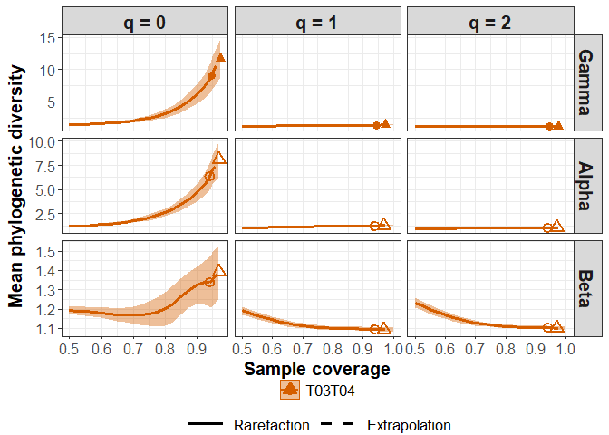

``` r
ggiNEXTseq(out, type = "B")
```

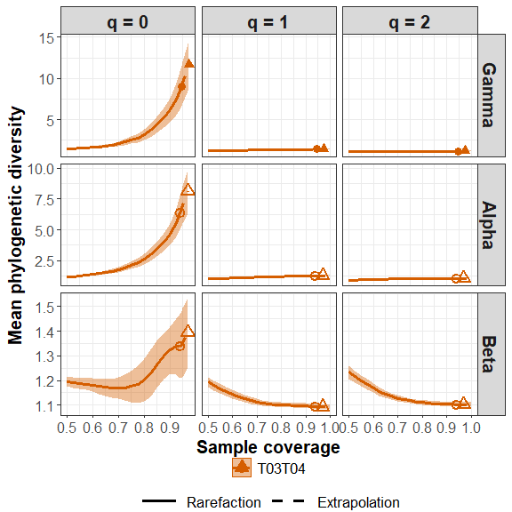

``` r
ggiNEXTseq(out, type = "D")
```

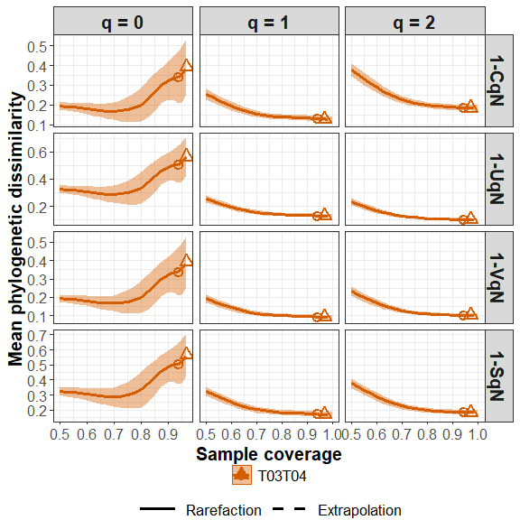

The following commands return the size-based R/E sampling curves for
gamma and alpha diversity:

``` r
out_size = iNEXTseq(data = fungi[1], q = c(0, 1, 2), base = "size", datatype = "abundance",
                    nboot = 10, PDtree = fungi_tree, PDreftime = NULL)
ggiNEXTseq(out_size)
```

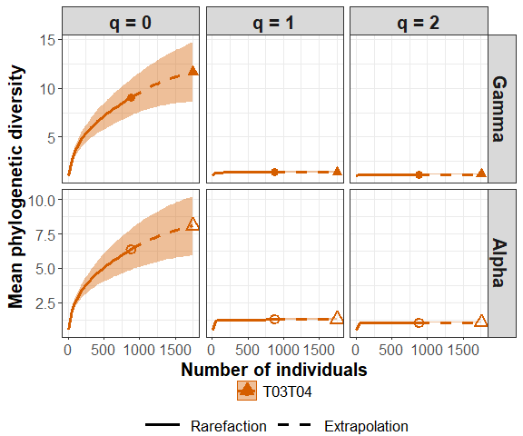

### MAIN FUNCTION: iNEXT_seq_Relative()

We first describe the main function `iNEXT_seq_Relative()` with default
arguments:

``` r
iNEXT_seq_Relative(data, q = c(0, 1, 2),  base = 'coverage', level = NULL, nboot = 10, conf = 0.95,
                              PDtree = NULL, PDreftime = NULL, PDtype = 'meanPD')
```

The arguments of this function are briefly described below and will be
further explained through illustrative examples in the following text.
This main function computes gamma, alpha, and beta diversity estimates
of order q at specified sample coverage or sample size, based on the
multiple-assemblage decomposition framework proposed by Routledge
(1979), which incorporates assemblage-size weighting to reflect the
relative contribution of each assemblage.

By default, if <code>base = “size”</code> and <code>level = NULL</code>,
the function computes gamma and alpha diversity estimates up to twice
the reference sample size, accounting for the size-weighted contribution
of each assemblage. If <code>base = “coverage”</code> and <code>level =
NULL</code>, the function computes gamma, alpha, beta diversity, and
four dissimilarity/turnover indices up to coverage = 1 (for <code>q = 1,
2</code>) or up to the coverage corresponding to double the reference
sample size (for <code>q = 0</code>), with all components estimated
under the relative abundance framework.

<table style="width:100%;">

<colgroup>

<col width="20%">

<col width="80%">

</colgroup>

<thead>

<tr class="header">

<th align="center">

Argument
</th>

<th align="left">

Description
</th>

</tr>

</thead>

<tbody>

<tr class="odd">

<td align="center">

<code>data</code>
</td>

<td align="left">

OTU count data can be input as a <code>matrix/data.frame</code> (species
by assemblages), or a list of <code>matrices/data.frames</code>, each
matrix represents species-by-assemblages abundance matrix.
</td>

</tr>

<tr class="even">

<td align="center">

<code>q</code>
</td>

<td align="left">

a numerical vector specifying the diversity orders. Default is
<code>c(0, 1, 2)</code>.
</td>

</tr>

<tr class="odd">

<td align="center">

<code>base</code>
</td>

<td align="left">

Sample-sized-based rarefaction and extrapolation for gamma and alpha
diversity (<code>base = “size”</code>) or coverage-based rarefaction and
extrapolation for gamma, alpha and beta diversity (<code>base =
“coverage”</code>). Default is <code>base = “coverage”</code>.
</td>

</tr>

<tr class="even">

<td align="center">

<code>level</code>
</td>

<td align="left">

A numerical vector specifying the particular value of sample coverage
(between 0 and 1 when <code>base = “coverage”</code>) or sample size
(<code>base = “size”</code>). <code>level = 1</code> (<code>base =
“coverage”</code>) means complete coverage (the corresponding diversity
represents asymptotic diversity).

If <code>base = “size”</code> and <code>level = NULL</code>, then this
function computes the gamma and alpha diversity estimates up to double
the reference sample size.

If <code>base = “coverage”</code> and <code>level = NULL</code>, then
this function computes the gamma and alpha diversity estimates up to one
(for <code>q = 1, 2</code>) or up to the coverage of double the
reference sample size (for <code>q = 0</code>); the corresponding beta
diversity and dissimilarity are computed up to the same maximum coverage
as the alpha diversity.
</td>

</tr>

<tr class="odd">

<td align="center">

<code>nboot</code>
</td>

<td align="left">

a positive integer specifying the number of bootstrap replications when
assessing sampling uncertainty and constructing confidence intervals.
Bootstrap replications are generally time consuming. Enter
<code>0</code> to skip the bootstrap procedures. Default is
<code>10</code>. Note that large bootstrap replication needs more run
time.
</td>

</tr>

<tr class="even">

<td align="center">

<code>conf</code>
</td>

<td align="left">

a positive number \< 1 specifying the level of confidence interval.
Default is <code>0.95</code>.
</td>

</tr>

<tr class="odd">

<td align="center">

<code>PDtree</code>
</td>

<td align="left">

a <code>phylo</code>, a phylogenetic tree in Newick format for all
observed species in the pooled assemblage.
</td>

</tr>

<tr class="even">

<td align="center">

<code>PDreftime</code>
</td>

<td align="left">

a numerical value specifying reference time for PD. Default is
<code>NULL</code> (i.e., the age of the root of PDtree).
</td>

<tr class="odd">

<td align="center">

<code>PDtype</code>
</td>

<td align="left">

Type of phylogenetic diversity (PD) to report: <code>“meanPD”</code>
(default), which reports the mean diversity per unit of reference time,
or <code>“PD”</code>, which reports total phylogenetic diversity
accumulated up to the specified reference time.
</td>

</tr>

</tbody>

</table>

This function returns an `"iNEXT_seq_Relative"` object which can be
further used to make plots using the function `ggiNEXT_seq_Relative()`
to be described below.

When `base = 'coverage'`, the `iNEXT_seq_Relative()` function returns
the `"iNEXT_seq_Relative()"` object including seven data frames for each
data sets:

- gamma
- alpha
- beta
- 1-$`C^*`$ (Sorensen-type non-overlap )
- 1-$`U^*`$ (Jaccard-type non-overlap )
- 1-$`V^*`$ (Sorensen-type turnover )
- 1-$`S^*`$ (Jaccard-type turnover )

When `base = 'size'`, the `iNEXTseq()` function returns the `"iNEXTseq"`
object including two data frames for each data sets:

- gamma
- alpha
- joint

#### Rarefaction/Extrapolation Via Examples

Run the `iNEXT_seq_Relative()` function with `fungi` data to compute
multiple-assemblage phylogenetic diversity standardized by sample
coverage. (Here we only show the first six rows for each output data
frame)

``` r
data("fungi")
data("fungi_tree")

out = iNEXT_seq_Relative(data = fungi[1], q = c(0, 1, 2), nboot = 10,
               PDtree = fungi_tree, PDreftime = NULL)
```

    #> ℹ invalid tbl_tree object. Missing column: label.
    #> ℹ invalid tbl_tree object. Missing column: parent,node,label.
    #> ℹ invalid tbl_tree object. Missing column: parent,node,label.
    #> ℹ invalid tbl_tree object. Missing column: parent,node,label.
    #> ℹ invalid tbl_tree object. Missing column: parent,node,label.
    #> ℹ invalid tbl_tree object. Missing column: parent,node,label.
    #> ℹ invalid tbl_tree object. Missing column: parent,node,label.
    #> ℹ invalid tbl_tree object. Missing column: parent,node,label.
    #> ℹ invalid tbl_tree object. Missing column: parent,node,label.
    #> ℹ invalid tbl_tree object. Missing column: parent,node,label.
    #> ℹ invalid tbl_tree object. Missing column: parent,node,label.
    #> ℹ invalid tbl_tree object. Missing column: parent,node,label.
    #> ℹ invalid tbl_tree object. Missing column: parent,node,label.
    #> ℹ invalid tbl_tree object. Missing column: parent,node,label.
    #> ℹ invalid tbl_tree object. Missing column: parent,node,label.
    #> ℹ invalid tbl_tree object. Missing column: parent,node,label.
    #> ℹ invalid tbl_tree object. Missing column: parent,node,label.
    #> ℹ invalid tbl_tree object. Missing column: parent,node,label.
    #> ℹ invalid tbl_tree object. Missing column: parent,node,label.
    #> ℹ invalid tbl_tree object. Missing column: parent,node,label.
    #> ℹ invalid tbl_tree object. Missing column: parent,node,label.
    #> ℹ invalid tbl_tree object. Missing column: parent,node,label.
    #> ℹ invalid tbl_tree object. Missing column: parent,node,label.
    #> ℹ invalid tbl_tree object. Missing column: parent,node,label.
    #> ℹ invalid tbl_tree object. Missing column: parent,node,label.
    #> ℹ invalid tbl_tree object. Missing column: parent,node,label.
    #> ℹ invalid tbl_tree object. Missing column: parent,node,label.
    #> ℹ invalid tbl_tree object. Missing column: parent,node,label.
    #> ℹ invalid tbl_tree object. Missing column: parent,node,label.
    #> ℹ invalid tbl_tree object. Missing column: parent,node,label.
    #> ℹ invalid tbl_tree object. Missing column: parent,node,label.
    #> ℹ invalid tbl_tree object. Missing column: parent,node,label.
    #> ℹ invalid tbl_tree object. Missing column: parent,node,label.
    #> ℹ invalid tbl_tree object. Missing column: parent,node,label.
    #> ℹ invalid tbl_tree object. Missing column: parent,node,label.
    #> ℹ invalid tbl_tree object. Missing column: parent,node,label.
    #> ℹ invalid tbl_tree object. Missing column: parent,node,label.
    #> ℹ invalid tbl_tree object. Missing column: parent,node,label.
    #> ℹ invalid tbl_tree object. Missing column: parent,node,label.
    #> ℹ invalid tbl_tree object. Missing column: parent,node,label.
    #> ℹ invalid tbl_tree object. Missing column: parent,node,label.
    #> ℹ invalid tbl_tree object. Missing column: parent,node,label.
    #> ℹ invalid tbl_tree object. Missing column: parent,node,label.
    #> ℹ invalid tbl_tree object. Missing column: parent,node,label.
    #> ℹ invalid tbl_tree object. Missing column: parent,node,label.
    #> ℹ invalid tbl_tree object. Missing column: parent,node,label.
    #> ℹ invalid tbl_tree object. Missing column: parent,node,label.
    #> ℹ invalid tbl_tree object. Missing column: parent,node,label.
    #> ℹ invalid tbl_tree object. Missing column: parent,node,label.
    #> ℹ invalid tbl_tree object. Missing column: parent,node,label.
    #> ℹ invalid tbl_tree object. Missing column: parent,node,label.
    #> ℹ invalid tbl_tree object. Missing column: parent,node,label.
    #> ℹ invalid tbl_tree object. Missing column: parent,node,label.
    #> ℹ invalid tbl_tree object. Missing column: parent,node,label.
    #> ℹ invalid tbl_tree object. Missing column: parent,node,label.
    #> ℹ invalid tbl_tree object. Missing column: parent,node,label.
    #> ℹ invalid tbl_tree object. Missing column: parent,node,label.
    #> ℹ invalid tbl_tree object. Missing column: parent,node,label.
    #> ℹ invalid tbl_tree object. Missing column: parent,node,label.
    #> ℹ invalid tbl_tree object. Missing column: parent,node,label.
    #> ℹ invalid tbl_tree object. Missing column: parent,node,label.
    #> ℹ invalid tbl_tree object. Missing column: parent,node,label.
    #> ℹ invalid tbl_tree object. Missing column: parent,node,label.
    #> ℹ invalid tbl_tree object. Missing column: parent,node,label.
    #> ℹ invalid tbl_tree object. Missing column: parent,node,label.
    #> ℹ invalid tbl_tree object. Missing column: parent,node,label.
    #> ℹ invalid tbl_tree object. Missing column: parent,node,label.
    #> ℹ invalid tbl_tree object. Missing column: parent,node,label.
    #> ℹ invalid tbl_tree object. Missing column: parent,node,label.
    #> ℹ invalid tbl_tree object. Missing column: parent,node,label.
    #> ℹ invalid tbl_tree object. Missing column: parent,node,label.
    #> ℹ invalid tbl_tree object. Missing column: parent,node,label.
    #> ℹ invalid tbl_tree object. Missing column: parent,node,label.
    #> ℹ invalid tbl_tree object. Missing column: parent,node,label.
    #> ℹ invalid tbl_tree object. Missing column: parent,node,label.
    #> ℹ invalid tbl_tree object. Missing column: parent,node,label.
    #> ℹ invalid tbl_tree object. Missing column: parent,node,label.
    #> ℹ invalid tbl_tree object. Missing column: parent,node,label.
    #> ℹ invalid tbl_tree object. Missing column: parent,node,label.
    #> ℹ invalid tbl_tree object. Missing column: parent,node,label.
    #> ℹ invalid tbl_tree object. Missing column: parent,node,label.
    #> ℹ invalid tbl_tree object. Missing column: parent,node,label.
    #> ℹ invalid tbl_tree object. Missing column: parent,node,label.
    #> ℹ invalid tbl_tree object. Missing column: parent,node,label.
    #> ℹ invalid tbl_tree object. Missing column: parent,node,label.
    #> ℹ invalid tbl_tree object. Missing column: parent,node,label.
    #> ℹ invalid tbl_tree object. Missing column: parent,node,label.
    #> ℹ invalid tbl_tree object. Missing column: parent,node,label.
    #> ℹ invalid tbl_tree object. Missing column: parent,node,label.
    #> ℹ invalid tbl_tree object. Missing column: parent,node,label.
    #> ℹ invalid tbl_tree object. Missing column: label.
    #> ℹ invalid tbl_tree object. Missing column: parent,node,label.
    #> ℹ invalid tbl_tree object. Missing column: parent,node,label.
    #> ℹ invalid tbl_tree object. Missing column: parent,node,label.
    #> ℹ invalid tbl_tree object. Missing column: parent,node,label.
    #> ℹ invalid tbl_tree object. Missing column: parent,node,label.
    #> ℹ invalid tbl_tree object. Missing column: parent,node,label.
    #> ℹ invalid tbl_tree object. Missing column: parent,node,label.
    #> ℹ invalid tbl_tree object. Missing column: parent,node,label.
    #> ℹ invalid tbl_tree object. Missing column: parent,node,label.
    #> ℹ invalid tbl_tree object. Missing column: parent,node,label.
    #> ℹ invalid tbl_tree object. Missing column: parent,node,label.
    #> ℹ invalid tbl_tree object. Missing column: parent,node,label.
    #> ℹ invalid tbl_tree object. Missing column: parent,node,label.
    #> ℹ invalid tbl_tree object. Missing column: parent,node,label.
    #> ℹ invalid tbl_tree object. Missing column: parent,node,label.
    #> ℹ invalid tbl_tree object. Missing column: parent,node,label.
    #> ℹ invalid tbl_tree object. Missing column: parent,node,label.
    #> ℹ invalid tbl_tree object. Missing column: parent,node,label.
    #> ℹ invalid tbl_tree object. Missing column: parent,node,label.
    #> ℹ invalid tbl_tree object. Missing column: parent,node,label.
    #> ℹ invalid tbl_tree object. Missing column: parent,node,label.
    #> ℹ invalid tbl_tree object. Missing column: parent,node,label.
    #> ℹ invalid tbl_tree object. Missing column: parent,node,label.
    #> ℹ invalid tbl_tree object. Missing column: parent,node,label.
    #> ℹ invalid tbl_tree object. Missing column: parent,node,label.
    #> ℹ invalid tbl_tree object. Missing column: parent,node,label.
    #> ℹ invalid tbl_tree object. Missing column: parent,node,label.
    #> ℹ invalid tbl_tree object. Missing column: parent,node,label.
    #> ℹ invalid tbl_tree object. Missing column: parent,node,label.
    #> ℹ invalid tbl_tree object. Missing column: parent,node,label.
    #> ℹ invalid tbl_tree object. Missing column: parent,node,label.
    #> ℹ invalid tbl_tree object. Missing column: parent,node,label.
    #> ℹ invalid tbl_tree object. Missing column: parent,node,label.
    #> ℹ invalid tbl_tree object. Missing column: parent,node,label.
    #> ℹ invalid tbl_tree object. Missing column: parent,node,label.
    #> ℹ invalid tbl_tree object. Missing column: parent,node,label.
    #> ℹ invalid tbl_tree object. Missing column: parent,node,label.
    #> ℹ invalid tbl_tree object. Missing column: parent,node,label.
    #> ℹ invalid tbl_tree object. Missing column: parent,node,label.
    #> ℹ invalid tbl_tree object. Missing column: parent,node,label.
    #> ℹ invalid tbl_tree object. Missing column: parent,node,label.
    #> ℹ invalid tbl_tree object. Missing column: parent,node,label.
    #> ℹ invalid tbl_tree object. Missing column: parent,node,label.
    #> ℹ invalid tbl_tree object. Missing column: label.
    #> ℹ invalid tbl_tree object. Missing column: parent,node,label.
    #> ℹ invalid tbl_tree object. Missing column: parent,node,label.
    #> ℹ invalid tbl_tree object. Missing column: parent,node,label.
    #> ℹ invalid tbl_tree object. Missing column: parent,node,label.
    #> ℹ invalid tbl_tree object. Missing column: parent,node,label.
    #> ℹ invalid tbl_tree object. Missing column: parent,node,label.
    #> ℹ invalid tbl_tree object. Missing column: parent,node,label.
    #> ℹ invalid tbl_tree object. Missing column: parent,node,label.
    #> ℹ invalid tbl_tree object. Missing column: parent,node,label.
    #> ℹ invalid tbl_tree object. Missing column: parent,node,label.
    #> ℹ invalid tbl_tree object. Missing column: parent,node,label.
    #> ℹ invalid tbl_tree object. Missing column: parent,node,label.
    #> ℹ invalid tbl_tree object. Missing column: parent,node,label.
    #> ℹ invalid tbl_tree object. Missing column: parent,node,label.
    #> ℹ invalid tbl_tree object. Missing column: parent,node,label.
    #> ℹ invalid tbl_tree object. Missing column: parent,node,label.
    #> ℹ invalid tbl_tree object. Missing column: parent,node,label.
    #> ℹ invalid tbl_tree object. Missing column: parent,node,label.
    #> ℹ invalid tbl_tree object. Missing column: parent,node,label.
    #> ℹ invalid tbl_tree object. Missing column: parent,node,label.
    #> ℹ invalid tbl_tree object. Missing column: parent,node,label.
    #> ℹ invalid tbl_tree object. Missing column: parent,node,label.
    #> ℹ invalid tbl_tree object. Missing column: parent,node,label.
    #> ℹ invalid tbl_tree object. Missing column: parent,node,label.
    #> ℹ invalid tbl_tree object. Missing column: parent,node,label.
    #> ℹ invalid tbl_tree object. Missing column: parent,node,label.
    #> ℹ invalid tbl_tree object. Missing column: parent,node,label.
    #> ℹ invalid tbl_tree object. Missing column: parent,node,label.
    #> ℹ invalid tbl_tree object. Missing column: parent,node,label.
    #> ℹ invalid tbl_tree object. Missing column: parent,node,label.
    #> ℹ invalid tbl_tree object. Missing column: parent,node,label.
    #> ℹ invalid tbl_tree object. Missing column: parent,node,label.
    #> ℹ invalid tbl_tree object. Missing column: parent,node,label.
    #> ℹ invalid tbl_tree object. Missing column: parent,node,label.
    #> ℹ invalid tbl_tree object. Missing column: parent,node,label.
    #> ℹ invalid tbl_tree object. Missing column: parent,node,label.
    #> ℹ invalid tbl_tree object. Missing column: parent,node,label.
    #> ℹ invalid tbl_tree object. Missing column: parent,node,label.
    #> ℹ invalid tbl_tree object. Missing column: parent,node,label.
    #> ℹ invalid tbl_tree object. Missing column: parent,node,label.
    #> ℹ invalid tbl_tree object. Missing column: parent,node,label.
    #> ℹ invalid tbl_tree object. Missing column: parent,node,label.
    #> ℹ invalid tbl_tree object. Missing column: parent,node,label.
    #> ℹ invalid tbl_tree object. Missing column: parent,node,label.
    #> ℹ invalid tbl_tree object. Missing column: parent,node,label.
    #> ℹ invalid tbl_tree object. Missing column: parent,node,label.
    #> ℹ invalid tbl_tree object. Missing column: parent,node,label.
    #> ℹ invalid tbl_tree object. Missing column: parent,node,label.
    #> ℹ invalid tbl_tree object. Missing column: parent,node,label.
    #> ℹ invalid tbl_tree object. Missing column: parent,node,label.
    #> ℹ invalid tbl_tree object. Missing column: parent,node,label.
    #> ℹ invalid tbl_tree object. Missing column: parent,node,label.
    #> ℹ invalid tbl_tree object. Missing column: parent,node,label.
    #> ℹ invalid tbl_tree object. Missing column: parent,node,label.
    #> ℹ invalid tbl_tree object. Missing column: parent,node,label.
    #> ℹ invalid tbl_tree object. Missing column: parent,node,label.
    #> ℹ invalid tbl_tree object. Missing column: parent,node,label.
    #> ℹ invalid tbl_tree object. Missing column: parent,node,label.
    #> ℹ invalid tbl_tree object. Missing column: parent,node,label.
    #> ℹ invalid tbl_tree object. Missing column: label.
    #> ℹ invalid tbl_tree object. Missing column: parent,node,label.
    #> ℹ invalid tbl_tree object. Missing column: parent,node,label.
    #> ℹ invalid tbl_tree object. Missing column: parent,node,label.
    #> ℹ invalid tbl_tree object. Missing column: parent,node,label.
    #> ℹ invalid tbl_tree object. Missing column: parent,node,label.
    #> ℹ invalid tbl_tree object. Missing column: parent,node,label.
    #> ℹ invalid tbl_tree object. Missing column: parent,node,label.
    #> ℹ invalid tbl_tree object. Missing column: parent,node,label.
    #> ℹ invalid tbl_tree object. Missing column: parent,node,label.
    #> ℹ invalid tbl_tree object. Missing column: parent,node,label.
    #> ℹ invalid tbl_tree object. Missing column: parent,node,label.
    #> ℹ invalid tbl_tree object. Missing column: parent,node,label.
    #> ℹ invalid tbl_tree object. Missing column: parent,node,label.
    #> ℹ invalid tbl_tree object. Missing column: parent,node,label.
    #> ℹ invalid tbl_tree object. Missing column: parent,node,label.
    #> ℹ invalid tbl_tree object. Missing column: parent,node,label.
    #> ℹ invalid tbl_tree object. Missing column: parent,node,label.
    #> ℹ invalid tbl_tree object. Missing column: parent,node,label.
    #> ℹ invalid tbl_tree object. Missing column: parent,node,label.
    #> ℹ invalid tbl_tree object. Missing column: parent,node,label.
    #> ℹ invalid tbl_tree object. Missing column: parent,node,label.
    #> ℹ invalid tbl_tree object. Missing column: parent,node,label.
    #> ℹ invalid tbl_tree object. Missing column: parent,node,label.
    #> ℹ invalid tbl_tree object. Missing column: parent,node,label.
    #> ℹ invalid tbl_tree object. Missing column: parent,node,label.
    #> ℹ invalid tbl_tree object. Missing column: parent,node,label.
    #> ℹ invalid tbl_tree object. Missing column: parent,node,label.
    #> ℹ invalid tbl_tree object. Missing column: parent,node,label.
    #> ℹ invalid tbl_tree object. Missing column: parent,node,label.
    #> ℹ invalid tbl_tree object. Missing column: parent,node,label.
    #> ℹ invalid tbl_tree object. Missing column: parent,node,label.
    #> ℹ invalid tbl_tree object. Missing column: parent,node,label.
    #> ℹ invalid tbl_tree object. Missing column: parent,node,label.
    #> ℹ invalid tbl_tree object. Missing column: parent,node,label.
    #> ℹ invalid tbl_tree object. Missing column: parent,node,label.
    #> ℹ invalid tbl_tree object. Missing column: parent,node,label.
    #> ℹ invalid tbl_tree object. Missing column: parent,node,label.
    #> ℹ invalid tbl_tree object. Missing column: parent,node,label.
    #> ℹ invalid tbl_tree object. Missing column: parent,node,label.
    #> ℹ invalid tbl_tree object. Missing column: parent,node,label.
    #> ℹ invalid tbl_tree object. Missing column: parent,node,label.
    #> ℹ invalid tbl_tree object. Missing column: parent,node,label.
    #> ℹ invalid tbl_tree object. Missing column: parent,node,label.
    #> ℹ invalid tbl_tree object. Missing column: label.
    #> ℹ invalid tbl_tree object. Missing column: parent,node,label.
    #> ℹ invalid tbl_tree object. Missing column: parent,node,label.
    #> ℹ invalid tbl_tree object. Missing column: parent,node,label.
    #> ℹ invalid tbl_tree object. Missing column: parent,node,label.
    #> ℹ invalid tbl_tree object. Missing column: parent,node,label.
    #> ℹ invalid tbl_tree object. Missing column: parent,node,label.
    #> ℹ invalid tbl_tree object. Missing column: parent,node,label.
    #> ℹ invalid tbl_tree object. Missing column: parent,node,label.
    #> ℹ invalid tbl_tree object. Missing column: parent,node,label.
    #> ℹ invalid tbl_tree object. Missing column: parent,node,label.
    #> ℹ invalid tbl_tree object. Missing column: parent,node,label.
    #> ℹ invalid tbl_tree object. Missing column: parent,node,label.
    #> ℹ invalid tbl_tree object. Missing column: parent,node,label.
    #> ℹ invalid tbl_tree object. Missing column: parent,node,label.
    #> ℹ invalid tbl_tree object. Missing column: parent,node,label.
    #> ℹ invalid tbl_tree object. Missing column: parent,node,label.
    #> ℹ invalid tbl_tree object. Missing column: parent,node,label.
    #> ℹ invalid tbl_tree object. Missing column: parent,node,label.
    #> ℹ invalid tbl_tree object. Missing column: parent,node,label.
    #> ℹ invalid tbl_tree object. Missing column: parent,node,label.
    #> ℹ invalid tbl_tree object. Missing column: parent,node,label.
    #> ℹ invalid tbl_tree object. Missing column: parent,node,label.
    #> ℹ invalid tbl_tree object. Missing column: parent,node,label.
    #> ℹ invalid tbl_tree object. Missing column: parent,node,label.
    #> ℹ invalid tbl_tree object. Missing column: parent,node,label.
    #> ℹ invalid tbl_tree object. Missing column: parent,node,label.
    #> ℹ invalid tbl_tree object. Missing column: parent,node,label.
    #> ℹ invalid tbl_tree object. Missing column: parent,node,label.
    #> ℹ invalid tbl_tree object. Missing column: parent,node,label.
    #> ℹ invalid tbl_tree object. Missing column: parent,node,label.
    #> ℹ invalid tbl_tree object. Missing column: parent,node,label.
    #> ℹ invalid tbl_tree object. Missing column: parent,node,label.
    #> ℹ invalid tbl_tree object. Missing column: parent,node,label.
    #> ℹ invalid tbl_tree object. Missing column: parent,node,label.
    #> ℹ invalid tbl_tree object. Missing column: parent,node,label.
    #> ℹ invalid tbl_tree object. Missing column: parent,node,label.
    #> ℹ invalid tbl_tree object. Missing column: parent,node,label.
    #> ℹ invalid tbl_tree object. Missing column: parent,node,label.
    #> ℹ invalid tbl_tree object. Missing column: parent,node,label.
    #> ℹ invalid tbl_tree object. Missing column: parent,node,label.
    #> ℹ invalid tbl_tree object. Missing column: parent,node,label.
    #> ℹ invalid tbl_tree object. Missing column: parent,node,label.
    #> ℹ invalid tbl_tree object. Missing column: parent,node,label.
    #> ℹ invalid tbl_tree object. Missing column: parent,node,label.
    #> ℹ invalid tbl_tree object. Missing column: parent,node,label.
    #> ℹ invalid tbl_tree object. Missing column: parent,node,label.
    #> ℹ invalid tbl_tree object. Missing column: parent,node,label.
    #> ℹ invalid tbl_tree object. Missing column: parent,node,label.
    #> ℹ invalid tbl_tree object. Missing column: parent,node,label.
    #> ℹ invalid tbl_tree object. Missing column: parent,node,label.
    #> ℹ invalid tbl_tree object. Missing column: parent,node,label.
    #> ℹ invalid tbl_tree object. Missing column: parent,node,label.
    #> ℹ invalid tbl_tree object. Missing column: parent,node,label.
    #> ℹ invalid tbl_tree object. Missing column: parent,node,label.
    #> ℹ invalid tbl_tree object. Missing column: parent,node,label.
    #> ℹ invalid tbl_tree object. Missing column: parent,node,label.
    #> ℹ invalid tbl_tree object. Missing column: parent,node,label.
    #> ℹ invalid tbl_tree object. Missing column: parent,node,label.
    #> ℹ invalid tbl_tree object. Missing column: parent,node,label.
    #> ℹ invalid tbl_tree object. Missing column: label.
    #> ℹ invalid tbl_tree object. Missing column: parent,node,label.
    #> ℹ invalid tbl_tree object. Missing column: parent,node,label.
    #> ℹ invalid tbl_tree object. Missing column: parent,node,label.
    #> ℹ invalid tbl_tree object. Missing column: parent,node,label.
    #> ℹ invalid tbl_tree object. Missing column: parent,node,label.
    #> ℹ invalid tbl_tree object. Missing column: parent,node,label.
    #> ℹ invalid tbl_tree object. Missing column: parent,node,label.
    #> ℹ invalid tbl_tree object. Missing column: parent,node,label.
    #> ℹ invalid tbl_tree object. Missing column: parent,node,label.
    #> ℹ invalid tbl_tree object. Missing column: parent,node,label.
    #> ℹ invalid tbl_tree object. Missing column: parent,node,label.
    #> ℹ invalid tbl_tree object. Missing column: parent,node,label.
    #> ℹ invalid tbl_tree object. Missing column: parent,node,label.
    #> ℹ invalid tbl_tree object. Missing column: parent,node,label.
    #> ℹ invalid tbl_tree object. Missing column: parent,node,label.
    #> ℹ invalid tbl_tree object. Missing column: parent,node,label.
    #> ℹ invalid tbl_tree object. Missing column: parent,node,label.
    #> ℹ invalid tbl_tree object. Missing column: parent,node,label.
    #> ℹ invalid tbl_tree object. Missing column: parent,node,label.
    #> ℹ invalid tbl_tree object. Missing column: parent,node,label.
    #> ℹ invalid tbl_tree object. Missing column: parent,node,label.
    #> ℹ invalid tbl_tree object. Missing column: parent,node,label.
    #> ℹ invalid tbl_tree object. Missing column: parent,node,label.
    #> ℹ invalid tbl_tree object. Missing column: parent,node,label.
    #> ℹ invalid tbl_tree object. Missing column: parent,node,label.
    #> ℹ invalid tbl_tree object. Missing column: parent,node,label.
    #> ℹ invalid tbl_tree object. Missing column: parent,node,label.
    #> ℹ invalid tbl_tree object. Missing column: parent,node,label.
    #> ℹ invalid tbl_tree object. Missing column: parent,node,label.
    #> ℹ invalid tbl_tree object. Missing column: parent,node,label.
    #> ℹ invalid tbl_tree object. Missing column: parent,node,label.
    #> ℹ invalid tbl_tree object. Missing column: parent,node,label.
    #> ℹ invalid tbl_tree object. Missing column: parent,node,label.
    #> ℹ invalid tbl_tree object. Missing column: parent,node,label.
    #> ℹ invalid tbl_tree object. Missing column: parent,node,label.
    #> ℹ invalid tbl_tree object. Missing column: parent,node,label.
    #> ℹ invalid tbl_tree object. Missing column: parent,node,label.
    #> ℹ invalid tbl_tree object. Missing column: parent,node,label.
    #> ℹ invalid tbl_tree object. Missing column: parent,node,label.
    #> ℹ invalid tbl_tree object. Missing column: parent,node,label.
    #> ℹ invalid tbl_tree object. Missing column: parent,node,label.
    #> ℹ invalid tbl_tree object. Missing column: parent,node,label.
    #> ℹ invalid tbl_tree object. Missing column: parent,node,label.
    #> ℹ invalid tbl_tree object. Missing column: label.
    #> ℹ invalid tbl_tree object. Missing column: parent,node,label.
    #> ℹ invalid tbl_tree object. Missing column: parent,node,label.
    #> ℹ invalid tbl_tree object. Missing column: parent,node,label.
    #> ℹ invalid tbl_tree object. Missing column: parent,node,label.
    #> ℹ invalid tbl_tree object. Missing column: parent,node,label.
    #> ℹ invalid tbl_tree object. Missing column: parent,node,label.
    #> ℹ invalid tbl_tree object. Missing column: parent,node,label.
    #> ℹ invalid tbl_tree object. Missing column: parent,node,label.
    #> ℹ invalid tbl_tree object. Missing column: parent,node,label.
    #> ℹ invalid tbl_tree object. Missing column: parent,node,label.
    #> ℹ invalid tbl_tree object. Missing column: parent,node,label.
    #> ℹ invalid tbl_tree object. Missing column: parent,node,label.
    #> ℹ invalid tbl_tree object. Missing column: parent,node,label.
    #> ℹ invalid tbl_tree object. Missing column: parent,node,label.
    #> ℹ invalid tbl_tree object. Missing column: parent,node,label.
    #> ℹ invalid tbl_tree object. Missing column: parent,node,label.
    #> ℹ invalid tbl_tree object. Missing column: parent,node,label.
    #> ℹ invalid tbl_tree object. Missing column: parent,node,label.
    #> ℹ invalid tbl_tree object. Missing column: parent,node,label.
    #> ℹ invalid tbl_tree object. Missing column: parent,node,label.
    #> ℹ invalid tbl_tree object. Missing column: parent,node,label.
    #> ℹ invalid tbl_tree object. Missing column: parent,node,label.
    #> ℹ invalid tbl_tree object. Missing column: parent,node,label.
    #> ℹ invalid tbl_tree object. Missing column: parent,node,label.
    #> ℹ invalid tbl_tree object. Missing column: parent,node,label.
    #> ℹ invalid tbl_tree object. Missing column: parent,node,label.
    #> ℹ invalid tbl_tree object. Missing column: parent,node,label.
    #> ℹ invalid tbl_tree object. Missing column: parent,node,label.
    #> ℹ invalid tbl_tree object. Missing column: parent,node,label.
    #> ℹ invalid tbl_tree object. Missing column: parent,node,label.
    #> ℹ invalid tbl_tree object. Missing column: parent,node,label.
    #> ℹ invalid tbl_tree object. Missing column: parent,node,label.
    #> ℹ invalid tbl_tree object. Missing column: parent,node,label.
    #> ℹ invalid tbl_tree object. Missing column: parent,node,label.
    #> ℹ invalid tbl_tree object. Missing column: parent,node,label.
    #> ℹ invalid tbl_tree object. Missing column: parent,node,label.
    #> ℹ invalid tbl_tree object. Missing column: parent,node,label.
    #> ℹ invalid tbl_tree object. Missing column: parent,node,label.
    #> ℹ invalid tbl_tree object. Missing column: parent,node,label.
    #> ℹ invalid tbl_tree object. Missing column: parent,node,label.
    #> ℹ invalid tbl_tree object. Missing column: parent,node,label.
    #> ℹ invalid tbl_tree object. Missing column: parent,node,label.
    #> ℹ invalid tbl_tree object. Missing column: parent,node,label.
    #> ℹ invalid tbl_tree object. Missing column: parent,node,label.
    #> ℹ invalid tbl_tree object. Missing column: parent,node,label.
    #> ℹ invalid tbl_tree object. Missing column: parent,node,label.
    #> ℹ invalid tbl_tree object. Missing column: parent,node,label.
    #> ℹ invalid tbl_tree object. Missing column: parent,node,label.
    #> ℹ invalid tbl_tree object. Missing column: parent,node,label.
    #> ℹ invalid tbl_tree object. Missing column: parent,node,label.
    #> ℹ invalid tbl_tree object. Missing column: parent,node,label.
    #> ℹ invalid tbl_tree object. Missing column: parent,node,label.
    #> ℹ invalid tbl_tree object. Missing column: parent,node,label.
    #> ℹ invalid tbl_tree object. Missing column: parent,node,label.
    #> ℹ invalid tbl_tree object. Missing column: parent,node,label.
    #> ℹ invalid tbl_tree object. Missing column: parent,node,label.
    #> ℹ invalid tbl_tree object. Missing column: parent,node,label.
    #> ℹ invalid tbl_tree object. Missing column: parent,node,label.
    #> ℹ invalid tbl_tree object. Missing column: parent,node,label.
    #> ℹ invalid tbl_tree object. Missing column: label.
    #> ℹ invalid tbl_tree object. Missing column: parent,node,label.
    #> ℹ invalid tbl_tree object. Missing column: parent,node,label.
    #> ℹ invalid tbl_tree object. Missing column: parent,node,label.
    #> ℹ invalid tbl_tree object. Missing column: parent,node,label.
    #> ℹ invalid tbl_tree object. Missing column: parent,node,label.
    #> ℹ invalid tbl_tree object. Missing column: parent,node,label.
    #> ℹ invalid tbl_tree object. Missing column: parent,node,label.
    #> ℹ invalid tbl_tree object. Missing column: parent,node,label.
    #> ℹ invalid tbl_tree object. Missing column: parent,node,label.
    #> ℹ invalid tbl_tree object. Missing column: parent,node,label.
    #> ℹ invalid tbl_tree object. Missing column: parent,node,label.
    #> ℹ invalid tbl_tree object. Missing column: parent,node,label.
    #> ℹ invalid tbl_tree object. Missing column: parent,node,label.
    #> ℹ invalid tbl_tree object. Missing column: parent,node,label.
    #> ℹ invalid tbl_tree object. Missing column: parent,node,label.
    #> ℹ invalid tbl_tree object. Missing column: parent,node,label.
    #> ℹ invalid tbl_tree object. Missing column: parent,node,label.
    #> ℹ invalid tbl_tree object. Missing column: parent,node,label.
    #> ℹ invalid tbl_tree object. Missing column: parent,node,label.
    #> ℹ invalid tbl_tree object. Missing column: parent,node,label.
    #> ℹ invalid tbl_tree object. Missing column: parent,node,label.
    #> ℹ invalid tbl_tree object. Missing column: parent,node,label.
    #> ℹ invalid tbl_tree object. Missing column: parent,node,label.
    #> ℹ invalid tbl_tree object. Missing column: parent,node,label.
    #> ℹ invalid tbl_tree object. Missing column: parent,node,label.
    #> ℹ invalid tbl_tree object. Missing column: parent,node,label.
    #> ℹ invalid tbl_tree object. Missing column: parent,node,label.
    #> ℹ invalid tbl_tree object. Missing column: parent,node,label.
    #> ℹ invalid tbl_tree object. Missing column: parent,node,label.
    #> ℹ invalid tbl_tree object. Missing column: parent,node,label.
    #> ℹ invalid tbl_tree object. Missing column: parent,node,label.
    #> ℹ invalid tbl_tree object. Missing column: parent,node,label.
    #> ℹ invalid tbl_tree object. Missing column: parent,node,label.
    #> ℹ invalid tbl_tree object. Missing column: parent,node,label.
    #> ℹ invalid tbl_tree object. Missing column: parent,node,label.
    #> ℹ invalid tbl_tree object. Missing column: parent,node,label.
    #> ℹ invalid tbl_tree object. Missing column: parent,node,label.
    #> ℹ invalid tbl_tree object. Missing column: parent,node,label.
    #> ℹ invalid tbl_tree object. Missing column: parent,node,label.
    #> ℹ invalid tbl_tree object. Missing column: parent,node,label.
    #> ℹ invalid tbl_tree object. Missing column: parent,node,label.
    #> ℹ invalid tbl_tree object. Missing column: parent,node,label.
    #> ℹ invalid tbl_tree object. Missing column: parent,node,label.
    #> ℹ invalid tbl_tree object. Missing column: parent,node,label.
    #> ℹ invalid tbl_tree object. Missing column: parent,node,label.
    #> ℹ invalid tbl_tree object. Missing column: parent,node,label.
    #> ℹ invalid tbl_tree object. Missing column: label.
    #> ℹ invalid tbl_tree object. Missing column: parent,node,label.
    #> ℹ invalid tbl_tree object. Missing column: parent,node,label.
    #> ℹ invalid tbl_tree object. Missing column: parent,node,label.
    #> ℹ invalid tbl_tree object. Missing column: parent,node,label.
    #> ℹ invalid tbl_tree object. Missing column: parent,node,label.
    #> ℹ invalid tbl_tree object. Missing column: parent,node,label.
    #> ℹ invalid tbl_tree object. Missing column: parent,node,label.
    #> ℹ invalid tbl_tree object. Missing column: parent,node,label.
    #> ℹ invalid tbl_tree object. Missing column: parent,node,label.
    #> ℹ invalid tbl_tree object. Missing column: parent,node,label.
    #> ℹ invalid tbl_tree object. Missing column: parent,node,label.
    #> ℹ invalid tbl_tree object. Missing column: parent,node,label.
    #> ℹ invalid tbl_tree object. Missing column: parent,node,label.
    #> ℹ invalid tbl_tree object. Missing column: parent,node,label.
    #> ℹ invalid tbl_tree object. Missing column: parent,node,label.
    #> ℹ invalid tbl_tree object. Missing column: parent,node,label.
    #> ℹ invalid tbl_tree object. Missing column: parent,node,label.
    #> ℹ invalid tbl_tree object. Missing column: parent,node,label.
    #> ℹ invalid tbl_tree object. Missing column: parent,node,label.
    #> ℹ invalid tbl_tree object. Missing column: parent,node,label.
    #> ℹ invalid tbl_tree object. Missing column: parent,node,label.
    #> ℹ invalid tbl_tree object. Missing column: parent,node,label.
    #> ℹ invalid tbl_tree object. Missing column: parent,node,label.
    #> ℹ invalid tbl_tree object. Missing column: parent,node,label.
    #> ℹ invalid tbl_tree object. Missing column: parent,node,label.
    #> ℹ invalid tbl_tree object. Missing column: parent,node,label.
    #> ℹ invalid tbl_tree object. Missing column: parent,node,label.
    #> ℹ invalid tbl_tree object. Missing column: parent,node,label.
    #> ℹ invalid tbl_tree object. Missing column: parent,node,label.
    #> ℹ invalid tbl_tree object. Missing column: parent,node,label.
    #> ℹ invalid tbl_tree object. Missing column: parent,node,label.
    #> ℹ invalid tbl_tree object. Missing column: parent,node,label.
    #> ℹ invalid tbl_tree object. Missing column: parent,node,label.
    #> ℹ invalid tbl_tree object. Missing column: parent,node,label.
    #> ℹ invalid tbl_tree object. Missing column: parent,node,label.
    #> ℹ invalid tbl_tree object. Missing column: parent,node,label.
    #> ℹ invalid tbl_tree object. Missing column: parent,node,label.
    #> ℹ invalid tbl_tree object. Missing column: parent,node,label.
    #> ℹ invalid tbl_tree object. Missing column: parent,node,label.
    #> ℹ invalid tbl_tree object. Missing column: parent,node,label.
    #> ℹ invalid tbl_tree object. Missing column: parent,node,label.
    #> ℹ invalid tbl_tree object. Missing column: parent,node,label.
    #> ℹ invalid tbl_tree object. Missing column: parent,node,label.
    #> ℹ invalid tbl_tree object. Missing column: parent,node,label.
    #> ℹ invalid tbl_tree object. Missing column: parent,node,label.
    #> ℹ invalid tbl_tree object. Missing column: parent,node,label.
    #> ℹ invalid tbl_tree object. Missing column: parent,node,label.
    #> ℹ invalid tbl_tree object. Missing column: parent,node,label.
    #> ℹ invalid tbl_tree object. Missing column: parent,node,label.
    #> ℹ invalid tbl_tree object. Missing column: parent,node,label.
    #> ℹ invalid tbl_tree object. Missing column: parent,node,label.
    #> ℹ invalid tbl_tree object. Missing column: parent,node,label.
    #> ℹ invalid tbl_tree object. Missing column: parent,node,label.
    #> ℹ invalid tbl_tree object. Missing column: parent,node,label.
    #> ℹ invalid tbl_tree object. Missing column: parent,node,label.
    #> ℹ invalid tbl_tree object. Missing column: parent,node,label.
    #> ℹ invalid tbl_tree object. Missing column: parent,node,label.
    #> ℹ invalid tbl_tree object. Missing column: label.
    #> ℹ invalid tbl_tree object. Missing column: parent,node,label.
    #> ℹ invalid tbl_tree object. Missing column: parent,node,label.
    #> ℹ invalid tbl_tree object. Missing column: parent,node,label.
    #> ℹ invalid tbl_tree object. Missing column: parent,node,label.
    #> ℹ invalid tbl_tree object. Missing column: parent,node,label.
    #> ℹ invalid tbl_tree object. Missing column: parent,node,label.
    #> ℹ invalid tbl_tree object. Missing column: parent,node,label.
    #> ℹ invalid tbl_tree object. Missing column: parent,node,label.
    #> ℹ invalid tbl_tree object. Missing column: parent,node,label.
    #> ℹ invalid tbl_tree object. Missing column: parent,node,label.
    #> ℹ invalid tbl_tree object. Missing column: parent,node,label.
    #> ℹ invalid tbl_tree object. Missing column: parent,node,label.
    #> ℹ invalid tbl_tree object. Missing column: parent,node,label.
    #> ℹ invalid tbl_tree object. Missing column: parent,node,label.
    #> ℹ invalid tbl_tree object. Missing column: parent,node,label.
    #> ℹ invalid tbl_tree object. Missing column: parent,node,label.
    #> ℹ invalid tbl_tree object. Missing column: parent,node,label.
    #> ℹ invalid tbl_tree object. Missing column: parent,node,label.
    #> ℹ invalid tbl_tree object. Missing column: parent,node,label.
    #> ℹ invalid tbl_tree object. Missing column: parent,node,label.
    #> ℹ invalid tbl_tree object. Missing column: parent,node,label.
    #> ℹ invalid tbl_tree object. Missing column: parent,node,label.
    #> ℹ invalid tbl_tree object. Missing column: parent,node,label.
    #> ℹ invalid tbl_tree object. Missing column: parent,node,label.
    #> ℹ invalid tbl_tree object. Missing column: parent,node,label.
    #> ℹ invalid tbl_tree object. Missing column: parent,node,label.
    #> ℹ invalid tbl_tree object. Missing column: parent,node,label.
    #> ℹ invalid tbl_tree object. Missing column: parent,node,label.
    #> ℹ invalid tbl_tree object. Missing column: parent,node,label.
    #> ℹ invalid tbl_tree object. Missing column: parent,node,label.
    #> ℹ invalid tbl_tree object. Missing column: parent,node,label.
    #> ℹ invalid tbl_tree object. Missing column: parent,node,label.
    #> ℹ invalid tbl_tree object. Missing column: parent,node,label.
    #> ℹ invalid tbl_tree object. Missing column: parent,node,label.
    #> ℹ invalid tbl_tree object. Missing column: parent,node,label.
    #> ℹ invalid tbl_tree object. Missing column: parent,node,label.
    #> ℹ invalid tbl_tree object. Missing column: parent,node,label.
    #> ℹ invalid tbl_tree object. Missing column: parent,node,label.
    #> ℹ invalid tbl_tree object. Missing column: parent,node,label.
    #> ℹ invalid tbl_tree object. Missing column: parent,node,label.
    #> ℹ invalid tbl_tree object. Missing column: parent,node,label.
    #> ℹ invalid tbl_tree object. Missing column: parent,node,label.
    #> ℹ invalid tbl_tree object. Missing column: parent,node,label.
    #> ℹ invalid tbl_tree object. Missing column: parent,node,label.
    #> ℹ invalid tbl_tree object. Missing column: parent,node,label.
    #> ℹ invalid tbl_tree object. Missing column: parent,node,label.
    #> ℹ invalid tbl_tree object. Missing column: parent,node,label.
    #> ℹ invalid tbl_tree object. Missing column: parent,node,label.
    #> ℹ invalid tbl_tree object. Missing column: parent,node,label.
    #> ℹ invalid tbl_tree object. Missing column: parent,node,label.
    #> ℹ invalid tbl_tree object. Missing column: parent,node,label.
    #> ℹ invalid tbl_tree object. Missing column: parent,node,label.
    #> ℹ invalid tbl_tree object. Missing column: parent,node,label.
    #> ℹ invalid tbl_tree object. Missing column: parent,node,label.
    #> ℹ invalid tbl_tree object. Missing column: parent,node,label.
    #> ℹ invalid tbl_tree object. Missing column: parent,node,label.
    #> ℹ invalid tbl_tree object. Missing column: parent,node,label.
    #> ℹ invalid tbl_tree object. Missing column: parent,node,label.
    #> ℹ invalid tbl_tree object. Missing column: parent,node,label.
    #> ℹ invalid tbl_tree object. Missing column: parent,node,label.
    #> ℹ invalid tbl_tree object. Missing column: parent,node,label.
    #> ℹ invalid tbl_tree object. Missing column: parent,node,label.
    #> ℹ invalid tbl_tree object. Missing column: parent,node,label.
    #> ℹ invalid tbl_tree object. Missing column: parent,node,label.
    #> ℹ invalid tbl_tree object. Missing column: parent,node,label.
    #> ℹ invalid tbl_tree object. Missing column: parent,node,label.
    #> ℹ invalid tbl_tree object. Missing column: parent,node,label.
    #> ℹ invalid tbl_tree object. Missing column: parent,node,label.
    #> ℹ invalid tbl_tree object. Missing column: parent,node,label.
    #> ℹ invalid tbl_tree object. Missing column: parent,node,label.
    #> ℹ invalid tbl_tree object. Missing column: parent,node,label.
    #> ℹ invalid tbl_tree object. Missing column: parent,node,label.
    #> ℹ invalid tbl_tree object. Missing column: parent,node,label.
    #> ℹ invalid tbl_tree object. Missing column: parent,node,label.
    #> ℹ invalid tbl_tree object. Missing column: parent,node,label.
    #> ℹ invalid tbl_tree object. Missing column: parent,node,label.
    #> ℹ invalid tbl_tree object. Missing column: parent,node,label.
    #> ℹ invalid tbl_tree object. Missing column: parent,node,label.
    #> ℹ invalid tbl_tree object. Missing column: parent,node,label.
    #> ℹ invalid tbl_tree object. Missing column: parent,node,label.
    #> ℹ invalid tbl_tree object. Missing column: parent,node,label.
    #> ℹ invalid tbl_tree object. Missing column: parent,node,label.
    #> ℹ invalid tbl_tree object. Missing column: parent,node,label.
    #> ℹ invalid tbl_tree object. Missing column: parent,node,label.
    #> ℹ invalid tbl_tree object. Missing column: parent,node,label.
    #> ℹ invalid tbl_tree object. Missing column: parent,node,label.
    #> ℹ invalid tbl_tree object. Missing column: parent,node,label.
    #> ℹ invalid tbl_tree object. Missing column: parent,node,label.
    #> ℹ invalid tbl_tree object. Missing column: label.
    #> ℹ invalid tbl_tree object. Missing column: parent,node,label.
    #> ℹ invalid tbl_tree object. Missing column: parent,node,label.
    #> ℹ invalid tbl_tree object. Missing column: parent,node,label.
    #> ℹ invalid tbl_tree object. Missing column: parent,node,label.
    #> ℹ invalid tbl_tree object. Missing column: parent,node,label.
    #> ℹ invalid tbl_tree object. Missing column: parent,node,label.
    #> ℹ invalid tbl_tree object. Missing column: parent,node,label.
    #> ℹ invalid tbl_tree object. Missing column: parent,node,label.
    #> ℹ invalid tbl_tree object. Missing column: parent,node,label.
    #> ℹ invalid tbl_tree object. Missing column: parent,node,label.
    #> ℹ invalid tbl_tree object. Missing column: parent,node,label.
    #> ℹ invalid tbl_tree object. Missing column: parent,node,label.
    #> ℹ invalid tbl_tree object. Missing column: parent,node,label.
    #> ℹ invalid tbl_tree object. Missing column: parent,node,label.
    #> ℹ invalid tbl_tree object. Missing column: parent,node,label.
    #> ℹ invalid tbl_tree object. Missing column: parent,node,label.
    #> ℹ invalid tbl_tree object. Missing column: parent,node,label.
    #> ℹ invalid tbl_tree object. Missing column: parent,node,label.
    #> ℹ invalid tbl_tree object. Missing column: parent,node,label.
    #> ℹ invalid tbl_tree object. Missing column: parent,node,label.
    #> ℹ invalid tbl_tree object. Missing column: parent,node,label.
    #> ℹ invalid tbl_tree object. Missing column: parent,node,label.
    #> ℹ invalid tbl_tree object. Missing column: parent,node,label.
    #> ℹ invalid tbl_tree object. Missing column: parent,node,label.
    #> ℹ invalid tbl_tree object. Missing column: parent,node,label.
    #> ℹ invalid tbl_tree object. Missing column: parent,node,label.
    #> ℹ invalid tbl_tree object. Missing column: parent,node,label.
    #> ℹ invalid tbl_tree object. Missing column: parent,node,label.
    #> ℹ invalid tbl_tree object. Missing column: parent,node,label.
    #> ℹ invalid tbl_tree object. Missing column: parent,node,label.
    #> ℹ invalid tbl_tree object. Missing column: parent,node,label.
    #> ℹ invalid tbl_tree object. Missing column: parent,node,label.
    #> ℹ invalid tbl_tree object. Missing column: parent,node,label.
    #> ℹ invalid tbl_tree object. Missing column: parent,node,label.
    #> ℹ invalid tbl_tree object. Missing column: parent,node,label.
    #> ℹ invalid tbl_tree object. Missing column: parent,node,label.
    #> ℹ invalid tbl_tree object. Missing column: parent,node,label.
    #> ℹ invalid tbl_tree object. Missing column: parent,node,label.
    #> ℹ invalid tbl_tree object. Missing column: parent,node,label.
    #> ℹ invalid tbl_tree object. Missing column: parent,node,label.
    #> ℹ invalid tbl_tree object. Missing column: parent,node,label.
    #> ℹ invalid tbl_tree object. Missing column: parent,node,label.
    #> ℹ invalid tbl_tree object. Missing column: parent,node,label.
    #> ℹ invalid tbl_tree object. Missing column: parent,node,label.
    #> ℹ invalid tbl_tree object. Missing column: parent,node,label.
    #> ℹ invalid tbl_tree object. Missing column: parent,node,label.
    #> ℹ invalid tbl_tree object. Missing column: parent,node,label.
    #> ℹ invalid tbl_tree object. Missing column: label.
    #> ℹ invalid tbl_tree object. Missing column: parent,node,label.
    #> ℹ invalid tbl_tree object. Missing column: parent,node,label.
    #> ℹ invalid tbl_tree object. Missing column: parent,node,label.
    #> ℹ invalid tbl_tree object. Missing column: parent,node,label.
    #> ℹ invalid tbl_tree object. Missing column: parent,node,label.
    #> ℹ invalid tbl_tree object. Missing column: parent,node,label.
    #> ℹ invalid tbl_tree object. Missing column: parent,node,label.
    #> ℹ invalid tbl_tree object. Missing column: parent,node,label.
    #> ℹ invalid tbl_tree object. Missing column: parent,node,label.
    #> ℹ invalid tbl_tree object. Missing column: parent,node,label.
    #> ℹ invalid tbl_tree object. Missing column: parent,node,label.
    #> ℹ invalid tbl_tree object. Missing column: parent,node,label.
    #> ℹ invalid tbl_tree object. Missing column: parent,node,label.
    #> ℹ invalid tbl_tree object. Missing column: parent,node,label.
    #> ℹ invalid tbl_tree object. Missing column: parent,node,label.
    #> ℹ invalid tbl_tree object. Missing column: parent,node,label.
    #> ℹ invalid tbl_tree object. Missing column: parent,node,label.
    #> ℹ invalid tbl_tree object. Missing column: parent,node,label.
    #> ℹ invalid tbl_tree object. Missing column: parent,node,label.
    #> ℹ invalid tbl_tree object. Missing column: parent,node,label.
    #> ℹ invalid tbl_tree object. Missing column: parent,node,label.
    #> ℹ invalid tbl_tree object. Missing column: parent,node,label.
    #> ℹ invalid tbl_tree object. Missing column: parent,node,label.
    #> ℹ invalid tbl_tree object. Missing column: parent,node,label.
    #> ℹ invalid tbl_tree object. Missing column: parent,node,label.
    #> ℹ invalid tbl_tree object. Missing column: parent,node,label.
    #> ℹ invalid tbl_tree object. Missing column: parent,node,label.
    #> ℹ invalid tbl_tree object. Missing column: parent,node,label.
    #> ℹ invalid tbl_tree object. Missing column: parent,node,label.
    #> ℹ invalid tbl_tree object. Missing column: parent,node,label.
    #> ℹ invalid tbl_tree object. Missing column: parent,node,label.
    #> ℹ invalid tbl_tree object. Missing column: parent,node,label.
    #> ℹ invalid tbl_tree object. Missing column: parent,node,label.
    #> ℹ invalid tbl_tree object. Missing column: parent,node,label.
    #> ℹ invalid tbl_tree object. Missing column: parent,node,label.
    #> ℹ invalid tbl_tree object. Missing column: parent,node,label.
    #> ℹ invalid tbl_tree object. Missing column: parent,node,label.
    #> ℹ invalid tbl_tree object. Missing column: parent,node,label.
    #> ℹ invalid tbl_tree object. Missing column: parent,node,label.
    #> ℹ invalid tbl_tree object. Missing column: parent,node,label.
    #> ℹ invalid tbl_tree object. Missing column: parent,node,label.
    #> ℹ invalid tbl_tree object. Missing column: parent,node,label.
    #> ℹ invalid tbl_tree object. Missing column: parent,node,label.
    #> ℹ invalid tbl_tree object. Missing column: parent,node,label.
    #> ℹ invalid tbl_tree object. Missing column: parent,node,label.
    #> ℹ invalid tbl_tree object. Missing column: parent,node,label.
    #> ℹ invalid tbl_tree object. Missing column: parent,node,label.
    #> ℹ invalid tbl_tree object. Missing column: parent,node,label.
    #> ℹ invalid tbl_tree object. Missing column: parent,node,label.
    #> ℹ invalid tbl_tree object. Missing column: parent,node,label.
    #> ℹ invalid tbl_tree object. Missing column: parent,node,label.
    #> ℹ invalid tbl_tree object. Missing column: parent,node,label.
    #> ℹ invalid tbl_tree object. Missing column: parent,node,label.
    #> ℹ invalid tbl_tree object. Missing column: parent,node,label.
    #> ℹ invalid tbl_tree object. Missing column: parent,node,label.
    #> ℹ invalid tbl_tree object. Missing column: parent,node,label.
    #> ℹ invalid tbl_tree object. Missing column: parent,node,label.
    #> ℹ invalid tbl_tree object. Missing column: parent,node,label.
    #> ℹ invalid tbl_tree object. Missing column: label.
    #> ℹ invalid tbl_tree object. Missing column: parent,node,label.
    #> ℹ invalid tbl_tree object. Missing column: parent,node,label.
    #> ℹ invalid tbl_tree object. Missing column: parent,node,label.
    #> ℹ invalid tbl_tree object. Missing column: parent,node,label.
    #> ℹ invalid tbl_tree object. Missing column: parent,node,label.
    #> ℹ invalid tbl_tree object. Missing column: parent,node,label.
    #> ℹ invalid tbl_tree object. Missing column: parent,node,label.
    #> ℹ invalid tbl_tree object. Missing column: parent,node,label.
    #> ℹ invalid tbl_tree object. Missing column: parent,node,label.
    #> ℹ invalid tbl_tree object. Missing column: parent,node,label.
    #> ℹ invalid tbl_tree object. Missing column: parent,node,label.
    #> ℹ invalid tbl_tree object. Missing column: parent,node,label.
    #> ℹ invalid tbl_tree object. Missing column: parent,node,label.
    #> ℹ invalid tbl_tree object. Missing column: parent,node,label.
    #> ℹ invalid tbl_tree object. Missing column: parent,node,label.
    #> ℹ invalid tbl_tree object. Missing column: parent,node,label.
    #> ℹ invalid tbl_tree object. Missing column: parent,node,label.
    #> ℹ invalid tbl_tree object. Missing column: parent,node,label.
    #> ℹ invalid tbl_tree object. Missing column: parent,node,label.
    #> ℹ invalid tbl_tree object. Missing column: parent,node,label.
    #> ℹ invalid tbl_tree object. Missing column: parent,node,label.
    #> ℹ invalid tbl_tree object. Missing column: parent,node,label.
    #> ℹ invalid tbl_tree object. Missing column: parent,node,label.
    #> ℹ invalid tbl_tree object. Missing column: parent,node,label.
    #> ℹ invalid tbl_tree object. Missing column: parent,node,label.
    #> ℹ invalid tbl_tree object. Missing column: parent,node,label.
    #> ℹ invalid tbl_tree object. Missing column: parent,node,label.
    #> ℹ invalid tbl_tree object. Missing column: parent,node,label.
    #> ℹ invalid tbl_tree object. Missing column: parent,node,label.
    #> ℹ invalid tbl_tree object. Missing column: parent,node,label.
    #> ℹ invalid tbl_tree object. Missing column: parent,node,label.
    #> ℹ invalid tbl_tree object. Missing column: parent,node,label.
    #> ℹ invalid tbl_tree object. Missing column: parent,node,label.
    #> ℹ invalid tbl_tree object. Missing column: parent,node,label.
    #> ℹ invalid tbl_tree object. Missing column: parent,node,label.
    #> ℹ invalid tbl_tree object. Missing column: parent,node,label.
    #> ℹ invalid tbl_tree object. Missing column: parent,node,label.
    #> ℹ invalid tbl_tree object. Missing column: parent,node,label.
    #> ℹ invalid tbl_tree object. Missing column: parent,node,label.
    #> ℹ invalid tbl_tree object. Missing column: parent,node,label.
    #> ℹ invalid tbl_tree object. Missing column: parent,node,label.
    #> ℹ invalid tbl_tree object. Missing column: parent,node,label.
    #> ℹ invalid tbl_tree object. Missing column: parent,node,label.
    #> ℹ invalid tbl_tree object. Missing column: parent,node,label.
    #> ℹ invalid tbl_tree object. Missing column: parent,node,label.
    #> ℹ invalid tbl_tree object. Missing column: parent,node,label.
    #> ℹ invalid tbl_tree object. Missing column: parent,node,label.
    #> ℹ invalid tbl_tree object. Missing column: label.
    #> ℹ invalid tbl_tree object. Missing column: parent,node,label.
    #> ℹ invalid tbl_tree object. Missing column: parent,node,label.
    #> ℹ invalid tbl_tree object. Missing column: parent,node,label.
    #> ℹ invalid tbl_tree object. Missing column: parent,node,label.
    #> ℹ invalid tbl_tree object. Missing column: parent,node,label.
    #> ℹ invalid tbl_tree object. Missing column: parent,node,label.
    #> ℹ invalid tbl_tree object. Missing column: parent,node,label.
    #> ℹ invalid tbl_tree object. Missing column: parent,node,label.
    #> ℹ invalid tbl_tree object. Missing column: parent,node,label.
    #> ℹ invalid tbl_tree object. Missing column: parent,node,label.
    #> ℹ invalid tbl_tree object. Missing column: parent,node,label.
    #> ℹ invalid tbl_tree object. Missing column: parent,node,label.
    #> ℹ invalid tbl_tree object. Missing column: parent,node,label.
    #> ℹ invalid tbl_tree object. Missing column: parent,node,label.
    #> ℹ invalid tbl_tree object. Missing column: parent,node,label.
    #> ℹ invalid tbl_tree object. Missing column: parent,node,label.
    #> ℹ invalid tbl_tree object. Missing column: parent,node,label.
    #> ℹ invalid tbl_tree object. Missing column: parent,node,label.
    #> ℹ invalid tbl_tree object. Missing column: parent,node,label.
    #> ℹ invalid tbl_tree object. Missing column: parent,node,label.
    #> ℹ invalid tbl_tree object. Missing column: parent,node,label.
    #> ℹ invalid tbl_tree object. Missing column: parent,node,label.
    #> ℹ invalid tbl_tree object. Missing column: parent,node,label.
    #> ℹ invalid tbl_tree object. Missing column: parent,node,label.
    #> ℹ invalid tbl_tree object. Missing column: parent,node,label.
    #> ℹ invalid tbl_tree object. Missing column: parent,node,label.
    #> ℹ invalid tbl_tree object. Missing column: parent,node,label.
    #> ℹ invalid tbl_tree object. Missing column: parent,node,label.
    #> ℹ invalid tbl_tree object. Missing column: parent,node,label.
    #> ℹ invalid tbl_tree object. Missing column: parent,node,label.
    #> ℹ invalid tbl_tree object. Missing column: parent,node,label.
    #> ℹ invalid tbl_tree object. Missing column: parent,node,label.
    #> ℹ invalid tbl_tree object. Missing column: parent,node,label.
    #> ℹ invalid tbl_tree object. Missing column: parent,node,label.
    #> ℹ invalid tbl_tree object. Missing column: parent,node,label.
    #> ℹ invalid tbl_tree object. Missing column: parent,node,label.
    #> ℹ invalid tbl_tree object. Missing column: parent,node,label.
    #> ℹ invalid tbl_tree object. Missing column: parent,node,label.
    #> ℹ invalid tbl_tree object. Missing column: parent,node,label.
    #> ℹ invalid tbl_tree object. Missing column: parent,node,label.
    #> ℹ invalid tbl_tree object. Missing column: parent,node,label.
    #> ℹ invalid tbl_tree object. Missing column: parent,node,label.
    #> ℹ invalid tbl_tree object. Missing column: parent,node,label.
    #> ℹ invalid tbl_tree object. Missing column: parent,node,label.
    #> ℹ invalid tbl_tree object. Missing column: parent,node,label.
    #> ℹ invalid tbl_tree object. Missing column: parent,node,label.
    #> ℹ invalid tbl_tree object. Missing column: parent,node,label.
    #> ℹ invalid tbl_tree object. Missing column: parent,node,label.
    #> ℹ invalid tbl_tree object. Missing column: parent,node,label.
    #> ℹ invalid tbl_tree object. Missing column: parent,node,label.
    #> ℹ invalid tbl_tree object. Missing column: parent,node,label.
    #> ℹ invalid tbl_tree object. Missing column: parent,node,label.
    #> ℹ invalid tbl_tree object. Missing column: parent,node,label.
    #> ℹ invalid tbl_tree object. Missing column: parent,node,label.
    #> ℹ invalid tbl_tree object. Missing column: parent,node,label.
    #> ℹ invalid tbl_tree object. Missing column: parent,node,label.
    #> ℹ invalid tbl_tree object. Missing column: parent,node,label.
    #> ℹ invalid tbl_tree object. Missing column: parent,node,label.
    #> ℹ invalid tbl_tree object. Missing column: label.
    #> ℹ invalid tbl_tree object. Missing column: parent,node,label.
    #> ℹ invalid tbl_tree object. Missing column: parent,node,label.
    #> ℹ invalid tbl_tree object. Missing column: parent,node,label.
    #> ℹ invalid tbl_tree object. Missing column: parent,node,label.
    #> ℹ invalid tbl_tree object. Missing column: parent,node,label.
    #> ℹ invalid tbl_tree object. Missing column: parent,node,label.
    #> ℹ invalid tbl_tree object. Missing column: parent,node,label.
    #> ℹ invalid tbl_tree object. Missing column: parent,node,label.
    #> ℹ invalid tbl_tree object. Missing column: parent,node,label.
    #> ℹ invalid tbl_tree object. Missing column: parent,node,label.
    #> ℹ invalid tbl_tree object. Missing column: parent,node,label.
    #> ℹ invalid tbl_tree object. Missing column: parent,node,label.
    #> ℹ invalid tbl_tree object. Missing column: parent,node,label.
    #> ℹ invalid tbl_tree object. Missing column: parent,node,label.
    #> ℹ invalid tbl_tree object. Missing column: parent,node,label.
    #> ℹ invalid tbl_tree object. Missing column: parent,node,label.
    #> ℹ invalid tbl_tree object. Missing column: parent,node,label.
    #> ℹ invalid tbl_tree object. Missing column: parent,node,label.
    #> ℹ invalid tbl_tree object. Missing column: parent,node,label.
    #> ℹ invalid tbl_tree object. Missing column: parent,node,label.
    #> ℹ invalid tbl_tree object. Missing column: parent,node,label.
    #> ℹ invalid tbl_tree object. Missing column: parent,node,label.
    #> ℹ invalid tbl_tree object. Missing column: parent,node,label.
    #> ℹ invalid tbl_tree object. Missing column: parent,node,label.
    #> ℹ invalid tbl_tree object. Missing column: parent,node,label.
    #> ℹ invalid tbl_tree object. Missing column: parent,node,label.
    #> ℹ invalid tbl_tree object. Missing column: parent,node,label.
    #> ℹ invalid tbl_tree object. Missing column: parent,node,label.
    #> ℹ invalid tbl_tree object. Missing column: parent,node,label.
    #> ℹ invalid tbl_tree object. Missing column: parent,node,label.
    #> ℹ invalid tbl_tree object. Missing column: parent,node,label.
    #> ℹ invalid tbl_tree object. Missing column: parent,node,label.
    #> ℹ invalid tbl_tree object. Missing column: parent,node,label.
    #> ℹ invalid tbl_tree object. Missing column: parent,node,label.
    #> ℹ invalid tbl_tree object. Missing column: parent,node,label.
    #> ℹ invalid tbl_tree object. Missing column: parent,node,label.
    #> ℹ invalid tbl_tree object. Missing column: parent,node,label.
    #> ℹ invalid tbl_tree object. Missing column: parent,node,label.
    #> ℹ invalid tbl_tree object. Missing column: parent,node,label.
    #> ℹ invalid tbl_tree object. Missing column: parent,node,label.
    #> ℹ invalid tbl_tree object. Missing column: parent,node,label.
    #> ℹ invalid tbl_tree object. Missing column: parent,node,label.
    #> ℹ invalid tbl_tree object. Missing column: parent,node,label.
    #> ℹ invalid tbl_tree object. Missing column: label.
    #> ℹ invalid tbl_tree object. Missing column: parent,node,label.
    #> ℹ invalid tbl_tree object. Missing column: parent,node,label.
    #> ℹ invalid tbl_tree object. Missing column: parent,node,label.
    #> ℹ invalid tbl_tree object. Missing column: parent,node,label.
    #> ℹ invalid tbl_tree object. Missing column: parent,node,label.
    #> ℹ invalid tbl_tree object. Missing column: parent,node,label.
    #> ℹ invalid tbl_tree object. Missing column: parent,node,label.
    #> ℹ invalid tbl_tree object. Missing column: parent,node,label.
    #> ℹ invalid tbl_tree object. Missing column: parent,node,label.
    #> ℹ invalid tbl_tree object. Missing column: parent,node,label.
    #> ℹ invalid tbl_tree object. Missing column: parent,node,label.
    #> ℹ invalid tbl_tree object. Missing column: parent,node,label.
    #> ℹ invalid tbl_tree object. Missing column: parent,node,label.
    #> ℹ invalid tbl_tree object. Missing column: parent,node,label.
    #> ℹ invalid tbl_tree object. Missing column: parent,node,label.
    #> ℹ invalid tbl_tree object. Missing column: parent,node,label.
    #> ℹ invalid tbl_tree object. Missing column: parent,node,label.
    #> ℹ invalid tbl_tree object. Missing column: parent,node,label.
    #> ℹ invalid tbl_tree object. Missing column: parent,node,label.
    #> ℹ invalid tbl_tree object. Missing column: parent,node,label.
    #> ℹ invalid tbl_tree object. Missing column: parent,node,label.
    #> ℹ invalid tbl_tree object. Missing column: parent,node,label.
    #> ℹ invalid tbl_tree object. Missing column: parent,node,label.
    #> ℹ invalid tbl_tree object. Missing column: parent,node,label.
    #> ℹ invalid tbl_tree object. Missing column: parent,node,label.
    #> ℹ invalid tbl_tree object. Missing column: parent,node,label.
    #> ℹ invalid tbl_tree object. Missing column: parent,node,label.
    #> ℹ invalid tbl_tree object. Missing column: parent,node,label.
    #> ℹ invalid tbl_tree object. Missing column: parent,node,label.
    #> ℹ invalid tbl_tree object. Missing column: parent,node,label.
    #> ℹ invalid tbl_tree object. Missing column: parent,node,label.
    #> ℹ invalid tbl_tree object. Missing column: parent,node,label.
    #> ℹ invalid tbl_tree object. Missing column: parent,node,label.
    #> ℹ invalid tbl_tree object. Missing column: parent,node,label.
    #> ℹ invalid tbl_tree object. Missing column: parent,node,label.
    #> ℹ invalid tbl_tree object. Missing column: parent,node,label.
    #> ℹ invalid tbl_tree object. Missing column: parent,node,label.
    #> ℹ invalid tbl_tree object. Missing column: parent,node,label.
    #> ℹ invalid tbl_tree object. Missing column: parent,node,label.
    #> ℹ invalid tbl_tree object. Missing column: parent,node,label.
    #> ℹ invalid tbl_tree object. Missing column: parent,node,label.
    #> ℹ invalid tbl_tree object. Missing column: parent,node,label.
    #> ℹ invalid tbl_tree object. Missing column: parent,node,label.
    #> ℹ invalid tbl_tree object. Missing column: parent,node,label.
    #> ℹ invalid tbl_tree object. Missing column: parent,node,label.
    #> ℹ invalid tbl_tree object. Missing column: parent,node,label.
    #> ℹ invalid tbl_tree object. Missing column: parent,node,label.
    #> ℹ invalid tbl_tree object. Missing column: parent,node,label.
    #> ℹ invalid tbl_tree object. Missing column: parent,node,label.
    #> ℹ invalid tbl_tree object. Missing column: parent,node,label.
    #> ℹ invalid tbl_tree object. Missing column: parent,node,label.
    #> ℹ invalid tbl_tree object. Missing column: parent,node,label.
    #> ℹ invalid tbl_tree object. Missing column: parent,node,label.
    #> ℹ invalid tbl_tree object. Missing column: parent,node,label.
    #> ℹ invalid tbl_tree object. Missing column: parent,node,label.
    #> ℹ invalid tbl_tree object. Missing column: parent,node,label.
    #> ℹ invalid tbl_tree object. Missing column: parent,node,label.
    #> ℹ invalid tbl_tree object. Missing column: parent,node,label.
    #> ℹ invalid tbl_tree object. Missing column: parent,node,label.
    #> ℹ invalid tbl_tree object. Missing column: label.
    #> ℹ invalid tbl_tree object. Missing column: parent,node,label.
    #> ℹ invalid tbl_tree object. Missing column: parent,node,label.
    #> ℹ invalid tbl_tree object. Missing column: parent,node,label.
    #> ℹ invalid tbl_tree object. Missing column: parent,node,label.
    #> ℹ invalid tbl_tree object. Missing column: parent,node,label.
    #> ℹ invalid tbl_tree object. Missing column: parent,node,label.
    #> ℹ invalid tbl_tree object. Missing column: parent,node,label.
    #> ℹ invalid tbl_tree object. Missing column: parent,node,label.
    #> ℹ invalid tbl_tree object. Missing column: parent,node,label.
    #> ℹ invalid tbl_tree object. Missing column: parent,node,label.
    #> ℹ invalid tbl_tree object. Missing column: parent,node,label.
    #> ℹ invalid tbl_tree object. Missing column: parent,node,label.
    #> ℹ invalid tbl_tree object. Missing column: parent,node,label.
    #> ℹ invalid tbl_tree object. Missing column: parent,node,label.
    #> ℹ invalid tbl_tree object. Missing column: parent,node,label.
    #> ℹ invalid tbl_tree object. Missing column: parent,node,label.
    #> ℹ invalid tbl_tree object. Missing column: parent,node,label.
    #> ℹ invalid tbl_tree object. Missing column: parent,node,label.
    #> ℹ invalid tbl_tree object. Missing column: parent,node,label.
    #> ℹ invalid tbl_tree object. Missing column: parent,node,label.
    #> ℹ invalid tbl_tree object. Missing column: parent,node,label.
    #> ℹ invalid tbl_tree object. Missing column: parent,node,label.
    #> ℹ invalid tbl_tree object. Missing column: parent,node,label.
    #> ℹ invalid tbl_tree object. Missing column: parent,node,label.
    #> ℹ invalid tbl_tree object. Missing column: parent,node,label.
    #> ℹ invalid tbl_tree object. Missing column: parent,node,label.
    #> ℹ invalid tbl_tree object. Missing column: parent,node,label.
    #> ℹ invalid tbl_tree object. Missing column: parent,node,label.
    #> ℹ invalid tbl_tree object. Missing column: parent,node,label.
    #> ℹ invalid tbl_tree object. Missing column: parent,node,label.
    #> ℹ invalid tbl_tree object. Missing column: parent,node,label.
    #> ℹ invalid tbl_tree object. Missing column: parent,node,label.
    #> ℹ invalid tbl_tree object. Missing column: parent,node,label.
    #> ℹ invalid tbl_tree object. Missing column: parent,node,label.
    #> ℹ invalid tbl_tree object. Missing column: label.
    #> ℹ invalid tbl_tree object. Missing column: parent,node,label.
    #> ℹ invalid tbl_tree object. Missing column: parent,node,label.
    #> ℹ invalid tbl_tree object. Missing column: parent,node,label.
    #> ℹ invalid tbl_tree object. Missing column: parent,node,label.
    #> ℹ invalid tbl_tree object. Missing column: parent,node,label.
    #> ℹ invalid tbl_tree object. Missing column: parent,node,label.
    #> ℹ invalid tbl_tree object. Missing column: parent,node,label.
    #> ℹ invalid tbl_tree object. Missing column: parent,node,label.
    #> ℹ invalid tbl_tree object. Missing column: parent,node,label.
    #> ℹ invalid tbl_tree object. Missing column: parent,node,label.
    #> ℹ invalid tbl_tree object. Missing column: parent,node,label.
    #> ℹ invalid tbl_tree object. Missing column: parent,node,label.
    #> ℹ invalid tbl_tree object. Missing column: parent,node,label.
    #> ℹ invalid tbl_tree object. Missing column: parent,node,label.
    #> ℹ invalid tbl_tree object. Missing column: parent,node,label.
    #> ℹ invalid tbl_tree object. Missing column: parent,node,label.
    #> ℹ invalid tbl_tree object. Missing column: parent,node,label.
    #> ℹ invalid tbl_tree object. Missing column: parent,node,label.
    #> ℹ invalid tbl_tree object. Missing column: parent,node,label.
    #> ℹ invalid tbl_tree object. Missing column: parent,node,label.
    #> ℹ invalid tbl_tree object. Missing column: parent,node,label.
    #> ℹ invalid tbl_tree object. Missing column: parent,node,label.
    #> ℹ invalid tbl_tree object. Missing column: parent,node,label.
    #> ℹ invalid tbl_tree object. Missing column: parent,node,label.
    #> ℹ invalid tbl_tree object. Missing column: parent,node,label.
    #> ℹ invalid tbl_tree object. Missing column: parent,node,label.
    #> ℹ invalid tbl_tree object. Missing column: parent,node,label.
    #> ℹ invalid tbl_tree object. Missing column: parent,node,label.
    #> ℹ invalid tbl_tree object. Missing column: parent,node,label.
    #> ℹ invalid tbl_tree object. Missing column: parent,node,label.
    #> ℹ invalid tbl_tree object. Missing column: parent,node,label.
    #> ℹ invalid tbl_tree object. Missing column: parent,node,label.
    #> ℹ invalid tbl_tree object. Missing column: parent,node,label.
    #> ℹ invalid tbl_tree object. Missing column: parent,node,label.
    #> ℹ invalid tbl_tree object. Missing column: parent,node,label.
    #> ℹ invalid tbl_tree object. Missing column: parent,node,label.
    #> ℹ invalid tbl_tree object. Missing column: parent,node,label.
    #> ℹ invalid tbl_tree object. Missing column: parent,node,label.
    #> ℹ invalid tbl_tree object. Missing column: parent,node,label.
    #> ℹ invalid tbl_tree object. Missing column: parent,node,label.
    #> ℹ invalid tbl_tree object. Missing column: parent,node,label.
    #> ℹ invalid tbl_tree object. Missing column: parent,node,label.
    #> ℹ invalid tbl_tree object. Missing column: parent,node,label.
    #> ℹ invalid tbl_tree object. Missing column: parent,node,label.
    #> ℹ invalid tbl_tree object. Missing column: parent,node,label.
    #> ℹ invalid tbl_tree object. Missing column: parent,node,label.
    #> ℹ invalid tbl_tree object. Missing column: parent,node,label.
    #> ℹ invalid tbl_tree object. Missing column: parent,node,label.
    #> ℹ invalid tbl_tree object. Missing column: parent,node,label.
    #> ℹ invalid tbl_tree object. Missing column: parent,node,label.
    #> ℹ invalid tbl_tree object. Missing column: parent,node,label.
    #> ℹ invalid tbl_tree object. Missing column: parent,node,label.
    #> ℹ invalid tbl_tree object. Missing column: parent,node,label.
    #> ℹ invalid tbl_tree object. Missing column: parent,node,label.
    #> ℹ invalid tbl_tree object. Missing column: label.
    #> ℹ invalid tbl_tree object. Missing column: parent,node,label.
    #> ℹ invalid tbl_tree object. Missing column: parent,node,label.
    #> ℹ invalid tbl_tree object. Missing column: parent,node,label.
    #> ℹ invalid tbl_tree object. Missing column: parent,node,label.
    #> ℹ invalid tbl_tree object. Missing column: parent,node,label.
    #> ℹ invalid tbl_tree object. Missing column: parent,node,label.
    #> ℹ invalid tbl_tree object. Missing column: parent,node,label.
    #> ℹ invalid tbl_tree object. Missing column: parent,node,label.
    #> ℹ invalid tbl_tree object. Missing column: parent,node,label.
    #> ℹ invalid tbl_tree object. Missing column: parent,node,label.
    #> ℹ invalid tbl_tree object. Missing column: parent,node,label.
    #> ℹ invalid tbl_tree object. Missing column: parent,node,label.
    #> ℹ invalid tbl_tree object. Missing column: parent,node,label.
    #> ℹ invalid tbl_tree object. Missing column: parent,node,label.
    #> ℹ invalid tbl_tree object. Missing column: parent,node,label.
    #> ℹ invalid tbl_tree object. Missing column: parent,node,label.
    #> ℹ invalid tbl_tree object. Missing column: parent,node,label.
    #> ℹ invalid tbl_tree object. Missing column: parent,node,label.
    #> ℹ invalid tbl_tree object. Missing column: parent,node,label.
    #> ℹ invalid tbl_tree object. Missing column: parent,node,label.
    #> ℹ invalid tbl_tree object. Missing column: parent,node,label.
    #> ℹ invalid tbl_tree object. Missing column: parent,node,label.
    #> ℹ invalid tbl_tree object. Missing column: parent,node,label.
    #> ℹ invalid tbl_tree object. Missing column: parent,node,label.
    #> ℹ invalid tbl_tree object. Missing column: parent,node,label.
    #> ℹ invalid tbl_tree object. Missing column: parent,node,label.
    #> ℹ invalid tbl_tree object. Missing column: parent,node,label.
    #> ℹ invalid tbl_tree object. Missing column: parent,node,label.
    #> ℹ invalid tbl_tree object. Missing column: parent,node,label.
    #> ℹ invalid tbl_tree object. Missing column: parent,node,label.
    #> ℹ invalid tbl_tree object. Missing column: parent,node,label.
    #> ℹ invalid tbl_tree object. Missing column: parent,node,label.
    #> ℹ invalid tbl_tree object. Missing column: parent,node,label.
    #> ℹ invalid tbl_tree object. Missing column: parent,node,label.
    #> ℹ invalid tbl_tree object. Missing column: parent,node,label.
    #> ℹ invalid tbl_tree object. Missing column: parent,node,label.
    #> ℹ invalid tbl_tree object. Missing column: parent,node,label.
    #> ℹ invalid tbl_tree object. Missing column: parent,node,label.
    #> ℹ invalid tbl_tree object. Missing column: parent,node,label.
    #> ℹ invalid tbl_tree object. Missing column: parent,node,label.
    #> ℹ invalid tbl_tree object. Missing column: parent,node,label.
    #> ℹ invalid tbl_tree object. Missing column: parent,node,label.
    #> ℹ invalid tbl_tree object. Missing column: parent,node,label.
    #> ℹ invalid tbl_tree object. Missing column: parent,node,label.
    #> ℹ invalid tbl_tree object. Missing column: parent,node,label.
    #> ℹ invalid tbl_tree object. Missing column: parent,node,label.
    #> ℹ invalid tbl_tree object. Missing column: parent,node,label.
    #> ℹ invalid tbl_tree object. Missing column: parent,node,label.
    #> ℹ invalid tbl_tree object. Missing column: parent,node,label.
    #> ℹ invalid tbl_tree object. Missing column: parent,node,label.
    #> ℹ invalid tbl_tree object. Missing column: parent,node,label.
    #> ℹ invalid tbl_tree object. Missing column: parent,node,label.
    #> ℹ invalid tbl_tree object. Missing column: parent,node,label.
    #> ℹ invalid tbl_tree object. Missing column: parent,node,label.
    #> ℹ invalid tbl_tree object. Missing column: parent,node,label.
    #> ℹ invalid tbl_tree object. Missing column: parent,node,label.
    #> ℹ invalid tbl_tree object. Missing column: parent,node,label.
    #> ℹ invalid tbl_tree object. Missing column: parent,node,label.
    #> ℹ invalid tbl_tree object. Missing column: parent,node,label.
    #> ℹ invalid tbl_tree object. Missing column: parent,node,label.
    #> ℹ invalid tbl_tree object. Missing column: parent,node,label.
    #> ℹ invalid tbl_tree object. Missing column: parent,node,label.
    #> ℹ invalid tbl_tree object. Missing column: parent,node,label.
    #> ℹ invalid tbl_tree object. Missing column: parent,node,label.
    #> ℹ invalid tbl_tree object. Missing column: parent,node,label.
    #> ℹ invalid tbl_tree object. Missing column: parent,node,label.
    #> ℹ invalid tbl_tree object. Missing column: parent,node,label.
    #> ℹ invalid tbl_tree object. Missing column: parent,node,label.
    #> ℹ invalid tbl_tree object. Missing column: parent,node,label.
    #> ℹ invalid tbl_tree object. Missing column: parent,node,label.
    #> ℹ invalid tbl_tree object. Missing column: parent,node,label.
    #> ℹ invalid tbl_tree object. Missing column: parent,node,label.
    #> ℹ invalid tbl_tree object. Missing column: parent,node,label.
    #> ℹ invalid tbl_tree object. Missing column: parent,node,label.
    #> ℹ invalid tbl_tree object. Missing column: parent,node,label.
    #> ℹ invalid tbl_tree object. Missing column: parent,node,label.
    #> ℹ invalid tbl_tree object. Missing column: parent,node,label.
    #> ℹ invalid tbl_tree object. Missing column: parent,node,label.
    #> ℹ invalid tbl_tree object. Missing column: parent,node,label.
    #> ℹ invalid tbl_tree object. Missing column: parent,node,label.
    #> ℹ invalid tbl_tree object. Missing column: parent,node,label.
    #> ℹ invalid tbl_tree object. Missing column: parent,node,label.
    #> ℹ invalid tbl_tree object. Missing column: label.
    #> ℹ invalid tbl_tree object. Missing column: parent,node,label.
    #> ℹ invalid tbl_tree object. Missing column: parent,node,label.
    #> ℹ invalid tbl_tree object. Missing column: parent,node,label.
    #> ℹ invalid tbl_tree object. Missing column: parent,node,label.
    #> ℹ invalid tbl_tree object. Missing column: parent,node,label.
    #> ℹ invalid tbl_tree object. Missing column: parent,node,label.
    #> ℹ invalid tbl_tree object. Missing column: parent,node,label.
    #> ℹ invalid tbl_tree object. Missing column: parent,node,label.
    #> ℹ invalid tbl_tree object. Missing column: parent,node,label.
    #> ℹ invalid tbl_tree object. Missing column: parent,node,label.
    #> ℹ invalid tbl_tree object. Missing column: parent,node,label.
    #> ℹ invalid tbl_tree object. Missing column: parent,node,label.
    #> ℹ invalid tbl_tree object. Missing column: parent,node,label.
    #> ℹ invalid tbl_tree object. Missing column: parent,node,label.
    #> ℹ invalid tbl_tree object. Missing column: parent,node,label.
    #> ℹ invalid tbl_tree object. Missing column: parent,node,label.
    #> ℹ invalid tbl_tree object. Missing column: parent,node,label.
    #> ℹ invalid tbl_tree object. Missing column: parent,node,label.
    #> ℹ invalid tbl_tree object. Missing column: parent,node,label.
    #> ℹ invalid tbl_tree object. Missing column: parent,node,label.
    #> ℹ invalid tbl_tree object. Missing column: parent,node,label.
    #> ℹ invalid tbl_tree object. Missing column: parent,node,label.
    #> ℹ invalid tbl_tree object. Missing column: parent,node,label.
    #> ℹ invalid tbl_tree object. Missing column: parent,node,label.
    #> ℹ invalid tbl_tree object. Missing column: parent,node,label.
    #> ℹ invalid tbl_tree object. Missing column: parent,node,label.
    #> ℹ invalid tbl_tree object. Missing column: parent,node,label.
    #> ℹ invalid tbl_tree object. Missing column: parent,node,label.
    #> ℹ invalid tbl_tree object. Missing column: parent,node,label.
    #> ℹ invalid tbl_tree object. Missing column: parent,node,label.
    #> ℹ invalid tbl_tree object. Missing column: parent,node,label.
    #> ℹ invalid tbl_tree object. Missing column: parent,node,label.
    #> ℹ invalid tbl_tree object. Missing column: parent,node,label.
    #> ℹ invalid tbl_tree object. Missing column: parent,node,label.
    #> ℹ invalid tbl_tree object. Missing column: parent,node,label.
    #> ℹ invalid tbl_tree object. Missing column: label.
    #> ℹ invalid tbl_tree object. Missing column: parent,node,label.
    #> ℹ invalid tbl_tree object. Missing column: parent,node,label.
    #> ℹ invalid tbl_tree object. Missing column: parent,node,label.
    #> ℹ invalid tbl_tree object. Missing column: parent,node,label.
    #> ℹ invalid tbl_tree object. Missing column: parent,node,label.
    #> ℹ invalid tbl_tree object. Missing column: parent,node,label.
    #> ℹ invalid tbl_tree object. Missing column: parent,node,label.
    #> ℹ invalid tbl_tree object. Missing column: parent,node,label.
    #> ℹ invalid tbl_tree object. Missing column: parent,node,label.
    #> ℹ invalid tbl_tree object. Missing column: parent,node,label.
    #> ℹ invalid tbl_tree object. Missing column: parent,node,label.
    #> ℹ invalid tbl_tree object. Missing column: parent,node,label.
    #> ℹ invalid tbl_tree object. Missing column: parent,node,label.
    #> ℹ invalid tbl_tree object. Missing column: parent,node,label.
    #> ℹ invalid tbl_tree object. Missing column: parent,node,label.
    #> ℹ invalid tbl_tree object. Missing column: parent,node,label.
    #> ℹ invalid tbl_tree object. Missing column: parent,node,label.
    #> ℹ invalid tbl_tree object. Missing column: parent,node,label.
    #> ℹ invalid tbl_tree object. Missing column: parent,node,label.
    #> ℹ invalid tbl_tree object. Missing column: parent,node,label.
    #> ℹ invalid tbl_tree object. Missing column: parent,node,label.
    #> ℹ invalid tbl_tree object. Missing column: parent,node,label.
    #> ℹ invalid tbl_tree object. Missing column: parent,node,label.
    #> ℹ invalid tbl_tree object. Missing column: parent,node,label.
    #> ℹ invalid tbl_tree object. Missing column: parent,node,label.
    #> ℹ invalid tbl_tree object. Missing column: parent,node,label.
    #> ℹ invalid tbl_tree object. Missing column: parent,node,label.
    #> ℹ invalid tbl_tree object. Missing column: parent,node,label.
    #> ℹ invalid tbl_tree object. Missing column: parent,node,label.
    #> ℹ invalid tbl_tree object. Missing column: parent,node,label.
    #> ℹ invalid tbl_tree object. Missing column: parent,node,label.
    #> ℹ invalid tbl_tree object. Missing column: parent,node,label.
    #> ℹ invalid tbl_tree object. Missing column: parent,node,label.
    #> ℹ invalid tbl_tree object. Missing column: parent,node,label.
    #> ℹ invalid tbl_tree object. Missing column: parent,node,label.
    #> ℹ invalid tbl_tree object. Missing column: parent,node,label.
    #> ℹ invalid tbl_tree object. Missing column: parent,node,label.
    #> ℹ invalid tbl_tree object. Missing column: parent,node,label.
    #> ℹ invalid tbl_tree object. Missing column: parent,node,label.
    #> ℹ invalid tbl_tree object. Missing column: parent,node,label.
    #> ℹ invalid tbl_tree object. Missing column: parent,node,label.
    #> ℹ invalid tbl_tree object. Missing column: parent,node,label.
    #> ℹ invalid tbl_tree object. Missing column: parent,node,label.
    #> ℹ invalid tbl_tree object. Missing column: parent,node,label.
    #> ℹ invalid tbl_tree object. Missing column: parent,node,label.
    #> ℹ invalid tbl_tree object. Missing column: parent,node,label.
    #> ℹ invalid tbl_tree object. Missing column: parent,node,label.
    #> ℹ invalid tbl_tree object. Missing column: parent,node,label.
    #> ℹ invalid tbl_tree object. Missing column: parent,node,label.
    #> ℹ invalid tbl_tree object. Missing column: parent,node,label.
    #> ℹ invalid tbl_tree object. Missing column: parent,node,label.
    #> ℹ invalid tbl_tree object. Missing column: parent,node,label.
    #> ℹ invalid tbl_tree object. Missing column: parent,node,label.
    #> ℹ invalid tbl_tree object. Missing column: parent,node,label.
    #> ℹ invalid tbl_tree object. Missing column: parent,node,label.
    #> ℹ invalid tbl_tree object. Missing column: label.
    #> ℹ invalid tbl_tree object. Missing column: parent,node,label.
    #> ℹ invalid tbl_tree object. Missing column: parent,node,label.
    #> ℹ invalid tbl_tree object. Missing column: parent,node,label.
    #> ℹ invalid tbl_tree object. Missing column: parent,node,label.
    #> ℹ invalid tbl_tree object. Missing column: parent,node,label.
    #> ℹ invalid tbl_tree object. Missing column: parent,node,label.
    #> ℹ invalid tbl_tree object. Missing column: parent,node,label.
    #> ℹ invalid tbl_tree object. Missing column: parent,node,label.
    #> ℹ invalid tbl_tree object. Missing column: parent,node,label.
    #> ℹ invalid tbl_tree object. Missing column: parent,node,label.
    #> ℹ invalid tbl_tree object. Missing column: parent,node,label.
    #> ℹ invalid tbl_tree object. Missing column: parent,node,label.
    #> ℹ invalid tbl_tree object. Missing column: parent,node,label.
    #> ℹ invalid tbl_tree object. Missing column: parent,node,label.
    #> ℹ invalid tbl_tree object. Missing column: parent,node,label.
    #> ℹ invalid tbl_tree object. Missing column: parent,node,label.
    #> ℹ invalid tbl_tree object. Missing column: parent,node,label.
    #> ℹ invalid tbl_tree object. Missing column: parent,node,label.
    #> ℹ invalid tbl_tree object. Missing column: parent,node,label.
    #> ℹ invalid tbl_tree object. Missing column: parent,node,label.
    #> ℹ invalid tbl_tree object. Missing column: parent,node,label.
    #> ℹ invalid tbl_tree object. Missing column: parent,node,label.
    #> ℹ invalid tbl_tree object. Missing column: parent,node,label.
    #> ℹ invalid tbl_tree object. Missing column: parent,node,label.
    #> ℹ invalid tbl_tree object. Missing column: parent,node,label.
    #> ℹ invalid tbl_tree object. Missing column: parent,node,label.
    #> ℹ invalid tbl_tree object. Missing column: parent,node,label.
    #> ℹ invalid tbl_tree object. Missing column: parent,node,label.
    #> ℹ invalid tbl_tree object. Missing column: parent,node,label.
    #> ℹ invalid tbl_tree object. Missing column: parent,node,label.
    #> ℹ invalid tbl_tree object. Missing column: parent,node,label.
    #> ℹ invalid tbl_tree object. Missing column: parent,node,label.
    #> ℹ invalid tbl_tree object. Missing column: parent,node,label.
    #> ℹ invalid tbl_tree object. Missing column: parent,node,label.
    #> ℹ invalid tbl_tree object. Missing column: parent,node,label.
    #> ℹ invalid tbl_tree object. Missing column: label.
    #> ℹ invalid tbl_tree object. Missing column: parent,node,label.
    #> ℹ invalid tbl_tree object. Missing column: parent,node,label.
    #> ℹ invalid tbl_tree object. Missing column: parent,node,label.
    #> ℹ invalid tbl_tree object. Missing column: parent,node,label.
    #> ℹ invalid tbl_tree object. Missing column: parent,node,label.
    #> ℹ invalid tbl_tree object. Missing column: parent,node,label.
    #> ℹ invalid tbl_tree object. Missing column: parent,node,label.
    #> ℹ invalid tbl_tree object. Missing column: parent,node,label.
    #> ℹ invalid tbl_tree object. Missing column: parent,node,label.
    #> ℹ invalid tbl_tree object. Missing column: parent,node,label.
    #> ℹ invalid tbl_tree object. Missing column: parent,node,label.
    #> ℹ invalid tbl_tree object. Missing column: parent,node,label.
    #> ℹ invalid tbl_tree object. Missing column: parent,node,label.
    #> ℹ invalid tbl_tree object. Missing column: parent,node,label.
    #> ℹ invalid tbl_tree object. Missing column: parent,node,label.
    #> ℹ invalid tbl_tree object. Missing column: parent,node,label.
    #> ℹ invalid tbl_tree object. Missing column: parent,node,label.
    #> ℹ invalid tbl_tree object. Missing column: parent,node,label.
    #> ℹ invalid tbl_tree object. Missing column: parent,node,label.
    #> ℹ invalid tbl_tree object. Missing column: parent,node,label.
    #> ℹ invalid tbl_tree object. Missing column: parent,node,label.
    #> ℹ invalid tbl_tree object. Missing column: parent,node,label.
    #> ℹ invalid tbl_tree object. Missing column: parent,node,label.
    #> ℹ invalid tbl_tree object. Missing column: parent,node,label.
    #> ℹ invalid tbl_tree object. Missing column: parent,node,label.
    #> ℹ invalid tbl_tree object. Missing column: parent,node,label.
    #> ℹ invalid tbl_tree object. Missing column: parent,node,label.
    #> ℹ invalid tbl_tree object. Missing column: parent,node,label.
    #> ℹ invalid tbl_tree object. Missing column: parent,node,label.
    #> ℹ invalid tbl_tree object. Missing column: parent,node,label.
    #> ℹ invalid tbl_tree object. Missing column: parent,node,label.
    #> ℹ invalid tbl_tree object. Missing column: parent,node,label.
    #> ℹ invalid tbl_tree object. Missing column: parent,node,label.
    #> ℹ invalid tbl_tree object. Missing column: parent,node,label.
    #> ℹ invalid tbl_tree object. Missing column: parent,node,label.
    #> ℹ invalid tbl_tree object. Missing column: parent,node,label.
    #> ℹ invalid tbl_tree object. Missing column: parent,node,label.
    #> ℹ invalid tbl_tree object. Missing column: parent,node,label.
    #> ℹ invalid tbl_tree object. Missing column: parent,node,label.
    #> ℹ invalid tbl_tree object. Missing column: parent,node,label.
    #> ℹ invalid tbl_tree object. Missing column: parent,node,label.
    #> ℹ invalid tbl_tree object. Missing column: parent,node,label.
    #> ℹ invalid tbl_tree object. Missing column: parent,node,label.
    #> ℹ invalid tbl_tree object. Missing column: parent,node,label.
    #> ℹ invalid tbl_tree object. Missing column: parent,node,label.
    #> ℹ invalid tbl_tree object. Missing column: parent,node,label.
    #> ℹ invalid tbl_tree object. Missing column: parent,node,label.
    #> ℹ invalid tbl_tree object. Missing column: parent,node,label.
    #> ℹ invalid tbl_tree object. Missing column: parent,node,label.
    #> ℹ invalid tbl_tree object. Missing column: parent,node,label.
    #> ℹ invalid tbl_tree object. Missing column: parent,node,label.
    #> ℹ invalid tbl_tree object. Missing column: parent,node,label.
    #> ℹ invalid tbl_tree object. Missing column: parent,node,label.
    #> ℹ invalid tbl_tree object. Missing column: parent,node,label.
    #> ℹ invalid tbl_tree object. Missing column: parent,node,label.
    #> ℹ invalid tbl_tree object. Missing column: label.
    #> ℹ invalid tbl_tree object. Missing column: parent,node,label.
    #> ℹ invalid tbl_tree object. Missing column: parent,node,label.
    #> ℹ invalid tbl_tree object. Missing column: parent,node,label.
    #> ℹ invalid tbl_tree object. Missing column: parent,node,label.
    #> ℹ invalid tbl_tree object. Missing column: parent,node,label.
    #> ℹ invalid tbl_tree object. Missing column: parent,node,label.
    #> ℹ invalid tbl_tree object. Missing column: parent,node,label.
    #> ℹ invalid tbl_tree object. Missing column: parent,node,label.
    #> ℹ invalid tbl_tree object. Missing column: parent,node,label.
    #> ℹ invalid tbl_tree object. Missing column: parent,node,label.
    #> ℹ invalid tbl_tree object. Missing column: parent,node,label.
    #> ℹ invalid tbl_tree object. Missing column: parent,node,label.
    #> ℹ invalid tbl_tree object. Missing column: parent,node,label.
    #> ℹ invalid tbl_tree object. Missing column: parent,node,label.
    #> ℹ invalid tbl_tree object. Missing column: parent,node,label.
    #> ℹ invalid tbl_tree object. Missing column: parent,node,label.
    #> ℹ invalid tbl_tree object. Missing column: parent,node,label.
    #> ℹ invalid tbl_tree object. Missing column: parent,node,label.
    #> ℹ invalid tbl_tree object. Missing column: parent,node,label.
    #> ℹ invalid tbl_tree object. Missing column: parent,node,label.
    #> ℹ invalid tbl_tree object. Missing column: parent,node,label.
    #> ℹ invalid tbl_tree object. Missing column: parent,node,label.
    #> ℹ invalid tbl_tree object. Missing column: parent,node,label.
    #> ℹ invalid tbl_tree object. Missing column: parent,node,label.
    #> ℹ invalid tbl_tree object. Missing column: parent,node,label.
    #> ℹ invalid tbl_tree object. Missing column: parent,node,label.
    #> ℹ invalid tbl_tree object. Missing column: parent,node,label.
    #> ℹ invalid tbl_tree object. Missing column: parent,node,label.
    #> ℹ invalid tbl_tree object. Missing column: parent,node,label.
    #> ℹ invalid tbl_tree object. Missing column: parent,node,label.
    #> ℹ invalid tbl_tree object. Missing column: parent,node,label.
    #> ℹ invalid tbl_tree object. Missing column: parent,node,label.
    #> ℹ invalid tbl_tree object. Missing column: parent,node,label.
    #> ℹ invalid tbl_tree object. Missing column: parent,node,label.
    #> ℹ invalid tbl_tree object. Missing column: parent,node,label.
    #> ℹ invalid tbl_tree object. Missing column: parent,node,label.
    #> ℹ invalid tbl_tree object. Missing column: parent,node,label.
    #> ℹ invalid tbl_tree object. Missing column: parent,node,label.
    #> ℹ invalid tbl_tree object. Missing column: parent,node,label.
    #> ℹ invalid tbl_tree object. Missing column: parent,node,label.
    #> ℹ invalid tbl_tree object. Missing column: parent,node,label.
    #> ℹ invalid tbl_tree object. Missing column: parent,node,label.
    #> ℹ invalid tbl_tree object. Missing column: parent,node,label.
    #> ℹ invalid tbl_tree object. Missing column: label.
    #> ℹ invalid tbl_tree object. Missing column: parent,node,label.
    #> ℹ invalid tbl_tree object. Missing column: parent,node,label.
    #> ℹ invalid tbl_tree object. Missing column: parent,node,label.
    #> ℹ invalid tbl_tree object. Missing column: parent,node,label.
    #> ℹ invalid tbl_tree object. Missing column: parent,node,label.
    #> ℹ invalid tbl_tree object. Missing column: parent,node,label.
    #> ℹ invalid tbl_tree object. Missing column: parent,node,label.
    #> ℹ invalid tbl_tree object. Missing column: parent,node,label.
    #> ℹ invalid tbl_tree object. Missing column: parent,node,label.
    #> ℹ invalid tbl_tree object. Missing column: parent,node,label.
    #> ℹ invalid tbl_tree object. Missing column: parent,node,label.
    #> ℹ invalid tbl_tree object. Missing column: parent,node,label.
    #> ℹ invalid tbl_tree object. Missing column: parent,node,label.
    #> ℹ invalid tbl_tree object. Missing column: parent,node,label.
    #> ℹ invalid tbl_tree object. Missing column: parent,node,label.
    #> ℹ invalid tbl_tree object. Missing column: parent,node,label.
    #> ℹ invalid tbl_tree object. Missing column: parent,node,label.
    #> ℹ invalid tbl_tree object. Missing column: parent,node,label.
    #> ℹ invalid tbl_tree object. Missing column: parent,node,label.
    #> ℹ invalid tbl_tree object. Missing column: parent,node,label.
    #> ℹ invalid tbl_tree object. Missing column: parent,node,label.
    #> ℹ invalid tbl_tree object. Missing column: parent,node,label.
    #> ℹ invalid tbl_tree object. Missing column: parent,node,label.
    #> ℹ invalid tbl_tree object. Missing column: parent,node,label.
    #> ℹ invalid tbl_tree object. Missing column: parent,node,label.
    #> ℹ invalid tbl_tree object. Missing column: parent,node,label.
    #> ℹ invalid tbl_tree object. Missing column: parent,node,label.
    #> ℹ invalid tbl_tree object. Missing column: parent,node,label.
    #> ℹ invalid tbl_tree object. Missing column: parent,node,label.
    #> ℹ invalid tbl_tree object. Missing column: parent,node,label.
    #> ℹ invalid tbl_tree object. Missing column: parent,node,label.
    #> ℹ invalid tbl_tree object. Missing column: parent,node,label.
    #> ℹ invalid tbl_tree object. Missing column: parent,node,label.
    #> ℹ invalid tbl_tree object. Missing column: parent,node,label.
    #> ℹ invalid tbl_tree object. Missing column: parent,node,label.
    #> ℹ invalid tbl_tree object. Missing column: parent,node,label.
    #> ℹ invalid tbl_tree object. Missing column: parent,node,label.
    #> ℹ invalid tbl_tree object. Missing column: parent,node,label.
    #> ℹ invalid tbl_tree object. Missing column: parent,node,label.
    #> ℹ invalid tbl_tree object. Missing column: parent,node,label.
    #> ℹ invalid tbl_tree object. Missing column: parent,node,label.
    #> ℹ invalid tbl_tree object. Missing column: parent,node,label.
    #> ℹ invalid tbl_tree object. Missing column: parent,node,label.
    #> ℹ invalid tbl_tree object. Missing column: parent,node,label.
    #> ℹ invalid tbl_tree object. Missing column: parent,node,label.
    #> ℹ invalid tbl_tree object. Missing column: parent,node,label.
    #> ℹ invalid tbl_tree object. Missing column: parent,node,label.
    #> ℹ invalid tbl_tree object. Missing column: parent,node,label.
    #> ℹ invalid tbl_tree object. Missing column: parent,node,label.
    #> ℹ invalid tbl_tree object. Missing column: parent,node,label.
    #> ℹ invalid tbl_tree object. Missing column: parent,node,label.
    #> ℹ invalid tbl_tree object. Missing column: parent,node,label.
    #> ℹ invalid tbl_tree object. Missing column: parent,node,label.
    #> ℹ invalid tbl_tree object. Missing column: parent,node,label.
    #> ℹ invalid tbl_tree object. Missing column: parent,node,label.
    #> ℹ invalid tbl_tree object. Missing column: parent,node,label.
    #> ℹ invalid tbl_tree object. Missing column: parent,node,label.
    #> ℹ invalid tbl_tree object. Missing column: parent,node,label.
    #> ℹ invalid tbl_tree object. Missing column: parent,node,label.
    #> ℹ invalid tbl_tree object. Missing column: label.
    #> ℹ invalid tbl_tree object. Missing column: parent,node,label.
    #> ℹ invalid tbl_tree object. Missing column: parent,node,label.
    #> ℹ invalid tbl_tree object. Missing column: parent,node,label.
    #> ℹ invalid tbl_tree object. Missing column: parent,node,label.
    #> ℹ invalid tbl_tree object. Missing column: parent,node,label.
    #> ℹ invalid tbl_tree object. Missing column: parent,node,label.
    #> ℹ invalid tbl_tree object. Missing column: parent,node,label.
    #> ℹ invalid tbl_tree object. Missing column: parent,node,label.
    #> ℹ invalid tbl_tree object. Missing column: parent,node,label.
    #> ℹ invalid tbl_tree object. Missing column: parent,node,label.
    #> ℹ invalid tbl_tree object. Missing column: parent,node,label.
    #> ℹ invalid tbl_tree object. Missing column: parent,node,label.
    #> ℹ invalid tbl_tree object. Missing column: parent,node,label.
    #> ℹ invalid tbl_tree object. Missing column: parent,node,label.
    #> ℹ invalid tbl_tree object. Missing column: parent,node,label.
    #> ℹ invalid tbl_tree object. Missing column: parent,node,label.
    #> ℹ invalid tbl_tree object. Missing column: parent,node,label.
    #> ℹ invalid tbl_tree object. Missing column: parent,node,label.
    #> ℹ invalid tbl_tree object. Missing column: parent,node,label.
    #> ℹ invalid tbl_tree object. Missing column: parent,node,label.
    #> ℹ invalid tbl_tree object. Missing column: parent,node,label.
    #> ℹ invalid tbl_tree object. Missing column: parent,node,label.
    #> ℹ invalid tbl_tree object. Missing column: parent,node,label.
    #> ℹ invalid tbl_tree object. Missing column: parent,node,label.
    #> ℹ invalid tbl_tree object. Missing column: parent,node,label.
    #> ℹ invalid tbl_tree object. Missing column: parent,node,label.
    #> ℹ invalid tbl_tree object. Missing column: parent,node,label.
    #> ℹ invalid tbl_tree object. Missing column: parent,node,label.
    #> ℹ invalid tbl_tree object. Missing column: parent,node,label.
    #> ℹ invalid tbl_tree object. Missing column: parent,node,label.
    #> ℹ invalid tbl_tree object. Missing column: parent,node,label.
    #> ℹ invalid tbl_tree object. Missing column: parent,node,label.
    #> ℹ invalid tbl_tree object. Missing column: parent,node,label.
    #> ℹ invalid tbl_tree object. Missing column: parent,node,label.
    #> ℹ invalid tbl_tree object. Missing column: label.
    #> ℹ invalid tbl_tree object. Missing column: parent,node,label.
    #> ℹ invalid tbl_tree object. Missing column: parent,node,label.
    #> ℹ invalid tbl_tree object. Missing column: parent,node,label.
    #> ℹ invalid tbl_tree object. Missing column: parent,node,label.
    #> ℹ invalid tbl_tree object. Missing column: parent,node,label.
    #> ℹ invalid tbl_tree object. Missing column: parent,node,label.
    #> ℹ invalid tbl_tree object. Missing column: parent,node,label.
    #> ℹ invalid tbl_tree object. Missing column: parent,node,label.
    #> ℹ invalid tbl_tree object. Missing column: parent,node,label.
    #> ℹ invalid tbl_tree object. Missing column: parent,node,label.
    #> ℹ invalid tbl_tree object. Missing column: parent,node,label.
    #> ℹ invalid tbl_tree object. Missing column: parent,node,label.
    #> ℹ invalid tbl_tree object. Missing column: parent,node,label.
    #> ℹ invalid tbl_tree object. Missing column: parent,node,label.
    #> ℹ invalid tbl_tree object. Missing column: parent,node,label.
    #> ℹ invalid tbl_tree object. Missing column: parent,node,label.
    #> ℹ invalid tbl_tree object. Missing column: parent,node,label.
    #> ℹ invalid tbl_tree object. Missing column: parent,node,label.
    #> ℹ invalid tbl_tree object. Missing column: parent,node,label.
    #> ℹ invalid tbl_tree object. Missing column: parent,node,label.
    #> ℹ invalid tbl_tree object. Missing column: parent,node,label.
    #> ℹ invalid tbl_tree object. Missing column: parent,node,label.
    #> ℹ invalid tbl_tree object. Missing column: parent,node,label.
    #> ℹ invalid tbl_tree object. Missing column: parent,node,label.
    #> ℹ invalid tbl_tree object. Missing column: parent,node,label.
    #> ℹ invalid tbl_tree object. Missing column: parent,node,label.
    #> ℹ invalid tbl_tree object. Missing column: parent,node,label.
    #> ℹ invalid tbl_tree object. Missing column: parent,node,label.
    #> ℹ invalid tbl_tree object. Missing column: parent,node,label.
    #> ℹ invalid tbl_tree object. Missing column: parent,node,label.
    #> ℹ invalid tbl_tree object. Missing column: parent,node,label.
    #> ℹ invalid tbl_tree object. Missing column: parent,node,label.
    #> ℹ invalid tbl_tree object. Missing column: parent,node,label.
    #> ℹ invalid tbl_tree object. Missing column: parent,node,label.
    #> ℹ invalid tbl_tree object. Missing column: parent,node,label.
    #> ℹ invalid tbl_tree object. Missing column: parent,node,label.
    #> ℹ invalid tbl_tree object. Missing column: parent,node,label.
    #> ℹ invalid tbl_tree object. Missing column: parent,node,label.
    #> ℹ invalid tbl_tree object. Missing column: parent,node,label.
    #> ℹ invalid tbl_tree object. Missing column: parent,node,label.
    #> ℹ invalid tbl_tree object. Missing column: parent,node,label.
    #> ℹ invalid tbl_tree object. Missing column: parent,node,label.
    #> ℹ invalid tbl_tree object. Missing column: parent,node,label.
    #> ℹ invalid tbl_tree object. Missing column: parent,node,label.
    #> ℹ invalid tbl_tree object. Missing column: parent,node,label.
    #> ℹ invalid tbl_tree object. Missing column: parent,node,label.
    #> ℹ invalid tbl_tree object. Missing column: parent,node,label.
    #> ℹ invalid tbl_tree object. Missing column: parent,node,label.
    #> ℹ invalid tbl_tree object. Missing column: parent,node,label.
    #> ℹ invalid tbl_tree object. Missing column: parent,node,label.
    #> ℹ invalid tbl_tree object. Missing column: parent,node,label.
    #> ℹ invalid tbl_tree object. Missing column: parent,node,label.
    #> ℹ invalid tbl_tree object. Missing column: parent,node,label.
    #> ℹ invalid tbl_tree object. Missing column: label.
    #> ℹ invalid tbl_tree object. Missing column: parent,node,label.
    #> ℹ invalid tbl_tree object. Missing column: parent,node,label.
    #> ℹ invalid tbl_tree object. Missing column: parent,node,label.
    #> ℹ invalid tbl_tree object. Missing column: parent,node,label.
    #> ℹ invalid tbl_tree object. Missing column: parent,node,label.
    #> ℹ invalid tbl_tree object. Missing column: parent,node,label.
    #> ℹ invalid tbl_tree object. Missing column: parent,node,label.
    #> ℹ invalid tbl_tree object. Missing column: parent,node,label.
    #> ℹ invalid tbl_tree object. Missing column: parent,node,label.
    #> ℹ invalid tbl_tree object. Missing column: parent,node,label.
    #> ℹ invalid tbl_tree object. Missing column: parent,node,label.
    #> ℹ invalid tbl_tree object. Missing column: parent,node,label.
    #> ℹ invalid tbl_tree object. Missing column: parent,node,label.
    #> ℹ invalid tbl_tree object. Missing column: parent,node,label.
    #> ℹ invalid tbl_tree object. Missing column: parent,node,label.
    #> ℹ invalid tbl_tree object. Missing column: parent,node,label.
    #> ℹ invalid tbl_tree object. Missing column: parent,node,label.
    #> ℹ invalid tbl_tree object. Missing column: parent,node,label.
    #> ℹ invalid tbl_tree object. Missing column: parent,node,label.
    #> ℹ invalid tbl_tree object. Missing column: parent,node,label.
    #> ℹ invalid tbl_tree object. Missing column: parent,node,label.
    #> ℹ invalid tbl_tree object. Missing column: parent,node,label.
    #> ℹ invalid tbl_tree object. Missing column: parent,node,label.
    #> ℹ invalid tbl_tree object. Missing column: parent,node,label.
    #> ℹ invalid tbl_tree object. Missing column: parent,node,label.
    #> ℹ invalid tbl_tree object. Missing column: parent,node,label.
    #> ℹ invalid tbl_tree object. Missing column: parent,node,label.
    #> ℹ invalid tbl_tree object. Missing column: parent,node,label.
    #> ℹ invalid tbl_tree object. Missing column: parent,node,label.
    #> ℹ invalid tbl_tree object. Missing column: parent,node,label.
    #> ℹ invalid tbl_tree object. Missing column: parent,node,label.
    #> ℹ invalid tbl_tree object. Missing column: parent,node,label.
    #> ℹ invalid tbl_tree object. Missing column: parent,node,label.
    #> ℹ invalid tbl_tree object. Missing column: parent,node,label.
    #> ℹ invalid tbl_tree object. Missing column: parent,node,label.
    #> ℹ invalid tbl_tree object. Missing column: parent,node,label.
    #> ℹ invalid tbl_tree object. Missing column: parent,node,label.
    #> ℹ invalid tbl_tree object. Missing column: parent,node,label.
    #> ℹ invalid tbl_tree object. Missing column: parent,node,label.
    #> ℹ invalid tbl_tree object. Missing column: parent,node,label.
    #> ℹ invalid tbl_tree object. Missing column: parent,node,label.
    #> ℹ invalid tbl_tree object. Missing column: parent,node,label.
    #> ℹ invalid tbl_tree object. Missing column: parent,node,label.
    #> ℹ invalid tbl_tree object. Missing column: parent,node,label.
    #> ℹ invalid tbl_tree object. Missing column: parent,node,label.
    #> ℹ invalid tbl_tree object. Missing column: parent,node,label.
    #> ℹ invalid tbl_tree object. Missing column: parent,node,label.
    #> ℹ invalid tbl_tree object. Missing column: parent,node,label.
    #> ℹ invalid tbl_tree object. Missing column: parent,node,label.
    #> ℹ invalid tbl_tree object. Missing column: parent,node,label.
    #> ℹ invalid tbl_tree object. Missing column: parent,node,label.
    #> ℹ invalid tbl_tree object. Missing column: parent,node,label.
    #> ℹ invalid tbl_tree object. Missing column: parent,node,label.
    #> ℹ invalid tbl_tree object. Missing column: parent,node,label.
    #> ℹ invalid tbl_tree object. Missing column: parent,node,label.
    #> ℹ invalid tbl_tree object. Missing column: parent,node,label.
    #> ℹ invalid tbl_tree object. Missing column: parent,node,label.
    #> ℹ invalid tbl_tree object. Missing column: parent,node,label.
    #> ℹ invalid tbl_tree object. Missing column: parent,node,label.
    #> ℹ invalid tbl_tree object. Missing column: parent,node,label.
    #> ℹ invalid tbl_tree object. Missing column: parent,node,label.
    #> ℹ invalid tbl_tree object. Missing column: parent,node,label.
    #> ℹ invalid tbl_tree object. Missing column: parent,node,label.
    #> ℹ invalid tbl_tree object. Missing column: parent,node,label.
    #> ℹ invalid tbl_tree object. Missing column: parent,node,label.
    #> ℹ invalid tbl_tree object. Missing column: parent,node,label.
    #> ℹ invalid tbl_tree object. Missing column: parent,node,label.
    #> ℹ invalid tbl_tree object. Missing column: parent,node,label.
    #> ℹ invalid tbl_tree object. Missing column: parent,node,label.
    #> ℹ invalid tbl_tree object. Missing column: parent,node,label.
    #> ℹ invalid tbl_tree object. Missing column: parent,node,label.
    #> ℹ invalid tbl_tree object. Missing column: parent,node,label.
    #> ℹ invalid tbl_tree object. Missing column: parent,node,label.
    #> ℹ invalid tbl_tree object. Missing column: parent,node,label.
    #> ℹ invalid tbl_tree object. Missing column: parent,node,label.
    #> ℹ invalid tbl_tree object. Missing column: label.
    #> ℹ invalid tbl_tree object. Missing column: parent,node,label.
    #> ℹ invalid tbl_tree object. Missing column: parent,node,label.
    #> ℹ invalid tbl_tree object. Missing column: parent,node,label.
    #> ℹ invalid tbl_tree object. Missing column: parent,node,label.
    #> ℹ invalid tbl_tree object. Missing column: parent,node,label.
    #> ℹ invalid tbl_tree object. Missing column: parent,node,label.
    #> ℹ invalid tbl_tree object. Missing column: parent,node,label.
    #> ℹ invalid tbl_tree object. Missing column: parent,node,label.
    #> ℹ invalid tbl_tree object. Missing column: parent,node,label.
    #> ℹ invalid tbl_tree object. Missing column: parent,node,label.
    #> ℹ invalid tbl_tree object. Missing column: parent,node,label.
    #> ℹ invalid tbl_tree object. Missing column: parent,node,label.
    #> ℹ invalid tbl_tree object. Missing column: parent,node,label.
    #> ℹ invalid tbl_tree object. Missing column: parent,node,label.
    #> ℹ invalid tbl_tree object. Missing column: parent,node,label.
    #> ℹ invalid tbl_tree object. Missing column: parent,node,label.
    #> ℹ invalid tbl_tree object. Missing column: parent,node,label.
    #> ℹ invalid tbl_tree object. Missing column: parent,node,label.
    #> ℹ invalid tbl_tree object. Missing column: parent,node,label.
    #> ℹ invalid tbl_tree object. Missing column: parent,node,label.
    #> ℹ invalid tbl_tree object. Missing column: parent,node,label.
    #> ℹ invalid tbl_tree object. Missing column: parent,node,label.
    #> ℹ invalid tbl_tree object. Missing column: parent,node,label.
    #> ℹ invalid tbl_tree object. Missing column: parent,node,label.
    #> ℹ invalid tbl_tree object. Missing column: parent,node,label.
    #> ℹ invalid tbl_tree object. Missing column: parent,node,label.
    #> ℹ invalid tbl_tree object. Missing column: parent,node,label.
    #> ℹ invalid tbl_tree object. Missing column: parent,node,label.
    #> ℹ invalid tbl_tree object. Missing column: parent,node,label.
    #> ℹ invalid tbl_tree object. Missing column: parent,node,label.
    #> ℹ invalid tbl_tree object. Missing column: parent,node,label.
    #> ℹ invalid tbl_tree object. Missing column: parent,node,label.
    #> ℹ invalid tbl_tree object. Missing column: parent,node,label.
    #> ℹ invalid tbl_tree object. Missing column: parent,node,label.
    #> ℹ invalid tbl_tree object. Missing column: parent,node,label.
    #> ℹ invalid tbl_tree object. Missing column: label.
    #> ℹ invalid tbl_tree object. Missing column: parent,node,label.
    #> ℹ invalid tbl_tree object. Missing column: parent,node,label.
    #> ℹ invalid tbl_tree object. Missing column: parent,node,label.
    #> ℹ invalid tbl_tree object. Missing column: parent,node,label.
    #> ℹ invalid tbl_tree object. Missing column: parent,node,label.
    #> ℹ invalid tbl_tree object. Missing column: parent,node,label.
    #> ℹ invalid tbl_tree object. Missing column: parent,node,label.
    #> ℹ invalid tbl_tree object. Missing column: parent,node,label.
    #> ℹ invalid tbl_tree object. Missing column: parent,node,label.
    #> ℹ invalid tbl_tree object. Missing column: parent,node,label.
    #> ℹ invalid tbl_tree object. Missing column: parent,node,label.
    #> ℹ invalid tbl_tree object. Missing column: parent,node,label.
    #> ℹ invalid tbl_tree object. Missing column: parent,node,label.
    #> ℹ invalid tbl_tree object. Missing column: parent,node,label.
    #> ℹ invalid tbl_tree object. Missing column: parent,node,label.
    #> ℹ invalid tbl_tree object. Missing column: parent,node,label.
    #> ℹ invalid tbl_tree object. Missing column: parent,node,label.
    #> ℹ invalid tbl_tree object. Missing column: parent,node,label.
    #> ℹ invalid tbl_tree object. Missing column: parent,node,label.
    #> ℹ invalid tbl_tree object. Missing column: parent,node,label.
    #> ℹ invalid tbl_tree object. Missing column: parent,node,label.
    #> ℹ invalid tbl_tree object. Missing column: parent,node,label.
    #> ℹ invalid tbl_tree object. Missing column: parent,node,label.
    #> ℹ invalid tbl_tree object. Missing column: parent,node,label.
    #> ℹ invalid tbl_tree object. Missing column: parent,node,label.
    #> ℹ invalid tbl_tree object. Missing column: parent,node,label.
    #> ℹ invalid tbl_tree object. Missing column: parent,node,label.
    #> ℹ invalid tbl_tree object. Missing column: parent,node,label.
    #> ℹ invalid tbl_tree object. Missing column: parent,node,label.
    #> ℹ invalid tbl_tree object. Missing column: parent,node,label.
    #> ℹ invalid tbl_tree object. Missing column: parent,node,label.
    #> ℹ invalid tbl_tree object. Missing column: parent,node,label.
    #> ℹ invalid tbl_tree object. Missing column: parent,node,label.
    #> ℹ invalid tbl_tree object. Missing column: parent,node,label.
    #> ℹ invalid tbl_tree object. Missing column: parent,node,label.
    #> ℹ invalid tbl_tree object. Missing column: parent,node,label.
    #> ℹ invalid tbl_tree object. Missing column: parent,node,label.
    #> ℹ invalid tbl_tree object. Missing column: parent,node,label.
    #> ℹ invalid tbl_tree object. Missing column: parent,node,label.
    #> ℹ invalid tbl_tree object. Missing column: parent,node,label.
    #> ℹ invalid tbl_tree object. Missing column: parent,node,label.
    #> ℹ invalid tbl_tree object. Missing column: parent,node,label.
    #> ℹ invalid tbl_tree object. Missing column: parent,node,label.
    #> ℹ invalid tbl_tree object. Missing column: parent,node,label.
    #> ℹ invalid tbl_tree object. Missing column: parent,node,label.
    #> ℹ invalid tbl_tree object. Missing column: parent,node,label.
    #> ℹ invalid tbl_tree object. Missing column: parent,node,label.
    #> ℹ invalid tbl_tree object. Missing column: parent,node,label.
    #> ℹ invalid tbl_tree object. Missing column: parent,node,label.
    #> ℹ invalid tbl_tree object. Missing column: parent,node,label.
    #> ℹ invalid tbl_tree object. Missing column: parent,node,label.
    #> ℹ invalid tbl_tree object. Missing column: parent,node,label.
    #> ℹ invalid tbl_tree object. Missing column: parent,node,label.
    #> ℹ invalid tbl_tree object. Missing column: parent,node,label.
    #> ℹ invalid tbl_tree object. Missing column: label.
    #> ℹ invalid tbl_tree object. Missing column: parent,node,label.
    #> ℹ invalid tbl_tree object. Missing column: parent,node,label.
    #> ℹ invalid tbl_tree object. Missing column: parent,node,label.
    #> ℹ invalid tbl_tree object. Missing column: parent,node,label.
    #> ℹ invalid tbl_tree object. Missing column: parent,node,label.
    #> ℹ invalid tbl_tree object. Missing column: parent,node,label.
    #> ℹ invalid tbl_tree object. Missing column: parent,node,label.
    #> ℹ invalid tbl_tree object. Missing column: parent,node,label.
    #> ℹ invalid tbl_tree object. Missing column: parent,node,label.
    #> ℹ invalid tbl_tree object. Missing column: parent,node,label.
    #> ℹ invalid tbl_tree object. Missing column: parent,node,label.
    #> ℹ invalid tbl_tree object. Missing column: parent,node,label.
    #> ℹ invalid tbl_tree object. Missing column: parent,node,label.
    #> ℹ invalid tbl_tree object. Missing column: parent,node,label.
    #> ℹ invalid tbl_tree object. Missing column: parent,node,label.
    #> ℹ invalid tbl_tree object. Missing column: parent,node,label.
    #> ℹ invalid tbl_tree object. Missing column: parent,node,label.
    #> ℹ invalid tbl_tree object. Missing column: parent,node,label.
    #> ℹ invalid tbl_tree object. Missing column: parent,node,label.
    #> ℹ invalid tbl_tree object. Missing column: parent,node,label.
    #> ℹ invalid tbl_tree object. Missing column: parent,node,label.
    #> ℹ invalid tbl_tree object. Missing column: parent,node,label.
    #> ℹ invalid tbl_tree object. Missing column: parent,node,label.
    #> ℹ invalid tbl_tree object. Missing column: parent,node,label.
    #> ℹ invalid tbl_tree object. Missing column: parent,node,label.
    #> ℹ invalid tbl_tree object. Missing column: parent,node,label.
    #> ℹ invalid tbl_tree object. Missing column: parent,node,label.
    #> ℹ invalid tbl_tree object. Missing column: parent,node,label.
    #> ℹ invalid tbl_tree object. Missing column: parent,node,label.
    #> ℹ invalid tbl_tree object. Missing column: parent,node,label.
    #> ℹ invalid tbl_tree object. Missing column: parent,node,label.
    #> ℹ invalid tbl_tree object. Missing column: parent,node,label.
    #> ℹ invalid tbl_tree object. Missing column: parent,node,label.
    #> ℹ invalid tbl_tree object. Missing column: parent,node,label.
    #> ℹ invalid tbl_tree object. Missing column: parent,node,label.
    #> ℹ invalid tbl_tree object. Missing column: label.
    #> ℹ invalid tbl_tree object. Missing column: parent,node,label.
    #> ℹ invalid tbl_tree object. Missing column: parent,node,label.
    #> ℹ invalid tbl_tree object. Missing column: parent,node,label.
    #> ℹ invalid tbl_tree object. Missing column: parent,node,label.
    #> ℹ invalid tbl_tree object. Missing column: parent,node,label.
    #> ℹ invalid tbl_tree object. Missing column: parent,node,label.
    #> ℹ invalid tbl_tree object. Missing column: parent,node,label.
    #> ℹ invalid tbl_tree object. Missing column: parent,node,label.
    #> ℹ invalid tbl_tree object. Missing column: parent,node,label.
    #> ℹ invalid tbl_tree object. Missing column: parent,node,label.
    #> ℹ invalid tbl_tree object. Missing column: parent,node,label.
    #> ℹ invalid tbl_tree object. Missing column: parent,node,label.
    #> ℹ invalid tbl_tree object. Missing column: parent,node,label.
    #> ℹ invalid tbl_tree object. Missing column: parent,node,label.
    #> ℹ invalid tbl_tree object. Missing column: parent,node,label.
    #> ℹ invalid tbl_tree object. Missing column: parent,node,label.
    #> ℹ invalid tbl_tree object. Missing column: parent,node,label.
    #> ℹ invalid tbl_tree object. Missing column: parent,node,label.
    #> ℹ invalid tbl_tree object. Missing column: parent,node,label.
    #> ℹ invalid tbl_tree object. Missing column: parent,node,label.
    #> ℹ invalid tbl_tree object. Missing column: parent,node,label.
    #> ℹ invalid tbl_tree object. Missing column: parent,node,label.
    #> ℹ invalid tbl_tree object. Missing column: parent,node,label.
    #> ℹ invalid tbl_tree object. Missing column: parent,node,label.
    #> ℹ invalid tbl_tree object. Missing column: parent,node,label.
    #> ℹ invalid tbl_tree object. Missing column: parent,node,label.
    #> ℹ invalid tbl_tree object. Missing column: parent,node,label.
    #> ℹ invalid tbl_tree object. Missing column: parent,node,label.
    #> ℹ invalid tbl_tree object. Missing column: parent,node,label.
    #> ℹ invalid tbl_tree object. Missing column: parent,node,label.
    #> ℹ invalid tbl_tree object. Missing column: parent,node,label.
    #> ℹ invalid tbl_tree object. Missing column: parent,node,label.
    #> ℹ invalid tbl_tree object. Missing column: parent,node,label.
    #> ℹ invalid tbl_tree object. Missing column: parent,node,label.
    #> ℹ invalid tbl_tree object. Missing column: parent,node,label.
    #> ℹ invalid tbl_tree object. Missing column: parent,node,label.
    #> ℹ invalid tbl_tree object. Missing column: parent,node,label.
    #> ℹ invalid tbl_tree object. Missing column: parent,node,label.
    #> ℹ invalid tbl_tree object. Missing column: parent,node,label.
    #> ℹ invalid tbl_tree object. Missing column: parent,node,label.
    #> ℹ invalid tbl_tree object. Missing column: parent,node,label.
    #> ℹ invalid tbl_tree object. Missing column: parent,node,label.
    #> ℹ invalid tbl_tree object. Missing column: parent,node,label.
    #> ℹ invalid tbl_tree object. Missing column: parent,node,label.
    #> ℹ invalid tbl_tree object. Missing column: parent,node,label.
    #> ℹ invalid tbl_tree object. Missing column: parent,node,label.
    #> ℹ invalid tbl_tree object. Missing column: parent,node,label.
    #> ℹ invalid tbl_tree object. Missing column: parent,node,label.
    #> ℹ invalid tbl_tree object. Missing column: parent,node,label.
    #> ℹ invalid tbl_tree object. Missing column: parent,node,label.
    #> ℹ invalid tbl_tree object. Missing column: parent,node,label.
    #> ℹ invalid tbl_tree object. Missing column: parent,node,label.
    #> ℹ invalid tbl_tree object. Missing column: parent,node,label.
    #> ℹ invalid tbl_tree object. Missing column: parent,node,label.
    #> ℹ invalid tbl_tree object. Missing column: label.
    #> ℹ invalid tbl_tree object. Missing column: parent,node,label.
    #> ℹ invalid tbl_tree object. Missing column: parent,node,label.
    #> ℹ invalid tbl_tree object. Missing column: parent,node,label.
    #> ℹ invalid tbl_tree object. Missing column: parent,node,label.
    #> ℹ invalid tbl_tree object. Missing column: parent,node,label.
    #> ℹ invalid tbl_tree object. Missing column: parent,node,label.
    #> ℹ invalid tbl_tree object. Missing column: parent,node,label.
    #> ℹ invalid tbl_tree object. Missing column: parent,node,label.
    #> ℹ invalid tbl_tree object. Missing column: parent,node,label.
    #> ℹ invalid tbl_tree object. Missing column: parent,node,label.
    #> ℹ invalid tbl_tree object. Missing column: parent,node,label.
    #> ℹ invalid tbl_tree object. Missing column: parent,node,label.
    #> ℹ invalid tbl_tree object. Missing column: parent,node,label.
    #> ℹ invalid tbl_tree object. Missing column: parent,node,label.
    #> ℹ invalid tbl_tree object. Missing column: parent,node,label.
    #> ℹ invalid tbl_tree object. Missing column: parent,node,label.
    #> ℹ invalid tbl_tree object. Missing column: parent,node,label.
    #> ℹ invalid tbl_tree object. Missing column: parent,node,label.
    #> ℹ invalid tbl_tree object. Missing column: parent,node,label.
    #> ℹ invalid tbl_tree object. Missing column: parent,node,label.
    #> ℹ invalid tbl_tree object. Missing column: parent,node,label.
    #> ℹ invalid tbl_tree object. Missing column: parent,node,label.
    #> ℹ invalid tbl_tree object. Missing column: parent,node,label.
    #> ℹ invalid tbl_tree object. Missing column: parent,node,label.
    #> ℹ invalid tbl_tree object. Missing column: parent,node,label.
    #> ℹ invalid tbl_tree object. Missing column: parent,node,label.
    #> ℹ invalid tbl_tree object. Missing column: parent,node,label.
    #> ℹ invalid tbl_tree object. Missing column: parent,node,label.
    #> ℹ invalid tbl_tree object. Missing column: parent,node,label.
    #> ℹ invalid tbl_tree object. Missing column: parent,node,label.
    #> ℹ invalid tbl_tree object. Missing column: parent,node,label.
    #> ℹ invalid tbl_tree object. Missing column: parent,node,label.
    #> ℹ invalid tbl_tree object. Missing column: parent,node,label.
    #> ℹ invalid tbl_tree object. Missing column: parent,node,label.
    #> ℹ invalid tbl_tree object. Missing column: parent,node,label.
    #> ℹ invalid tbl_tree object. Missing column: parent,node,label.
    #> ℹ invalid tbl_tree object. Missing column: parent,node,label.
    #> ℹ invalid tbl_tree object. Missing column: parent,node,label.
    #> ℹ invalid tbl_tree object. Missing column: parent,node,label.
    #> ℹ invalid tbl_tree object. Missing column: parent,node,label.
    #> ℹ invalid tbl_tree object. Missing column: parent,node,label.
    #> ℹ invalid tbl_tree object. Missing column: parent,node,label.
    #> ℹ invalid tbl_tree object. Missing column: parent,node,label.
    #> ℹ invalid tbl_tree object. Missing column: label.
    #> ℹ invalid tbl_tree object. Missing column: parent,node,label.
    #> ℹ invalid tbl_tree object. Missing column: parent,node,label.
    #> ℹ invalid tbl_tree object. Missing column: parent,node,label.
    #> ℹ invalid tbl_tree object. Missing column: parent,node,label.
    #> ℹ invalid tbl_tree object. Missing column: parent,node,label.
    #> ℹ invalid tbl_tree object. Missing column: parent,node,label.
    #> ℹ invalid tbl_tree object. Missing column: parent,node,label.
    #> ℹ invalid tbl_tree object. Missing column: parent,node,label.
    #> ℹ invalid tbl_tree object. Missing column: parent,node,label.
    #> ℹ invalid tbl_tree object. Missing column: parent,node,label.
    #> ℹ invalid tbl_tree object. Missing column: parent,node,label.
    #> ℹ invalid tbl_tree object. Missing column: parent,node,label.
    #> ℹ invalid tbl_tree object. Missing column: parent,node,label.
    #> ℹ invalid tbl_tree object. Missing column: parent,node,label.
    #> ℹ invalid tbl_tree object. Missing column: parent,node,label.
    #> ℹ invalid tbl_tree object. Missing column: parent,node,label.
    #> ℹ invalid tbl_tree object. Missing column: parent,node,label.
    #> ℹ invalid tbl_tree object. Missing column: parent,node,label.
    #> ℹ invalid tbl_tree object. Missing column: parent,node,label.
    #> ℹ invalid tbl_tree object. Missing column: parent,node,label.
    #> ℹ invalid tbl_tree object. Missing column: parent,node,label.
    #> ℹ invalid tbl_tree object. Missing column: parent,node,label.
    #> ℹ invalid tbl_tree object. Missing column: parent,node,label.
    #> ℹ invalid tbl_tree object. Missing column: parent,node,label.
    #> ℹ invalid tbl_tree object. Missing column: parent,node,label.
    #> ℹ invalid tbl_tree object. Missing column: parent,node,label.
    #> ℹ invalid tbl_tree object. Missing column: parent,node,label.
    #> ℹ invalid tbl_tree object. Missing column: parent,node,label.
    #> ℹ invalid tbl_tree object. Missing column: parent,node,label.
    #> ℹ invalid tbl_tree object. Missing column: parent,node,label.
    #> ℹ invalid tbl_tree object. Missing column: parent,node,label.
    #> ℹ invalid tbl_tree object. Missing column: parent,node,label.
    #> ℹ invalid tbl_tree object. Missing column: parent,node,label.
    #> ℹ invalid tbl_tree object. Missing column: parent,node,label.
    #> ℹ invalid tbl_tree object. Missing column: parent,node,label.
    #> ℹ invalid tbl_tree object. Missing column: parent,node,label.
    #> ℹ invalid tbl_tree object. Missing column: parent,node,label.
    #> ℹ invalid tbl_tree object. Missing column: parent,node,label.
    #> ℹ invalid tbl_tree object. Missing column: parent,node,label.
    #> ℹ invalid tbl_tree object. Missing column: parent,node,label.
    #> ℹ invalid tbl_tree object. Missing column: parent,node,label.
    #> ℹ invalid tbl_tree object. Missing column: parent,node,label.
    #> ℹ invalid tbl_tree object. Missing column: parent,node,label.
    #> ℹ invalid tbl_tree object. Missing column: parent,node,label.
    #> ℹ invalid tbl_tree object. Missing column: parent,node,label.
    #> ℹ invalid tbl_tree object. Missing column: parent,node,label.
    #> ℹ invalid tbl_tree object. Missing column: parent,node,label.
    #> ℹ invalid tbl_tree object. Missing column: parent,node,label.
    #> ℹ invalid tbl_tree object. Missing column: parent,node,label.
    #> ℹ invalid tbl_tree object. Missing column: parent,node,label.
    #> ℹ invalid tbl_tree object. Missing column: parent,node,label.
    #> ℹ invalid tbl_tree object. Missing column: parent,node,label.
    #> ℹ invalid tbl_tree object. Missing column: parent,node,label.
    #> ℹ invalid tbl_tree object. Missing column: parent,node,label.
    #> ℹ invalid tbl_tree object. Missing column: parent,node,label.
    #> ℹ invalid tbl_tree object. Missing column: parent,node,label.
    #> ℹ invalid tbl_tree object. Missing column: parent,node,label.
    #> ℹ invalid tbl_tree object. Missing column: parent,node,label.
    #> ℹ invalid tbl_tree object. Missing column: parent,node,label.
    #> ℹ invalid tbl_tree object. Missing column: label.
    #> ℹ invalid tbl_tree object. Missing column: parent,node,label.
    #> ℹ invalid tbl_tree object. Missing column: parent,node,label.
    #> ℹ invalid tbl_tree object. Missing column: parent,node,label.
    #> ℹ invalid tbl_tree object. Missing column: parent,node,label.
    #> ℹ invalid tbl_tree object. Missing column: parent,node,label.
    #> ℹ invalid tbl_tree object. Missing column: parent,node,label.
    #> ℹ invalid tbl_tree object. Missing column: parent,node,label.
    #> ℹ invalid tbl_tree object. Missing column: parent,node,label.
    #> ℹ invalid tbl_tree object. Missing column: parent,node,label.
    #> ℹ invalid tbl_tree object. Missing column: parent,node,label.
    #> ℹ invalid tbl_tree object. Missing column: parent,node,label.
    #> ℹ invalid tbl_tree object. Missing column: parent,node,label.
    #> ℹ invalid tbl_tree object. Missing column: parent,node,label.
    #> ℹ invalid tbl_tree object. Missing column: parent,node,label.
    #> ℹ invalid tbl_tree object. Missing column: parent,node,label.
    #> ℹ invalid tbl_tree object. Missing column: parent,node,label.
    #> ℹ invalid tbl_tree object. Missing column: parent,node,label.
    #> ℹ invalid tbl_tree object. Missing column: parent,node,label.
    #> ℹ invalid tbl_tree object. Missing column: parent,node,label.
    #> ℹ invalid tbl_tree object. Missing column: parent,node,label.
    #> ℹ invalid tbl_tree object. Missing column: parent,node,label.
    #> ℹ invalid tbl_tree object. Missing column: parent,node,label.
    #> ℹ invalid tbl_tree object. Missing column: parent,node,label.
    #> ℹ invalid tbl_tree object. Missing column: parent,node,label.
    #> ℹ invalid tbl_tree object. Missing column: parent,node,label.
    #> ℹ invalid tbl_tree object. Missing column: parent,node,label.
    #> ℹ invalid tbl_tree object. Missing column: parent,node,label.
    #> ℹ invalid tbl_tree object. Missing column: parent,node,label.
    #> ℹ invalid tbl_tree object. Missing column: parent,node,label.
    #> ℹ invalid tbl_tree object. Missing column: parent,node,label.
    #> ℹ invalid tbl_tree object. Missing column: parent,node,label.
    #> ℹ invalid tbl_tree object. Missing column: parent,node,label.
    #> ℹ invalid tbl_tree object. Missing column: parent,node,label.
    #> ℹ invalid tbl_tree object. Missing column: parent,node,label.
    #> ℹ invalid tbl_tree object. Missing column: parent,node,label.
    #> ℹ invalid tbl_tree object. Missing column: parent,node,label.
    #> ℹ invalid tbl_tree object. Missing column: parent,node,label.
    #> ℹ invalid tbl_tree object. Missing column: parent,node,label.
    #> ℹ invalid tbl_tree object. Missing column: parent,node,label.
    #> ℹ invalid tbl_tree object. Missing column: label.
    #> ℹ invalid tbl_tree object. Missing column: parent,node,label.
    #> ℹ invalid tbl_tree object. Missing column: parent,node,label.
    #> ℹ invalid tbl_tree object. Missing column: parent,node,label.
    #> ℹ invalid tbl_tree object. Missing column: parent,node,label.
    #> ℹ invalid tbl_tree object. Missing column: parent,node,label.
    #> ℹ invalid tbl_tree object. Missing column: parent,node,label.
    #> ℹ invalid tbl_tree object. Missing column: parent,node,label.
    #> ℹ invalid tbl_tree object. Missing column: parent,node,label.
    #> ℹ invalid tbl_tree object. Missing column: parent,node,label.
    #> ℹ invalid tbl_tree object. Missing column: parent,node,label.
    #> ℹ invalid tbl_tree object. Missing column: parent,node,label.
    #> ℹ invalid tbl_tree object. Missing column: parent,node,label.
    #> ℹ invalid tbl_tree object. Missing column: parent,node,label.
    #> ℹ invalid tbl_tree object. Missing column: parent,node,label.
    #> ℹ invalid tbl_tree object. Missing column: parent,node,label.
    #> ℹ invalid tbl_tree object. Missing column: parent,node,label.
    #> ℹ invalid tbl_tree object. Missing column: parent,node,label.
    #> ℹ invalid tbl_tree object. Missing column: parent,node,label.
    #> ℹ invalid tbl_tree object. Missing column: parent,node,label.
    #> ℹ invalid tbl_tree object. Missing column: parent,node,label.
    #> ℹ invalid tbl_tree object. Missing column: parent,node,label.
    #> ℹ invalid tbl_tree object. Missing column: parent,node,label.
    #> ℹ invalid tbl_tree object. Missing column: parent,node,label.
    #> ℹ invalid tbl_tree object. Missing column: parent,node,label.
    #> ℹ invalid tbl_tree object. Missing column: parent,node,label.
    #> ℹ invalid tbl_tree object. Missing column: parent,node,label.
    #> ℹ invalid tbl_tree object. Missing column: parent,node,label.
    #> ℹ invalid tbl_tree object. Missing column: parent,node,label.
    #> ℹ invalid tbl_tree object. Missing column: parent,node,label.
    #> ℹ invalid tbl_tree object. Missing column: parent,node,label.
    #> ℹ invalid tbl_tree object. Missing column: parent,node,label.
    #> ℹ invalid tbl_tree object. Missing column: parent,node,label.
    #> ℹ invalid tbl_tree object. Missing column: parent,node,label.
    #> ℹ invalid tbl_tree object. Missing column: parent,node,label.
    #> ℹ invalid tbl_tree object. Missing column: parent,node,label.
    #> ℹ invalid tbl_tree object. Missing column: parent,node,label.
    #> ℹ invalid tbl_tree object. Missing column: parent,node,label.
    #> ℹ invalid tbl_tree object. Missing column: parent,node,label.
    #> ℹ invalid tbl_tree object. Missing column: parent,node,label.
    #> ℹ invalid tbl_tree object. Missing column: parent,node,label.
    #> ℹ invalid tbl_tree object. Missing column: parent,node,label.
    #> ℹ invalid tbl_tree object. Missing column: parent,node,label.
    #> ℹ invalid tbl_tree object. Missing column: parent,node,label.
    #> ℹ invalid tbl_tree object. Missing column: parent,node,label.
    #> ℹ invalid tbl_tree object. Missing column: parent,node,label.
    #> ℹ invalid tbl_tree object. Missing column: parent,node,label.
    #> ℹ invalid tbl_tree object. Missing column: parent,node,label.
    #> ℹ invalid tbl_tree object. Missing column: label.
    #> ℹ invalid tbl_tree object. Missing column: parent,node,label.
    #> ℹ invalid tbl_tree object. Missing column: parent,node,label.
    #> ℹ invalid tbl_tree object. Missing column: parent,node,label.
    #> ℹ invalid tbl_tree object. Missing column: parent,node,label.
    #> ℹ invalid tbl_tree object. Missing column: parent,node,label.
    #> ℹ invalid tbl_tree object. Missing column: parent,node,label.
    #> ℹ invalid tbl_tree object. Missing column: parent,node,label.
    #> ℹ invalid tbl_tree object. Missing column: parent,node,label.
    #> ℹ invalid tbl_tree object. Missing column: parent,node,label.
    #> ℹ invalid tbl_tree object. Missing column: parent,node,label.
    #> ℹ invalid tbl_tree object. Missing column: parent,node,label.
    #> ℹ invalid tbl_tree object. Missing column: parent,node,label.
    #> ℹ invalid tbl_tree object. Missing column: parent,node,label.
    #> ℹ invalid tbl_tree object. Missing column: parent,node,label.
    #> ℹ invalid tbl_tree object. Missing column: parent,node,label.
    #> ℹ invalid tbl_tree object. Missing column: parent,node,label.
    #> ℹ invalid tbl_tree object. Missing column: parent,node,label.
    #> ℹ invalid tbl_tree object. Missing column: parent,node,label.
    #> ℹ invalid tbl_tree object. Missing column: parent,node,label.
    #> ℹ invalid tbl_tree object. Missing column: parent,node,label.
    #> ℹ invalid tbl_tree object. Missing column: parent,node,label.
    #> ℹ invalid tbl_tree object. Missing column: parent,node,label.
    #> ℹ invalid tbl_tree object. Missing column: parent,node,label.
    #> ℹ invalid tbl_tree object. Missing column: parent,node,label.
    #> ℹ invalid tbl_tree object. Missing column: parent,node,label.
    #> ℹ invalid tbl_tree object. Missing column: parent,node,label.
    #> ℹ invalid tbl_tree object. Missing column: parent,node,label.
    #> ℹ invalid tbl_tree object. Missing column: parent,node,label.
    #> ℹ invalid tbl_tree object. Missing column: parent,node,label.
    #> ℹ invalid tbl_tree object. Missing column: parent,node,label.
    #> ℹ invalid tbl_tree object. Missing column: parent,node,label.
    #> ℹ invalid tbl_tree object. Missing column: parent,node,label.
    #> ℹ invalid tbl_tree object. Missing column: parent,node,label.
    #> ℹ invalid tbl_tree object. Missing column: parent,node,label.
    #> ℹ invalid tbl_tree object. Missing column: parent,node,label.
    #> ℹ invalid tbl_tree object. Missing column: parent,node,label.
    #> ℹ invalid tbl_tree object. Missing column: parent,node,label.
    #> ℹ invalid tbl_tree object. Missing column: parent,node,label.
    #> ℹ invalid tbl_tree object. Missing column: parent,node,label.
    #> ℹ invalid tbl_tree object. Missing column: parent,node,label.
    #> ℹ invalid tbl_tree object. Missing column: parent,node,label.
    #> ℹ invalid tbl_tree object. Missing column: parent,node,label.
    #> ℹ invalid tbl_tree object. Missing column: parent,node,label.
    #> ℹ invalid tbl_tree object. Missing column: parent,node,label.
    #> ℹ invalid tbl_tree object. Missing column: parent,node,label.
    #> ℹ invalid tbl_tree object. Missing column: parent,node,label.
    #> ℹ invalid tbl_tree object. Missing column: parent,node,label.
    #> ℹ invalid tbl_tree object. Missing column: parent,node,label.
    #> ℹ invalid tbl_tree object. Missing column: parent,node,label.
    #> ℹ invalid tbl_tree object. Missing column: parent,node,label.
    #> ℹ invalid tbl_tree object. Missing column: parent,node,label.
    #> ℹ invalid tbl_tree object. Missing column: parent,node,label.
    #> ℹ invalid tbl_tree object. Missing column: parent,node,label.
    #> ℹ invalid tbl_tree object. Missing column: parent,node,label.
    #> ℹ invalid tbl_tree object. Missing column: parent,node,label.
    #> ℹ invalid tbl_tree object. Missing column: parent,node,label.
    #> ℹ invalid tbl_tree object. Missing column: parent,node,label.
    #> ℹ invalid tbl_tree object. Missing column: parent,node,label.
    #> ℹ invalid tbl_tree object. Missing column: parent,node,label.
    #> ℹ invalid tbl_tree object. Missing column: parent,node,label.
    #> ℹ invalid tbl_tree object. Missing column: parent,node,label.
    #> ℹ invalid tbl_tree object. Missing column: parent,node,label.
    #> ℹ invalid tbl_tree object. Missing column: parent,node,label.
    #> ℹ invalid tbl_tree object. Missing column: parent,node,label.
    #> ℹ invalid tbl_tree object. Missing column: parent,node,label.
    #> ℹ invalid tbl_tree object. Missing column: parent,node,label.
    #> ℹ invalid tbl_tree object. Missing column: parent,node,label.
    #> ℹ invalid tbl_tree object. Missing column: parent,node,label.
    #> ℹ invalid tbl_tree object. Missing column: parent,node,label.
    #> ℹ invalid tbl_tree object. Missing column: parent,node,label.
    #> ℹ invalid tbl_tree object. Missing column: parent,node,label.
    #> ℹ invalid tbl_tree object. Missing column: parent,node,label.
    #> ℹ invalid tbl_tree object. Missing column: parent,node,label.
    #> ℹ invalid tbl_tree object. Missing column: parent,node,label.
    #> ℹ invalid tbl_tree object. Missing column: parent,node,label.
    #> ℹ invalid tbl_tree object. Missing column: parent,node,label.
    #> ℹ invalid tbl_tree object. Missing column: parent,node,label.
    #> ℹ invalid tbl_tree object. Missing column: parent,node,label.
    #> ℹ invalid tbl_tree object. Missing column: label.
    #> ℹ invalid tbl_tree object. Missing column: parent,node,label.
    #> ℹ invalid tbl_tree object. Missing column: parent,node,label.
    #> ℹ invalid tbl_tree object. Missing column: parent,node,label.
    #> ℹ invalid tbl_tree object. Missing column: parent,node,label.
    #> ℹ invalid tbl_tree object. Missing column: parent,node,label.
    #> ℹ invalid tbl_tree object. Missing column: parent,node,label.
    #> ℹ invalid tbl_tree object. Missing column: parent,node,label.
    #> ℹ invalid tbl_tree object. Missing column: parent,node,label.
    #> ℹ invalid tbl_tree object. Missing column: parent,node,label.
    #> ℹ invalid tbl_tree object. Missing column: parent,node,label.
    #> ℹ invalid tbl_tree object. Missing column: parent,node,label.
    #> ℹ invalid tbl_tree object. Missing column: parent,node,label.
    #> ℹ invalid tbl_tree object. Missing column: parent,node,label.
    #> ℹ invalid tbl_tree object. Missing column: parent,node,label.
    #> ℹ invalid tbl_tree object. Missing column: parent,node,label.
    #> ℹ invalid tbl_tree object. Missing column: parent,node,label.
    #> ℹ invalid tbl_tree object. Missing column: parent,node,label.
    #> ℹ invalid tbl_tree object. Missing column: parent,node,label.
    #> ℹ invalid tbl_tree object. Missing column: parent,node,label.
    #> ℹ invalid tbl_tree object. Missing column: parent,node,label.
    #> ℹ invalid tbl_tree object. Missing column: parent,node,label.
    #> ℹ invalid tbl_tree object. Missing column: parent,node,label.
    #> ℹ invalid tbl_tree object. Missing column: parent,node,label.
    #> ℹ invalid tbl_tree object. Missing column: parent,node,label.
    #> ℹ invalid tbl_tree object. Missing column: parent,node,label.
    #> ℹ invalid tbl_tree object. Missing column: parent,node,label.
    #> ℹ invalid tbl_tree object. Missing column: parent,node,label.
    #> ℹ invalid tbl_tree object. Missing column: parent,node,label.
    #> ℹ invalid tbl_tree object. Missing column: parent,node,label.
    #> ℹ invalid tbl_tree object. Missing column: parent,node,label.
    #> ℹ invalid tbl_tree object. Missing column: parent,node,label.
    #> ℹ invalid tbl_tree object. Missing column: parent,node,label.
    #> ℹ invalid tbl_tree object. Missing column: parent,node,label.
    #> ℹ invalid tbl_tree object. Missing column: parent,node,label.
    #> ℹ invalid tbl_tree object. Missing column: parent,node,label.
    #> ℹ invalid tbl_tree object. Missing column: parent,node,label.
    #> ℹ invalid tbl_tree object. Missing column: parent,node,label.
    #> ℹ invalid tbl_tree object. Missing column: parent,node,label.
    #> ℹ invalid tbl_tree object. Missing column: parent,node,label.
    #> ℹ invalid tbl_tree object. Missing column: parent,node,label.
    #> ℹ invalid tbl_tree object. Missing column: label.
    #> ℹ invalid tbl_tree object. Missing column: parent,node,label.
    #> ℹ invalid tbl_tree object. Missing column: parent,node,label.
    #> ℹ invalid tbl_tree object. Missing column: parent,node,label.
    #> ℹ invalid tbl_tree object. Missing column: parent,node,label.
    #> ℹ invalid tbl_tree object. Missing column: parent,node,label.
    #> ℹ invalid tbl_tree object. Missing column: parent,node,label.
    #> ℹ invalid tbl_tree object. Missing column: parent,node,label.
    #> ℹ invalid tbl_tree object. Missing column: parent,node,label.
    #> ℹ invalid tbl_tree object. Missing column: parent,node,label.
    #> ℹ invalid tbl_tree object. Missing column: parent,node,label.
    #> ℹ invalid tbl_tree object. Missing column: parent,node,label.
    #> ℹ invalid tbl_tree object. Missing column: parent,node,label.
    #> ℹ invalid tbl_tree object. Missing column: parent,node,label.
    #> ℹ invalid tbl_tree object. Missing column: parent,node,label.
    #> ℹ invalid tbl_tree object. Missing column: parent,node,label.
    #> ℹ invalid tbl_tree object. Missing column: parent,node,label.
    #> ℹ invalid tbl_tree object. Missing column: parent,node,label.
    #> ℹ invalid tbl_tree object. Missing column: parent,node,label.
    #> ℹ invalid tbl_tree object. Missing column: parent,node,label.
    #> ℹ invalid tbl_tree object. Missing column: parent,node,label.
    #> ℹ invalid tbl_tree object. Missing column: parent,node,label.
    #> ℹ invalid tbl_tree object. Missing column: parent,node,label.
    #> ℹ invalid tbl_tree object. Missing column: parent,node,label.
    #> ℹ invalid tbl_tree object. Missing column: parent,node,label.
    #> ℹ invalid tbl_tree object. Missing column: parent,node,label.
    #> ℹ invalid tbl_tree object. Missing column: parent,node,label.
    #> ℹ invalid tbl_tree object. Missing column: parent,node,label.
    #> ℹ invalid tbl_tree object. Missing column: parent,node,label.
    #> ℹ invalid tbl_tree object. Missing column: parent,node,label.
    #> ℹ invalid tbl_tree object. Missing column: parent,node,label.
    #> ℹ invalid tbl_tree object. Missing column: parent,node,label.
    #> ℹ invalid tbl_tree object. Missing column: parent,node,label.
    #> ℹ invalid tbl_tree object. Missing column: parent,node,label.
    #> ℹ invalid tbl_tree object. Missing column: parent,node,label.
    #> ℹ invalid tbl_tree object. Missing column: parent,node,label.
    #> ℹ invalid tbl_tree object. Missing column: parent,node,label.
    #> ℹ invalid tbl_tree object. Missing column: parent,node,label.
    #> ℹ invalid tbl_tree object. Missing column: parent,node,label.
    #> ℹ invalid tbl_tree object. Missing column: parent,node,label.
    #> ℹ invalid tbl_tree object. Missing column: parent,node,label.
    #> ℹ invalid tbl_tree object. Missing column: parent,node,label.
    #> ℹ invalid tbl_tree object. Missing column: parent,node,label.
    #> ℹ invalid tbl_tree object. Missing column: parent,node,label.
    #> ℹ invalid tbl_tree object. Missing column: parent,node,label.
    #> ℹ invalid tbl_tree object. Missing column: parent,node,label.
    #> ℹ invalid tbl_tree object. Missing column: parent,node,label.
    #> ℹ invalid tbl_tree object. Missing column: parent,node,label.
    #> ℹ invalid tbl_tree object. Missing column: parent,node,label.
    #> ℹ invalid tbl_tree object. Missing column: label.
    #> ℹ invalid tbl_tree object. Missing column: parent,node,label.
    #> ℹ invalid tbl_tree object. Missing column: parent,node,label.
    #> ℹ invalid tbl_tree object. Missing column: parent,node,label.
    #> ℹ invalid tbl_tree object. Missing column: parent,node,label.
    #> ℹ invalid tbl_tree object. Missing column: parent,node,label.
    #> ℹ invalid tbl_tree object. Missing column: parent,node,label.
    #> ℹ invalid tbl_tree object. Missing column: parent,node,label.
    #> ℹ invalid tbl_tree object. Missing column: parent,node,label.
    #> ℹ invalid tbl_tree object. Missing column: parent,node,label.
    #> ℹ invalid tbl_tree object. Missing column: parent,node,label.
    #> ℹ invalid tbl_tree object. Missing column: parent,node,label.
    #> ℹ invalid tbl_tree object. Missing column: parent,node,label.
    #> ℹ invalid tbl_tree object. Missing column: parent,node,label.
    #> ℹ invalid tbl_tree object. Missing column: parent,node,label.
    #> ℹ invalid tbl_tree object. Missing column: parent,node,label.
    #> ℹ invalid tbl_tree object. Missing column: parent,node,label.
    #> ℹ invalid tbl_tree object. Missing column: parent,node,label.
    #> ℹ invalid tbl_tree object. Missing column: parent,node,label.
    #> ℹ invalid tbl_tree object. Missing column: parent,node,label.
    #> ℹ invalid tbl_tree object. Missing column: parent,node,label.
    #> ℹ invalid tbl_tree object. Missing column: parent,node,label.
    #> ℹ invalid tbl_tree object. Missing column: parent,node,label.
    #> ℹ invalid tbl_tree object. Missing column: parent,node,label.
    #> ℹ invalid tbl_tree object. Missing column: parent,node,label.
    #> ℹ invalid tbl_tree object. Missing column: parent,node,label.
    #> ℹ invalid tbl_tree object. Missing column: parent,node,label.
    #> ℹ invalid tbl_tree object. Missing column: parent,node,label.
    #> ℹ invalid tbl_tree object. Missing column: parent,node,label.
    #> ℹ invalid tbl_tree object. Missing column: parent,node,label.
    #> ℹ invalid tbl_tree object. Missing column: parent,node,label.
    #> ℹ invalid tbl_tree object. Missing column: parent,node,label.
    #> ℹ invalid tbl_tree object. Missing column: parent,node,label.
    #> ℹ invalid tbl_tree object. Missing column: parent,node,label.
    #> ℹ invalid tbl_tree object. Missing column: parent,node,label.
    #> ℹ invalid tbl_tree object. Missing column: parent,node,label.
    #> ℹ invalid tbl_tree object. Missing column: parent,node,label.
    #> ℹ invalid tbl_tree object. Missing column: parent,node,label.
    #> ℹ invalid tbl_tree object. Missing column: parent,node,label.
    #> ℹ invalid tbl_tree object. Missing column: parent,node,label.
    #> ℹ invalid tbl_tree object. Missing column: parent,node,label.
    #> ℹ invalid tbl_tree object. Missing column: label.
    #> ℹ invalid tbl_tree object. Missing column: parent,node,label.
    #> ℹ invalid tbl_tree object. Missing column: parent,node,label.
    #> ℹ invalid tbl_tree object. Missing column: parent,node,label.
    #> ℹ invalid tbl_tree object. Missing column: parent,node,label.
    #> ℹ invalid tbl_tree object. Missing column: parent,node,label.
    #> ℹ invalid tbl_tree object. Missing column: parent,node,label.
    #> ℹ invalid tbl_tree object. Missing column: parent,node,label.
    #> ℹ invalid tbl_tree object. Missing column: parent,node,label.
    #> ℹ invalid tbl_tree object. Missing column: parent,node,label.
    #> ℹ invalid tbl_tree object. Missing column: parent,node,label.
    #> ℹ invalid tbl_tree object. Missing column: parent,node,label.
    #> ℹ invalid tbl_tree object. Missing column: parent,node,label.
    #> ℹ invalid tbl_tree object. Missing column: parent,node,label.
    #> ℹ invalid tbl_tree object. Missing column: parent,node,label.
    #> ℹ invalid tbl_tree object. Missing column: parent,node,label.
    #> ℹ invalid tbl_tree object. Missing column: parent,node,label.
    #> ℹ invalid tbl_tree object. Missing column: parent,node,label.
    #> ℹ invalid tbl_tree object. Missing column: parent,node,label.
    #> ℹ invalid tbl_tree object. Missing column: parent,node,label.
    #> ℹ invalid tbl_tree object. Missing column: parent,node,label.
    #> ℹ invalid tbl_tree object. Missing column: parent,node,label.
    #> ℹ invalid tbl_tree object. Missing column: parent,node,label.
    #> ℹ invalid tbl_tree object. Missing column: parent,node,label.
    #> ℹ invalid tbl_tree object. Missing column: parent,node,label.
    #> ℹ invalid tbl_tree object. Missing column: parent,node,label.
    #> ℹ invalid tbl_tree object. Missing column: parent,node,label.
    #> ℹ invalid tbl_tree object. Missing column: parent,node,label.
    #> ℹ invalid tbl_tree object. Missing column: parent,node,label.
    #> ℹ invalid tbl_tree object. Missing column: parent,node,label.
    #> ℹ invalid tbl_tree object. Missing column: parent,node,label.
    #> ℹ invalid tbl_tree object. Missing column: parent,node,label.
    #> ℹ invalid tbl_tree object. Missing column: parent,node,label.
    #> ℹ invalid tbl_tree object. Missing column: parent,node,label.
    #> ℹ invalid tbl_tree object. Missing column: parent,node,label.
    #> ℹ invalid tbl_tree object. Missing column: parent,node,label.
    #> ℹ invalid tbl_tree object. Missing column: parent,node,label.
    #> ℹ invalid tbl_tree object. Missing column: parent,node,label.
    #> ℹ invalid tbl_tree object. Missing column: parent,node,label.
    #> ℹ invalid tbl_tree object. Missing column: parent,node,label.
    #> ℹ invalid tbl_tree object. Missing column: parent,node,label.
    #> ℹ invalid tbl_tree object. Missing column: parent,node,label.
    #> ℹ invalid tbl_tree object. Missing column: parent,node,label.
    #> ℹ invalid tbl_tree object. Missing column: parent,node,label.
    #> ℹ invalid tbl_tree object. Missing column: parent,node,label.
    #> ℹ invalid tbl_tree object. Missing column: parent,node,label.
    #> ℹ invalid tbl_tree object. Missing column: parent,node,label.
    #> ℹ invalid tbl_tree object. Missing column: parent,node,label.
    #> ℹ invalid tbl_tree object. Missing column: parent,node,label.
    #> ℹ invalid tbl_tree object. Missing column: label.
    #> ℹ invalid tbl_tree object. Missing column: parent,node,label.
    #> ℹ invalid tbl_tree object. Missing column: parent,node,label.
    #> ℹ invalid tbl_tree object. Missing column: parent,node,label.
    #> ℹ invalid tbl_tree object. Missing column: parent,node,label.
    #> ℹ invalid tbl_tree object. Missing column: parent,node,label.
    #> ℹ invalid tbl_tree object. Missing column: parent,node,label.
    #> ℹ invalid tbl_tree object. Missing column: parent,node,label.
    #> ℹ invalid tbl_tree object. Missing column: parent,node,label.
    #> ℹ invalid tbl_tree object. Missing column: parent,node,label.
    #> ℹ invalid tbl_tree object. Missing column: parent,node,label.
    #> ℹ invalid tbl_tree object. Missing column: parent,node,label.
    #> ℹ invalid tbl_tree object. Missing column: parent,node,label.
    #> ℹ invalid tbl_tree object. Missing column: parent,node,label.
    #> ℹ invalid tbl_tree object. Missing column: parent,node,label.
    #> ℹ invalid tbl_tree object. Missing column: parent,node,label.
    #> ℹ invalid tbl_tree object. Missing column: parent,node,label.
    #> ℹ invalid tbl_tree object. Missing column: parent,node,label.
    #> ℹ invalid tbl_tree object. Missing column: parent,node,label.
    #> ℹ invalid tbl_tree object. Missing column: parent,node,label.
    #> ℹ invalid tbl_tree object. Missing column: parent,node,label.
    #> ℹ invalid tbl_tree object. Missing column: parent,node,label.
    #> ℹ invalid tbl_tree object. Missing column: parent,node,label.
    #> ℹ invalid tbl_tree object. Missing column: parent,node,label.
    #> ℹ invalid tbl_tree object. Missing column: parent,node,label.
    #> ℹ invalid tbl_tree object. Missing column: parent,node,label.
    #> ℹ invalid tbl_tree object. Missing column: parent,node,label.
    #> ℹ invalid tbl_tree object. Missing column: parent,node,label.
    #> ℹ invalid tbl_tree object. Missing column: parent,node,label.
    #> ℹ invalid tbl_tree object. Missing column: parent,node,label.
    #> ℹ invalid tbl_tree object. Missing column: parent,node,label.
    #> ℹ invalid tbl_tree object. Missing column: parent,node,label.
    #> ℹ invalid tbl_tree object. Missing column: parent,node,label.
    #> ℹ invalid tbl_tree object. Missing column: parent,node,label.
    #> ℹ invalid tbl_tree object. Missing column: parent,node,label.
    #> ℹ invalid tbl_tree object. Missing column: parent,node,label.
    #> ℹ invalid tbl_tree object. Missing column: parent,node,label.
    #> ℹ invalid tbl_tree object. Missing column: parent,node,label.
    #> ℹ invalid tbl_tree object. Missing column: parent,node,label.
    #> ℹ invalid tbl_tree object. Missing column: parent,node,label.
    #> ℹ invalid tbl_tree object. Missing column: parent,node,label.
    #> ℹ invalid tbl_tree object. Missing column: parent,node,label.
    #> ℹ invalid tbl_tree object. Missing column: parent,node,label.
    #> ℹ invalid tbl_tree object. Missing column: parent,node,label.
    #> ℹ invalid tbl_tree object. Missing column: label.
    #> ℹ invalid tbl_tree object. Missing column: parent,node,label.
    #> ℹ invalid tbl_tree object. Missing column: parent,node,label.
    #> ℹ invalid tbl_tree object. Missing column: parent,node,label.
    #> ℹ invalid tbl_tree object. Missing column: parent,node,label.
    #> ℹ invalid tbl_tree object. Missing column: parent,node,label.
    #> ℹ invalid tbl_tree object. Missing column: parent,node,label.
    #> ℹ invalid tbl_tree object. Missing column: parent,node,label.
    #> ℹ invalid tbl_tree object. Missing column: parent,node,label.
    #> ℹ invalid tbl_tree object. Missing column: parent,node,label.
    #> ℹ invalid tbl_tree object. Missing column: parent,node,label.
    #> ℹ invalid tbl_tree object. Missing column: parent,node,label.
    #> ℹ invalid tbl_tree object. Missing column: parent,node,label.
    #> ℹ invalid tbl_tree object. Missing column: parent,node,label.
    #> ℹ invalid tbl_tree object. Missing column: parent,node,label.
    #> ℹ invalid tbl_tree object. Missing column: parent,node,label.
    #> ℹ invalid tbl_tree object. Missing column: parent,node,label.
    #> ℹ invalid tbl_tree object. Missing column: parent,node,label.
    #> ℹ invalid tbl_tree object. Missing column: parent,node,label.
    #> ℹ invalid tbl_tree object. Missing column: parent,node,label.
    #> ℹ invalid tbl_tree object. Missing column: parent,node,label.
    #> ℹ invalid tbl_tree object. Missing column: parent,node,label.
    #> ℹ invalid tbl_tree object. Missing column: parent,node,label.
    #> ℹ invalid tbl_tree object. Missing column: parent,node,label.
    #> ℹ invalid tbl_tree object. Missing column: parent,node,label.
    #> ℹ invalid tbl_tree object. Missing column: parent,node,label.
    #> ℹ invalid tbl_tree object. Missing column: parent,node,label.
    #> ℹ invalid tbl_tree object. Missing column: parent,node,label.
    #> ℹ invalid tbl_tree object. Missing column: parent,node,label.
    #> ℹ invalid tbl_tree object. Missing column: parent,node,label.
    #> ℹ invalid tbl_tree object. Missing column: parent,node,label.
    #> ℹ invalid tbl_tree object. Missing column: parent,node,label.
    #> ℹ invalid tbl_tree object. Missing column: parent,node,label.
    #> ℹ invalid tbl_tree object. Missing column: parent,node,label.
    #> ℹ invalid tbl_tree object. Missing column: parent,node,label.
    #> ℹ invalid tbl_tree object. Missing column: parent,node,label.
    #> ℹ invalid tbl_tree object. Missing column: parent,node,label.
    #> ℹ invalid tbl_tree object. Missing column: parent,node,label.
    #> ℹ invalid tbl_tree object. Missing column: parent,node,label.
    #> ℹ invalid tbl_tree object. Missing column: parent,node,label.
    #> ℹ invalid tbl_tree object. Missing column: parent,node,label.
    #> ℹ invalid tbl_tree object. Missing column: parent,node,label.
    #> ℹ invalid tbl_tree object. Missing column: parent,node,label.
    #> ℹ invalid tbl_tree object. Missing column: parent,node,label.
    #> ℹ invalid tbl_tree object. Missing column: parent,node,label.
    #> ℹ invalid tbl_tree object. Missing column: parent,node,label.
    #> ℹ invalid tbl_tree object. Missing column: parent,node,label.
    #> ℹ invalid tbl_tree object. Missing column: parent,node,label.
    #> ℹ invalid tbl_tree object. Missing column: parent,node,label.
    #> ℹ invalid tbl_tree object. Missing column: parent,node,label.
    #> ℹ invalid tbl_tree object. Missing column: parent,node,label.
    #> ℹ invalid tbl_tree object. Missing column: parent,node,label.
    #> ℹ invalid tbl_tree object. Missing column: parent,node,label.
    #> ℹ invalid tbl_tree object. Missing column: parent,node,label.
    #> ℹ invalid tbl_tree object. Missing column: parent,node,label.
    #> ℹ invalid tbl_tree object. Missing column: parent,node,label.
    #> ℹ invalid tbl_tree object. Missing column: parent,node,label.
    #> ℹ invalid tbl_tree object. Missing column: parent,node,label.
    #> ℹ invalid tbl_tree object. Missing column: parent,node,label.
    #> ℹ invalid tbl_tree object. Missing column: parent,node,label.
    #> ℹ invalid tbl_tree object. Missing column: label.
    #> ℹ invalid tbl_tree object. Missing column: parent,node,label.
    #> ℹ invalid tbl_tree object. Missing column: parent,node,label.
    #> ℹ invalid tbl_tree object. Missing column: parent,node,label.
    #> ℹ invalid tbl_tree object. Missing column: parent,node,label.
    #> ℹ invalid tbl_tree object. Missing column: parent,node,label.
    #> ℹ invalid tbl_tree object. Missing column: parent,node,label.
    #> ℹ invalid tbl_tree object. Missing column: parent,node,label.
    #> ℹ invalid tbl_tree object. Missing column: parent,node,label.
    #> ℹ invalid tbl_tree object. Missing column: parent,node,label.
    #> ℹ invalid tbl_tree object. Missing column: parent,node,label.
    #> ℹ invalid tbl_tree object. Missing column: parent,node,label.
    #> ℹ invalid tbl_tree object. Missing column: parent,node,label.
    #> ℹ invalid tbl_tree object. Missing column: parent,node,label.
    #> ℹ invalid tbl_tree object. Missing column: parent,node,label.
    #> ℹ invalid tbl_tree object. Missing column: parent,node,label.
    #> ℹ invalid tbl_tree object. Missing column: parent,node,label.
    #> ℹ invalid tbl_tree object. Missing column: parent,node,label.
    #> ℹ invalid tbl_tree object. Missing column: parent,node,label.
    #> ℹ invalid tbl_tree object. Missing column: parent,node,label.
    #> ℹ invalid tbl_tree object. Missing column: parent,node,label.
    #> ℹ invalid tbl_tree object. Missing column: parent,node,label.
    #> ℹ invalid tbl_tree object. Missing column: parent,node,label.
    #> ℹ invalid tbl_tree object. Missing column: parent,node,label.
    #> ℹ invalid tbl_tree object. Missing column: parent,node,label.
    #> ℹ invalid tbl_tree object. Missing column: parent,node,label.
    #> ℹ invalid tbl_tree object. Missing column: parent,node,label.
    #> ℹ invalid tbl_tree object. Missing column: parent,node,label.
    #> ℹ invalid tbl_tree object. Missing column: parent,node,label.
    #> ℹ invalid tbl_tree object. Missing column: parent,node,label.
    #> ℹ invalid tbl_tree object. Missing column: parent,node,label.
    #> ℹ invalid tbl_tree object. Missing column: parent,node,label.
    #> ℹ invalid tbl_tree object. Missing column: parent,node,label.
    #> ℹ invalid tbl_tree object. Missing column: parent,node,label.
    #> ℹ invalid tbl_tree object. Missing column: parent,node,label.
    #> ℹ invalid tbl_tree object. Missing column: parent,node,label.
    #> ℹ invalid tbl_tree object. Missing column: parent,node,label.
    #> ℹ invalid tbl_tree object. Missing column: parent,node,label.
    #> ℹ invalid tbl_tree object. Missing column: label.
    #> ℹ invalid tbl_tree object. Missing column: parent,node,label.
    #> ℹ invalid tbl_tree object. Missing column: parent,node,label.
    #> ℹ invalid tbl_tree object. Missing column: parent,node,label.
    #> ℹ invalid tbl_tree object. Missing column: parent,node,label.
    #> ℹ invalid tbl_tree object. Missing column: parent,node,label.
    #> ℹ invalid tbl_tree object. Missing column: parent,node,label.
    #> ℹ invalid tbl_tree object. Missing column: parent,node,label.
    #> ℹ invalid tbl_tree object. Missing column: parent,node,label.
    #> ℹ invalid tbl_tree object. Missing column: parent,node,label.
    #> ℹ invalid tbl_tree object. Missing column: parent,node,label.
    #> ℹ invalid tbl_tree object. Missing column: parent,node,label.
    #> ℹ invalid tbl_tree object. Missing column: parent,node,label.
    #> ℹ invalid tbl_tree object. Missing column: parent,node,label.
    #> ℹ invalid tbl_tree object. Missing column: parent,node,label.
    #> ℹ invalid tbl_tree object. Missing column: parent,node,label.
    #> ℹ invalid tbl_tree object. Missing column: parent,node,label.
    #> ℹ invalid tbl_tree object. Missing column: parent,node,label.
    #> ℹ invalid tbl_tree object. Missing column: parent,node,label.
    #> ℹ invalid tbl_tree object. Missing column: parent,node,label.
    #> ℹ invalid tbl_tree object. Missing column: parent,node,label.
    #> ℹ invalid tbl_tree object. Missing column: parent,node,label.
    #> ℹ invalid tbl_tree object. Missing column: parent,node,label.
    #> ℹ invalid tbl_tree object. Missing column: parent,node,label.
    #> ℹ invalid tbl_tree object. Missing column: parent,node,label.
    #> ℹ invalid tbl_tree object. Missing column: parent,node,label.
    #> ℹ invalid tbl_tree object. Missing column: parent,node,label.
    #> ℹ invalid tbl_tree object. Missing column: parent,node,label.
    #> ℹ invalid tbl_tree object. Missing column: parent,node,label.
    #> ℹ invalid tbl_tree object. Missing column: parent,node,label.
    #> ℹ invalid tbl_tree object. Missing column: parent,node,label.
    #> ℹ invalid tbl_tree object. Missing column: parent,node,label.
    #> ℹ invalid tbl_tree object. Missing column: parent,node,label.
    #> ℹ invalid tbl_tree object. Missing column: parent,node,label.
    #> ℹ invalid tbl_tree object. Missing column: parent,node,label.
    #> ℹ invalid tbl_tree object. Missing column: parent,node,label.
    #> ℹ invalid tbl_tree object. Missing column: parent,node,label.
    #> ℹ invalid tbl_tree object. Missing column: parent,node,label.
    #> ℹ invalid tbl_tree object. Missing column: parent,node,label.
    #> ℹ invalid tbl_tree object. Missing column: parent,node,label.
    #> ℹ invalid tbl_tree object. Missing column: parent,node,label.
    #> ℹ invalid tbl_tree object. Missing column: parent,node,label.
    #> ℹ invalid tbl_tree object. Missing column: parent,node,label.
    #> ℹ invalid tbl_tree object. Missing column: parent,node,label.
    #> ℹ invalid tbl_tree object. Missing column: parent,node,label.
    #> ℹ invalid tbl_tree object. Missing column: parent,node,label.
    #> ℹ invalid tbl_tree object. Missing column: parent,node,label.
    #> ℹ invalid tbl_tree object. Missing column: parent,node,label.
    #> ℹ invalid tbl_tree object. Missing column: parent,node,label.
    #> ℹ invalid tbl_tree object. Missing column: parent,node,label.
    #> ℹ invalid tbl_tree object. Missing column: parent,node,label.
    #> ℹ invalid tbl_tree object. Missing column: parent,node,label.
    #> ℹ invalid tbl_tree object. Missing column: parent,node,label.
    #> ℹ invalid tbl_tree object. Missing column: parent,node,label.
    #> ℹ invalid tbl_tree object. Missing column: parent,node,label.
    #> ℹ invalid tbl_tree object. Missing column: label.
    #> ℹ invalid tbl_tree object. Missing column: parent,node,label.
    #> ℹ invalid tbl_tree object. Missing column: parent,node,label.
    #> ℹ invalid tbl_tree object. Missing column: parent,node,label.
    #> ℹ invalid tbl_tree object. Missing column: parent,node,label.
    #> ℹ invalid tbl_tree object. Missing column: parent,node,label.
    #> ℹ invalid tbl_tree object. Missing column: parent,node,label.
    #> ℹ invalid tbl_tree object. Missing column: parent,node,label.
    #> ℹ invalid tbl_tree object. Missing column: parent,node,label.
    #> ℹ invalid tbl_tree object. Missing column: parent,node,label.
    #> ℹ invalid tbl_tree object. Missing column: parent,node,label.
    #> ℹ invalid tbl_tree object. Missing column: parent,node,label.
    #> ℹ invalid tbl_tree object. Missing column: parent,node,label.
    #> ℹ invalid tbl_tree object. Missing column: parent,node,label.
    #> ℹ invalid tbl_tree object. Missing column: parent,node,label.
    #> ℹ invalid tbl_tree object. Missing column: parent,node,label.
    #> ℹ invalid tbl_tree object. Missing column: parent,node,label.
    #> ℹ invalid tbl_tree object. Missing column: parent,node,label.
    #> ℹ invalid tbl_tree object. Missing column: parent,node,label.
    #> ℹ invalid tbl_tree object. Missing column: parent,node,label.
    #> ℹ invalid tbl_tree object. Missing column: parent,node,label.
    #> ℹ invalid tbl_tree object. Missing column: parent,node,label.
    #> ℹ invalid tbl_tree object. Missing column: parent,node,label.
    #> ℹ invalid tbl_tree object. Missing column: parent,node,label.
    #> ℹ invalid tbl_tree object. Missing column: parent,node,label.
    #> ℹ invalid tbl_tree object. Missing column: parent,node,label.
    #> ℹ invalid tbl_tree object. Missing column: parent,node,label.
    #> ℹ invalid tbl_tree object. Missing column: parent,node,label.
    #> ℹ invalid tbl_tree object. Missing column: parent,node,label.
    #> ℹ invalid tbl_tree object. Missing column: parent,node,label.
    #> ℹ invalid tbl_tree object. Missing column: parent,node,label.
    #> ℹ invalid tbl_tree object. Missing column: parent,node,label.
    #> ℹ invalid tbl_tree object. Missing column: parent,node,label.
    #> ℹ invalid tbl_tree object. Missing column: parent,node,label.
    #> ℹ invalid tbl_tree object. Missing column: parent,node,label.
    #> ℹ invalid tbl_tree object. Missing column: parent,node,label.
    #> ℹ invalid tbl_tree object. Missing column: parent,node,label.
    #> ℹ invalid tbl_tree object. Missing column: parent,node,label.
    #> ℹ invalid tbl_tree object. Missing column: parent,node,label.
    #> ℹ invalid tbl_tree object. Missing column: parent,node,label.
    #> ℹ invalid tbl_tree object. Missing column: parent,node,label.
    #> ℹ invalid tbl_tree object. Missing column: parent,node,label.
    #> ℹ invalid tbl_tree object. Missing column: parent,node,label.
    #> ℹ invalid tbl_tree object. Missing column: parent,node,label.
    #> ℹ invalid tbl_tree object. Missing column: parent,node,label.
    #> ℹ invalid tbl_tree object. Missing column: parent,node,label.
    #> ℹ invalid tbl_tree object. Missing column: parent,node,label.
    #> ℹ invalid tbl_tree object. Missing column: parent,node,label.
    #> ℹ invalid tbl_tree object. Missing column: parent,node,label.
    #> ℹ invalid tbl_tree object. Missing column: parent,node,label.
    #> ℹ invalid tbl_tree object. Missing column: parent,node,label.
    #> ℹ invalid tbl_tree object. Missing column: parent,node,label.
    #> ℹ invalid tbl_tree object. Missing column: parent,node,label.
    #> ℹ invalid tbl_tree object. Missing column: parent,node,label.
    #> ℹ invalid tbl_tree object. Missing column: parent,node,label.
    #> ℹ invalid tbl_tree object. Missing column: parent,node,label.
    #> ℹ invalid tbl_tree object. Missing column: parent,node,label.
    #> ℹ invalid tbl_tree object. Missing column: parent,node,label.
    #> ℹ invalid tbl_tree object. Missing column: parent,node,label.
    #> ℹ invalid tbl_tree object. Missing column: parent,node,label.
    #> ℹ invalid tbl_tree object. Missing column: parent,node,label.
    #> ℹ invalid tbl_tree object. Missing column: parent,node,label.
    #> ℹ invalid tbl_tree object. Missing column: parent,node,label.
    #> ℹ invalid tbl_tree object. Missing column: parent,node,label.
    #> ℹ invalid tbl_tree object. Missing column: parent,node,label.
    #> ℹ invalid tbl_tree object. Missing column: parent,node,label.
    #> ℹ invalid tbl_tree object. Missing column: parent,node,label.
    #> ℹ invalid tbl_tree object. Missing column: parent,node,label.
    #> ℹ invalid tbl_tree object. Missing column: parent,node,label.
    #> ℹ invalid tbl_tree object. Missing column: parent,node,label.
    #> ℹ invalid tbl_tree object. Missing column: parent,node,label.
    #> ℹ invalid tbl_tree object. Missing column: parent,node,label.
    #> ℹ invalid tbl_tree object. Missing column: parent,node,label.
    #> ℹ invalid tbl_tree object. Missing column: parent,node,label.
    #> ℹ invalid tbl_tree object. Missing column: parent,node,label.
    #> ℹ invalid tbl_tree object. Missing column: parent,node,label.
    #> ℹ invalid tbl_tree object. Missing column: parent,node,label.
    #> ℹ invalid tbl_tree object. Missing column: parent,node,label.
    #> ℹ invalid tbl_tree object. Missing column: parent,node,label.
    #> ℹ invalid tbl_tree object. Missing column: parent,node,label.
    #> ℹ invalid tbl_tree object. Missing column: parent,node,label.
    #> ℹ invalid tbl_tree object. Missing column: parent,node,label.
    #> ℹ invalid tbl_tree object. Missing column: label.
    #> ℹ invalid tbl_tree object. Missing column: parent,node,label.
    #> ℹ invalid tbl_tree object. Missing column: parent,node,label.
    #> ℹ invalid tbl_tree object. Missing column: parent,node,label.
    #> ℹ invalid tbl_tree object. Missing column: parent,node,label.
    #> ℹ invalid tbl_tree object. Missing column: parent,node,label.
    #> ℹ invalid tbl_tree object. Missing column: parent,node,label.
    #> ℹ invalid tbl_tree object. Missing column: parent,node,label.
    #> ℹ invalid tbl_tree object. Missing column: parent,node,label.
    #> ℹ invalid tbl_tree object. Missing column: parent,node,label.
    #> ℹ invalid tbl_tree object. Missing column: parent,node,label.
    #> ℹ invalid tbl_tree object. Missing column: parent,node,label.
    #> ℹ invalid tbl_tree object. Missing column: parent,node,label.
    #> ℹ invalid tbl_tree object. Missing column: parent,node,label.
    #> ℹ invalid tbl_tree object. Missing column: parent,node,label.
    #> ℹ invalid tbl_tree object. Missing column: parent,node,label.
    #> ℹ invalid tbl_tree object. Missing column: parent,node,label.
    #> ℹ invalid tbl_tree object. Missing column: parent,node,label.
    #> ℹ invalid tbl_tree object. Missing column: parent,node,label.
    #> ℹ invalid tbl_tree object. Missing column: parent,node,label.
    #> ℹ invalid tbl_tree object. Missing column: parent,node,label.
    #> ℹ invalid tbl_tree object. Missing column: parent,node,label.
    #> ℹ invalid tbl_tree object. Missing column: parent,node,label.
    #> ℹ invalid tbl_tree object. Missing column: parent,node,label.
    #> ℹ invalid tbl_tree object. Missing column: parent,node,label.
    #> ℹ invalid tbl_tree object. Missing column: parent,node,label.
    #> ℹ invalid tbl_tree object. Missing column: parent,node,label.
    #> ℹ invalid tbl_tree object. Missing column: parent,node,label.
    #> ℹ invalid tbl_tree object. Missing column: parent,node,label.
    #> ℹ invalid tbl_tree object. Missing column: parent,node,label.
    #> ℹ invalid tbl_tree object. Missing column: parent,node,label.
    #> ℹ invalid tbl_tree object. Missing column: parent,node,label.
    #> ℹ invalid tbl_tree object. Missing column: parent,node,label.
    #> ℹ invalid tbl_tree object. Missing column: parent,node,label.
    #> ℹ invalid tbl_tree object. Missing column: parent,node,label.
    #> ℹ invalid tbl_tree object. Missing column: parent,node,label.
    #> ℹ invalid tbl_tree object. Missing column: parent,node,label.
    #> ℹ invalid tbl_tree object. Missing column: parent,node,label.
    #> ℹ invalid tbl_tree object. Missing column: parent,node,label.
    #> ℹ invalid tbl_tree object. Missing column: label.
    #> ℹ invalid tbl_tree object. Missing column: parent,node,label.
    #> ℹ invalid tbl_tree object. Missing column: parent,node,label.
    #> ℹ invalid tbl_tree object. Missing column: parent,node,label.
    #> ℹ invalid tbl_tree object. Missing column: parent,node,label.
    #> ℹ invalid tbl_tree object. Missing column: parent,node,label.
    #> ℹ invalid tbl_tree object. Missing column: parent,node,label.
    #> ℹ invalid tbl_tree object. Missing column: parent,node,label.
    #> ℹ invalid tbl_tree object. Missing column: parent,node,label.
    #> ℹ invalid tbl_tree object. Missing column: parent,node,label.
    #> ℹ invalid tbl_tree object. Missing column: parent,node,label.
    #> ℹ invalid tbl_tree object. Missing column: parent,node,label.
    #> ℹ invalid tbl_tree object. Missing column: parent,node,label.
    #> ℹ invalid tbl_tree object. Missing column: parent,node,label.
    #> ℹ invalid tbl_tree object. Missing column: parent,node,label.
    #> ℹ invalid tbl_tree object. Missing column: parent,node,label.
    #> ℹ invalid tbl_tree object. Missing column: parent,node,label.
    #> ℹ invalid tbl_tree object. Missing column: parent,node,label.
    #> ℹ invalid tbl_tree object. Missing column: parent,node,label.
    #> ℹ invalid tbl_tree object. Missing column: parent,node,label.
    #> ℹ invalid tbl_tree object. Missing column: parent,node,label.
    #> ℹ invalid tbl_tree object. Missing column: parent,node,label.
    #> ℹ invalid tbl_tree object. Missing column: parent,node,label.
    #> ℹ invalid tbl_tree object. Missing column: parent,node,label.
    #> ℹ invalid tbl_tree object. Missing column: parent,node,label.
    #> ℹ invalid tbl_tree object. Missing column: parent,node,label.
    #> ℹ invalid tbl_tree object. Missing column: parent,node,label.
    #> ℹ invalid tbl_tree object. Missing column: parent,node,label.
    #> ℹ invalid tbl_tree object. Missing column: parent,node,label.
    #> ℹ invalid tbl_tree object. Missing column: parent,node,label.
    #> ℹ invalid tbl_tree object. Missing column: parent,node,label.
    #> ℹ invalid tbl_tree object. Missing column: parent,node,label.
    #> ℹ invalid tbl_tree object. Missing column: parent,node,label.
    #> ℹ invalid tbl_tree object. Missing column: parent,node,label.
    #> ℹ invalid tbl_tree object. Missing column: parent,node,label.
    #> ℹ invalid tbl_tree object. Missing column: parent,node,label.
    #> ℹ invalid tbl_tree object. Missing column: parent,node,label.
    #> ℹ invalid tbl_tree object. Missing column: parent,node,label.
    #> ℹ invalid tbl_tree object. Missing column: parent,node,label.
    #> ℹ invalid tbl_tree object. Missing column: parent,node,label.
    #> ℹ invalid tbl_tree object. Missing column: parent,node,label.
    #> ℹ invalid tbl_tree object. Missing column: parent,node,label.
    #> ℹ invalid tbl_tree object. Missing column: parent,node,label.
    #> ℹ invalid tbl_tree object. Missing column: parent,node,label.
    #> ℹ invalid tbl_tree object. Missing column: parent,node,label.
    #> ℹ invalid tbl_tree object. Missing column: parent,node,label.
    #> ℹ invalid tbl_tree object. Missing column: parent,node,label.
    #> ℹ invalid tbl_tree object. Missing column: parent,node,label.
    #> ℹ invalid tbl_tree object. Missing column: parent,node,label.
    #> ℹ invalid tbl_tree object. Missing column: parent,node,label.
    #> ℹ invalid tbl_tree object. Missing column: parent,node,label.
    #> ℹ invalid tbl_tree object. Missing column: parent,node,label.
    #> ℹ invalid tbl_tree object. Missing column: parent,node,label.
    #> ℹ invalid tbl_tree object. Missing column: parent,node,label.
    #> ℹ invalid tbl_tree object. Missing column: parent,node,label.
    #> ℹ invalid tbl_tree object. Missing column: parent,node,label.
    #> ℹ invalid tbl_tree object. Missing column: label.
    #> ℹ invalid tbl_tree object. Missing column: parent,node,label.
    #> ℹ invalid tbl_tree object. Missing column: parent,node,label.
    #> ℹ invalid tbl_tree object. Missing column: parent,node,label.
    #> ℹ invalid tbl_tree object. Missing column: parent,node,label.
    #> ℹ invalid tbl_tree object. Missing column: parent,node,label.
    #> ℹ invalid tbl_tree object. Missing column: parent,node,label.
    #> ℹ invalid tbl_tree object. Missing column: parent,node,label.
    #> ℹ invalid tbl_tree object. Missing column: parent,node,label.
    #> ℹ invalid tbl_tree object. Missing column: parent,node,label.
    #> ℹ invalid tbl_tree object. Missing column: parent,node,label.
    #> ℹ invalid tbl_tree object. Missing column: parent,node,label.
    #> ℹ invalid tbl_tree object. Missing column: parent,node,label.
    #> ℹ invalid tbl_tree object. Missing column: parent,node,label.
    #> ℹ invalid tbl_tree object. Missing column: parent,node,label.
    #> ℹ invalid tbl_tree object. Missing column: parent,node,label.
    #> ℹ invalid tbl_tree object. Missing column: parent,node,label.
    #> ℹ invalid tbl_tree object. Missing column: parent,node,label.
    #> ℹ invalid tbl_tree object. Missing column: parent,node,label.
    #> ℹ invalid tbl_tree object. Missing column: parent,node,label.
    #> ℹ invalid tbl_tree object. Missing column: parent,node,label.
    #> ℹ invalid tbl_tree object. Missing column: parent,node,label.
    #> ℹ invalid tbl_tree object. Missing column: parent,node,label.
    #> ℹ invalid tbl_tree object. Missing column: parent,node,label.
    #> ℹ invalid tbl_tree object. Missing column: parent,node,label.
    #> ℹ invalid tbl_tree object. Missing column: parent,node,label.
    #> ℹ invalid tbl_tree object. Missing column: parent,node,label.
    #> ℹ invalid tbl_tree object. Missing column: parent,node,label.
    #> ℹ invalid tbl_tree object. Missing column: parent,node,label.
    #> ℹ invalid tbl_tree object. Missing column: parent,node,label.
    #> ℹ invalid tbl_tree object. Missing column: parent,node,label.
    #> ℹ invalid tbl_tree object. Missing column: parent,node,label.
    #> ℹ invalid tbl_tree object. Missing column: parent,node,label.
    #> ℹ invalid tbl_tree object. Missing column: parent,node,label.
    #> ℹ invalid tbl_tree object. Missing column: parent,node,label.
    #> ℹ invalid tbl_tree object. Missing column: parent,node,label.
    #> ℹ invalid tbl_tree object. Missing column: parent,node,label.
    #> ℹ invalid tbl_tree object. Missing column: parent,node,label.
    #> ℹ invalid tbl_tree object. Missing column: parent,node,label.
    #> ℹ invalid tbl_tree object. Missing column: label.
    #> ℹ invalid tbl_tree object. Missing column: parent,node,label.
    #> ℹ invalid tbl_tree object. Missing column: parent,node,label.
    #> ℹ invalid tbl_tree object. Missing column: parent,node,label.
    #> ℹ invalid tbl_tree object. Missing column: parent,node,label.
    #> ℹ invalid tbl_tree object. Missing column: parent,node,label.
    #> ℹ invalid tbl_tree object. Missing column: parent,node,label.
    #> ℹ invalid tbl_tree object. Missing column: parent,node,label.
    #> ℹ invalid tbl_tree object. Missing column: parent,node,label.
    #> ℹ invalid tbl_tree object. Missing column: parent,node,label.
    #> ℹ invalid tbl_tree object. Missing column: parent,node,label.
    #> ℹ invalid tbl_tree object. Missing column: parent,node,label.
    #> ℹ invalid tbl_tree object. Missing column: parent,node,label.
    #> ℹ invalid tbl_tree object. Missing column: parent,node,label.
    #> ℹ invalid tbl_tree object. Missing column: parent,node,label.
    #> ℹ invalid tbl_tree object. Missing column: parent,node,label.
    #> ℹ invalid tbl_tree object. Missing column: parent,node,label.
    #> ℹ invalid tbl_tree object. Missing column: parent,node,label.
    #> ℹ invalid tbl_tree object. Missing column: parent,node,label.
    #> ℹ invalid tbl_tree object. Missing column: parent,node,label.
    #> ℹ invalid tbl_tree object. Missing column: parent,node,label.
    #> ℹ invalid tbl_tree object. Missing column: parent,node,label.
    #> ℹ invalid tbl_tree object. Missing column: parent,node,label.
    #> ℹ invalid tbl_tree object. Missing column: parent,node,label.
    #> ℹ invalid tbl_tree object. Missing column: parent,node,label.
    #> ℹ invalid tbl_tree object. Missing column: parent,node,label.
    #> ℹ invalid tbl_tree object. Missing column: parent,node,label.
    #> ℹ invalid tbl_tree object. Missing column: parent,node,label.
    #> ℹ invalid tbl_tree object. Missing column: parent,node,label.
    #> ℹ invalid tbl_tree object. Missing column: parent,node,label.
    #> ℹ invalid tbl_tree object. Missing column: parent,node,label.
    #> ℹ invalid tbl_tree object. Missing column: parent,node,label.
    #> ℹ invalid tbl_tree object. Missing column: parent,node,label.
    #> ℹ invalid tbl_tree object. Missing column: parent,node,label.
    #> ℹ invalid tbl_tree object. Missing column: parent,node,label.
    #> ℹ invalid tbl_tree object. Missing column: parent,node,label.
    #> ℹ invalid tbl_tree object. Missing column: parent,node,label.
    #> ℹ invalid tbl_tree object. Missing column: parent,node,label.
    #> ℹ invalid tbl_tree object. Missing column: parent,node,label.
    #> ℹ invalid tbl_tree object. Missing column: parent,node,label.
    #> ℹ invalid tbl_tree object. Missing column: parent,node,label.
    #> ℹ invalid tbl_tree object. Missing column: parent,node,label.
    #> ℹ invalid tbl_tree object. Missing column: parent,node,label.
    #> ℹ invalid tbl_tree object. Missing column: parent,node,label.
    #> ℹ invalid tbl_tree object. Missing column: parent,node,label.
    #> ℹ invalid tbl_tree object. Missing column: parent,node,label.
    #> ℹ invalid tbl_tree object. Missing column: parent,node,label.
    #> ℹ invalid tbl_tree object. Missing column: parent,node,label.
    #> ℹ invalid tbl_tree object. Missing column: parent,node,label.
    #> ℹ invalid tbl_tree object. Missing column: parent,node,label.
    #> ℹ invalid tbl_tree object. Missing column: parent,node,label.
    #> ℹ invalid tbl_tree object. Missing column: parent,node,label.
    #> ℹ invalid tbl_tree object. Missing column: parent,node,label.
    #> ℹ invalid tbl_tree object. Missing column: parent,node,label.
    #> ℹ invalid tbl_tree object. Missing column: parent,node,label.
    #> ℹ invalid tbl_tree object. Missing column: parent,node,label.
    #> ℹ invalid tbl_tree object. Missing column: label.
    #> ℹ invalid tbl_tree object. Missing column: parent,node,label.
    #> ℹ invalid tbl_tree object. Missing column: parent,node,label.
    #> ℹ invalid tbl_tree object. Missing column: parent,node,label.
    #> ℹ invalid tbl_tree object. Missing column: parent,node,label.
    #> ℹ invalid tbl_tree object. Missing column: parent,node,label.
    #> ℹ invalid tbl_tree object. Missing column: parent,node,label.
    #> ℹ invalid tbl_tree object. Missing column: parent,node,label.
    #> ℹ invalid tbl_tree object. Missing column: parent,node,label.
    #> ℹ invalid tbl_tree object. Missing column: parent,node,label.
    #> ℹ invalid tbl_tree object. Missing column: parent,node,label.
    #> ℹ invalid tbl_tree object. Missing column: parent,node,label.
    #> ℹ invalid tbl_tree object. Missing column: parent,node,label.
    #> ℹ invalid tbl_tree object. Missing column: parent,node,label.
    #> ℹ invalid tbl_tree object. Missing column: parent,node,label.
    #> ℹ invalid tbl_tree object. Missing column: parent,node,label.
    #> ℹ invalid tbl_tree object. Missing column: parent,node,label.
    #> ℹ invalid tbl_tree object. Missing column: parent,node,label.
    #> ℹ invalid tbl_tree object. Missing column: parent,node,label.
    #> ℹ invalid tbl_tree object. Missing column: parent,node,label.
    #> ℹ invalid tbl_tree object. Missing column: parent,node,label.
    #> ℹ invalid tbl_tree object. Missing column: parent,node,label.
    #> ℹ invalid tbl_tree object. Missing column: parent,node,label.
    #> ℹ invalid tbl_tree object. Missing column: parent,node,label.
    #> ℹ invalid tbl_tree object. Missing column: parent,node,label.
    #> ℹ invalid tbl_tree object. Missing column: parent,node,label.
    #> ℹ invalid tbl_tree object. Missing column: parent,node,label.
    #> ℹ invalid tbl_tree object. Missing column: parent,node,label.
    #> ℹ invalid tbl_tree object. Missing column: parent,node,label.
    #> ℹ invalid tbl_tree object. Missing column: parent,node,label.
    #> ℹ invalid tbl_tree object. Missing column: parent,node,label.
    #> ℹ invalid tbl_tree object. Missing column: parent,node,label.
    #> ℹ invalid tbl_tree object. Missing column: parent,node,label.
    #> ℹ invalid tbl_tree object. Missing column: parent,node,label.
    #> ℹ invalid tbl_tree object. Missing column: parent,node,label.
    #> ℹ invalid tbl_tree object. Missing column: parent,node,label.
    #> ℹ invalid tbl_tree object. Missing column: parent,node,label.
    #> ℹ invalid tbl_tree object. Missing column: parent,node,label.
    #> ℹ invalid tbl_tree object. Missing column: parent,node,label.
    #> ℹ invalid tbl_tree object. Missing column: parent,node,label.
    #> ℹ invalid tbl_tree object. Missing column: parent,node,label.
    #> ℹ invalid tbl_tree object. Missing column: parent,node,label.
    #> ℹ invalid tbl_tree object. Missing column: parent,node,label.
    #> ℹ invalid tbl_tree object. Missing column: parent,node,label.
    #> ℹ invalid tbl_tree object. Missing column: label.
    #> ℹ invalid tbl_tree object. Missing column: parent,node,label.
    #> ℹ invalid tbl_tree object. Missing column: parent,node,label.
    #> ℹ invalid tbl_tree object. Missing column: parent,node,label.
    #> ℹ invalid tbl_tree object. Missing column: parent,node,label.
    #> ℹ invalid tbl_tree object. Missing column: parent,node,label.
    #> ℹ invalid tbl_tree object. Missing column: parent,node,label.
    #> ℹ invalid tbl_tree object. Missing column: parent,node,label.
    #> ℹ invalid tbl_tree object. Missing column: parent,node,label.
    #> ℹ invalid tbl_tree object. Missing column: parent,node,label.
    #> ℹ invalid tbl_tree object. Missing column: parent,node,label.
    #> ℹ invalid tbl_tree object. Missing column: parent,node,label.
    #> ℹ invalid tbl_tree object. Missing column: parent,node,label.
    #> ℹ invalid tbl_tree object. Missing column: parent,node,label.
    #> ℹ invalid tbl_tree object. Missing column: parent,node,label.
    #> ℹ invalid tbl_tree object. Missing column: parent,node,label.
    #> ℹ invalid tbl_tree object. Missing column: parent,node,label.
    #> ℹ invalid tbl_tree object. Missing column: parent,node,label.
    #> ℹ invalid tbl_tree object. Missing column: parent,node,label.
    #> ℹ invalid tbl_tree object. Missing column: parent,node,label.
    #> ℹ invalid tbl_tree object. Missing column: parent,node,label.
    #> ℹ invalid tbl_tree object. Missing column: parent,node,label.
    #> ℹ invalid tbl_tree object. Missing column: parent,node,label.
    #> ℹ invalid tbl_tree object. Missing column: parent,node,label.
    #> ℹ invalid tbl_tree object. Missing column: parent,node,label.
    #> ℹ invalid tbl_tree object. Missing column: parent,node,label.
    #> ℹ invalid tbl_tree object. Missing column: parent,node,label.
    #> ℹ invalid tbl_tree object. Missing column: parent,node,label.
    #> ℹ invalid tbl_tree object. Missing column: parent,node,label.
    #> ℹ invalid tbl_tree object. Missing column: parent,node,label.
    #> ℹ invalid tbl_tree object. Missing column: parent,node,label.
    #> ℹ invalid tbl_tree object. Missing column: parent,node,label.
    #> ℹ invalid tbl_tree object. Missing column: parent,node,label.
    #> ℹ invalid tbl_tree object. Missing column: parent,node,label.
    #> ℹ invalid tbl_tree object. Missing column: parent,node,label.
    #> ℹ invalid tbl_tree object. Missing column: parent,node,label.
    #> ℹ invalid tbl_tree object. Missing column: parent,node,label.
    #> ℹ invalid tbl_tree object. Missing column: parent,node,label.
    #> ℹ invalid tbl_tree object. Missing column: parent,node,label.
    #> ℹ invalid tbl_tree object. Missing column: parent,node,label.
    #> ℹ invalid tbl_tree object. Missing column: parent,node,label.
    #> ℹ invalid tbl_tree object. Missing column: parent,node,label.
    #> ℹ invalid tbl_tree object. Missing column: parent,node,label.
    #> ℹ invalid tbl_tree object. Missing column: parent,node,label.
    #> ℹ invalid tbl_tree object. Missing column: parent,node,label.
    #> ℹ invalid tbl_tree object. Missing column: parent,node,label.
    #> ℹ invalid tbl_tree object. Missing column: parent,node,label.
    #> ℹ invalid tbl_tree object. Missing column: parent,node,label.
    #> ℹ invalid tbl_tree object. Missing column: parent,node,label.
    #> ℹ invalid tbl_tree object. Missing column: parent,node,label.
    #> ℹ invalid tbl_tree object. Missing column: parent,node,label.
    #> ℹ invalid tbl_tree object. Missing column: parent,node,label.
    #> ℹ invalid tbl_tree object. Missing column: parent,node,label.
    #> ℹ invalid tbl_tree object. Missing column: parent,node,label.
    #> ℹ invalid tbl_tree object. Missing column: parent,node,label.
    #> ℹ invalid tbl_tree object. Missing column: parent,node,label.
    #> ℹ invalid tbl_tree object. Missing column: parent,node,label.
    #> ℹ invalid tbl_tree object. Missing column: parent,node,label.
    #> ℹ invalid tbl_tree object. Missing column: parent,node,label.
    #> ℹ invalid tbl_tree object. Missing column: parent,node,label.
    #> ℹ invalid tbl_tree object. Missing column: label.
    #> ℹ invalid tbl_tree object. Missing column: parent,node,label.
    #> ℹ invalid tbl_tree object. Missing column: parent,node,label.
    #> ℹ invalid tbl_tree object. Missing column: parent,node,label.
    #> ℹ invalid tbl_tree object. Missing column: parent,node,label.
    #> ℹ invalid tbl_tree object. Missing column: parent,node,label.
    #> ℹ invalid tbl_tree object. Missing column: parent,node,label.
    #> ℹ invalid tbl_tree object. Missing column: parent,node,label.
    #> ℹ invalid tbl_tree object. Missing column: parent,node,label.
    #> ℹ invalid tbl_tree object. Missing column: parent,node,label.
    #> ℹ invalid tbl_tree object. Missing column: parent,node,label.
    #> ℹ invalid tbl_tree object. Missing column: parent,node,label.
    #> ℹ invalid tbl_tree object. Missing column: parent,node,label.
    #> ℹ invalid tbl_tree object. Missing column: parent,node,label.
    #> ℹ invalid tbl_tree object. Missing column: parent,node,label.
    #> ℹ invalid tbl_tree object. Missing column: parent,node,label.
    #> ℹ invalid tbl_tree object. Missing column: parent,node,label.
    #> ℹ invalid tbl_tree object. Missing column: parent,node,label.
    #> ℹ invalid tbl_tree object. Missing column: parent,node,label.
    #> ℹ invalid tbl_tree object. Missing column: parent,node,label.
    #> ℹ invalid tbl_tree object. Missing column: parent,node,label.
    #> ℹ invalid tbl_tree object. Missing column: parent,node,label.
    #> ℹ invalid tbl_tree object. Missing column: parent,node,label.
    #> ℹ invalid tbl_tree object. Missing column: parent,node,label.
    #> ℹ invalid tbl_tree object. Missing column: parent,node,label.
    #> ℹ invalid tbl_tree object. Missing column: parent,node,label.
    #> ℹ invalid tbl_tree object. Missing column: parent,node,label.
    #> ℹ invalid tbl_tree object. Missing column: parent,node,label.
    #> ℹ invalid tbl_tree object. Missing column: parent,node,label.
    #> ℹ invalid tbl_tree object. Missing column: parent,node,label.
    #> ℹ invalid tbl_tree object. Missing column: parent,node,label.
    #> ℹ invalid tbl_tree object. Missing column: parent,node,label.
    #> ℹ invalid tbl_tree object. Missing column: parent,node,label.
    #> ℹ invalid tbl_tree object. Missing column: label.
    #> ℹ invalid tbl_tree object. Missing column: parent,node,label.
    #> ℹ invalid tbl_tree object. Missing column: parent,node,label.
    #> ℹ invalid tbl_tree object. Missing column: parent,node,label.
    #> ℹ invalid tbl_tree object. Missing column: parent,node,label.
    #> ℹ invalid tbl_tree object. Missing column: parent,node,label.
    #> ℹ invalid tbl_tree object. Missing column: parent,node,label.
    #> ℹ invalid tbl_tree object. Missing column: parent,node,label.
    #> ℹ invalid tbl_tree object. Missing column: parent,node,label.
    #> ℹ invalid tbl_tree object. Missing column: parent,node,label.
    #> ℹ invalid tbl_tree object. Missing column: parent,node,label.
    #> ℹ invalid tbl_tree object. Missing column: parent,node,label.
    #> ℹ invalid tbl_tree object. Missing column: parent,node,label.
    #> ℹ invalid tbl_tree object. Missing column: parent,node,label.
    #> ℹ invalid tbl_tree object. Missing column: parent,node,label.
    #> ℹ invalid tbl_tree object. Missing column: parent,node,label.
    #> ℹ invalid tbl_tree object. Missing column: parent,node,label.
    #> ℹ invalid tbl_tree object. Missing column: parent,node,label.
    #> ℹ invalid tbl_tree object. Missing column: parent,node,label.
    #> ℹ invalid tbl_tree object. Missing column: parent,node,label.
    #> ℹ invalid tbl_tree object. Missing column: parent,node,label.
    #> ℹ invalid tbl_tree object. Missing column: parent,node,label.
    #> ℹ invalid tbl_tree object. Missing column: parent,node,label.
    #> ℹ invalid tbl_tree object. Missing column: parent,node,label.
    #> ℹ invalid tbl_tree object. Missing column: parent,node,label.
    #> ℹ invalid tbl_tree object. Missing column: parent,node,label.
    #> ℹ invalid tbl_tree object. Missing column: parent,node,label.
    #> ℹ invalid tbl_tree object. Missing column: parent,node,label.
    #> ℹ invalid tbl_tree object. Missing column: parent,node,label.
    #> ℹ invalid tbl_tree object. Missing column: parent,node,label.
    #> ℹ invalid tbl_tree object. Missing column: parent,node,label.
    #> ℹ invalid tbl_tree object. Missing column: parent,node,label.
    #> ℹ invalid tbl_tree object. Missing column: parent,node,label.
    #> ℹ invalid tbl_tree object. Missing column: parent,node,label.
    #> ℹ invalid tbl_tree object. Missing column: parent,node,label.
    #> ℹ invalid tbl_tree object. Missing column: parent,node,label.
    #> ℹ invalid tbl_tree object. Missing column: parent,node,label.
    #> ℹ invalid tbl_tree object. Missing column: parent,node,label.
    #> ℹ invalid tbl_tree object. Missing column: parent,node,label.
    #> ℹ invalid tbl_tree object. Missing column: parent,node,label.
    #> ℹ invalid tbl_tree object. Missing column: parent,node,label.
    #> ℹ invalid tbl_tree object. Missing column: parent,node,label.
    #> ℹ invalid tbl_tree object. Missing column: parent,node,label.
    #> ℹ invalid tbl_tree object. Missing column: parent,node,label.
    #> ℹ invalid tbl_tree object. Missing column: parent,node,label.
    #> ℹ invalid tbl_tree object. Missing column: parent,node,label.
    #> ℹ invalid tbl_tree object. Missing column: parent,node,label.
    #> ℹ invalid tbl_tree object. Missing column: parent,node,label.
    #> ℹ invalid tbl_tree object. Missing column: parent,node,label.
    #> ℹ invalid tbl_tree object. Missing column: parent,node,label.
    #> ℹ invalid tbl_tree object. Missing column: parent,node,label.
    #> ℹ invalid tbl_tree object. Missing column: parent,node,label.
    #> ℹ invalid tbl_tree object. Missing column: parent,node,label.
    #> ℹ invalid tbl_tree object. Missing column: parent,node,label.
    #> ℹ invalid tbl_tree object. Missing column: parent,node,label.
    #> ℹ invalid tbl_tree object. Missing column: parent,node,label.
    #> ℹ invalid tbl_tree object. Missing column: parent,node,label.
    #> ℹ invalid tbl_tree object. Missing column: parent,node,label.
    #> ℹ invalid tbl_tree object. Missing column: label.
    #> ℹ invalid tbl_tree object. Missing column: parent,node,label.
    #> ℹ invalid tbl_tree object. Missing column: parent,node,label.
    #> ℹ invalid tbl_tree object. Missing column: parent,node,label.
    #> ℹ invalid tbl_tree object. Missing column: parent,node,label.
    #> ℹ invalid tbl_tree object. Missing column: parent,node,label.
    #> ℹ invalid tbl_tree object. Missing column: parent,node,label.
    #> ℹ invalid tbl_tree object. Missing column: parent,node,label.
    #> ℹ invalid tbl_tree object. Missing column: parent,node,label.
    #> ℹ invalid tbl_tree object. Missing column: parent,node,label.
    #> ℹ invalid tbl_tree object. Missing column: parent,node,label.
    #> ℹ invalid tbl_tree object. Missing column: parent,node,label.
    #> ℹ invalid tbl_tree object. Missing column: parent,node,label.
    #> ℹ invalid tbl_tree object. Missing column: parent,node,label.
    #> ℹ invalid tbl_tree object. Missing column: parent,node,label.
    #> ℹ invalid tbl_tree object. Missing column: parent,node,label.
    #> ℹ invalid tbl_tree object. Missing column: parent,node,label.
    #> ℹ invalid tbl_tree object. Missing column: parent,node,label.
    #> ℹ invalid tbl_tree object. Missing column: parent,node,label.
    #> ℹ invalid tbl_tree object. Missing column: parent,node,label.
    #> ℹ invalid tbl_tree object. Missing column: parent,node,label.
    #> ℹ invalid tbl_tree object. Missing column: parent,node,label.
    #> ℹ invalid tbl_tree object. Missing column: parent,node,label.
    #> ℹ invalid tbl_tree object. Missing column: parent,node,label.
    #> ℹ invalid tbl_tree object. Missing column: parent,node,label.
    #> ℹ invalid tbl_tree object. Missing column: parent,node,label.
    #> ℹ invalid tbl_tree object. Missing column: parent,node,label.
    #> ℹ invalid tbl_tree object. Missing column: parent,node,label.
    #> ℹ invalid tbl_tree object. Missing column: parent,node,label.
    #> ℹ invalid tbl_tree object. Missing column: parent,node,label.
    #> ℹ invalid tbl_tree object. Missing column: parent,node,label.
    #> ℹ invalid tbl_tree object. Missing column: parent,node,label.
    #> ℹ invalid tbl_tree object. Missing column: parent,node,label.
    #> ℹ invalid tbl_tree object. Missing column: parent,node,label.
    #> ℹ invalid tbl_tree object. Missing column: parent,node,label.
    #> ℹ invalid tbl_tree object. Missing column: parent,node,label.
    #> ℹ invalid tbl_tree object. Missing column: parent,node,label.
    #> ℹ invalid tbl_tree object. Missing column: parent,node,label.
    #> ℹ invalid tbl_tree object. Missing column: parent,node,label.
    #> ℹ invalid tbl_tree object. Missing column: parent,node,label.
    #> ℹ invalid tbl_tree object. Missing column: parent,node,label.
    #> ℹ invalid tbl_tree object. Missing column: parent,node,label.
    #> ℹ invalid tbl_tree object. Missing column: parent,node,label.
    #> ℹ invalid tbl_tree object. Missing column: parent,node,label.
    #> ℹ invalid tbl_tree object. Missing column: parent,node,label.
    #> ℹ invalid tbl_tree object. Missing column: parent,node,label.
    #> ℹ invalid tbl_tree object. Missing column: parent,node,label.
    #> ℹ invalid tbl_tree object. Missing column: parent,node,label.
    #> ℹ invalid tbl_tree object. Missing column: parent,node,label.
    #> ℹ invalid tbl_tree object. Missing column: parent,node,label.
    #> ℹ invalid tbl_tree object. Missing column: parent,node,label.
    #> ℹ invalid tbl_tree object. Missing column: parent,node,label.
    #> ℹ invalid tbl_tree object. Missing column: parent,node,label.
    #> ℹ invalid tbl_tree object. Missing column: parent,node,label.
    #> ℹ invalid tbl_tree object. Missing column: parent,node,label.
    #> ℹ invalid tbl_tree object. Missing column: parent,node,label.
    #> ℹ invalid tbl_tree object. Missing column: parent,node,label.
    #> ℹ invalid tbl_tree object. Missing column: parent,node,label.
    #> ℹ invalid tbl_tree object. Missing column: parent,node,label.
    #> ℹ invalid tbl_tree object. Missing column: parent,node,label.
    #> ℹ invalid tbl_tree object. Missing column: parent,node,label.
    #> ℹ invalid tbl_tree object. Missing column: parent,node,label.
    #> ℹ invalid tbl_tree object. Missing column: parent,node,label.
    #> ℹ invalid tbl_tree object. Missing column: parent,node,label.
    #> ℹ invalid tbl_tree object. Missing column: parent,node,label.
    #> ℹ invalid tbl_tree object. Missing column: parent,node,label.
    #> ℹ invalid tbl_tree object. Missing column: parent,node,label.
    #> ℹ invalid tbl_tree object. Missing column: parent,node,label.
    #> ℹ invalid tbl_tree object. Missing column: parent,node,label.
    #> ℹ invalid tbl_tree object. Missing column: parent,node,label.
    #> ℹ invalid tbl_tree object. Missing column: parent,node,label.
    #> ℹ invalid tbl_tree object. Missing column: parent,node,label.
    #> ℹ invalid tbl_tree object. Missing column: parent,node,label.
    #> ℹ invalid tbl_tree object. Missing column: parent,node,label.
    #> ℹ invalid tbl_tree object. Missing column: parent,node,label.
    #> ℹ invalid tbl_tree object. Missing column: parent,node,label.
    #> ℹ invalid tbl_tree object. Missing column: parent,node,label.
    #> ℹ invalid tbl_tree object. Missing column: parent,node,label.
    #> ℹ invalid tbl_tree object. Missing column: parent,node,label.
    #> ℹ invalid tbl_tree object. Missing column: parent,node,label.
    #> ℹ invalid tbl_tree object. Missing column: parent,node,label.
    #> ℹ invalid tbl_tree object. Missing column: parent,node,label.
    #> ℹ invalid tbl_tree object. Missing column: label.
    #> ℹ invalid tbl_tree object. Missing column: parent,node,label.
    #> ℹ invalid tbl_tree object. Missing column: parent,node,label.
    #> ℹ invalid tbl_tree object. Missing column: parent,node,label.
    #> ℹ invalid tbl_tree object. Missing column: parent,node,label.
    #> ℹ invalid tbl_tree object. Missing column: parent,node,label.
    #> ℹ invalid tbl_tree object. Missing column: parent,node,label.
    #> ℹ invalid tbl_tree object. Missing column: parent,node,label.
    #> ℹ invalid tbl_tree object. Missing column: parent,node,label.
    #> ℹ invalid tbl_tree object. Missing column: parent,node,label.
    #> ℹ invalid tbl_tree object. Missing column: parent,node,label.
    #> ℹ invalid tbl_tree object. Missing column: parent,node,label.
    #> ℹ invalid tbl_tree object. Missing column: parent,node,label.
    #> ℹ invalid tbl_tree object. Missing column: parent,node,label.
    #> ℹ invalid tbl_tree object. Missing column: parent,node,label.
    #> ℹ invalid tbl_tree object. Missing column: parent,node,label.
    #> ℹ invalid tbl_tree object. Missing column: parent,node,label.
    #> ℹ invalid tbl_tree object. Missing column: parent,node,label.
    #> ℹ invalid tbl_tree object. Missing column: parent,node,label.
    #> ℹ invalid tbl_tree object. Missing column: parent,node,label.
    #> ℹ invalid tbl_tree object. Missing column: parent,node,label.
    #> ℹ invalid tbl_tree object. Missing column: parent,node,label.
    #> ℹ invalid tbl_tree object. Missing column: parent,node,label.
    #> ℹ invalid tbl_tree object. Missing column: parent,node,label.
    #> ℹ invalid tbl_tree object. Missing column: parent,node,label.
    #> ℹ invalid tbl_tree object. Missing column: parent,node,label.
    #> ℹ invalid tbl_tree object. Missing column: parent,node,label.
    #> ℹ invalid tbl_tree object. Missing column: parent,node,label.
    #> ℹ invalid tbl_tree object. Missing column: parent,node,label.
    #> ℹ invalid tbl_tree object. Missing column: parent,node,label.
    #> ℹ invalid tbl_tree object. Missing column: parent,node,label.
    #> ℹ invalid tbl_tree object. Missing column: parent,node,label.
    #> ℹ invalid tbl_tree object. Missing column: parent,node,label.
    #> ℹ invalid tbl_tree object. Missing column: parent,node,label.
    #> ℹ invalid tbl_tree object. Missing column: label.
    #> ℹ invalid tbl_tree object. Missing column: parent,node,label.
    #> ℹ invalid tbl_tree object. Missing column: parent,node,label.
    #> ℹ invalid tbl_tree object. Missing column: parent,node,label.
    #> ℹ invalid tbl_tree object. Missing column: parent,node,label.
    #> ℹ invalid tbl_tree object. Missing column: parent,node,label.
    #> ℹ invalid tbl_tree object. Missing column: parent,node,label.
    #> ℹ invalid tbl_tree object. Missing column: parent,node,label.
    #> ℹ invalid tbl_tree object. Missing column: parent,node,label.
    #> ℹ invalid tbl_tree object. Missing column: parent,node,label.
    #> ℹ invalid tbl_tree object. Missing column: parent,node,label.
    #> ℹ invalid tbl_tree object. Missing column: parent,node,label.
    #> ℹ invalid tbl_tree object. Missing column: parent,node,label.
    #> ℹ invalid tbl_tree object. Missing column: parent,node,label.
    #> ℹ invalid tbl_tree object. Missing column: parent,node,label.
    #> ℹ invalid tbl_tree object. Missing column: parent,node,label.
    #> ℹ invalid tbl_tree object. Missing column: parent,node,label.
    #> ℹ invalid tbl_tree object. Missing column: parent,node,label.
    #> ℹ invalid tbl_tree object. Missing column: parent,node,label.
    #> ℹ invalid tbl_tree object. Missing column: parent,node,label.
    #> ℹ invalid tbl_tree object. Missing column: parent,node,label.
    #> ℹ invalid tbl_tree object. Missing column: parent,node,label.
    #> ℹ invalid tbl_tree object. Missing column: parent,node,label.
    #> ℹ invalid tbl_tree object. Missing column: parent,node,label.
    #> ℹ invalid tbl_tree object. Missing column: parent,node,label.
    #> ℹ invalid tbl_tree object. Missing column: parent,node,label.
    #> ℹ invalid tbl_tree object. Missing column: parent,node,label.
    #> ℹ invalid tbl_tree object. Missing column: parent,node,label.
    #> ℹ invalid tbl_tree object. Missing column: parent,node,label.
    #> ℹ invalid tbl_tree object. Missing column: parent,node,label.
    #> ℹ invalid tbl_tree object. Missing column: parent,node,label.
    #> ℹ invalid tbl_tree object. Missing column: parent,node,label.
    #> ℹ invalid tbl_tree object. Missing column: parent,node,label.
    #> ℹ invalid tbl_tree object. Missing column: parent,node,label.
    #> ℹ invalid tbl_tree object. Missing column: parent,node,label.
    #> ℹ invalid tbl_tree object. Missing column: parent,node,label.
    #> ℹ invalid tbl_tree object. Missing column: parent,node,label.
    #> ℹ invalid tbl_tree object. Missing column: parent,node,label.
    #> ℹ invalid tbl_tree object. Missing column: parent,node,label.
    #> ℹ invalid tbl_tree object. Missing column: parent,node,label.
    #> ℹ invalid tbl_tree object. Missing column: parent,node,label.
    #> ℹ invalid tbl_tree object. Missing column: parent,node,label.
    #> ℹ invalid tbl_tree object. Missing column: parent,node,label.
    #> ℹ invalid tbl_tree object. Missing column: parent,node,label.
    #> ℹ invalid tbl_tree object. Missing column: parent,node,label.
    #> ℹ invalid tbl_tree object. Missing column: parent,node,label.
    #> ℹ invalid tbl_tree object. Missing column: parent,node,label.
    #> ℹ invalid tbl_tree object. Missing column: parent,node,label.
    #> ℹ invalid tbl_tree object. Missing column: parent,node,label.
    #> ℹ invalid tbl_tree object. Missing column: parent,node,label.
    #> ℹ invalid tbl_tree object. Missing column: parent,node,label.
    #> ℹ invalid tbl_tree object. Missing column: parent,node,label.
    #> ℹ invalid tbl_tree object. Missing column: parent,node,label.
    #> ℹ invalid tbl_tree object. Missing column: parent,node,label.
    #> ℹ invalid tbl_tree object. Missing column: parent,node,label.
    #> ℹ invalid tbl_tree object. Missing column: parent,node,label.
    #> ℹ invalid tbl_tree object. Missing column: parent,node,label.
    #> ℹ invalid tbl_tree object. Missing column: parent,node,label.
    #> ℹ invalid tbl_tree object. Missing column: parent,node,label.
    #> ℹ invalid tbl_tree object. Missing column: label.
    #> ℹ invalid tbl_tree object. Missing column: parent,node,label.
    #> ℹ invalid tbl_tree object. Missing column: parent,node,label.
    #> ℹ invalid tbl_tree object. Missing column: parent,node,label.
    #> ℹ invalid tbl_tree object. Missing column: parent,node,label.
    #> ℹ invalid tbl_tree object. Missing column: parent,node,label.
    #> ℹ invalid tbl_tree object. Missing column: parent,node,label.
    #> ℹ invalid tbl_tree object. Missing column: parent,node,label.
    #> ℹ invalid tbl_tree object. Missing column: parent,node,label.
    #> ℹ invalid tbl_tree object. Missing column: parent,node,label.
    #> ℹ invalid tbl_tree object. Missing column: parent,node,label.
    #> ℹ invalid tbl_tree object. Missing column: parent,node,label.
    #> ℹ invalid tbl_tree object. Missing column: parent,node,label.
    #> ℹ invalid tbl_tree object. Missing column: parent,node,label.
    #> ℹ invalid tbl_tree object. Missing column: parent,node,label.
    #> ℹ invalid tbl_tree object. Missing column: parent,node,label.
    #> ℹ invalid tbl_tree object. Missing column: parent,node,label.
    #> ℹ invalid tbl_tree object. Missing column: parent,node,label.
    #> ℹ invalid tbl_tree object. Missing column: parent,node,label.
    #> ℹ invalid tbl_tree object. Missing column: parent,node,label.
    #> ℹ invalid tbl_tree object. Missing column: parent,node,label.
    #> ℹ invalid tbl_tree object. Missing column: parent,node,label.
    #> ℹ invalid tbl_tree object. Missing column: parent,node,label.
    #> ℹ invalid tbl_tree object. Missing column: parent,node,label.
    #> ℹ invalid tbl_tree object. Missing column: parent,node,label.
    #> ℹ invalid tbl_tree object. Missing column: parent,node,label.
    #> ℹ invalid tbl_tree object. Missing column: parent,node,label.
    #> ℹ invalid tbl_tree object. Missing column: parent,node,label.
    #> ℹ invalid tbl_tree object. Missing column: parent,node,label.
    #> ℹ invalid tbl_tree object. Missing column: parent,node,label.
    #> ℹ invalid tbl_tree object. Missing column: parent,node,label.
    #> ℹ invalid tbl_tree object. Missing column: parent,node,label.
    #> ℹ invalid tbl_tree object. Missing column: parent,node,label.
    #> ℹ invalid tbl_tree object. Missing column: parent,node,label.
    #> ℹ invalid tbl_tree object. Missing column: label.
    #> ℹ invalid tbl_tree object. Missing column: parent,node,label.
    #> ℹ invalid tbl_tree object. Missing column: parent,node,label.
    #> ℹ invalid tbl_tree object. Missing column: parent,node,label.
    #> ℹ invalid tbl_tree object. Missing column: parent,node,label.
    #> ℹ invalid tbl_tree object. Missing column: parent,node,label.
    #> ℹ invalid tbl_tree object. Missing column: parent,node,label.
    #> ℹ invalid tbl_tree object. Missing column: parent,node,label.
    #> ℹ invalid tbl_tree object. Missing column: parent,node,label.
    #> ℹ invalid tbl_tree object. Missing column: parent,node,label.
    #> ℹ invalid tbl_tree object. Missing column: parent,node,label.
    #> ℹ invalid tbl_tree object. Missing column: parent,node,label.
    #> ℹ invalid tbl_tree object. Missing column: parent,node,label.
    #> ℹ invalid tbl_tree object. Missing column: parent,node,label.
    #> ℹ invalid tbl_tree object. Missing column: parent,node,label.
    #> ℹ invalid tbl_tree object. Missing column: parent,node,label.
    #> ℹ invalid tbl_tree object. Missing column: parent,node,label.
    #> ℹ invalid tbl_tree object. Missing column: parent,node,label.
    #> ℹ invalid tbl_tree object. Missing column: parent,node,label.
    #> ℹ invalid tbl_tree object. Missing column: parent,node,label.
    #> ℹ invalid tbl_tree object. Missing column: parent,node,label.
    #> ℹ invalid tbl_tree object. Missing column: parent,node,label.
    #> ℹ invalid tbl_tree object. Missing column: parent,node,label.
    #> ℹ invalid tbl_tree object. Missing column: parent,node,label.
    #> ℹ invalid tbl_tree object. Missing column: parent,node,label.
    #> ℹ invalid tbl_tree object. Missing column: parent,node,label.
    #> ℹ invalid tbl_tree object. Missing column: parent,node,label.
    #> ℹ invalid tbl_tree object. Missing column: parent,node,label.
    #> ℹ invalid tbl_tree object. Missing column: parent,node,label.
    #> ℹ invalid tbl_tree object. Missing column: parent,node,label.
    #> ℹ invalid tbl_tree object. Missing column: parent,node,label.
    #> ℹ invalid tbl_tree object. Missing column: parent,node,label.
    #> ℹ invalid tbl_tree object. Missing column: parent,node,label.
    #> ℹ invalid tbl_tree object. Missing column: parent,node,label.
    #> ℹ invalid tbl_tree object. Missing column: parent,node,label.
    #> ℹ invalid tbl_tree object. Missing column: parent,node,label.
    #> ℹ invalid tbl_tree object. Missing column: parent,node,label.
    #> ℹ invalid tbl_tree object. Missing column: parent,node,label.
    #> ℹ invalid tbl_tree object. Missing column: parent,node,label.
    #> ℹ invalid tbl_tree object. Missing column: parent,node,label.
    #> ℹ invalid tbl_tree object. Missing column: parent,node,label.
    #> ℹ invalid tbl_tree object. Missing column: parent,node,label.
    #> ℹ invalid tbl_tree object. Missing column: parent,node,label.
    #> ℹ invalid tbl_tree object. Missing column: parent,node,label.
    #> ℹ invalid tbl_tree object. Missing column: parent,node,label.
    #> ℹ invalid tbl_tree object. Missing column: parent,node,label.
    #> ℹ invalid tbl_tree object. Missing column: parent,node,label.
    #> ℹ invalid tbl_tree object. Missing column: parent,node,label.
    #> ℹ invalid tbl_tree object. Missing column: parent,node,label.
    #> ℹ invalid tbl_tree object. Missing column: parent,node,label.
    #> ℹ invalid tbl_tree object. Missing column: parent,node,label.
    #> ℹ invalid tbl_tree object. Missing column: parent,node,label.
    #> ℹ invalid tbl_tree object. Missing column: parent,node,label.
    #> ℹ invalid tbl_tree object. Missing column: parent,node,label.
    #> ℹ invalid tbl_tree object. Missing column: parent,node,label.
    #> ℹ invalid tbl_tree object. Missing column: parent,node,label.
    #> ℹ invalid tbl_tree object. Missing column: parent,node,label.
    #> ℹ invalid tbl_tree object. Missing column: parent,node,label.
    #> ℹ invalid tbl_tree object. Missing column: parent,node,label.
    #> ℹ invalid tbl_tree object. Missing column: label.
    #> ℹ invalid tbl_tree object. Missing column: parent,node,label.
    #> ℹ invalid tbl_tree object. Missing column: parent,node,label.
    #> ℹ invalid tbl_tree object. Missing column: parent,node,label.
    #> ℹ invalid tbl_tree object. Missing column: parent,node,label.
    #> ℹ invalid tbl_tree object. Missing column: parent,node,label.
    #> ℹ invalid tbl_tree object. Missing column: parent,node,label.
    #> ℹ invalid tbl_tree object. Missing column: parent,node,label.
    #> ℹ invalid tbl_tree object. Missing column: parent,node,label.
    #> ℹ invalid tbl_tree object. Missing column: parent,node,label.
    #> ℹ invalid tbl_tree object. Missing column: parent,node,label.
    #> ℹ invalid tbl_tree object. Missing column: parent,node,label.
    #> ℹ invalid tbl_tree object. Missing column: parent,node,label.
    #> ℹ invalid tbl_tree object. Missing column: parent,node,label.
    #> ℹ invalid tbl_tree object. Missing column: parent,node,label.
    #> ℹ invalid tbl_tree object. Missing column: parent,node,label.
    #> ℹ invalid tbl_tree object. Missing column: parent,node,label.
    #> ℹ invalid tbl_tree object. Missing column: parent,node,label.
    #> ℹ invalid tbl_tree object. Missing column: parent,node,label.
    #> ℹ invalid tbl_tree object. Missing column: parent,node,label.
    #> ℹ invalid tbl_tree object. Missing column: parent,node,label.
    #> ℹ invalid tbl_tree object. Missing column: parent,node,label.
    #> ℹ invalid tbl_tree object. Missing column: parent,node,label.
    #> ℹ invalid tbl_tree object. Missing column: parent,node,label.
    #> ℹ invalid tbl_tree object. Missing column: parent,node,label.
    #> ℹ invalid tbl_tree object. Missing column: parent,node,label.
    #> ℹ invalid tbl_tree object. Missing column: parent,node,label.
    #> ℹ invalid tbl_tree object. Missing column: parent,node,label.
    #> ℹ invalid tbl_tree object. Missing column: parent,node,label.
    #> ℹ invalid tbl_tree object. Missing column: parent,node,label.
    #> ℹ invalid tbl_tree object. Missing column: parent,node,label.
    #> ℹ invalid tbl_tree object. Missing column: parent,node,label.
    #> ℹ invalid tbl_tree object. Missing column: parent,node,label.
    #> ℹ invalid tbl_tree object. Missing column: parent,node,label.
    #> ℹ invalid tbl_tree object. Missing column: parent,node,label.
    #> ℹ invalid tbl_tree object. Missing column: parent,node,label.
    #> ℹ invalid tbl_tree object. Missing column: parent,node,label.
    #> ℹ invalid tbl_tree object. Missing column: parent,node,label.
    #> ℹ invalid tbl_tree object. Missing column: parent,node,label.
    #> ℹ invalid tbl_tree object. Missing column: parent,node,label.
    #> ℹ invalid tbl_tree object. Missing column: parent,node,label.
    #> ℹ invalid tbl_tree object. Missing column: parent,node,label.
    #> ℹ invalid tbl_tree object. Missing column: parent,node,label.
    #> ℹ invalid tbl_tree object. Missing column: parent,node,label.
    #> ℹ invalid tbl_tree object. Missing column: label.
    #> ℹ invalid tbl_tree object. Missing column: parent,node,label.
    #> ℹ invalid tbl_tree object. Missing column: parent,node,label.
    #> ℹ invalid tbl_tree object. Missing column: parent,node,label.
    #> ℹ invalid tbl_tree object. Missing column: parent,node,label.
    #> ℹ invalid tbl_tree object. Missing column: parent,node,label.
    #> ℹ invalid tbl_tree object. Missing column: parent,node,label.
    #> ℹ invalid tbl_tree object. Missing column: parent,node,label.
    #> ℹ invalid tbl_tree object. Missing column: parent,node,label.
    #> ℹ invalid tbl_tree object. Missing column: parent,node,label.
    #> ℹ invalid tbl_tree object. Missing column: parent,node,label.
    #> ℹ invalid tbl_tree object. Missing column: parent,node,label.
    #> ℹ invalid tbl_tree object. Missing column: parent,node,label.
    #> ℹ invalid tbl_tree object. Missing column: parent,node,label.
    #> ℹ invalid tbl_tree object. Missing column: parent,node,label.
    #> ℹ invalid tbl_tree object. Missing column: parent,node,label.
    #> ℹ invalid tbl_tree object. Missing column: parent,node,label.
    #> ℹ invalid tbl_tree object. Missing column: parent,node,label.
    #> ℹ invalid tbl_tree object. Missing column: parent,node,label.
    #> ℹ invalid tbl_tree object. Missing column: parent,node,label.
    #> ℹ invalid tbl_tree object. Missing column: parent,node,label.
    #> ℹ invalid tbl_tree object. Missing column: parent,node,label.
    #> ℹ invalid tbl_tree object. Missing column: parent,node,label.
    #> ℹ invalid tbl_tree object. Missing column: parent,node,label.
    #> ℹ invalid tbl_tree object. Missing column: parent,node,label.
    #> ℹ invalid tbl_tree object. Missing column: parent,node,label.
    #> ℹ invalid tbl_tree object. Missing column: parent,node,label.
    #> ℹ invalid tbl_tree object. Missing column: parent,node,label.
    #> ℹ invalid tbl_tree object. Missing column: parent,node,label.
    #> ℹ invalid tbl_tree object. Missing column: parent,node,label.
    #> ℹ invalid tbl_tree object. Missing column: parent,node,label.
    #> ℹ invalid tbl_tree object. Missing column: parent,node,label.
    #> ℹ invalid tbl_tree object. Missing column: parent,node,label.
    #> ℹ invalid tbl_tree object. Missing column: parent,node,label.
    #> ℹ invalid tbl_tree object. Missing column: parent,node,label.
    #> ℹ invalid tbl_tree object. Missing column: parent,node,label.
    #> ℹ invalid tbl_tree object. Missing column: parent,node,label.
    #> ℹ invalid tbl_tree object. Missing column: parent,node,label.
    #> ℹ invalid tbl_tree object. Missing column: parent,node,label.
    #> ℹ invalid tbl_tree object. Missing column: parent,node,label.
    #> ℹ invalid tbl_tree object. Missing column: parent,node,label.
    #> ℹ invalid tbl_tree object. Missing column: parent,node,label.
    #> ℹ invalid tbl_tree object. Missing column: parent,node,label.
    #> ℹ invalid tbl_tree object. Missing column: parent,node,label.
    #> ℹ invalid tbl_tree object. Missing column: parent,node,label.
    #> ℹ invalid tbl_tree object. Missing column: parent,node,label.
    #> ℹ invalid tbl_tree object. Missing column: parent,node,label.
    #> ℹ invalid tbl_tree object. Missing column: parent,node,label.
    #> ℹ invalid tbl_tree object. Missing column: parent,node,label.
    #> ℹ invalid tbl_tree object. Missing column: parent,node,label.
    #> ℹ invalid tbl_tree object. Missing column: parent,node,label.
    #> ℹ invalid tbl_tree object. Missing column: parent,node,label.
    #> ℹ invalid tbl_tree object. Missing column: parent,node,label.
    #> ℹ invalid tbl_tree object. Missing column: parent,node,label.
    #> ℹ invalid tbl_tree object. Missing column: parent,node,label.
    #> ℹ invalid tbl_tree object. Missing column: parent,node,label.
    #> ℹ invalid tbl_tree object. Missing column: parent,node,label.
    #> ℹ invalid tbl_tree object. Missing column: parent,node,label.
    #> ℹ invalid tbl_tree object. Missing column: parent,node,label.
    #> ℹ invalid tbl_tree object. Missing column: parent,node,label.
    #> ℹ invalid tbl_tree object. Missing column: label.
    #> ℹ invalid tbl_tree object. Missing column: parent,node,label.
    #> ℹ invalid tbl_tree object. Missing column: parent,node,label.
    #> ℹ invalid tbl_tree object. Missing column: parent,node,label.
    #> ℹ invalid tbl_tree object. Missing column: parent,node,label.
    #> ℹ invalid tbl_tree object. Missing column: parent,node,label.
    #> ℹ invalid tbl_tree object. Missing column: parent,node,label.
    #> ℹ invalid tbl_tree object. Missing column: parent,node,label.
    #> ℹ invalid tbl_tree object. Missing column: parent,node,label.
    #> ℹ invalid tbl_tree object. Missing column: parent,node,label.
    #> ℹ invalid tbl_tree object. Missing column: parent,node,label.
    #> ℹ invalid tbl_tree object. Missing column: parent,node,label.
    #> ℹ invalid tbl_tree object. Missing column: parent,node,label.
    #> ℹ invalid tbl_tree object. Missing column: parent,node,label.
    #> ℹ invalid tbl_tree object. Missing column: parent,node,label.
    #> ℹ invalid tbl_tree object. Missing column: parent,node,label.
    #> ℹ invalid tbl_tree object. Missing column: parent,node,label.
    #> ℹ invalid tbl_tree object. Missing column: parent,node,label.
    #> ℹ invalid tbl_tree object. Missing column: parent,node,label.
    #> ℹ invalid tbl_tree object. Missing column: parent,node,label.
    #> ℹ invalid tbl_tree object. Missing column: parent,node,label.
    #> ℹ invalid tbl_tree object. Missing column: parent,node,label.
    #> ℹ invalid tbl_tree object. Missing column: parent,node,label.
    #> ℹ invalid tbl_tree object. Missing column: parent,node,label.
    #> ℹ invalid tbl_tree object. Missing column: parent,node,label.
    #> ℹ invalid tbl_tree object. Missing column: parent,node,label.
    #> ℹ invalid tbl_tree object. Missing column: parent,node,label.
    #> ℹ invalid tbl_tree object. Missing column: parent,node,label.
    #> ℹ invalid tbl_tree object. Missing column: parent,node,label.
    #> ℹ invalid tbl_tree object. Missing column: parent,node,label.
    #> ℹ invalid tbl_tree object. Missing column: parent,node,label.
    #> ℹ invalid tbl_tree object. Missing column: parent,node,label.
    #> ℹ invalid tbl_tree object. Missing column: parent,node,label.
    #> ℹ invalid tbl_tree object. Missing column: parent,node,label.
    #> ℹ invalid tbl_tree object. Missing column: label.
    #> ℹ invalid tbl_tree object. Missing column: parent,node,label.
    #> ℹ invalid tbl_tree object. Missing column: parent,node,label.
    #> ℹ invalid tbl_tree object. Missing column: parent,node,label.
    #> ℹ invalid tbl_tree object. Missing column: parent,node,label.
    #> ℹ invalid tbl_tree object. Missing column: parent,node,label.
    #> ℹ invalid tbl_tree object. Missing column: parent,node,label.
    #> ℹ invalid tbl_tree object. Missing column: parent,node,label.
    #> ℹ invalid tbl_tree object. Missing column: parent,node,label.
    #> ℹ invalid tbl_tree object. Missing column: parent,node,label.
    #> ℹ invalid tbl_tree object. Missing column: parent,node,label.
    #> ℹ invalid tbl_tree object. Missing column: parent,node,label.
    #> ℹ invalid tbl_tree object. Missing column: parent,node,label.
    #> ℹ invalid tbl_tree object. Missing column: parent,node,label.
    #> ℹ invalid tbl_tree object. Missing column: parent,node,label.
    #> ℹ invalid tbl_tree object. Missing column: parent,node,label.
    #> ℹ invalid tbl_tree object. Missing column: parent,node,label.
    #> ℹ invalid tbl_tree object. Missing column: parent,node,label.
    #> ℹ invalid tbl_tree object. Missing column: parent,node,label.
    #> ℹ invalid tbl_tree object. Missing column: parent,node,label.
    #> ℹ invalid tbl_tree object. Missing column: parent,node,label.
    #> ℹ invalid tbl_tree object. Missing column: parent,node,label.
    #> ℹ invalid tbl_tree object. Missing column: parent,node,label.
    #> ℹ invalid tbl_tree object. Missing column: parent,node,label.
    #> ℹ invalid tbl_tree object. Missing column: parent,node,label.
    #> ℹ invalid tbl_tree object. Missing column: parent,node,label.
    #> ℹ invalid tbl_tree object. Missing column: parent,node,label.
    #> ℹ invalid tbl_tree object. Missing column: parent,node,label.
    #> ℹ invalid tbl_tree object. Missing column: parent,node,label.
    #> ℹ invalid tbl_tree object. Missing column: parent,node,label.
    #> ℹ invalid tbl_tree object. Missing column: parent,node,label.
    #> ℹ invalid tbl_tree object. Missing column: parent,node,label.
    #> ℹ invalid tbl_tree object. Missing column: parent,node,label.
    #> ℹ invalid tbl_tree object. Missing column: parent,node,label.
    #> ℹ invalid tbl_tree object. Missing column: parent,node,label.
    #> ℹ invalid tbl_tree object. Missing column: parent,node,label.
    #> ℹ invalid tbl_tree object. Missing column: parent,node,label.
    #> ℹ invalid tbl_tree object. Missing column: parent,node,label.
    #> ℹ invalid tbl_tree object. Missing column: parent,node,label.
    #> ℹ invalid tbl_tree object. Missing column: parent,node,label.
    #> ℹ invalid tbl_tree object. Missing column: parent,node,label.
    #> ℹ invalid tbl_tree object. Missing column: parent,node,label.
    #> ℹ invalid tbl_tree object. Missing column: parent,node,label.
    #> ℹ invalid tbl_tree object. Missing column: parent,node,label.
    #> ℹ invalid tbl_tree object. Missing column: parent,node,label.
    #> ℹ invalid tbl_tree object. Missing column: parent,node,label.
    #> ℹ invalid tbl_tree object. Missing column: parent,node,label.
    #> ℹ invalid tbl_tree object. Missing column: parent,node,label.
    #> ℹ invalid tbl_tree object. Missing column: parent,node,label.
    #> ℹ invalid tbl_tree object. Missing column: parent,node,label.
    #> ℹ invalid tbl_tree object. Missing column: parent,node,label.
    #> ℹ invalid tbl_tree object. Missing column: parent,node,label.
    #> ℹ invalid tbl_tree object. Missing column: parent,node,label.
    #> ℹ invalid tbl_tree object. Missing column: parent,node,label.
    #> ℹ invalid tbl_tree object. Missing column: parent,node,label.
    #> ℹ invalid tbl_tree object. Missing column: label.
    #> ℹ invalid tbl_tree object. Missing column: parent,node,label.
    #> ℹ invalid tbl_tree object. Missing column: parent,node,label.
    #> ℹ invalid tbl_tree object. Missing column: parent,node,label.
    #> ℹ invalid tbl_tree object. Missing column: parent,node,label.
    #> ℹ invalid tbl_tree object. Missing column: parent,node,label.
    #> ℹ invalid tbl_tree object. Missing column: parent,node,label.
    #> ℹ invalid tbl_tree object. Missing column: parent,node,label.
    #> ℹ invalid tbl_tree object. Missing column: parent,node,label.
    #> ℹ invalid tbl_tree object. Missing column: parent,node,label.
    #> ℹ invalid tbl_tree object. Missing column: parent,node,label.
    #> ℹ invalid tbl_tree object. Missing column: parent,node,label.
    #> ℹ invalid tbl_tree object. Missing column: parent,node,label.
    #> ℹ invalid tbl_tree object. Missing column: parent,node,label.
    #> ℹ invalid tbl_tree object. Missing column: parent,node,label.
    #> ℹ invalid tbl_tree object. Missing column: parent,node,label.
    #> ℹ invalid tbl_tree object. Missing column: parent,node,label.
    #> ℹ invalid tbl_tree object. Missing column: parent,node,label.
    #> ℹ invalid tbl_tree object. Missing column: parent,node,label.
    #> ℹ invalid tbl_tree object. Missing column: parent,node,label.
    #> ℹ invalid tbl_tree object. Missing column: parent,node,label.
    #> ℹ invalid tbl_tree object. Missing column: parent,node,label.
    #> ℹ invalid tbl_tree object. Missing column: parent,node,label.
    #> ℹ invalid tbl_tree object. Missing column: parent,node,label.
    #> ℹ invalid tbl_tree object. Missing column: parent,node,label.
    #> ℹ invalid tbl_tree object. Missing column: parent,node,label.
    #> ℹ invalid tbl_tree object. Missing column: parent,node,label.
    #> ℹ invalid tbl_tree object. Missing column: parent,node,label.
    #> ℹ invalid tbl_tree object. Missing column: parent,node,label.
    #> ℹ invalid tbl_tree object. Missing column: parent,node,label.
    #> ℹ invalid tbl_tree object. Missing column: parent,node,label.
    #> ℹ invalid tbl_tree object. Missing column: parent,node,label.
    #> ℹ invalid tbl_tree object. Missing column: parent,node,label.
    #> ℹ invalid tbl_tree object. Missing column: parent,node,label.
    #> ℹ invalid tbl_tree object. Missing column: parent,node,label.
    #> ℹ invalid tbl_tree object. Missing column: parent,node,label.
    #> ℹ invalid tbl_tree object. Missing column: parent,node,label.
    #> ℹ invalid tbl_tree object. Missing column: parent,node,label.
    #> ℹ invalid tbl_tree object. Missing column: parent,node,label.
    #> ℹ invalid tbl_tree object. Missing column: parent,node,label.
    #> ℹ invalid tbl_tree object. Missing column: parent,node,label.
    #> ℹ invalid tbl_tree object. Missing column: parent,node,label.
    #> ℹ invalid tbl_tree object. Missing column: parent,node,label.
    #> ℹ invalid tbl_tree object. Missing column: parent,node,label.
    #> ℹ invalid tbl_tree object. Missing column: parent,node,label.
    #> ℹ invalid tbl_tree object. Missing column: parent,node,label.
    #> ℹ invalid tbl_tree object. Missing column: parent,node,label.
    #> ℹ invalid tbl_tree object. Missing column: parent,node,label.
    #> ℹ invalid tbl_tree object. Missing column: parent,node,label.
    #> ℹ invalid tbl_tree object. Missing column: parent,node,label.
    #> ℹ invalid tbl_tree object. Missing column: parent,node,label.
    #> ℹ invalid tbl_tree object. Missing column: parent,node,label.
    #> ℹ invalid tbl_tree object. Missing column: parent,node,label.
    #> ℹ invalid tbl_tree object. Missing column: parent,node,label.
    #> ℹ invalid tbl_tree object. Missing column: parent,node,label.
    #> ℹ invalid tbl_tree object. Missing column: parent,node,label.
    #> ℹ invalid tbl_tree object. Missing column: parent,node,label.
    #> ℹ invalid tbl_tree object. Missing column: parent,node,label.
    #> ℹ invalid tbl_tree object. Missing column: parent,node,label.
    #> ℹ invalid tbl_tree object. Missing column: parent,node,label.
    #> ℹ invalid tbl_tree object. Missing column: parent,node,label.
    #> ℹ invalid tbl_tree object. Missing column: parent,node,label.
    #> ℹ invalid tbl_tree object. Missing column: parent,node,label.
    #> ℹ invalid tbl_tree object. Missing column: parent,node,label.
    #> ℹ invalid tbl_tree object. Missing column: parent,node,label.
    #> ℹ invalid tbl_tree object. Missing column: parent,node,label.
    #> ℹ invalid tbl_tree object. Missing column: parent,node,label.
    #> ℹ invalid tbl_tree object. Missing column: parent,node,label.
    #> ℹ invalid tbl_tree object. Missing column: parent,node,label.
    #> ℹ invalid tbl_tree object. Missing column: parent,node,label.
    #> ℹ invalid tbl_tree object. Missing column: parent,node,label.
    #> ℹ invalid tbl_tree object. Missing column: parent,node,label.
    #> ℹ invalid tbl_tree object. Missing column: parent,node,label.
    #> ℹ invalid tbl_tree object. Missing column: parent,node,label.
    #> ℹ invalid tbl_tree object. Missing column: parent,node,label.
    #> ℹ invalid tbl_tree object. Missing column: parent,node,label.
    #> ℹ invalid tbl_tree object. Missing column: parent,node,label.
    #> ℹ invalid tbl_tree object. Missing column: parent,node,label.
    #> ℹ invalid tbl_tree object. Missing column: parent,node,label.
    #> ℹ invalid tbl_tree object. Missing column: parent,node,label.
    #> ℹ invalid tbl_tree object. Missing column: label.
    #> ℹ invalid tbl_tree object. Missing column: parent,node,label.
    #> ℹ invalid tbl_tree object. Missing column: parent,node,label.
    #> ℹ invalid tbl_tree object. Missing column: parent,node,label.
    #> ℹ invalid tbl_tree object. Missing column: parent,node,label.
    #> ℹ invalid tbl_tree object. Missing column: parent,node,label.
    #> ℹ invalid tbl_tree object. Missing column: parent,node,label.
    #> ℹ invalid tbl_tree object. Missing column: parent,node,label.
    #> ℹ invalid tbl_tree object. Missing column: parent,node,label.
    #> ℹ invalid tbl_tree object. Missing column: parent,node,label.
    #> ℹ invalid tbl_tree object. Missing column: parent,node,label.
    #> ℹ invalid tbl_tree object. Missing column: parent,node,label.
    #> ℹ invalid tbl_tree object. Missing column: parent,node,label.
    #> ℹ invalid tbl_tree object. Missing column: parent,node,label.
    #> ℹ invalid tbl_tree object. Missing column: parent,node,label.
    #> ℹ invalid tbl_tree object. Missing column: parent,node,label.
    #> ℹ invalid tbl_tree object. Missing column: parent,node,label.
    #> ℹ invalid tbl_tree object. Missing column: parent,node,label.
    #> ℹ invalid tbl_tree object. Missing column: parent,node,label.
    #> ℹ invalid tbl_tree object. Missing column: parent,node,label.
    #> ℹ invalid tbl_tree object. Missing column: parent,node,label.
    #> ℹ invalid tbl_tree object. Missing column: parent,node,label.
    #> ℹ invalid tbl_tree object. Missing column: parent,node,label.
    #> ℹ invalid tbl_tree object. Missing column: parent,node,label.
    #> ℹ invalid tbl_tree object. Missing column: parent,node,label.
    #> ℹ invalid tbl_tree object. Missing column: parent,node,label.
    #> ℹ invalid tbl_tree object. Missing column: parent,node,label.
    #> ℹ invalid tbl_tree object. Missing column: parent,node,label.
    #> ℹ invalid tbl_tree object. Missing column: parent,node,label.
    #> ℹ invalid tbl_tree object. Missing column: parent,node,label.
    #> ℹ invalid tbl_tree object. Missing column: parent,node,label.
    #> ℹ invalid tbl_tree object. Missing column: parent,node,label.
    #> ℹ invalid tbl_tree object. Missing column: parent,node,label.
    #> ℹ invalid tbl_tree object. Missing column: parent,node,label.
    #> ℹ invalid tbl_tree object. Missing column: parent,node,label.
    #> ℹ invalid tbl_tree object. Missing column: label.
    #> ℹ invalid tbl_tree object. Missing column: parent,node,label.
    #> ℹ invalid tbl_tree object. Missing column: parent,node,label.
    #> ℹ invalid tbl_tree object. Missing column: parent,node,label.
    #> ℹ invalid tbl_tree object. Missing column: parent,node,label.
    #> ℹ invalid tbl_tree object. Missing column: parent,node,label.
    #> ℹ invalid tbl_tree object. Missing column: parent,node,label.
    #> ℹ invalid tbl_tree object. Missing column: parent,node,label.
    #> ℹ invalid tbl_tree object. Missing column: parent,node,label.
    #> ℹ invalid tbl_tree object. Missing column: parent,node,label.
    #> ℹ invalid tbl_tree object. Missing column: parent,node,label.
    #> ℹ invalid tbl_tree object. Missing column: parent,node,label.
    #> ℹ invalid tbl_tree object. Missing column: parent,node,label.
    #> ℹ invalid tbl_tree object. Missing column: parent,node,label.
    #> ℹ invalid tbl_tree object. Missing column: parent,node,label.
    #> ℹ invalid tbl_tree object. Missing column: parent,node,label.
    #> ℹ invalid tbl_tree object. Missing column: parent,node,label.
    #> ℹ invalid tbl_tree object. Missing column: parent,node,label.
    #> ℹ invalid tbl_tree object. Missing column: parent,node,label.
    #> ℹ invalid tbl_tree object. Missing column: parent,node,label.
    #> ℹ invalid tbl_tree object. Missing column: parent,node,label.
    #> ℹ invalid tbl_tree object. Missing column: parent,node,label.
    #> ℹ invalid tbl_tree object. Missing column: parent,node,label.
    #> ℹ invalid tbl_tree object. Missing column: parent,node,label.
    #> ℹ invalid tbl_tree object. Missing column: parent,node,label.
    #> ℹ invalid tbl_tree object. Missing column: parent,node,label.
    #> ℹ invalid tbl_tree object. Missing column: parent,node,label.
    #> ℹ invalid tbl_tree object. Missing column: parent,node,label.
    #> ℹ invalid tbl_tree object. Missing column: parent,node,label.
    #> ℹ invalid tbl_tree object. Missing column: parent,node,label.
    #> ℹ invalid tbl_tree object. Missing column: parent,node,label.
    #> ℹ invalid tbl_tree object. Missing column: parent,node,label.
    #> ℹ invalid tbl_tree object. Missing column: parent,node,label.
    #> ℹ invalid tbl_tree object. Missing column: parent,node,label.
    #> ℹ invalid tbl_tree object. Missing column: parent,node,label.
    #> ℹ invalid tbl_tree object. Missing column: parent,node,label.
    #> ℹ invalid tbl_tree object. Missing column: parent,node,label.
    #> ℹ invalid tbl_tree object. Missing column: parent,node,label.
    #> ℹ invalid tbl_tree object. Missing column: parent,node,label.
    #> ℹ invalid tbl_tree object. Missing column: parent,node,label.
    #> ℹ invalid tbl_tree object. Missing column: parent,node,label.
    #> ℹ invalid tbl_tree object. Missing column: parent,node,label.
    #> ℹ invalid tbl_tree object. Missing column: parent,node,label.
    #> ℹ invalid tbl_tree object. Missing column: parent,node,label.
    #> ℹ invalid tbl_tree object. Missing column: parent,node,label.
    #> ℹ invalid tbl_tree object. Missing column: parent,node,label.
    #> ℹ invalid tbl_tree object. Missing column: parent,node,label.
    #> ℹ invalid tbl_tree object. Missing column: parent,node,label.
    #> ℹ invalid tbl_tree object. Missing column: parent,node,label.
    #> ℹ invalid tbl_tree object. Missing column: parent,node,label.
    #> ℹ invalid tbl_tree object. Missing column: parent,node,label.
    #> ℹ invalid tbl_tree object. Missing column: parent,node,label.
    #> ℹ invalid tbl_tree object. Missing column: parent,node,label.
    #> ℹ invalid tbl_tree object. Missing column: parent,node,label.
    #> ℹ invalid tbl_tree object. Missing column: parent,node,label.
    #> ℹ invalid tbl_tree object. Missing column: parent,node,label.
    #> ℹ invalid tbl_tree object. Missing column: label.
    #> ℹ invalid tbl_tree object. Missing column: parent,node,label.
    #> ℹ invalid tbl_tree object. Missing column: parent,node,label.
    #> ℹ invalid tbl_tree object. Missing column: parent,node,label.
    #> ℹ invalid tbl_tree object. Missing column: parent,node,label.
    #> ℹ invalid tbl_tree object. Missing column: parent,node,label.
    #> ℹ invalid tbl_tree object. Missing column: parent,node,label.
    #> ℹ invalid tbl_tree object. Missing column: parent,node,label.
    #> ℹ invalid tbl_tree object. Missing column: parent,node,label.
    #> ℹ invalid tbl_tree object. Missing column: parent,node,label.
    #> ℹ invalid tbl_tree object. Missing column: parent,node,label.
    #> ℹ invalid tbl_tree object. Missing column: parent,node,label.
    #> ℹ invalid tbl_tree object. Missing column: parent,node,label.
    #> ℹ invalid tbl_tree object. Missing column: parent,node,label.
    #> ℹ invalid tbl_tree object. Missing column: parent,node,label.
    #> ℹ invalid tbl_tree object. Missing column: parent,node,label.
    #> ℹ invalid tbl_tree object. Missing column: parent,node,label.
    #> ℹ invalid tbl_tree object. Missing column: parent,node,label.
    #> ℹ invalid tbl_tree object. Missing column: parent,node,label.
    #> ℹ invalid tbl_tree object. Missing column: parent,node,label.
    #> ℹ invalid tbl_tree object. Missing column: parent,node,label.
    #> ℹ invalid tbl_tree object. Missing column: parent,node,label.
    #> ℹ invalid tbl_tree object. Missing column: parent,node,label.
    #> ℹ invalid tbl_tree object. Missing column: parent,node,label.
    #> ℹ invalid tbl_tree object. Missing column: parent,node,label.
    #> ℹ invalid tbl_tree object. Missing column: parent,node,label.
    #> ℹ invalid tbl_tree object. Missing column: parent,node,label.
    #> ℹ invalid tbl_tree object. Missing column: parent,node,label.
    #> ℹ invalid tbl_tree object. Missing column: parent,node,label.
    #> ℹ invalid tbl_tree object. Missing column: parent,node,label.
    #> ℹ invalid tbl_tree object. Missing column: parent,node,label.
    #> ℹ invalid tbl_tree object. Missing column: parent,node,label.
    #> ℹ invalid tbl_tree object. Missing column: parent,node,label.
    #> ℹ invalid tbl_tree object. Missing column: parent,node,label.
    #> ℹ invalid tbl_tree object. Missing column: parent,node,label.
    #> ℹ invalid tbl_tree object. Missing column: label.
    #> ℹ invalid tbl_tree object. Missing column: parent,node,label.
    #> ℹ invalid tbl_tree object. Missing column: parent,node,label.
    #> ℹ invalid tbl_tree object. Missing column: parent,node,label.
    #> ℹ invalid tbl_tree object. Missing column: parent,node,label.
    #> ℹ invalid tbl_tree object. Missing column: parent,node,label.
    #> ℹ invalid tbl_tree object. Missing column: parent,node,label.
    #> ℹ invalid tbl_tree object. Missing column: parent,node,label.
    #> ℹ invalid tbl_tree object. Missing column: parent,node,label.
    #> ℹ invalid tbl_tree object. Missing column: parent,node,label.
    #> ℹ invalid tbl_tree object. Missing column: parent,node,label.
    #> ℹ invalid tbl_tree object. Missing column: parent,node,label.
    #> ℹ invalid tbl_tree object. Missing column: parent,node,label.
    #> ℹ invalid tbl_tree object. Missing column: parent,node,label.
    #> ℹ invalid tbl_tree object. Missing column: parent,node,label.
    #> ℹ invalid tbl_tree object. Missing column: parent,node,label.
    #> ℹ invalid tbl_tree object. Missing column: parent,node,label.
    #> ℹ invalid tbl_tree object. Missing column: parent,node,label.
    #> ℹ invalid tbl_tree object. Missing column: parent,node,label.
    #> ℹ invalid tbl_tree object. Missing column: parent,node,label.
    #> ℹ invalid tbl_tree object. Missing column: parent,node,label.
    #> ℹ invalid tbl_tree object. Missing column: parent,node,label.
    #> ℹ invalid tbl_tree object. Missing column: parent,node,label.
    #> ℹ invalid tbl_tree object. Missing column: parent,node,label.
    #> ℹ invalid tbl_tree object. Missing column: parent,node,label.
    #> ℹ invalid tbl_tree object. Missing column: parent,node,label.
    #> ℹ invalid tbl_tree object. Missing column: parent,node,label.
    #> ℹ invalid tbl_tree object. Missing column: parent,node,label.
    #> ℹ invalid tbl_tree object. Missing column: parent,node,label.
    #> ℹ invalid tbl_tree object. Missing column: parent,node,label.
    #> ℹ invalid tbl_tree object. Missing column: parent,node,label.
    #> ℹ invalid tbl_tree object. Missing column: parent,node,label.
    #> ℹ invalid tbl_tree object. Missing column: parent,node,label.
    #> ℹ invalid tbl_tree object. Missing column: parent,node,label.
    #> ℹ invalid tbl_tree object. Missing column: parent,node,label.
    #> ℹ invalid tbl_tree object. Missing column: parent,node,label.
    #> ℹ invalid tbl_tree object. Missing column: parent,node,label.
    #> ℹ invalid tbl_tree object. Missing column: parent,node,label.
    #> ℹ invalid tbl_tree object. Missing column: parent,node,label.
    #> ℹ invalid tbl_tree object. Missing column: parent,node,label.
    #> ℹ invalid tbl_tree object. Missing column: parent,node,label.
    #> ℹ invalid tbl_tree object. Missing column: parent,node,label.
    #> ℹ invalid tbl_tree object. Missing column: parent,node,label.
    #> ℹ invalid tbl_tree object. Missing column: parent,node,label.
    #> ℹ invalid tbl_tree object. Missing column: parent,node,label.
    #> ℹ invalid tbl_tree object. Missing column: parent,node,label.
    #> ℹ invalid tbl_tree object. Missing column: parent,node,label.
    #> ℹ invalid tbl_tree object. Missing column: parent,node,label.
    #> ℹ invalid tbl_tree object. Missing column: parent,node,label.
    #> ℹ invalid tbl_tree object. Missing column: parent,node,label.
    #> ℹ invalid tbl_tree object. Missing column: parent,node,label.
    #> ℹ invalid tbl_tree object. Missing column: parent,node,label.
    #> ℹ invalid tbl_tree object. Missing column: parent,node,label.
    #> ℹ invalid tbl_tree object. Missing column: parent,node,label.
    #> ℹ invalid tbl_tree object. Missing column: parent,node,label.
    #> ℹ invalid tbl_tree object. Missing column: parent,node,label.
    #> ℹ invalid tbl_tree object. Missing column: label.
    #> ℹ invalid tbl_tree object. Missing column: parent,node,label.
    #> ℹ invalid tbl_tree object. Missing column: parent,node,label.
    #> ℹ invalid tbl_tree object. Missing column: parent,node,label.
    #> ℹ invalid tbl_tree object. Missing column: parent,node,label.
    #> ℹ invalid tbl_tree object. Missing column: parent,node,label.
    #> ℹ invalid tbl_tree object. Missing column: parent,node,label.
    #> ℹ invalid tbl_tree object. Missing column: parent,node,label.
    #> ℹ invalid tbl_tree object. Missing column: parent,node,label.
    #> ℹ invalid tbl_tree object. Missing column: parent,node,label.
    #> ℹ invalid tbl_tree object. Missing column: parent,node,label.
    #> ℹ invalid tbl_tree object. Missing column: parent,node,label.
    #> ℹ invalid tbl_tree object. Missing column: parent,node,label.
    #> ℹ invalid tbl_tree object. Missing column: parent,node,label.
    #> ℹ invalid tbl_tree object. Missing column: parent,node,label.
    #> ℹ invalid tbl_tree object. Missing column: parent,node,label.
    #> ℹ invalid tbl_tree object. Missing column: parent,node,label.
    #> ℹ invalid tbl_tree object. Missing column: parent,node,label.
    #> ℹ invalid tbl_tree object. Missing column: parent,node,label.
    #> ℹ invalid tbl_tree object. Missing column: parent,node,label.
    #> ℹ invalid tbl_tree object. Missing column: parent,node,label.
    #> ℹ invalid tbl_tree object. Missing column: parent,node,label.
    #> ℹ invalid tbl_tree object. Missing column: parent,node,label.
    #> ℹ invalid tbl_tree object. Missing column: parent,node,label.
    #> ℹ invalid tbl_tree object. Missing column: parent,node,label.
    #> ℹ invalid tbl_tree object. Missing column: parent,node,label.
    #> ℹ invalid tbl_tree object. Missing column: parent,node,label.
    #> ℹ invalid tbl_tree object. Missing column: parent,node,label.
    #> ℹ invalid tbl_tree object. Missing column: parent,node,label.
    #> ℹ invalid tbl_tree object. Missing column: parent,node,label.
    #> ℹ invalid tbl_tree object. Missing column: parent,node,label.
    #> ℹ invalid tbl_tree object. Missing column: parent,node,label.
    #> ℹ invalid tbl_tree object. Missing column: parent,node,label.
    #> ℹ invalid tbl_tree object. Missing column: parent,node,label.
    #> ℹ invalid tbl_tree object. Missing column: parent,node,label.
    #> ℹ invalid tbl_tree object. Missing column: parent,node,label.
    #> ℹ invalid tbl_tree object. Missing column: parent,node,label.
    #> ℹ invalid tbl_tree object. Missing column: parent,node,label.
    #> ℹ invalid tbl_tree object. Missing column: parent,node,label.
    #> ℹ invalid tbl_tree object. Missing column: parent,node,label.
    #> ℹ invalid tbl_tree object. Missing column: parent,node,label.
    #> ℹ invalid tbl_tree object. Missing column: parent,node,label.
    #> ℹ invalid tbl_tree object. Missing column: parent,node,label.
    #> ℹ invalid tbl_tree object. Missing column: parent,node,label.
    #> ℹ invalid tbl_tree object. Missing column: label.
    #> ℹ invalid tbl_tree object. Missing column: parent,node,label.
    #> ℹ invalid tbl_tree object. Missing column: parent,node,label.
    #> ℹ invalid tbl_tree object. Missing column: parent,node,label.
    #> ℹ invalid tbl_tree object. Missing column: parent,node,label.
    #> ℹ invalid tbl_tree object. Missing column: parent,node,label.
    #> ℹ invalid tbl_tree object. Missing column: parent,node,label.
    #> ℹ invalid tbl_tree object. Missing column: parent,node,label.
    #> ℹ invalid tbl_tree object. Missing column: parent,node,label.
    #> ℹ invalid tbl_tree object. Missing column: parent,node,label.
    #> ℹ invalid tbl_tree object. Missing column: parent,node,label.
    #> ℹ invalid tbl_tree object. Missing column: parent,node,label.
    #> ℹ invalid tbl_tree object. Missing column: parent,node,label.
    #> ℹ invalid tbl_tree object. Missing column: parent,node,label.
    #> ℹ invalid tbl_tree object. Missing column: parent,node,label.
    #> ℹ invalid tbl_tree object. Missing column: parent,node,label.
    #> ℹ invalid tbl_tree object. Missing column: parent,node,label.
    #> ℹ invalid tbl_tree object. Missing column: parent,node,label.
    #> ℹ invalid tbl_tree object. Missing column: parent,node,label.
    #> ℹ invalid tbl_tree object. Missing column: parent,node,label.
    #> ℹ invalid tbl_tree object. Missing column: parent,node,label.
    #> ℹ invalid tbl_tree object. Missing column: parent,node,label.
    #> ℹ invalid tbl_tree object. Missing column: parent,node,label.
    #> ℹ invalid tbl_tree object. Missing column: parent,node,label.
    #> ℹ invalid tbl_tree object. Missing column: parent,node,label.
    #> ℹ invalid tbl_tree object. Missing column: parent,node,label.
    #> ℹ invalid tbl_tree object. Missing column: parent,node,label.
    #> ℹ invalid tbl_tree object. Missing column: parent,node,label.
    #> ℹ invalid tbl_tree object. Missing column: parent,node,label.
    #> ℹ invalid tbl_tree object. Missing column: parent,node,label.
    #> ℹ invalid tbl_tree object. Missing column: parent,node,label.
    #> ℹ invalid tbl_tree object. Missing column: parent,node,label.
    #> ℹ invalid tbl_tree object. Missing column: parent,node,label.
    #> ℹ invalid tbl_tree object. Missing column: parent,node,label.
    #> ℹ invalid tbl_tree object. Missing column: parent,node,label.
    #> ℹ invalid tbl_tree object. Missing column: parent,node,label.
    #> ℹ invalid tbl_tree object. Missing column: parent,node,label.
    #> ℹ invalid tbl_tree object. Missing column: parent,node,label.
    #> ℹ invalid tbl_tree object. Missing column: parent,node,label.
    #> ℹ invalid tbl_tree object. Missing column: parent,node,label.
    #> ℹ invalid tbl_tree object. Missing column: parent,node,label.
    #> ℹ invalid tbl_tree object. Missing column: parent,node,label.
    #> ℹ invalid tbl_tree object. Missing column: parent,node,label.
    #> ℹ invalid tbl_tree object. Missing column: parent,node,label.
    #> ℹ invalid tbl_tree object. Missing column: parent,node,label.
    #> ℹ invalid tbl_tree object. Missing column: parent,node,label.
    #> ℹ invalid tbl_tree object. Missing column: parent,node,label.
    #> ℹ invalid tbl_tree object. Missing column: parent,node,label.
    #> ℹ invalid tbl_tree object. Missing column: parent,node,label.
    #> ℹ invalid tbl_tree object. Missing column: parent,node,label.
    #> ℹ invalid tbl_tree object. Missing column: parent,node,label.
    #> ℹ invalid tbl_tree object. Missing column: parent,node,label.
    #> ℹ invalid tbl_tree object. Missing column: parent,node,label.
    #> ℹ invalid tbl_tree object. Missing column: parent,node,label.
    #> ℹ invalid tbl_tree object. Missing column: parent,node,label.
    #> ℹ invalid tbl_tree object. Missing column: parent,node,label.
    #> ℹ invalid tbl_tree object. Missing column: parent,node,label.
    #> ℹ invalid tbl_tree object. Missing column: parent,node,label.
    #> ℹ invalid tbl_tree object. Missing column: parent,node,label.
    #> ℹ invalid tbl_tree object. Missing column: parent,node,label.
    #> ℹ invalid tbl_tree object. Missing column: label.
    #> ℹ invalid tbl_tree object. Missing column: parent,node,label.
    #> ℹ invalid tbl_tree object. Missing column: parent,node,label.
    #> ℹ invalid tbl_tree object. Missing column: parent,node,label.
    #> ℹ invalid tbl_tree object. Missing column: parent,node,label.
    #> ℹ invalid tbl_tree object. Missing column: parent,node,label.
    #> ℹ invalid tbl_tree object. Missing column: parent,node,label.
    #> ℹ invalid tbl_tree object. Missing column: parent,node,label.
    #> ℹ invalid tbl_tree object. Missing column: parent,node,label.
    #> ℹ invalid tbl_tree object. Missing column: parent,node,label.
    #> ℹ invalid tbl_tree object. Missing column: parent,node,label.
    #> ℹ invalid tbl_tree object. Missing column: parent,node,label.
    #> ℹ invalid tbl_tree object. Missing column: parent,node,label.
    #> ℹ invalid tbl_tree object. Missing column: parent,node,label.
    #> ℹ invalid tbl_tree object. Missing column: parent,node,label.
    #> ℹ invalid tbl_tree object. Missing column: parent,node,label.
    #> ℹ invalid tbl_tree object. Missing column: parent,node,label.
    #> ℹ invalid tbl_tree object. Missing column: parent,node,label.
    #> ℹ invalid tbl_tree object. Missing column: parent,node,label.
    #> ℹ invalid tbl_tree object. Missing column: parent,node,label.
    #> ℹ invalid tbl_tree object. Missing column: parent,node,label.
    #> ℹ invalid tbl_tree object. Missing column: parent,node,label.
    #> ℹ invalid tbl_tree object. Missing column: parent,node,label.
    #> ℹ invalid tbl_tree object. Missing column: parent,node,label.
    #> ℹ invalid tbl_tree object. Missing column: parent,node,label.
    #> ℹ invalid tbl_tree object. Missing column: parent,node,label.
    #> ℹ invalid tbl_tree object. Missing column: parent,node,label.
    #> ℹ invalid tbl_tree object. Missing column: parent,node,label.
    #> ℹ invalid tbl_tree object. Missing column: parent,node,label.
    #> ℹ invalid tbl_tree object. Missing column: parent,node,label.
    #> ℹ invalid tbl_tree object. Missing column: parent,node,label.
    #> ℹ invalid tbl_tree object. Missing column: parent,node,label.
    #> ℹ invalid tbl_tree object. Missing column: parent,node,label.
    #> ℹ invalid tbl_tree object. Missing column: parent,node,label.
    #> ℹ invalid tbl_tree object. Missing column: parent,node,label.
    #> ℹ invalid tbl_tree object. Missing column: parent,node,label.
    #> ℹ invalid tbl_tree object. Missing column: parent,node,label.
    #> ℹ invalid tbl_tree object. Missing column: parent,node,label.
    #> ℹ invalid tbl_tree object. Missing column: parent,node,label.
    #> ℹ invalid tbl_tree object. Missing column: parent,node,label.
    #> ℹ invalid tbl_tree object. Missing column: label.
    #> ℹ invalid tbl_tree object. Missing column: parent,node,label.
    #> ℹ invalid tbl_tree object. Missing column: parent,node,label.
    #> ℹ invalid tbl_tree object. Missing column: parent,node,label.
    #> ℹ invalid tbl_tree object. Missing column: parent,node,label.
    #> ℹ invalid tbl_tree object. Missing column: parent,node,label.
    #> ℹ invalid tbl_tree object. Missing column: parent,node,label.
    #> ℹ invalid tbl_tree object. Missing column: parent,node,label.
    #> ℹ invalid tbl_tree object. Missing column: parent,node,label.
    #> ℹ invalid tbl_tree object. Missing column: parent,node,label.
    #> ℹ invalid tbl_tree object. Missing column: parent,node,label.
    #> ℹ invalid tbl_tree object. Missing column: parent,node,label.
    #> ℹ invalid tbl_tree object. Missing column: parent,node,label.
    #> ℹ invalid tbl_tree object. Missing column: parent,node,label.
    #> ℹ invalid tbl_tree object. Missing column: parent,node,label.
    #> ℹ invalid tbl_tree object. Missing column: parent,node,label.
    #> ℹ invalid tbl_tree object. Missing column: parent,node,label.
    #> ℹ invalid tbl_tree object. Missing column: parent,node,label.
    #> ℹ invalid tbl_tree object. Missing column: parent,node,label.
    #> ℹ invalid tbl_tree object. Missing column: parent,node,label.
    #> ℹ invalid tbl_tree object. Missing column: parent,node,label.
    #> ℹ invalid tbl_tree object. Missing column: parent,node,label.
    #> ℹ invalid tbl_tree object. Missing column: parent,node,label.
    #> ℹ invalid tbl_tree object. Missing column: parent,node,label.
    #> ℹ invalid tbl_tree object. Missing column: parent,node,label.
    #> ℹ invalid tbl_tree object. Missing column: parent,node,label.
    #> ℹ invalid tbl_tree object. Missing column: parent,node,label.
    #> ℹ invalid tbl_tree object. Missing column: parent,node,label.
    #> ℹ invalid tbl_tree object. Missing column: parent,node,label.
    #> ℹ invalid tbl_tree object. Missing column: parent,node,label.
    #> ℹ invalid tbl_tree object. Missing column: parent,node,label.
    #> ℹ invalid tbl_tree object. Missing column: parent,node,label.
    #> ℹ invalid tbl_tree object. Missing column: parent,node,label.
    #> ℹ invalid tbl_tree object. Missing column: parent,node,label.
    #> ℹ invalid tbl_tree object. Missing column: parent,node,label.
    #> ℹ invalid tbl_tree object. Missing column: parent,node,label.
    #> ℹ invalid tbl_tree object. Missing column: parent,node,label.
    #> ℹ invalid tbl_tree object. Missing column: parent,node,label.
    #> ℹ invalid tbl_tree object. Missing column: parent,node,label.
    #> ℹ invalid tbl_tree object. Missing column: parent,node,label.
    #> ℹ invalid tbl_tree object. Missing column: parent,node,label.
    #> ℹ invalid tbl_tree object. Missing column: parent,node,label.
    #> ℹ invalid tbl_tree object. Missing column: parent,node,label.
    #> ℹ invalid tbl_tree object. Missing column: parent,node,label.
    #> ℹ invalid tbl_tree object. Missing column: parent,node,label.
    #> ℹ invalid tbl_tree object. Missing column: parent,node,label.
    #> ℹ invalid tbl_tree object. Missing column: parent,node,label.
    #> ℹ invalid tbl_tree object. Missing column: parent,node,label.
    #> ℹ invalid tbl_tree object. Missing column: parent,node,label.
    #> ℹ invalid tbl_tree object. Missing column: parent,node,label.
    #> ℹ invalid tbl_tree object. Missing column: label.
    #> ℹ invalid tbl_tree object. Missing column: parent,node,label.
    #> ℹ invalid tbl_tree object. Missing column: parent,node,label.
    #> ℹ invalid tbl_tree object. Missing column: parent,node,label.
    #> ℹ invalid tbl_tree object. Missing column: parent,node,label.
    #> ℹ invalid tbl_tree object. Missing column: parent,node,label.
    #> ℹ invalid tbl_tree object. Missing column: parent,node,label.
    #> ℹ invalid tbl_tree object. Missing column: parent,node,label.
    #> ℹ invalid tbl_tree object. Missing column: parent,node,label.
    #> ℹ invalid tbl_tree object. Missing column: parent,node,label.
    #> ℹ invalid tbl_tree object. Missing column: parent,node,label.
    #> ℹ invalid tbl_tree object. Missing column: parent,node,label.
    #> ℹ invalid tbl_tree object. Missing column: parent,node,label.
    #> ℹ invalid tbl_tree object. Missing column: parent,node,label.
    #> ℹ invalid tbl_tree object. Missing column: parent,node,label.
    #> ℹ invalid tbl_tree object. Missing column: parent,node,label.
    #> ℹ invalid tbl_tree object. Missing column: parent,node,label.
    #> ℹ invalid tbl_tree object. Missing column: parent,node,label.
    #> ℹ invalid tbl_tree object. Missing column: parent,node,label.
    #> ℹ invalid tbl_tree object. Missing column: parent,node,label.
    #> ℹ invalid tbl_tree object. Missing column: parent,node,label.
    #> ℹ invalid tbl_tree object. Missing column: parent,node,label.
    #> ℹ invalid tbl_tree object. Missing column: parent,node,label.
    #> ℹ invalid tbl_tree object. Missing column: parent,node,label.
    #> ℹ invalid tbl_tree object. Missing column: parent,node,label.
    #> ℹ invalid tbl_tree object. Missing column: parent,node,label.
    #> ℹ invalid tbl_tree object. Missing column: parent,node,label.
    #> ℹ invalid tbl_tree object. Missing column: parent,node,label.
    #> ℹ invalid tbl_tree object. Missing column: parent,node,label.
    #> ℹ invalid tbl_tree object. Missing column: parent,node,label.
    #> ℹ invalid tbl_tree object. Missing column: parent,node,label.
    #> ℹ invalid tbl_tree object. Missing column: parent,node,label.
    #> ℹ invalid tbl_tree object. Missing column: parent,node,label.
    #> ℹ invalid tbl_tree object. Missing column: parent,node,label.
    #> ℹ invalid tbl_tree object. Missing column: parent,node,label.
    #> ℹ invalid tbl_tree object. Missing column: parent,node,label.
    #> ℹ invalid tbl_tree object. Missing column: parent,node,label.
    #> ℹ invalid tbl_tree object. Missing column: parent,node,label.
    #> ℹ invalid tbl_tree object. Missing column: parent,node,label.
    #> ℹ invalid tbl_tree object. Missing column: parent,node,label.
    #> ℹ invalid tbl_tree object. Missing column: parent,node,label.
    #> ℹ invalid tbl_tree object. Missing column: parent,node,label.
    #> ℹ invalid tbl_tree object. Missing column: parent,node,label.
    #> ℹ invalid tbl_tree object. Missing column: parent,node,label.
    #> ℹ invalid tbl_tree object. Missing column: parent,node,label.
    #> ℹ invalid tbl_tree object. Missing column: parent,node,label.
    #> ℹ invalid tbl_tree object. Missing column: parent,node,label.
    #> ℹ invalid tbl_tree object. Missing column: parent,node,label.
    #> ℹ invalid tbl_tree object. Missing column: parent,node,label.
    #> ℹ invalid tbl_tree object. Missing column: parent,node,label.
    #> ℹ invalid tbl_tree object. Missing column: parent,node,label.
    #> ℹ invalid tbl_tree object. Missing column: parent,node,label.
    #> ℹ invalid tbl_tree object. Missing column: parent,node,label.
    #> ℹ invalid tbl_tree object. Missing column: parent,node,label.
    #> ℹ invalid tbl_tree object. Missing column: parent,node,label.
    #> ℹ invalid tbl_tree object. Missing column: parent,node,label.
    #> ℹ invalid tbl_tree object. Missing column: parent,node,label.
    #> ℹ invalid tbl_tree object. Missing column: parent,node,label.
    #> ℹ invalid tbl_tree object. Missing column: parent,node,label.
    #> ℹ invalid tbl_tree object. Missing column: parent,node,label.
    #> ℹ invalid tbl_tree object. Missing column: parent,node,label.
    #> ℹ invalid tbl_tree object. Missing column: parent,node,label.
    #> ℹ invalid tbl_tree object. Missing column: parent,node,label.
    #> ℹ invalid tbl_tree object. Missing column: parent,node,label.
    #> ℹ invalid tbl_tree object. Missing column: parent,node,label.
    #> ℹ invalid tbl_tree object. Missing column: parent,node,label.
    #> ℹ invalid tbl_tree object. Missing column: parent,node,label.
    #> ℹ invalid tbl_tree object. Missing column: parent,node,label.
    #> ℹ invalid tbl_tree object. Missing column: parent,node,label.
    #> ℹ invalid tbl_tree object. Missing column: parent,node,label.
    #> ℹ invalid tbl_tree object. Missing column: parent,node,label.
    #> ℹ invalid tbl_tree object. Missing column: parent,node,label.
    #> ℹ invalid tbl_tree object. Missing column: parent,node,label.
    #> ℹ invalid tbl_tree object. Missing column: parent,node,label.
    #> ℹ invalid tbl_tree object. Missing column: parent,node,label.
    #> ℹ invalid tbl_tree object. Missing column: parent,node,label.
    #> ℹ invalid tbl_tree object. Missing column: parent,node,label.
    #> ℹ invalid tbl_tree object. Missing column: parent,node,label.
    #> ℹ invalid tbl_tree object. Missing column: label.
    #> ℹ invalid tbl_tree object. Missing column: parent,node,label.
    #> ℹ invalid tbl_tree object. Missing column: parent,node,label.
    #> ℹ invalid tbl_tree object. Missing column: parent,node,label.
    #> ℹ invalid tbl_tree object. Missing column: parent,node,label.
    #> ℹ invalid tbl_tree object. Missing column: parent,node,label.
    #> ℹ invalid tbl_tree object. Missing column: parent,node,label.
    #> ℹ invalid tbl_tree object. Missing column: parent,node,label.
    #> ℹ invalid tbl_tree object. Missing column: parent,node,label.
    #> ℹ invalid tbl_tree object. Missing column: parent,node,label.
    #> ℹ invalid tbl_tree object. Missing column: parent,node,label.
    #> ℹ invalid tbl_tree object. Missing column: parent,node,label.
    #> ℹ invalid tbl_tree object. Missing column: parent,node,label.
    #> ℹ invalid tbl_tree object. Missing column: parent,node,label.
    #> ℹ invalid tbl_tree object. Missing column: parent,node,label.
    #> ℹ invalid tbl_tree object. Missing column: parent,node,label.
    #> ℹ invalid tbl_tree object. Missing column: parent,node,label.
    #> ℹ invalid tbl_tree object. Missing column: parent,node,label.
    #> ℹ invalid tbl_tree object. Missing column: parent,node,label.
    #> ℹ invalid tbl_tree object. Missing column: parent,node,label.
    #> ℹ invalid tbl_tree object. Missing column: parent,node,label.
    #> ℹ invalid tbl_tree object. Missing column: parent,node,label.
    #> ℹ invalid tbl_tree object. Missing column: parent,node,label.
    #> ℹ invalid tbl_tree object. Missing column: parent,node,label.
    #> ℹ invalid tbl_tree object. Missing column: parent,node,label.
    #> ℹ invalid tbl_tree object. Missing column: parent,node,label.
    #> ℹ invalid tbl_tree object. Missing column: parent,node,label.
    #> ℹ invalid tbl_tree object. Missing column: parent,node,label.
    #> ℹ invalid tbl_tree object. Missing column: parent,node,label.
    #> ℹ invalid tbl_tree object. Missing column: parent,node,label.
    #> ℹ invalid tbl_tree object. Missing column: parent,node,label.
    #> ℹ invalid tbl_tree object. Missing column: parent,node,label.
    #> ℹ invalid tbl_tree object. Missing column: parent,node,label.
    #> ℹ invalid tbl_tree object. Missing column: parent,node,label.
    #> ℹ invalid tbl_tree object. Missing column: parent,node,label.
    #> ℹ invalid tbl_tree object. Missing column: parent,node,label.
    #> ℹ invalid tbl_tree object. Missing column: parent,node,label.
    #> ℹ invalid tbl_tree object. Missing column: parent,node,label.
    #> ℹ invalid tbl_tree object. Missing column: parent,node,label.
    #> ℹ invalid tbl_tree object. Missing column: parent,node,label.
    #> ℹ invalid tbl_tree object. Missing column: parent,node,label.
    #> ℹ invalid tbl_tree object. Missing column: label.
    #> ℹ invalid tbl_tree object. Missing column: parent,node,label.
    #> ℹ invalid tbl_tree object. Missing column: parent,node,label.
    #> ℹ invalid tbl_tree object. Missing column: parent,node,label.
    #> ℹ invalid tbl_tree object. Missing column: parent,node,label.
    #> ℹ invalid tbl_tree object. Missing column: parent,node,label.
    #> ℹ invalid tbl_tree object. Missing column: parent,node,label.
    #> ℹ invalid tbl_tree object. Missing column: parent,node,label.
    #> ℹ invalid tbl_tree object. Missing column: parent,node,label.
    #> ℹ invalid tbl_tree object. Missing column: parent,node,label.
    #> ℹ invalid tbl_tree object. Missing column: parent,node,label.
    #> ℹ invalid tbl_tree object. Missing column: parent,node,label.
    #> ℹ invalid tbl_tree object. Missing column: parent,node,label.
    #> ℹ invalid tbl_tree object. Missing column: parent,node,label.
    #> ℹ invalid tbl_tree object. Missing column: parent,node,label.
    #> ℹ invalid tbl_tree object. Missing column: parent,node,label.
    #> ℹ invalid tbl_tree object. Missing column: parent,node,label.
    #> ℹ invalid tbl_tree object. Missing column: parent,node,label.
    #> ℹ invalid tbl_tree object. Missing column: parent,node,label.
    #> ℹ invalid tbl_tree object. Missing column: parent,node,label.
    #> ℹ invalid tbl_tree object. Missing column: parent,node,label.
    #> ℹ invalid tbl_tree object. Missing column: parent,node,label.
    #> ℹ invalid tbl_tree object. Missing column: parent,node,label.
    #> ℹ invalid tbl_tree object. Missing column: parent,node,label.
    #> ℹ invalid tbl_tree object. Missing column: parent,node,label.
    #> ℹ invalid tbl_tree object. Missing column: parent,node,label.
    #> ℹ invalid tbl_tree object. Missing column: parent,node,label.
    #> ℹ invalid tbl_tree object. Missing column: parent,node,label.
    #> ℹ invalid tbl_tree object. Missing column: parent,node,label.
    #> ℹ invalid tbl_tree object. Missing column: parent,node,label.
    #> ℹ invalid tbl_tree object. Missing column: parent,node,label.
    #> ℹ invalid tbl_tree object. Missing column: parent,node,label.
    #> ℹ invalid tbl_tree object. Missing column: parent,node,label.
    #> ℹ invalid tbl_tree object. Missing column: parent,node,label.
    #> ℹ invalid tbl_tree object. Missing column: parent,node,label.
    #> ℹ invalid tbl_tree object. Missing column: parent,node,label.
    #> ℹ invalid tbl_tree object. Missing column: parent,node,label.
    #> ℹ invalid tbl_tree object. Missing column: parent,node,label.
    #> ℹ invalid tbl_tree object. Missing column: parent,node,label.
    #> ℹ invalid tbl_tree object. Missing column: parent,node,label.
    #> ℹ invalid tbl_tree object. Missing column: parent,node,label.
    #> ℹ invalid tbl_tree object. Missing column: parent,node,label.
    #> ℹ invalid tbl_tree object. Missing column: parent,node,label.
    #> ℹ invalid tbl_tree object. Missing column: parent,node,label.
    #> ℹ invalid tbl_tree object. Missing column: parent,node,label.
    #> ℹ invalid tbl_tree object. Missing column: parent,node,label.
    #> ℹ invalid tbl_tree object. Missing column: parent,node,label.
    #> ℹ invalid tbl_tree object. Missing column: parent,node,label.
    #> ℹ invalid tbl_tree object. Missing column: parent,node,label.
    #> ℹ invalid tbl_tree object. Missing column: parent,node,label.
    #> ℹ invalid tbl_tree object. Missing column: parent,node,label.
    #> ℹ invalid tbl_tree object. Missing column: label.
    #> ℹ invalid tbl_tree object. Missing column: parent,node,label.
    #> ℹ invalid tbl_tree object. Missing column: parent,node,label.
    #> ℹ invalid tbl_tree object. Missing column: parent,node,label.
    #> ℹ invalid tbl_tree object. Missing column: parent,node,label.
    #> ℹ invalid tbl_tree object. Missing column: parent,node,label.
    #> ℹ invalid tbl_tree object. Missing column: parent,node,label.
    #> ℹ invalid tbl_tree object. Missing column: parent,node,label.
    #> ℹ invalid tbl_tree object. Missing column: parent,node,label.
    #> ℹ invalid tbl_tree object. Missing column: parent,node,label.
    #> ℹ invalid tbl_tree object. Missing column: parent,node,label.
    #> ℹ invalid tbl_tree object. Missing column: parent,node,label.
    #> ℹ invalid tbl_tree object. Missing column: parent,node,label.
    #> ℹ invalid tbl_tree object. Missing column: parent,node,label.
    #> ℹ invalid tbl_tree object. Missing column: parent,node,label.
    #> ℹ invalid tbl_tree object. Missing column: parent,node,label.
    #> ℹ invalid tbl_tree object. Missing column: parent,node,label.
    #> ℹ invalid tbl_tree object. Missing column: parent,node,label.
    #> ℹ invalid tbl_tree object. Missing column: parent,node,label.
    #> ℹ invalid tbl_tree object. Missing column: parent,node,label.
    #> ℹ invalid tbl_tree object. Missing column: parent,node,label.
    #> ℹ invalid tbl_tree object. Missing column: parent,node,label.
    #> ℹ invalid tbl_tree object. Missing column: parent,node,label.
    #> ℹ invalid tbl_tree object. Missing column: parent,node,label.
    #> ℹ invalid tbl_tree object. Missing column: parent,node,label.
    #> ℹ invalid tbl_tree object. Missing column: parent,node,label.
    #> ℹ invalid tbl_tree object. Missing column: parent,node,label.
    #> ℹ invalid tbl_tree object. Missing column: parent,node,label.
    #> ℹ invalid tbl_tree object. Missing column: parent,node,label.
    #> ℹ invalid tbl_tree object. Missing column: parent,node,label.
    #> ℹ invalid tbl_tree object. Missing column: parent,node,label.
    #> ℹ invalid tbl_tree object. Missing column: parent,node,label.
    #> ℹ invalid tbl_tree object. Missing column: parent,node,label.
    #> ℹ invalid tbl_tree object. Missing column: parent,node,label.
    #> ℹ invalid tbl_tree object. Missing column: parent,node,label.
    #> ℹ invalid tbl_tree object. Missing column: parent,node,label.
    #> ℹ invalid tbl_tree object. Missing column: parent,node,label.
    #> ℹ invalid tbl_tree object. Missing column: parent,node,label.
    #> ℹ invalid tbl_tree object. Missing column: parent,node,label.
    #> ℹ invalid tbl_tree object. Missing column: parent,node,label.
    #> ℹ invalid tbl_tree object. Missing column: parent,node,label.
    #> ℹ invalid tbl_tree object. Missing column: label.
    #> ℹ invalid tbl_tree object. Missing column: parent,node,label.
    #> ℹ invalid tbl_tree object. Missing column: parent,node,label.
    #> ℹ invalid tbl_tree object. Missing column: parent,node,label.
    #> ℹ invalid tbl_tree object. Missing column: parent,node,label.
    #> ℹ invalid tbl_tree object. Missing column: parent,node,label.
    #> ℹ invalid tbl_tree object. Missing column: parent,node,label.
    #> ℹ invalid tbl_tree object. Missing column: parent,node,label.
    #> ℹ invalid tbl_tree object. Missing column: parent,node,label.
    #> ℹ invalid tbl_tree object. Missing column: parent,node,label.
    #> ℹ invalid tbl_tree object. Missing column: parent,node,label.
    #> ℹ invalid tbl_tree object. Missing column: parent,node,label.
    #> ℹ invalid tbl_tree object. Missing column: parent,node,label.
    #> ℹ invalid tbl_tree object. Missing column: parent,node,label.
    #> ℹ invalid tbl_tree object. Missing column: parent,node,label.
    #> ℹ invalid tbl_tree object. Missing column: parent,node,label.
    #> ℹ invalid tbl_tree object. Missing column: parent,node,label.
    #> ℹ invalid tbl_tree object. Missing column: parent,node,label.
    #> ℹ invalid tbl_tree object. Missing column: parent,node,label.
    #> ℹ invalid tbl_tree object. Missing column: parent,node,label.
    #> ℹ invalid tbl_tree object. Missing column: parent,node,label.
    #> ℹ invalid tbl_tree object. Missing column: parent,node,label.
    #> ℹ invalid tbl_tree object. Missing column: parent,node,label.
    #> ℹ invalid tbl_tree object. Missing column: parent,node,label.
    #> ℹ invalid tbl_tree object. Missing column: parent,node,label.
    #> ℹ invalid tbl_tree object. Missing column: parent,node,label.
    #> ℹ invalid tbl_tree object. Missing column: parent,node,label.
    #> ℹ invalid tbl_tree object. Missing column: parent,node,label.
    #> ℹ invalid tbl_tree object. Missing column: parent,node,label.
    #> ℹ invalid tbl_tree object. Missing column: parent,node,label.
    #> ℹ invalid tbl_tree object. Missing column: parent,node,label.
    #> ℹ invalid tbl_tree object. Missing column: parent,node,label.
    #> ℹ invalid tbl_tree object. Missing column: parent,node,label.
    #> ℹ invalid tbl_tree object. Missing column: parent,node,label.
    #> ℹ invalid tbl_tree object. Missing column: parent,node,label.
    #> ℹ invalid tbl_tree object. Missing column: parent,node,label.
    #> ℹ invalid tbl_tree object. Missing column: parent,node,label.
    #> ℹ invalid tbl_tree object. Missing column: parent,node,label.
    #> ℹ invalid tbl_tree object. Missing column: parent,node,label.
    #> ℹ invalid tbl_tree object. Missing column: parent,node,label.
    #> ℹ invalid tbl_tree object. Missing column: parent,node,label.
    #> ℹ invalid tbl_tree object. Missing column: parent,node,label.
    #> ℹ invalid tbl_tree object. Missing column: parent,node,label.
    #> ℹ invalid tbl_tree object. Missing column: parent,node,label.
    #> ℹ invalid tbl_tree object. Missing column: parent,node,label.
    #> ℹ invalid tbl_tree object. Missing column: parent,node,label.
    #> ℹ invalid tbl_tree object. Missing column: parent,node,label.
    #> ℹ invalid tbl_tree object. Missing column: parent,node,label.
    #> ℹ invalid tbl_tree object. Missing column: parent,node,label.
    #> ℹ invalid tbl_tree object. Missing column: parent,node,label.
    #> ℹ invalid tbl_tree object. Missing column: parent,node,label.
    #> ℹ invalid tbl_tree object. Missing column: label.
    #> ℹ invalid tbl_tree object. Missing column: parent,node,label.
    #> ℹ invalid tbl_tree object. Missing column: parent,node,label.
    #> ℹ invalid tbl_tree object. Missing column: parent,node,label.
    #> ℹ invalid tbl_tree object. Missing column: parent,node,label.
    #> ℹ invalid tbl_tree object. Missing column: parent,node,label.
    #> ℹ invalid tbl_tree object. Missing column: parent,node,label.
    #> ℹ invalid tbl_tree object. Missing column: parent,node,label.
    #> ℹ invalid tbl_tree object. Missing column: parent,node,label.
    #> ℹ invalid tbl_tree object. Missing column: parent,node,label.
    #> ℹ invalid tbl_tree object. Missing column: parent,node,label.
    #> ℹ invalid tbl_tree object. Missing column: parent,node,label.
    #> ℹ invalid tbl_tree object. Missing column: parent,node,label.
    #> ℹ invalid tbl_tree object. Missing column: parent,node,label.
    #> ℹ invalid tbl_tree object. Missing column: parent,node,label.
    #> ℹ invalid tbl_tree object. Missing column: parent,node,label.
    #> ℹ invalid tbl_tree object. Missing column: parent,node,label.
    #> ℹ invalid tbl_tree object. Missing column: parent,node,label.
    #> ℹ invalid tbl_tree object. Missing column: parent,node,label.
    #> ℹ invalid tbl_tree object. Missing column: parent,node,label.
    #> ℹ invalid tbl_tree object. Missing column: parent,node,label.
    #> ℹ invalid tbl_tree object. Missing column: parent,node,label.
    #> ℹ invalid tbl_tree object. Missing column: parent,node,label.
    #> ℹ invalid tbl_tree object. Missing column: parent,node,label.
    #> ℹ invalid tbl_tree object. Missing column: parent,node,label.
    #> ℹ invalid tbl_tree object. Missing column: parent,node,label.
    #> ℹ invalid tbl_tree object. Missing column: parent,node,label.
    #> ℹ invalid tbl_tree object. Missing column: parent,node,label.
    #> ℹ invalid tbl_tree object. Missing column: parent,node,label.
    #> ℹ invalid tbl_tree object. Missing column: parent,node,label.
    #> ℹ invalid tbl_tree object. Missing column: parent,node,label.
    #> ℹ invalid tbl_tree object. Missing column: parent,node,label.
    #> ℹ invalid tbl_tree object. Missing column: parent,node,label.
    #> ℹ invalid tbl_tree object. Missing column: parent,node,label.
    #> ℹ invalid tbl_tree object. Missing column: parent,node,label.
    #> ℹ invalid tbl_tree object. Missing column: parent,node,label.
    #> ℹ invalid tbl_tree object. Missing column: parent,node,label.
    #> ℹ invalid tbl_tree object. Missing column: parent,node,label.
    #> ℹ invalid tbl_tree object. Missing column: parent,node,label.
    #> ℹ invalid tbl_tree object. Missing column: parent,node,label.
    #> ℹ invalid tbl_tree object. Missing column: parent,node,label.
    #> ℹ invalid tbl_tree object. Missing column: parent,node,label.
    #> ℹ invalid tbl_tree object. Missing column: parent,node,label.
    #> ℹ invalid tbl_tree object. Missing column: parent,node,label.
    #> ℹ invalid tbl_tree object. Missing column: label.
    #> ℹ invalid tbl_tree object. Missing column: parent,node,label.
    #> ℹ invalid tbl_tree object. Missing column: parent,node,label.
    #> ℹ invalid tbl_tree object. Missing column: parent,node,label.
    #> ℹ invalid tbl_tree object. Missing column: parent,node,label.
    #> ℹ invalid tbl_tree object. Missing column: parent,node,label.
    #> ℹ invalid tbl_tree object. Missing column: parent,node,label.
    #> ℹ invalid tbl_tree object. Missing column: parent,node,label.
    #> ℹ invalid tbl_tree object. Missing column: parent,node,label.
    #> ℹ invalid tbl_tree object. Missing column: parent,node,label.
    #> ℹ invalid tbl_tree object. Missing column: parent,node,label.
    #> ℹ invalid tbl_tree object. Missing column: parent,node,label.
    #> ℹ invalid tbl_tree object. Missing column: parent,node,label.
    #> ℹ invalid tbl_tree object. Missing column: parent,node,label.
    #> ℹ invalid tbl_tree object. Missing column: parent,node,label.
    #> ℹ invalid tbl_tree object. Missing column: parent,node,label.
    #> ℹ invalid tbl_tree object. Missing column: parent,node,label.
    #> ℹ invalid tbl_tree object. Missing column: parent,node,label.
    #> ℹ invalid tbl_tree object. Missing column: parent,node,label.
    #> ℹ invalid tbl_tree object. Missing column: parent,node,label.
    #> ℹ invalid tbl_tree object. Missing column: parent,node,label.
    #> ℹ invalid tbl_tree object. Missing column: parent,node,label.
    #> ℹ invalid tbl_tree object. Missing column: parent,node,label.
    #> ℹ invalid tbl_tree object. Missing column: parent,node,label.
    #> ℹ invalid tbl_tree object. Missing column: parent,node,label.
    #> ℹ invalid tbl_tree object. Missing column: parent,node,label.
    #> ℹ invalid tbl_tree object. Missing column: parent,node,label.
    #> ℹ invalid tbl_tree object. Missing column: parent,node,label.
    #> ℹ invalid tbl_tree object. Missing column: parent,node,label.
    #> ℹ invalid tbl_tree object. Missing column: parent,node,label.
    #> ℹ invalid tbl_tree object. Missing column: parent,node,label.
    #> ℹ invalid tbl_tree object. Missing column: parent,node,label.
    #> ℹ invalid tbl_tree object. Missing column: parent,node,label.
    #> ℹ invalid tbl_tree object. Missing column: parent,node,label.
    #> ℹ invalid tbl_tree object. Missing column: parent,node,label.
    #> ℹ invalid tbl_tree object. Missing column: parent,node,label.
    #> ℹ invalid tbl_tree object. Missing column: parent,node,label.
    #> ℹ invalid tbl_tree object. Missing column: parent,node,label.
    #> ℹ invalid tbl_tree object. Missing column: parent,node,label.
    #> ℹ invalid tbl_tree object. Missing column: parent,node,label.
    #> ℹ invalid tbl_tree object. Missing column: parent,node,label.
    #> ℹ invalid tbl_tree object. Missing column: parent,node,label.
    #> ℹ invalid tbl_tree object. Missing column: parent,node,label.
    #> ℹ invalid tbl_tree object. Missing column: parent,node,label.
    #> ℹ invalid tbl_tree object. Missing column: parent,node,label.
    #> ℹ invalid tbl_tree object. Missing column: parent,node,label.
    #> ℹ invalid tbl_tree object. Missing column: parent,node,label.
    #> ℹ invalid tbl_tree object. Missing column: parent,node,label.
    #> ℹ invalid tbl_tree object. Missing column: parent,node,label.
    #> ℹ invalid tbl_tree object. Missing column: parent,node,label.
    #> ℹ invalid tbl_tree object. Missing column: parent,node,label.
    #> ℹ invalid tbl_tree object. Missing column: parent,node,label.
    #> ℹ invalid tbl_tree object. Missing column: parent,node,label.
    #> ℹ invalid tbl_tree object. Missing column: parent,node,label.
    #> ℹ invalid tbl_tree object. Missing column: parent,node,label.
    #> ℹ invalid tbl_tree object. Missing column: parent,node,label.
    #> ℹ invalid tbl_tree object. Missing column: parent,node,label.
    #> ℹ invalid tbl_tree object. Missing column: parent,node,label.
    #> ℹ invalid tbl_tree object. Missing column: parent,node,label.
    #> ℹ invalid tbl_tree object. Missing column: parent,node,label.
    #> ℹ invalid tbl_tree object. Missing column: label.
    #> ℹ invalid tbl_tree object. Missing column: parent,node,label.
    #> ℹ invalid tbl_tree object. Missing column: parent,node,label.
    #> ℹ invalid tbl_tree object. Missing column: parent,node,label.
    #> ℹ invalid tbl_tree object. Missing column: parent,node,label.
    #> ℹ invalid tbl_tree object. Missing column: parent,node,label.
    #> ℹ invalid tbl_tree object. Missing column: parent,node,label.
    #> ℹ invalid tbl_tree object. Missing column: parent,node,label.
    #> ℹ invalid tbl_tree object. Missing column: parent,node,label.
    #> ℹ invalid tbl_tree object. Missing column: parent,node,label.
    #> ℹ invalid tbl_tree object. Missing column: parent,node,label.
    #> ℹ invalid tbl_tree object. Missing column: parent,node,label.
    #> ℹ invalid tbl_tree object. Missing column: parent,node,label.
    #> ℹ invalid tbl_tree object. Missing column: parent,node,label.
    #> ℹ invalid tbl_tree object. Missing column: parent,node,label.
    #> ℹ invalid tbl_tree object. Missing column: parent,node,label.
    #> ℹ invalid tbl_tree object. Missing column: parent,node,label.
    #> ℹ invalid tbl_tree object. Missing column: parent,node,label.
    #> ℹ invalid tbl_tree object. Missing column: parent,node,label.
    #> ℹ invalid tbl_tree object. Missing column: parent,node,label.
    #> ℹ invalid tbl_tree object. Missing column: parent,node,label.
    #> ℹ invalid tbl_tree object. Missing column: parent,node,label.
    #> ℹ invalid tbl_tree object. Missing column: parent,node,label.
    #> ℹ invalid tbl_tree object. Missing column: parent,node,label.
    #> ℹ invalid tbl_tree object. Missing column: parent,node,label.
    #> ℹ invalid tbl_tree object. Missing column: parent,node,label.
    #> ℹ invalid tbl_tree object. Missing column: parent,node,label.
    #> ℹ invalid tbl_tree object. Missing column: parent,node,label.
    #> ℹ invalid tbl_tree object. Missing column: parent,node,label.
    #> ℹ invalid tbl_tree object. Missing column: parent,node,label.
    #> ℹ invalid tbl_tree object. Missing column: parent,node,label.
    #> ℹ invalid tbl_tree object. Missing column: parent,node,label.
    #> ℹ invalid tbl_tree object. Missing column: parent,node,label.
    #> ℹ invalid tbl_tree object. Missing column: parent,node,label.
    #> ℹ invalid tbl_tree object. Missing column: parent,node,label.
    #> ℹ invalid tbl_tree object. Missing column: parent,node,label.
    #> ℹ invalid tbl_tree object. Missing column: parent,node,label.
    #> ℹ invalid tbl_tree object. Missing column: label.
    #> ℹ invalid tbl_tree object. Missing column: parent,node,label.
    #> ℹ invalid tbl_tree object. Missing column: parent,node,label.
    #> ℹ invalid tbl_tree object. Missing column: parent,node,label.
    #> ℹ invalid tbl_tree object. Missing column: parent,node,label.
    #> ℹ invalid tbl_tree object. Missing column: parent,node,label.
    #> ℹ invalid tbl_tree object. Missing column: parent,node,label.
    #> ℹ invalid tbl_tree object. Missing column: parent,node,label.
    #> ℹ invalid tbl_tree object. Missing column: parent,node,label.
    #> ℹ invalid tbl_tree object. Missing column: parent,node,label.
    #> ℹ invalid tbl_tree object. Missing column: parent,node,label.
    #> ℹ invalid tbl_tree object. Missing column: parent,node,label.
    #> ℹ invalid tbl_tree object. Missing column: parent,node,label.
    #> ℹ invalid tbl_tree object. Missing column: parent,node,label.
    #> ℹ invalid tbl_tree object. Missing column: parent,node,label.
    #> ℹ invalid tbl_tree object. Missing column: parent,node,label.
    #> ℹ invalid tbl_tree object. Missing column: parent,node,label.
    #> ℹ invalid tbl_tree object. Missing column: parent,node,label.
    #> ℹ invalid tbl_tree object. Missing column: parent,node,label.
    #> ℹ invalid tbl_tree object. Missing column: parent,node,label.
    #> ℹ invalid tbl_tree object. Missing column: parent,node,label.
    #> ℹ invalid tbl_tree object. Missing column: parent,node,label.
    #> ℹ invalid tbl_tree object. Missing column: parent,node,label.
    #> ℹ invalid tbl_tree object. Missing column: parent,node,label.
    #> ℹ invalid tbl_tree object. Missing column: parent,node,label.
    #> ℹ invalid tbl_tree object. Missing column: parent,node,label.
    #> ℹ invalid tbl_tree object. Missing column: parent,node,label.
    #> ℹ invalid tbl_tree object. Missing column: parent,node,label.
    #> ℹ invalid tbl_tree object. Missing column: parent,node,label.
    #> ℹ invalid tbl_tree object. Missing column: parent,node,label.
    #> ℹ invalid tbl_tree object. Missing column: parent,node,label.
    #> ℹ invalid tbl_tree object. Missing column: parent,node,label.
    #> ℹ invalid tbl_tree object. Missing column: parent,node,label.
    #> ℹ invalid tbl_tree object. Missing column: parent,node,label.
    #> ℹ invalid tbl_tree object. Missing column: parent,node,label.
    #> ℹ invalid tbl_tree object. Missing column: parent,node,label.
    #> ℹ invalid tbl_tree object. Missing column: parent,node,label.
    #> ℹ invalid tbl_tree object. Missing column: parent,node,label.
    #> ℹ invalid tbl_tree object. Missing column: parent,node,label.
    #> ℹ invalid tbl_tree object. Missing column: parent,node,label.
    #> ℹ invalid tbl_tree object. Missing column: parent,node,label.
    #> ℹ invalid tbl_tree object. Missing column: parent,node,label.
    #> ℹ invalid tbl_tree object. Missing column: parent,node,label.
    #> ℹ invalid tbl_tree object. Missing column: parent,node,label.
    #> ℹ invalid tbl_tree object. Missing column: parent,node,label.
    #> ℹ invalid tbl_tree object. Missing column: parent,node,label.
    #> ℹ invalid tbl_tree object. Missing column: parent,node,label.
    #> ℹ invalid tbl_tree object. Missing column: parent,node,label.
    #> ℹ invalid tbl_tree object. Missing column: label.
    #> ℹ invalid tbl_tree object. Missing column: parent,node,label.
    #> ℹ invalid tbl_tree object. Missing column: parent,node,label.
    #> ℹ invalid tbl_tree object. Missing column: parent,node,label.
    #> ℹ invalid tbl_tree object. Missing column: parent,node,label.
    #> ℹ invalid tbl_tree object. Missing column: parent,node,label.
    #> ℹ invalid tbl_tree object. Missing column: parent,node,label.
    #> ℹ invalid tbl_tree object. Missing column: parent,node,label.
    #> ℹ invalid tbl_tree object. Missing column: parent,node,label.
    #> ℹ invalid tbl_tree object. Missing column: parent,node,label.
    #> ℹ invalid tbl_tree object. Missing column: parent,node,label.
    #> ℹ invalid tbl_tree object. Missing column: parent,node,label.
    #> ℹ invalid tbl_tree object. Missing column: parent,node,label.
    #> ℹ invalid tbl_tree object. Missing column: parent,node,label.
    #> ℹ invalid tbl_tree object. Missing column: parent,node,label.
    #> ℹ invalid tbl_tree object. Missing column: parent,node,label.
    #> ℹ invalid tbl_tree object. Missing column: parent,node,label.
    #> ℹ invalid tbl_tree object. Missing column: parent,node,label.
    #> ℹ invalid tbl_tree object. Missing column: parent,node,label.
    #> ℹ invalid tbl_tree object. Missing column: parent,node,label.
    #> ℹ invalid tbl_tree object. Missing column: parent,node,label.
    #> ℹ invalid tbl_tree object. Missing column: parent,node,label.
    #> ℹ invalid tbl_tree object. Missing column: parent,node,label.
    #> ℹ invalid tbl_tree object. Missing column: parent,node,label.
    #> ℹ invalid tbl_tree object. Missing column: parent,node,label.
    #> ℹ invalid tbl_tree object. Missing column: parent,node,label.
    #> ℹ invalid tbl_tree object. Missing column: parent,node,label.
    #> ℹ invalid tbl_tree object. Missing column: parent,node,label.
    #> ℹ invalid tbl_tree object. Missing column: parent,node,label.
    #> ℹ invalid tbl_tree object. Missing column: parent,node,label.
    #> ℹ invalid tbl_tree object. Missing column: parent,node,label.
    #> ℹ invalid tbl_tree object. Missing column: parent,node,label.
    #> ℹ invalid tbl_tree object. Missing column: parent,node,label.
    #> ℹ invalid tbl_tree object. Missing column: parent,node,label.
    #> ℹ invalid tbl_tree object. Missing column: parent,node,label.
    #> ℹ invalid tbl_tree object. Missing column: parent,node,label.
    #> ℹ invalid tbl_tree object. Missing column: parent,node,label.
    #> ℹ invalid tbl_tree object. Missing column: parent,node,label.
    #> ℹ invalid tbl_tree object. Missing column: parent,node,label.
    #> ℹ invalid tbl_tree object. Missing column: parent,node,label.
    #> ℹ invalid tbl_tree object. Missing column: parent,node,label.
    #> ℹ invalid tbl_tree object. Missing column: parent,node,label.
    #> ℹ invalid tbl_tree object. Missing column: parent,node,label.
    #> ℹ invalid tbl_tree object. Missing column: parent,node,label.
    #> ℹ invalid tbl_tree object. Missing column: parent,node,label.
    #> ℹ invalid tbl_tree object. Missing column: parent,node,label.
    #> ℹ invalid tbl_tree object. Missing column: parent,node,label.
    #> ℹ invalid tbl_tree object. Missing column: parent,node,label.
    #> ℹ invalid tbl_tree object. Missing column: parent,node,label.
    #> ℹ invalid tbl_tree object. Missing column: parent,node,label.
    #> ℹ invalid tbl_tree object. Missing column: parent,node,label.
    #> ℹ invalid tbl_tree object. Missing column: parent,node,label.
    #> ℹ invalid tbl_tree object. Missing column: parent,node,label.
    #> ℹ invalid tbl_tree object. Missing column: parent,node,label.
    #> ℹ invalid tbl_tree object. Missing column: parent,node,label.
    #> ℹ invalid tbl_tree object. Missing column: parent,node,label.
    #> ℹ invalid tbl_tree object. Missing column: parent,node,label.
    #> ℹ invalid tbl_tree object. Missing column: parent,node,label.
    #> ℹ invalid tbl_tree object. Missing column: parent,node,label.
    #> ℹ invalid tbl_tree object. Missing column: parent,node,label.
    #> ℹ invalid tbl_tree object. Missing column: parent,node,label.
    #> ℹ invalid tbl_tree object. Missing column: parent,node,label.
    #> ℹ invalid tbl_tree object. Missing column: parent,node,label.
    #> ℹ invalid tbl_tree object. Missing column: parent,node,label.
    #> ℹ invalid tbl_tree object. Missing column: parent,node,label.
    #> ℹ invalid tbl_tree object. Missing column: parent,node,label.
    #> ℹ invalid tbl_tree object. Missing column: parent,node,label.
    #> ℹ invalid tbl_tree object. Missing column: parent,node,label.
    #> ℹ invalid tbl_tree object. Missing column: parent,node,label.
    #> ℹ invalid tbl_tree object. Missing column: parent,node,label.
    #> ℹ invalid tbl_tree object. Missing column: parent,node,label.
    #> ℹ invalid tbl_tree object. Missing column: parent,node,label.
    #> ℹ invalid tbl_tree object. Missing column: label.
    #> ℹ invalid tbl_tree object. Missing column: parent,node,label.
    #> ℹ invalid tbl_tree object. Missing column: parent,node,label.
    #> ℹ invalid tbl_tree object. Missing column: parent,node,label.
    #> ℹ invalid tbl_tree object. Missing column: parent,node,label.
    #> ℹ invalid tbl_tree object. Missing column: parent,node,label.
    #> ℹ invalid tbl_tree object. Missing column: parent,node,label.
    #> ℹ invalid tbl_tree object. Missing column: parent,node,label.
    #> ℹ invalid tbl_tree object. Missing column: parent,node,label.
    #> ℹ invalid tbl_tree object. Missing column: parent,node,label.
    #> ℹ invalid tbl_tree object. Missing column: parent,node,label.
    #> ℹ invalid tbl_tree object. Missing column: parent,node,label.
    #> ℹ invalid tbl_tree object. Missing column: parent,node,label.
    #> ℹ invalid tbl_tree object. Missing column: parent,node,label.
    #> ℹ invalid tbl_tree object. Missing column: parent,node,label.
    #> ℹ invalid tbl_tree object. Missing column: parent,node,label.
    #> ℹ invalid tbl_tree object. Missing column: parent,node,label.
    #> ℹ invalid tbl_tree object. Missing column: parent,node,label.
    #> ℹ invalid tbl_tree object. Missing column: parent,node,label.
    #> ℹ invalid tbl_tree object. Missing column: parent,node,label.
    #> ℹ invalid tbl_tree object. Missing column: parent,node,label.
    #> ℹ invalid tbl_tree object. Missing column: parent,node,label.
    #> ℹ invalid tbl_tree object. Missing column: parent,node,label.
    #> ℹ invalid tbl_tree object. Missing column: parent,node,label.
    #> ℹ invalid tbl_tree object. Missing column: parent,node,label.
    #> ℹ invalid tbl_tree object. Missing column: parent,node,label.
    #> ℹ invalid tbl_tree object. Missing column: parent,node,label.
    #> ℹ invalid tbl_tree object. Missing column: parent,node,label.
    #> ℹ invalid tbl_tree object. Missing column: parent,node,label.
    #> ℹ invalid tbl_tree object. Missing column: parent,node,label.
    #> ℹ invalid tbl_tree object. Missing column: parent,node,label.
    #> ℹ invalid tbl_tree object. Missing column: parent,node,label.
    #> ℹ invalid tbl_tree object. Missing column: parent,node,label.
    #> ℹ invalid tbl_tree object. Missing column: parent,node,label.
    #> ℹ invalid tbl_tree object. Missing column: parent,node,label.
    #> ℹ invalid tbl_tree object. Missing column: parent,node,label.
    #> ℹ invalid tbl_tree object. Missing column: parent,node,label.
    #> ℹ invalid tbl_tree object. Missing column: parent,node,label.
    #> ℹ invalid tbl_tree object. Missing column: label.
    #> ℹ invalid tbl_tree object. Missing column: parent,node,label.
    #> ℹ invalid tbl_tree object. Missing column: parent,node,label.
    #> ℹ invalid tbl_tree object. Missing column: parent,node,label.
    #> ℹ invalid tbl_tree object. Missing column: parent,node,label.
    #> ℹ invalid tbl_tree object. Missing column: parent,node,label.
    #> ℹ invalid tbl_tree object. Missing column: parent,node,label.
    #> ℹ invalid tbl_tree object. Missing column: parent,node,label.
    #> ℹ invalid tbl_tree object. Missing column: parent,node,label.
    #> ℹ invalid tbl_tree object. Missing column: parent,node,label.
    #> ℹ invalid tbl_tree object. Missing column: parent,node,label.
    #> ℹ invalid tbl_tree object. Missing column: parent,node,label.
    #> ℹ invalid tbl_tree object. Missing column: parent,node,label.
    #> ℹ invalid tbl_tree object. Missing column: parent,node,label.
    #> ℹ invalid tbl_tree object. Missing column: parent,node,label.
    #> ℹ invalid tbl_tree object. Missing column: parent,node,label.
    #> ℹ invalid tbl_tree object. Missing column: parent,node,label.
    #> ℹ invalid tbl_tree object. Missing column: parent,node,label.
    #> ℹ invalid tbl_tree object. Missing column: parent,node,label.
    #> ℹ invalid tbl_tree object. Missing column: parent,node,label.
    #> ℹ invalid tbl_tree object. Missing column: parent,node,label.
    #> ℹ invalid tbl_tree object. Missing column: parent,node,label.
    #> ℹ invalid tbl_tree object. Missing column: parent,node,label.
    #> ℹ invalid tbl_tree object. Missing column: parent,node,label.
    #> ℹ invalid tbl_tree object. Missing column: parent,node,label.
    #> ℹ invalid tbl_tree object. Missing column: parent,node,label.
    #> ℹ invalid tbl_tree object. Missing column: parent,node,label.
    #> ℹ invalid tbl_tree object. Missing column: parent,node,label.
    #> ℹ invalid tbl_tree object. Missing column: parent,node,label.
    #> ℹ invalid tbl_tree object. Missing column: parent,node,label.
    #> ℹ invalid tbl_tree object. Missing column: parent,node,label.
    #> ℹ invalid tbl_tree object. Missing column: parent,node,label.
    #> ℹ invalid tbl_tree object. Missing column: parent,node,label.
    #> ℹ invalid tbl_tree object. Missing column: parent,node,label.
    #> ℹ invalid tbl_tree object. Missing column: parent,node,label.
    #> ℹ invalid tbl_tree object. Missing column: parent,node,label.
    #> ℹ invalid tbl_tree object. Missing column: parent,node,label.
    #> ℹ invalid tbl_tree object. Missing column: parent,node,label.
    #> ℹ invalid tbl_tree object. Missing column: parent,node,label.
    #> ℹ invalid tbl_tree object. Missing column: parent,node,label.
    #> ℹ invalid tbl_tree object. Missing column: parent,node,label.
    #> ℹ invalid tbl_tree object. Missing column: parent,node,label.
    #> ℹ invalid tbl_tree object. Missing column: parent,node,label.
    #> ℹ invalid tbl_tree object. Missing column: parent,node,label.
    #> ℹ invalid tbl_tree object. Missing column: parent,node,label.
    #> ℹ invalid tbl_tree object. Missing column: parent,node,label.
    #> ℹ invalid tbl_tree object. Missing column: parent,node,label.
    #> ℹ invalid tbl_tree object. Missing column: parent,node,label.
    #> ℹ invalid tbl_tree object. Missing column: label.
    #> ℹ invalid tbl_tree object. Missing column: parent,node,label.
    #> ℹ invalid tbl_tree object. Missing column: parent,node,label.
    #> ℹ invalid tbl_tree object. Missing column: parent,node,label.
    #> ℹ invalid tbl_tree object. Missing column: parent,node,label.
    #> ℹ invalid tbl_tree object. Missing column: parent,node,label.
    #> ℹ invalid tbl_tree object. Missing column: parent,node,label.
    #> ℹ invalid tbl_tree object. Missing column: parent,node,label.
    #> ℹ invalid tbl_tree object. Missing column: parent,node,label.
    #> ℹ invalid tbl_tree object. Missing column: parent,node,label.
    #> ℹ invalid tbl_tree object. Missing column: parent,node,label.
    #> ℹ invalid tbl_tree object. Missing column: parent,node,label.
    #> ℹ invalid tbl_tree object. Missing column: parent,node,label.
    #> ℹ invalid tbl_tree object. Missing column: parent,node,label.
    #> ℹ invalid tbl_tree object. Missing column: parent,node,label.
    #> ℹ invalid tbl_tree object. Missing column: parent,node,label.
    #> ℹ invalid tbl_tree object. Missing column: parent,node,label.
    #> ℹ invalid tbl_tree object. Missing column: parent,node,label.
    #> ℹ invalid tbl_tree object. Missing column: parent,node,label.
    #> ℹ invalid tbl_tree object. Missing column: parent,node,label.
    #> ℹ invalid tbl_tree object. Missing column: parent,node,label.
    #> ℹ invalid tbl_tree object. Missing column: parent,node,label.
    #> ℹ invalid tbl_tree object. Missing column: parent,node,label.
    #> ℹ invalid tbl_tree object. Missing column: parent,node,label.
    #> ℹ invalid tbl_tree object. Missing column: parent,node,label.
    #> ℹ invalid tbl_tree object. Missing column: parent,node,label.
    #> ℹ invalid tbl_tree object. Missing column: parent,node,label.
    #> ℹ invalid tbl_tree object. Missing column: parent,node,label.
    #> ℹ invalid tbl_tree object. Missing column: parent,node,label.
    #> ℹ invalid tbl_tree object. Missing column: parent,node,label.
    #> ℹ invalid tbl_tree object. Missing column: parent,node,label.
    #> ℹ invalid tbl_tree object. Missing column: parent,node,label.
    #> ℹ invalid tbl_tree object. Missing column: parent,node,label.
    #> ℹ invalid tbl_tree object. Missing column: parent,node,label.
    #> ℹ invalid tbl_tree object. Missing column: parent,node,label.
    #> ℹ invalid tbl_tree object. Missing column: parent,node,label.
    #> ℹ invalid tbl_tree object. Missing column: parent,node,label.
    #> ℹ invalid tbl_tree object. Missing column: parent,node,label.
    #> ℹ invalid tbl_tree object. Missing column: label.
    #> ℹ invalid tbl_tree object. Missing column: parent,node,label.
    #> ℹ invalid tbl_tree object. Missing column: parent,node,label.
    #> ℹ invalid tbl_tree object. Missing column: parent,node,label.
    #> ℹ invalid tbl_tree object. Missing column: parent,node,label.
    #> ℹ invalid tbl_tree object. Missing column: parent,node,label.
    #> ℹ invalid tbl_tree object. Missing column: parent,node,label.
    #> ℹ invalid tbl_tree object. Missing column: parent,node,label.
    #> ℹ invalid tbl_tree object. Missing column: parent,node,label.
    #> ℹ invalid tbl_tree object. Missing column: parent,node,label.
    #> ℹ invalid tbl_tree object. Missing column: parent,node,label.
    #> ℹ invalid tbl_tree object. Missing column: parent,node,label.
    #> ℹ invalid tbl_tree object. Missing column: parent,node,label.
    #> ℹ invalid tbl_tree object. Missing column: parent,node,label.
    #> ℹ invalid tbl_tree object. Missing column: parent,node,label.
    #> ℹ invalid tbl_tree object. Missing column: parent,node,label.
    #> ℹ invalid tbl_tree object. Missing column: parent,node,label.
    #> ℹ invalid tbl_tree object. Missing column: parent,node,label.
    #> ℹ invalid tbl_tree object. Missing column: parent,node,label.
    #> ℹ invalid tbl_tree object. Missing column: parent,node,label.
    #> ℹ invalid tbl_tree object. Missing column: parent,node,label.
    #> ℹ invalid tbl_tree object. Missing column: parent,node,label.
    #> ℹ invalid tbl_tree object. Missing column: parent,node,label.
    #> ℹ invalid tbl_tree object. Missing column: parent,node,label.
    #> ℹ invalid tbl_tree object. Missing column: parent,node,label.
    #> ℹ invalid tbl_tree object. Missing column: parent,node,label.
    #> ℹ invalid tbl_tree object. Missing column: parent,node,label.
    #> ℹ invalid tbl_tree object. Missing column: parent,node,label.
    #> ℹ invalid tbl_tree object. Missing column: parent,node,label.
    #> ℹ invalid tbl_tree object. Missing column: parent,node,label.
    #> ℹ invalid tbl_tree object. Missing column: parent,node,label.
    #> ℹ invalid tbl_tree object. Missing column: parent,node,label.
    #> ℹ invalid tbl_tree object. Missing column: parent,node,label.
    #> ℹ invalid tbl_tree object. Missing column: parent,node,label.
    #> ℹ invalid tbl_tree object. Missing column: parent,node,label.
    #> ℹ invalid tbl_tree object. Missing column: parent,node,label.
    #> ℹ invalid tbl_tree object. Missing column: parent,node,label.
    #> ℹ invalid tbl_tree object. Missing column: parent,node,label.
    #> ℹ invalid tbl_tree object. Missing column: parent,node,label.
    #> ℹ invalid tbl_tree object. Missing column: parent,node,label.
    #> ℹ invalid tbl_tree object. Missing column: parent,node,label.
    #> ℹ invalid tbl_tree object. Missing column: parent,node,label.
    #> ℹ invalid tbl_tree object. Missing column: parent,node,label.
    #> ℹ invalid tbl_tree object. Missing column: parent,node,label.
    #> ℹ invalid tbl_tree object. Missing column: parent,node,label.
    #> ℹ invalid tbl_tree object. Missing column: parent,node,label.
    #> ℹ invalid tbl_tree object. Missing column: parent,node,label.
    #> ℹ invalid tbl_tree object. Missing column: parent,node,label.
    #> ℹ invalid tbl_tree object. Missing column: label.
    #> ℹ invalid tbl_tree object. Missing column: parent,node,label.
    #> ℹ invalid tbl_tree object. Missing column: parent,node,label.
    #> ℹ invalid tbl_tree object. Missing column: parent,node,label.
    #> ℹ invalid tbl_tree object. Missing column: parent,node,label.
    #> ℹ invalid tbl_tree object. Missing column: parent,node,label.
    #> ℹ invalid tbl_tree object. Missing column: parent,node,label.
    #> ℹ invalid tbl_tree object. Missing column: parent,node,label.
    #> ℹ invalid tbl_tree object. Missing column: parent,node,label.
    #> ℹ invalid tbl_tree object. Missing column: parent,node,label.
    #> ℹ invalid tbl_tree object. Missing column: parent,node,label.
    #> ℹ invalid tbl_tree object. Missing column: parent,node,label.
    #> ℹ invalid tbl_tree object. Missing column: parent,node,label.
    #> ℹ invalid tbl_tree object. Missing column: parent,node,label.
    #> ℹ invalid tbl_tree object. Missing column: parent,node,label.
    #> ℹ invalid tbl_tree object. Missing column: parent,node,label.
    #> ℹ invalid tbl_tree object. Missing column: parent,node,label.
    #> ℹ invalid tbl_tree object. Missing column: parent,node,label.
    #> ℹ invalid tbl_tree object. Missing column: parent,node,label.
    #> ℹ invalid tbl_tree object. Missing column: parent,node,label.
    #> ℹ invalid tbl_tree object. Missing column: parent,node,label.
    #> ℹ invalid tbl_tree object. Missing column: parent,node,label.
    #> ℹ invalid tbl_tree object. Missing column: parent,node,label.
    #> ℹ invalid tbl_tree object. Missing column: parent,node,label.
    #> ℹ invalid tbl_tree object. Missing column: parent,node,label.
    #> ℹ invalid tbl_tree object. Missing column: parent,node,label.
    #> ℹ invalid tbl_tree object. Missing column: parent,node,label.
    #> ℹ invalid tbl_tree object. Missing column: parent,node,label.
    #> ℹ invalid tbl_tree object. Missing column: parent,node,label.
    #> ℹ invalid tbl_tree object. Missing column: parent,node,label.
    #> ℹ invalid tbl_tree object. Missing column: parent,node,label.
    #> ℹ invalid tbl_tree object. Missing column: parent,node,label.
    #> ℹ invalid tbl_tree object. Missing column: parent,node,label.
    #> ℹ invalid tbl_tree object. Missing column: parent,node,label.
    #> ℹ invalid tbl_tree object. Missing column: parent,node,label.
    #> ℹ invalid tbl_tree object. Missing column: parent,node,label.
    #> ℹ invalid tbl_tree object. Missing column: parent,node,label.
    #> ℹ invalid tbl_tree object. Missing column: parent,node,label.
    #> ℹ invalid tbl_tree object. Missing column: parent,node,label.
    #> ℹ invalid tbl_tree object. Missing column: parent,node,label.
    #> ℹ invalid tbl_tree object. Missing column: parent,node,label.
    #> ℹ invalid tbl_tree object. Missing column: parent,node,label.
    #> ℹ invalid tbl_tree object. Missing column: parent,node,label.
    #> ℹ invalid tbl_tree object. Missing column: parent,node,label.
    #> ℹ invalid tbl_tree object. Missing column: label.
    #> ℹ invalid tbl_tree object. Missing column: parent,node,label.
    #> ℹ invalid tbl_tree object. Missing column: parent,node,label.
    #> ℹ invalid tbl_tree object. Missing column: parent,node,label.
    #> ℹ invalid tbl_tree object. Missing column: parent,node,label.
    #> ℹ invalid tbl_tree object. Missing column: parent,node,label.
    #> ℹ invalid tbl_tree object. Missing column: parent,node,label.
    #> ℹ invalid tbl_tree object. Missing column: parent,node,label.
    #> ℹ invalid tbl_tree object. Missing column: parent,node,label.
    #> ℹ invalid tbl_tree object. Missing column: parent,node,label.
    #> ℹ invalid tbl_tree object. Missing column: parent,node,label.
    #> ℹ invalid tbl_tree object. Missing column: parent,node,label.
    #> ℹ invalid tbl_tree object. Missing column: parent,node,label.
    #> ℹ invalid tbl_tree object. Missing column: parent,node,label.
    #> ℹ invalid tbl_tree object. Missing column: parent,node,label.
    #> ℹ invalid tbl_tree object. Missing column: parent,node,label.
    #> ℹ invalid tbl_tree object. Missing column: parent,node,label.
    #> ℹ invalid tbl_tree object. Missing column: parent,node,label.
    #> ℹ invalid tbl_tree object. Missing column: parent,node,label.
    #> ℹ invalid tbl_tree object. Missing column: parent,node,label.
    #> ℹ invalid tbl_tree object. Missing column: parent,node,label.
    #> ℹ invalid tbl_tree object. Missing column: parent,node,label.
    #> ℹ invalid tbl_tree object. Missing column: parent,node,label.
    #> ℹ invalid tbl_tree object. Missing column: parent,node,label.
    #> ℹ invalid tbl_tree object. Missing column: parent,node,label.
    #> ℹ invalid tbl_tree object. Missing column: parent,node,label.
    #> ℹ invalid tbl_tree object. Missing column: parent,node,label.
    #> ℹ invalid tbl_tree object. Missing column: parent,node,label.
    #> ℹ invalid tbl_tree object. Missing column: parent,node,label.
    #> ℹ invalid tbl_tree object. Missing column: parent,node,label.
    #> ℹ invalid tbl_tree object. Missing column: parent,node,label.
    #> ℹ invalid tbl_tree object. Missing column: parent,node,label.
    #> ℹ invalid tbl_tree object. Missing column: parent,node,label.
    #> ℹ invalid tbl_tree object. Missing column: parent,node,label.
    #> ℹ invalid tbl_tree object. Missing column: parent,node,label.
    #> ℹ invalid tbl_tree object. Missing column: parent,node,label.
    #> ℹ invalid tbl_tree object. Missing column: parent,node,label.
    #> ℹ invalid tbl_tree object. Missing column: parent,node,label.
    #> ℹ invalid tbl_tree object. Missing column: parent,node,label.
    #> ℹ invalid tbl_tree object. Missing column: parent,node,label.
    #> ℹ invalid tbl_tree object. Missing column: parent,node,label.
    #> ℹ invalid tbl_tree object. Missing column: parent,node,label.
    #> ℹ invalid tbl_tree object. Missing column: parent,node,label.
    #> ℹ invalid tbl_tree object. Missing column: parent,node,label.
    #> ℹ invalid tbl_tree object. Missing column: parent,node,label.
    #> ℹ invalid tbl_tree object. Missing column: parent,node,label.
    #> ℹ invalid tbl_tree object. Missing column: parent,node,label.
    #> ℹ invalid tbl_tree object. Missing column: parent,node,label.
    #> ℹ invalid tbl_tree object. Missing column: parent,node,label.
    #> ℹ invalid tbl_tree object. Missing column: parent,node,label.
    #> ℹ invalid tbl_tree object. Missing column: parent,node,label.
    #> ℹ invalid tbl_tree object. Missing column: parent,node,label.
    #> ℹ invalid tbl_tree object. Missing column: parent,node,label.
    #> ℹ invalid tbl_tree object. Missing column: parent,node,label.
    #> ℹ invalid tbl_tree object. Missing column: parent,node,label.
    #> ℹ invalid tbl_tree object. Missing column: parent,node,label.
    #> ℹ invalid tbl_tree object. Missing column: parent,node,label.
    #> ℹ invalid tbl_tree object. Missing column: parent,node,label.
    #> ℹ invalid tbl_tree object. Missing column: parent,node,label.
    #> ℹ invalid tbl_tree object. Missing column: parent,node,label.
    #> ℹ invalid tbl_tree object. Missing column: label.
    #> ℹ invalid tbl_tree object. Missing column: parent,node,label.
    #> ℹ invalid tbl_tree object. Missing column: parent,node,label.
    #> ℹ invalid tbl_tree object. Missing column: parent,node,label.
    #> ℹ invalid tbl_tree object. Missing column: parent,node,label.
    #> ℹ invalid tbl_tree object. Missing column: parent,node,label.
    #> ℹ invalid tbl_tree object. Missing column: parent,node,label.
    #> ℹ invalid tbl_tree object. Missing column: parent,node,label.
    #> ℹ invalid tbl_tree object. Missing column: parent,node,label.
    #> ℹ invalid tbl_tree object. Missing column: parent,node,label.
    #> ℹ invalid tbl_tree object. Missing column: parent,node,label.
    #> ℹ invalid tbl_tree object. Missing column: parent,node,label.
    #> ℹ invalid tbl_tree object. Missing column: parent,node,label.
    #> ℹ invalid tbl_tree object. Missing column: parent,node,label.
    #> ℹ invalid tbl_tree object. Missing column: parent,node,label.
    #> ℹ invalid tbl_tree object. Missing column: parent,node,label.
    #> ℹ invalid tbl_tree object. Missing column: parent,node,label.
    #> ℹ invalid tbl_tree object. Missing column: parent,node,label.
    #> ℹ invalid tbl_tree object. Missing column: parent,node,label.
    #> ℹ invalid tbl_tree object. Missing column: parent,node,label.
    #> ℹ invalid tbl_tree object. Missing column: parent,node,label.
    #> ℹ invalid tbl_tree object. Missing column: parent,node,label.
    #> ℹ invalid tbl_tree object. Missing column: parent,node,label.
    #> ℹ invalid tbl_tree object. Missing column: parent,node,label.
    #> ℹ invalid tbl_tree object. Missing column: parent,node,label.
    #> ℹ invalid tbl_tree object. Missing column: parent,node,label.
    #> ℹ invalid tbl_tree object. Missing column: parent,node,label.
    #> ℹ invalid tbl_tree object. Missing column: parent,node,label.
    #> ℹ invalid tbl_tree object. Missing column: parent,node,label.
    #> ℹ invalid tbl_tree object. Missing column: parent,node,label.
    #> ℹ invalid tbl_tree object. Missing column: parent,node,label.
    #> ℹ invalid tbl_tree object. Missing column: parent,node,label.
    #> ℹ invalid tbl_tree object. Missing column: parent,node,label.
    #> ℹ invalid tbl_tree object. Missing column: parent,node,label.
    #> ℹ invalid tbl_tree object. Missing column: parent,node,label.
    #> ℹ invalid tbl_tree object. Missing column: parent,node,label.
    #> ℹ invalid tbl_tree object. Missing column: parent,node,label.
    #> ℹ invalid tbl_tree object. Missing column: label.
    #> ℹ invalid tbl_tree object. Missing column: parent,node,label.
    #> ℹ invalid tbl_tree object. Missing column: parent,node,label.
    #> ℹ invalid tbl_tree object. Missing column: parent,node,label.
    #> ℹ invalid tbl_tree object. Missing column: parent,node,label.
    #> ℹ invalid tbl_tree object. Missing column: parent,node,label.
    #> ℹ invalid tbl_tree object. Missing column: parent,node,label.
    #> ℹ invalid tbl_tree object. Missing column: parent,node,label.
    #> ℹ invalid tbl_tree object. Missing column: parent,node,label.
    #> ℹ invalid tbl_tree object. Missing column: parent,node,label.
    #> ℹ invalid tbl_tree object. Missing column: parent,node,label.
    #> ℹ invalid tbl_tree object. Missing column: parent,node,label.
    #> ℹ invalid tbl_tree object. Missing column: parent,node,label.
    #> ℹ invalid tbl_tree object. Missing column: parent,node,label.
    #> ℹ invalid tbl_tree object. Missing column: parent,node,label.
    #> ℹ invalid tbl_tree object. Missing column: parent,node,label.
    #> ℹ invalid tbl_tree object. Missing column: parent,node,label.
    #> ℹ invalid tbl_tree object. Missing column: parent,node,label.
    #> ℹ invalid tbl_tree object. Missing column: parent,node,label.
    #> ℹ invalid tbl_tree object. Missing column: parent,node,label.
    #> ℹ invalid tbl_tree object. Missing column: parent,node,label.
    #> ℹ invalid tbl_tree object. Missing column: parent,node,label.
    #> ℹ invalid tbl_tree object. Missing column: parent,node,label.
    #> ℹ invalid tbl_tree object. Missing column: parent,node,label.
    #> ℹ invalid tbl_tree object. Missing column: parent,node,label.
    #> ℹ invalid tbl_tree object. Missing column: parent,node,label.
    #> ℹ invalid tbl_tree object. Missing column: parent,node,label.
    #> ℹ invalid tbl_tree object. Missing column: parent,node,label.
    #> ℹ invalid tbl_tree object. Missing column: parent,node,label.
    #> ℹ invalid tbl_tree object. Missing column: parent,node,label.
    #> ℹ invalid tbl_tree object. Missing column: parent,node,label.
    #> ℹ invalid tbl_tree object. Missing column: parent,node,label.
    #> ℹ invalid tbl_tree object. Missing column: parent,node,label.
    #> ℹ invalid tbl_tree object. Missing column: parent,node,label.
    #> ℹ invalid tbl_tree object. Missing column: parent,node,label.
    #> ℹ invalid tbl_tree object. Missing column: parent,node,label.
    #> ℹ invalid tbl_tree object. Missing column: parent,node,label.
    #> ℹ invalid tbl_tree object. Missing column: parent,node,label.
    #> ℹ invalid tbl_tree object. Missing column: parent,node,label.
    #> ℹ invalid tbl_tree object. Missing column: parent,node,label.
    #> ℹ invalid tbl_tree object. Missing column: parent,node,label.
    #> ℹ invalid tbl_tree object. Missing column: parent,node,label.
    #> ℹ invalid tbl_tree object. Missing column: parent,node,label.
    #> ℹ invalid tbl_tree object. Missing column: parent,node,label.
    #> ℹ invalid tbl_tree object. Missing column: parent,node,label.
    #> ℹ invalid tbl_tree object. Missing column: parent,node,label.
    #> ℹ invalid tbl_tree object. Missing column: parent,node,label.
    #> ℹ invalid tbl_tree object. Missing column: parent,node,label.
    #> ℹ invalid tbl_tree object. Missing column: parent,node,label.
    #> ℹ invalid tbl_tree object. Missing column: parent,node,label.
    #> ℹ invalid tbl_tree object. Missing column: parent,node,label.
    #> ℹ invalid tbl_tree object. Missing column: parent,node,label.
    #> ℹ invalid tbl_tree object. Missing column: parent,node,label.
    #> ℹ invalid tbl_tree object. Missing column: parent,node,label.
    #> ℹ invalid tbl_tree object. Missing column: parent,node,label.
    #> ℹ invalid tbl_tree object. Missing column: label.
    #> ℹ invalid tbl_tree object. Missing column: parent,node,label.
    #> ℹ invalid tbl_tree object. Missing column: parent,node,label.
    #> ℹ invalid tbl_tree object. Missing column: parent,node,label.
    #> ℹ invalid tbl_tree object. Missing column: parent,node,label.
    #> ℹ invalid tbl_tree object. Missing column: parent,node,label.
    #> ℹ invalid tbl_tree object. Missing column: parent,node,label.
    #> ℹ invalid tbl_tree object. Missing column: parent,node,label.
    #> ℹ invalid tbl_tree object. Missing column: parent,node,label.
    #> ℹ invalid tbl_tree object. Missing column: parent,node,label.
    #> ℹ invalid tbl_tree object. Missing column: parent,node,label.
    #> ℹ invalid tbl_tree object. Missing column: parent,node,label.
    #> ℹ invalid tbl_tree object. Missing column: parent,node,label.
    #> ℹ invalid tbl_tree object. Missing column: parent,node,label.
    #> ℹ invalid tbl_tree object. Missing column: parent,node,label.
    #> ℹ invalid tbl_tree object. Missing column: parent,node,label.
    #> ℹ invalid tbl_tree object. Missing column: parent,node,label.
    #> ℹ invalid tbl_tree object. Missing column: parent,node,label.
    #> ℹ invalid tbl_tree object. Missing column: parent,node,label.
    #> ℹ invalid tbl_tree object. Missing column: parent,node,label.
    #> ℹ invalid tbl_tree object. Missing column: parent,node,label.
    #> ℹ invalid tbl_tree object. Missing column: parent,node,label.
    #> ℹ invalid tbl_tree object. Missing column: parent,node,label.
    #> ℹ invalid tbl_tree object. Missing column: parent,node,label.
    #> ℹ invalid tbl_tree object. Missing column: parent,node,label.
    #> ℹ invalid tbl_tree object. Missing column: parent,node,label.
    #> ℹ invalid tbl_tree object. Missing column: parent,node,label.
    #> ℹ invalid tbl_tree object. Missing column: parent,node,label.
    #> ℹ invalid tbl_tree object. Missing column: parent,node,label.
    #> ℹ invalid tbl_tree object. Missing column: parent,node,label.
    #> ℹ invalid tbl_tree object. Missing column: parent,node,label.
    #> ℹ invalid tbl_tree object. Missing column: parent,node,label.
    #> ℹ invalid tbl_tree object. Missing column: parent,node,label.
    #> ℹ invalid tbl_tree object. Missing column: parent,node,label.
    #> ℹ invalid tbl_tree object. Missing column: parent,node,label.
    #> ℹ invalid tbl_tree object. Missing column: parent,node,label.
    #> ℹ invalid tbl_tree object. Missing column: parent,node,label.
    #> ℹ invalid tbl_tree object. Missing column: parent,node,label.
    #> ℹ invalid tbl_tree object. Missing column: parent,node,label.
    #> ℹ invalid tbl_tree object. Missing column: parent,node,label.
    #> ℹ invalid tbl_tree object. Missing column: parent,node,label.
    #> ℹ invalid tbl_tree object. Missing column: parent,node,label.
    #> ℹ invalid tbl_tree object. Missing column: parent,node,label.
    #> ℹ invalid tbl_tree object. Missing column: parent,node,label.
    #> ℹ invalid tbl_tree object. Missing column: parent,node,label.
    #> ℹ invalid tbl_tree object. Missing column: parent,node,label.
    #> ℹ invalid tbl_tree object. Missing column: parent,node,label.
    #> ℹ invalid tbl_tree object. Missing column: parent,node,label.
    #> ℹ invalid tbl_tree object. Missing column: parent,node,label.
    #> ℹ invalid tbl_tree object. Missing column: parent,node,label.
    #> ℹ invalid tbl_tree object. Missing column: parent,node,label.
    #> ℹ invalid tbl_tree object. Missing column: parent,node,label.
    #> ℹ invalid tbl_tree object. Missing column: parent,node,label.
    #> ℹ invalid tbl_tree object. Missing column: parent,node,label.
    #> ℹ invalid tbl_tree object. Missing column: parent,node,label.
    #> ℹ invalid tbl_tree object. Missing column: parent,node,label.
    #> ℹ invalid tbl_tree object. Missing column: parent,node,label.
    #> ℹ invalid tbl_tree object. Missing column: parent,node,label.
    #> ℹ invalid tbl_tree object. Missing column: parent,node,label.
    #> ℹ invalid tbl_tree object. Missing column: parent,node,label.
    #> ℹ invalid tbl_tree object. Missing column: parent,node,label.
    #> ℹ invalid tbl_tree object. Missing column: parent,node,label.
    #> ℹ invalid tbl_tree object. Missing column: parent,node,label.
    #> ℹ invalid tbl_tree object. Missing column: parent,node,label.
    #> ℹ invalid tbl_tree object. Missing column: parent,node,label.
    #> ℹ invalid tbl_tree object. Missing column: parent,node,label.
    #> ℹ invalid tbl_tree object. Missing column: parent,node,label.
    #> ℹ invalid tbl_tree object. Missing column: parent,node,label.
    #> ℹ invalid tbl_tree object. Missing column: parent,node,label.
    #> ℹ invalid tbl_tree object. Missing column: parent,node,label.
    #> ℹ invalid tbl_tree object. Missing column: parent,node,label.
    #> ℹ invalid tbl_tree object. Missing column: parent,node,label.
    #> ℹ invalid tbl_tree object. Missing column: parent,node,label.
    #> ℹ invalid tbl_tree object. Missing column: parent,node,label.
    #> ℹ invalid tbl_tree object. Missing column: parent,node,label.
    #> ℹ invalid tbl_tree object. Missing column: parent,node,label.
    #> ℹ invalid tbl_tree object. Missing column: parent,node,label.
    #> ℹ invalid tbl_tree object. Missing column: parent,node,label.
    #> ℹ invalid tbl_tree object. Missing column: label.
    #> ℹ invalid tbl_tree object. Missing column: parent,node,label.
    #> ℹ invalid tbl_tree object. Missing column: parent,node,label.
    #> ℹ invalid tbl_tree object. Missing column: parent,node,label.
    #> ℹ invalid tbl_tree object. Missing column: parent,node,label.
    #> ℹ invalid tbl_tree object. Missing column: parent,node,label.
    #> ℹ invalid tbl_tree object. Missing column: parent,node,label.
    #> ℹ invalid tbl_tree object. Missing column: parent,node,label.
    #> ℹ invalid tbl_tree object. Missing column: parent,node,label.
    #> ℹ invalid tbl_tree object. Missing column: parent,node,label.
    #> ℹ invalid tbl_tree object. Missing column: parent,node,label.
    #> ℹ invalid tbl_tree object. Missing column: parent,node,label.
    #> ℹ invalid tbl_tree object. Missing column: parent,node,label.
    #> ℹ invalid tbl_tree object. Missing column: parent,node,label.
    #> ℹ invalid tbl_tree object. Missing column: parent,node,label.
    #> ℹ invalid tbl_tree object. Missing column: parent,node,label.
    #> ℹ invalid tbl_tree object. Missing column: parent,node,label.
    #> ℹ invalid tbl_tree object. Missing column: parent,node,label.
    #> ℹ invalid tbl_tree object. Missing column: parent,node,label.
    #> ℹ invalid tbl_tree object. Missing column: parent,node,label.
    #> ℹ invalid tbl_tree object. Missing column: parent,node,label.
    #> ℹ invalid tbl_tree object. Missing column: parent,node,label.
    #> ℹ invalid tbl_tree object. Missing column: parent,node,label.
    #> ℹ invalid tbl_tree object. Missing column: parent,node,label.
    #> ℹ invalid tbl_tree object. Missing column: parent,node,label.
    #> ℹ invalid tbl_tree object. Missing column: parent,node,label.
    #> ℹ invalid tbl_tree object. Missing column: parent,node,label.
    #> ℹ invalid tbl_tree object. Missing column: parent,node,label.
    #> ℹ invalid tbl_tree object. Missing column: parent,node,label.
    #> ℹ invalid tbl_tree object. Missing column: parent,node,label.
    #> ℹ invalid tbl_tree object. Missing column: parent,node,label.
    #> ℹ invalid tbl_tree object. Missing column: parent,node,label.
    #> ℹ invalid tbl_tree object. Missing column: parent,node,label.
    #> ℹ invalid tbl_tree object. Missing column: parent,node,label.
    #> ℹ invalid tbl_tree object. Missing column: parent,node,label.
    #> ℹ invalid tbl_tree object. Missing column: parent,node,label.
    #> ℹ invalid tbl_tree object. Missing column: parent,node,label.
    #> ℹ invalid tbl_tree object. Missing column: parent,node,label.
    #> ℹ invalid tbl_tree object. Missing column: label.
    #> ℹ invalid tbl_tree object. Missing column: parent,node,label.
    #> ℹ invalid tbl_tree object. Missing column: parent,node,label.
    #> ℹ invalid tbl_tree object. Missing column: parent,node,label.
    #> ℹ invalid tbl_tree object. Missing column: parent,node,label.
    #> ℹ invalid tbl_tree object. Missing column: parent,node,label.
    #> ℹ invalid tbl_tree object. Missing column: parent,node,label.
    #> ℹ invalid tbl_tree object. Missing column: parent,node,label.
    #> ℹ invalid tbl_tree object. Missing column: parent,node,label.
    #> ℹ invalid tbl_tree object. Missing column: parent,node,label.
    #> ℹ invalid tbl_tree object. Missing column: parent,node,label.
    #> ℹ invalid tbl_tree object. Missing column: parent,node,label.
    #> ℹ invalid tbl_tree object. Missing column: parent,node,label.
    #> ℹ invalid tbl_tree object. Missing column: parent,node,label.
    #> ℹ invalid tbl_tree object. Missing column: parent,node,label.
    #> ℹ invalid tbl_tree object. Missing column: parent,node,label.
    #> ℹ invalid tbl_tree object. Missing column: parent,node,label.
    #> ℹ invalid tbl_tree object. Missing column: parent,node,label.
    #> ℹ invalid tbl_tree object. Missing column: parent,node,label.
    #> ℹ invalid tbl_tree object. Missing column: parent,node,label.
    #> ℹ invalid tbl_tree object. Missing column: parent,node,label.
    #> ℹ invalid tbl_tree object. Missing column: parent,node,label.
    #> ℹ invalid tbl_tree object. Missing column: parent,node,label.
    #> ℹ invalid tbl_tree object. Missing column: parent,node,label.
    #> ℹ invalid tbl_tree object. Missing column: parent,node,label.
    #> ℹ invalid tbl_tree object. Missing column: parent,node,label.
    #> ℹ invalid tbl_tree object. Missing column: parent,node,label.
    #> ℹ invalid tbl_tree object. Missing column: parent,node,label.
    #> ℹ invalid tbl_tree object. Missing column: parent,node,label.
    #> ℹ invalid tbl_tree object. Missing column: parent,node,label.
    #> ℹ invalid tbl_tree object. Missing column: parent,node,label.
    #> ℹ invalid tbl_tree object. Missing column: parent,node,label.
    #> ℹ invalid tbl_tree object. Missing column: parent,node,label.
    #> ℹ invalid tbl_tree object. Missing column: parent,node,label.
    #> ℹ invalid tbl_tree object. Missing column: parent,node,label.
    #> ℹ invalid tbl_tree object. Missing column: parent,node,label.
    #> ℹ invalid tbl_tree object. Missing column: parent,node,label.
    #> ℹ invalid tbl_tree object. Missing column: parent,node,label.
    #> ℹ invalid tbl_tree object. Missing column: parent,node,label.
    #> ℹ invalid tbl_tree object. Missing column: parent,node,label.
    #> ℹ invalid tbl_tree object. Missing column: parent,node,label.
    #> ℹ invalid tbl_tree object. Missing column: parent,node,label.
    #> ℹ invalid tbl_tree object. Missing column: parent,node,label.
    #> ℹ invalid tbl_tree object. Missing column: parent,node,label.
    #> ℹ invalid tbl_tree object. Missing column: parent,node,label.
    #> ℹ invalid tbl_tree object. Missing column: parent,node,label.
    #> ℹ invalid tbl_tree object. Missing column: parent,node,label.
    #> ℹ invalid tbl_tree object. Missing column: parent,node,label.
    #> ℹ invalid tbl_tree object. Missing column: parent,node,label.
    #> ℹ invalid tbl_tree object. Missing column: parent,node,label.
    #> ℹ invalid tbl_tree object. Missing column: parent,node,label.
    #> ℹ invalid tbl_tree object. Missing column: parent,node,label.
    #> ℹ invalid tbl_tree object. Missing column: parent,node,label.
    #> ℹ invalid tbl_tree object. Missing column: parent,node,label.
    #> ℹ invalid tbl_tree object. Missing column: parent,node,label.
    #> ℹ invalid tbl_tree object. Missing column: parent,node,label.
    #> ℹ invalid tbl_tree object. Missing column: label.
    #> ℹ invalid tbl_tree object. Missing column: parent,node,label.
    #> ℹ invalid tbl_tree object. Missing column: parent,node,label.
    #> ℹ invalid tbl_tree object. Missing column: parent,node,label.
    #> ℹ invalid tbl_tree object. Missing column: parent,node,label.
    #> ℹ invalid tbl_tree object. Missing column: parent,node,label.
    #> ℹ invalid tbl_tree object. Missing column: parent,node,label.
    #> ℹ invalid tbl_tree object. Missing column: parent,node,label.
    #> ℹ invalid tbl_tree object. Missing column: parent,node,label.
    #> ℹ invalid tbl_tree object. Missing column: parent,node,label.
    #> ℹ invalid tbl_tree object. Missing column: parent,node,label.
    #> ℹ invalid tbl_tree object. Missing column: parent,node,label.
    #> ℹ invalid tbl_tree object. Missing column: parent,node,label.
    #> ℹ invalid tbl_tree object. Missing column: parent,node,label.
    #> ℹ invalid tbl_tree object. Missing column: parent,node,label.
    #> ℹ invalid tbl_tree object. Missing column: parent,node,label.
    #> ℹ invalid tbl_tree object. Missing column: parent,node,label.
    #> ℹ invalid tbl_tree object. Missing column: parent,node,label.
    #> ℹ invalid tbl_tree object. Missing column: parent,node,label.
    #> ℹ invalid tbl_tree object. Missing column: parent,node,label.
    #> ℹ invalid tbl_tree object. Missing column: parent,node,label.
    #> ℹ invalid tbl_tree object. Missing column: parent,node,label.
    #> ℹ invalid tbl_tree object. Missing column: parent,node,label.
    #> ℹ invalid tbl_tree object. Missing column: parent,node,label.
    #> ℹ invalid tbl_tree object. Missing column: parent,node,label.
    #> ℹ invalid tbl_tree object. Missing column: parent,node,label.
    #> ℹ invalid tbl_tree object. Missing column: parent,node,label.
    #> ℹ invalid tbl_tree object. Missing column: parent,node,label.
    #> ℹ invalid tbl_tree object. Missing column: parent,node,label.
    #> ℹ invalid tbl_tree object. Missing column: parent,node,label.
    #> ℹ invalid tbl_tree object. Missing column: parent,node,label.
    #> ℹ invalid tbl_tree object. Missing column: parent,node,label.
    #> ℹ invalid tbl_tree object. Missing column: parent,node,label.
    #> ℹ invalid tbl_tree object. Missing column: parent,node,label.
    #> ℹ invalid tbl_tree object. Missing column: parent,node,label.
    #> ℹ invalid tbl_tree object. Missing column: parent,node,label.
    #> ℹ invalid tbl_tree object. Missing column: parent,node,label.
    #> ℹ invalid tbl_tree object. Missing column: parent,node,label.
    #> ℹ invalid tbl_tree object. Missing column: label.
    #> ℹ invalid tbl_tree object. Missing column: parent,node,label.
    #> ℹ invalid tbl_tree object. Missing column: parent,node,label.
    #> ℹ invalid tbl_tree object. Missing column: parent,node,label.
    #> ℹ invalid tbl_tree object. Missing column: parent,node,label.
    #> ℹ invalid tbl_tree object. Missing column: parent,node,label.
    #> ℹ invalid tbl_tree object. Missing column: parent,node,label.
    #> ℹ invalid tbl_tree object. Missing column: parent,node,label.
    #> ℹ invalid tbl_tree object. Missing column: parent,node,label.
    #> ℹ invalid tbl_tree object. Missing column: parent,node,label.
    #> ℹ invalid tbl_tree object. Missing column: parent,node,label.
    #> ℹ invalid tbl_tree object. Missing column: parent,node,label.
    #> ℹ invalid tbl_tree object. Missing column: parent,node,label.
    #> ℹ invalid tbl_tree object. Missing column: parent,node,label.
    #> ℹ invalid tbl_tree object. Missing column: parent,node,label.
    #> ℹ invalid tbl_tree object. Missing column: parent,node,label.
    #> ℹ invalid tbl_tree object. Missing column: parent,node,label.
    #> ℹ invalid tbl_tree object. Missing column: parent,node,label.
    #> ℹ invalid tbl_tree object. Missing column: parent,node,label.
    #> ℹ invalid tbl_tree object. Missing column: parent,node,label.
    #> ℹ invalid tbl_tree object. Missing column: parent,node,label.
    #> ℹ invalid tbl_tree object. Missing column: parent,node,label.
    #> ℹ invalid tbl_tree object. Missing column: parent,node,label.
    #> ℹ invalid tbl_tree object. Missing column: parent,node,label.
    #> ℹ invalid tbl_tree object. Missing column: parent,node,label.
    #> ℹ invalid tbl_tree object. Missing column: parent,node,label.
    #> ℹ invalid tbl_tree object. Missing column: parent,node,label.
    #> ℹ invalid tbl_tree object. Missing column: parent,node,label.
    #> ℹ invalid tbl_tree object. Missing column: parent,node,label.
    #> ℹ invalid tbl_tree object. Missing column: parent,node,label.
    #> ℹ invalid tbl_tree object. Missing column: parent,node,label.
    #> ℹ invalid tbl_tree object. Missing column: parent,node,label.
    #> ℹ invalid tbl_tree object. Missing column: parent,node,label.
    #> ℹ invalid tbl_tree object. Missing column: parent,node,label.
    #> ℹ invalid tbl_tree object. Missing column: parent,node,label.
    #> ℹ invalid tbl_tree object. Missing column: parent,node,label.
    #> ℹ invalid tbl_tree object. Missing column: parent,node,label.
    #> ℹ invalid tbl_tree object. Missing column: parent,node,label.
    #> ℹ invalid tbl_tree object. Missing column: parent,node,label.
    #> ℹ invalid tbl_tree object. Missing column: parent,node,label.
    #> ℹ invalid tbl_tree object. Missing column: parent,node,label.
    #> ℹ invalid tbl_tree object. Missing column: parent,node,label.
    #> ℹ invalid tbl_tree object. Missing column: parent,node,label.
    #> ℹ invalid tbl_tree object. Missing column: parent,node,label.
    #> ℹ invalid tbl_tree object. Missing column: parent,node,label.
    #> ℹ invalid tbl_tree object. Missing column: parent,node,label.
    #> ℹ invalid tbl_tree object. Missing column: parent,node,label.
    #> ℹ invalid tbl_tree object. Missing column: parent,node,label.
    #> ℹ invalid tbl_tree object. Missing column: parent,node,label.
    #> ℹ invalid tbl_tree object. Missing column: parent,node,label.
    #> ℹ invalid tbl_tree object. Missing column: parent,node,label.
    #> ℹ invalid tbl_tree object. Missing column: parent,node,label.
    #> ℹ invalid tbl_tree object. Missing column: parent,node,label.
    #> ℹ invalid tbl_tree object. Missing column: parent,node,label.
    #> ℹ invalid tbl_tree object. Missing column: parent,node,label.
    #> ℹ invalid tbl_tree object. Missing column: parent,node,label.
    #> $gamma
    #>   Dataset Order.q    SC   Size Assemblage1 Assemblage2 Estimate      Method
    #> 1  T03T04       0 0.500  6.201       1.911      13.068    1.416 Rarefaction
    #> 2  T03T04       0 0.525  7.032       2.075      14.708    1.455 Rarefaction
    #> 3  T03T04       0 0.550  8.062       2.304      16.600    1.501 Rarefaction
    #> 4  T03T04       0 0.575  9.356       2.533      18.808    1.556 Rarefaction
    #> 5  T03T04       0 0.600 10.976       2.762      21.424    1.620 Rarefaction
    #> 6  T03T04       0 0.625 13.123       2.990      24.554    1.699 Rarefaction
    #>    s.e.   LCL   UCL Diversity   Reftime
    #> 1 0.048 1.322 1.509    meanPD 0.7588848
    #> 2 0.053 1.351 1.560    meanPD 0.7588848
    #> 3 0.060 1.383 1.620    meanPD 0.7588848
    #> 4 0.070 1.419 1.692    meanPD 0.7588848
    #> 5 0.081 1.461 1.778    meanPD 0.7588848
    #> 6 0.095 1.513 1.885    meanPD 0.7588848
    #> 
    #> $alpha
    #>   Dataset Order.q    SC   Size Assemblage1 Assemblage2 Estimate      Method
    #> 1  T03T04       0 0.500  7.473       1.911      13.068    1.337 Rarefaction
    #> 2  T03T04       0 0.525  8.613       2.075      14.708    1.366 Rarefaction
    #> 3  T03T04       0 0.550 10.032       2.304      16.600    1.398 Rarefaction
    #> 4  T03T04       0 0.575 11.900       2.533      18.808    1.431 Rarefaction
    #> 5  T03T04       0 0.600 14.382       2.762      21.424    1.469 Rarefaction
    #> 6  T03T04       0 0.625 17.712       2.990      24.554    1.510 Rarefaction
    #>    s.e.   LCL   UCL Diversity   Reftime
    #> 1 0.045 1.248 1.425    meanPD 0.7588848
    #> 2 0.050 1.268 1.465    meanPD 0.7588848
    #> 3 0.056 1.288 1.507    meanPD 0.7588848
    #> 4 0.063 1.309 1.554    meanPD 0.7588848
    #> 5 0.070 1.331 1.606    meanPD 0.7588848
    #> 6 0.079 1.354 1.665    meanPD 0.7588848
    #> 
    #> $beta
    #>   Dataset Order.q    SC   Size Assemblage1 Assemblage2 Estimate      Method
    #> 1  T03T04       0 0.500  7.473       1.911      13.068    1.059 Rarefaction
    #> 2  T03T04       0 0.525  8.613       2.075      14.708    1.065 Rarefaction
    #> 3  T03T04       0 0.550 10.032       2.304      16.600    1.074 Rarefaction
    #> 4  T03T04       0 0.575 11.900       2.533      18.808    1.087 Rarefaction
    #> 5  T03T04       0 0.600 14.382       2.762      21.424    1.103 Rarefaction
    #> 6  T03T04       0 0.625 17.712       2.990      24.554    1.125 Rarefaction
    #>    s.e.   LCL   UCL Diversity   Reftime
    #> 1 0.028 1.005 1.113    meanPD 0.7588848
    #> 2 0.029 1.008 1.122    meanPD 0.7588848
    #> 3 0.031 1.014 1.135    meanPD 0.7588848
    #> 4 0.033 1.022 1.152    meanPD 0.7588848
    #> 5 0.036 1.033 1.172    meanPD 0.7588848
    #> 6 0.038 1.050 1.200    meanPD 0.7588848
    #> 
    #> $`1-C`
    #>   Dataset Order.q    SC   Size Assemblage1 Assemblage2 Estimate      Method
    #> 1  T03T04       0 0.500  7.473       1.911      13.068    0.076 Rarefaction
    #> 2  T03T04       0 0.525  8.613       2.075      14.708    0.083 Rarefaction
    #> 3  T03T04       0 0.550 10.032       2.304      16.600    0.092 Rarefaction
    #> 4  T03T04       0 0.575 11.900       2.533      18.808    0.104 Rarefaction
    #> 5  T03T04       0 0.600 14.382       2.762      21.424    0.118 Rarefaction
    #> 6  T03T04       0 0.625 17.712       2.990      24.554    0.137 Rarefaction
    #>    s.e.   LCL   UCL Diversity   Reftime
    #> 1 0.033 0.011 0.141    meanPD 0.7588848
    #> 2 0.034 0.017 0.149    meanPD 0.7588848
    #> 3 0.034 0.025 0.159    meanPD 0.7588848
    #> 4 0.035 0.036 0.172    meanPD 0.7588848
    #> 5 0.035 0.050 0.187    meanPD 0.7588848
    #> 6 0.034 0.070 0.205    meanPD 0.7588848
    #> 
    #> $`1-U`
    #>   Dataset Order.q    SC   Size Assemblage1 Assemblage2 Estimate      Method
    #> 1  T03T04       0 0.500  7.473       1.911      13.068    0.128 Rarefaction
    #> 2  T03T04       0 0.525  8.613       2.075      14.708    0.139 Rarefaction
    #> 3  T03T04       0 0.550 10.032       2.304      16.600    0.155 Rarefaction
    #> 4  T03T04       0 0.575 11.900       2.533      18.808    0.175 Rarefaction
    #> 5  T03T04       0 0.600 14.382       2.762      21.424    0.201 Rarefaction
    #> 6  T03T04       0 0.625 17.712       2.990      24.554    0.233 Rarefaction
    #>    s.e.   LCL   UCL Diversity   Reftime
    #> 1 0.054 0.021 0.234    meanPD 0.7588848
    #> 2 0.056 0.030 0.248    meanPD 0.7588848
    #> 3 0.057 0.044 0.266    meanPD 0.7588848
    #> 4 0.057 0.063 0.288    meanPD 0.7588848
    #> 5 0.057 0.088 0.313    meanPD 0.7588848
    #> 6 0.056 0.123 0.344    meanPD 0.7588848
    #> 
    #> $`1-V`
    #>   Dataset Order.q    SC   Size Assemblage1 Assemblage2 Estimate      Method
    #> 1  T03T04       0 0.500  7.473       1.911      13.068    0.076 Rarefaction
    #> 2  T03T04       0 0.525  8.613       2.075      14.708    0.083 Rarefaction
    #> 3  T03T04       0 0.550 10.032       2.304      16.600    0.092 Rarefaction
    #> 4  T03T04       0 0.575 11.900       2.533      18.808    0.104 Rarefaction
    #> 5  T03T04       0 0.600 14.382       2.762      21.424    0.118 Rarefaction
    #> 6  T03T04       0 0.625 17.712       2.990      24.554    0.137 Rarefaction
    #>    s.e.   LCL   UCL Diversity   Reftime
    #> 1 0.033 0.011 0.141    meanPD 0.7588848
    #> 2 0.034 0.017 0.149    meanPD 0.7588848
    #> 3 0.034 0.025 0.159    meanPD 0.7588848
    #> 4 0.035 0.036 0.172    meanPD 0.7588848
    #> 5 0.035 0.050 0.187    meanPD 0.7588848
    #> 6 0.034 0.070 0.205    meanPD 0.7588848
    #> 
    #> $`1-S`
    #>   Dataset Order.q    SC   Size Assemblage1 Assemblage2 Estimate      Method
    #> 1  T03T04       0 0.500  7.473       1.911      13.068    0.128 Rarefaction
    #> 2  T03T04       0 0.525  8.613       2.075      14.708    0.139 Rarefaction
    #> 3  T03T04       0 0.550 10.032       2.304      16.600    0.155 Rarefaction
    #> 4  T03T04       0 0.575 11.900       2.533      18.808    0.175 Rarefaction
    #> 5  T03T04       0 0.600 14.382       2.762      21.424    0.201 Rarefaction
    #> 6  T03T04       0 0.625 17.712       2.990      24.554    0.233 Rarefaction
    #>    s.e.   LCL   UCL Diversity   Reftime
    #> 1 0.054 0.021 0.234    meanPD 0.7588848
    #> 2 0.056 0.030 0.248    meanPD 0.7588848
    #> 3 0.057 0.044 0.266    meanPD 0.7588848
    #> 4 0.057 0.063 0.288    meanPD 0.7588848
    #> 5 0.057 0.088 0.313    meanPD 0.7588848
    #> 6 0.056 0.123 0.344    meanPD 0.7588848

The output contains seven data frames: `gamma`, `alpha`, `beta`,
`1-$C^*$`, `1-$U^*$`, `1-$V^*$`, `1-$S^*$`. For each data frame, it
includes the diversity estimate (`Gamma`, `Alpha`, `Beta`,
`Dissimilarity`), the diversity order (`Order.q`), `Method`
(Interpolated, Observed, or Extrapolated, depending on whether the size
`Size` is less than, equal to, or greater than the reference sample
size), the sample coverage estimate (`SC`), the sample size (`Size`),
the standard error from bootstrap replications (`s.e.`), the 95% lower
and upper confidence limits of diversity (`LCL`, `UCL`),number of , and
the name of data set (`Dataset`). These diversity estimates with
confidence intervals are used for plotting the diversity curve.

When multiple assemblages are analyzed, the output will also include
assemblage-specific sample information:

-If base = “coverage”, the sample size of each assemblage will be listed
(Assemblage1, Assemblage2, etc.).

-If base = “size”, the sample coverage of each assemblage will be listed
instead.

### GRAPHIC DISPLAYS: FUNCTION ggiNEXT_seq_Relative()

The function `ggiNEXT_seq_Relative()`, which extends `ggplot2` to the
`"iNEXTseq"` object with default arguments, is described as follows:

``` r
ggiNEXT_seq_Relative(output, type = "B")  
```

<table style="width:100%;">

<colgroup>

<col width="20%">

<col width="80%">

</colgroup>

<thead>

<tr class="header">

<th align="center">

Argument
</th>

<th align="left">

Description
</th>

</tr>

</thead>

<tbody>

<tr class="odd">

<td align="center">

<code>output</code>
</td>

<td align="left">

the output of <code>iNEXTseq</code>.
</td>

</tr>

<tr class="even">

<td align="center">

<code>type</code>
</td>

<td align="left">

(required only when base = “coverage”), selection of plot type:
<code>type = “B”</code> for plotting the gamma, alpha, and beta
diversity; <code>type = “D”</code> for plotting 4 turnover
dissimilarities.
</td>

</tbody>

</table>

The `ggiNEXTseq()` function is a wrapper around the `ggplot2` package to
create a R/E curve using a single line of code. The resulting object is
of class `"ggplot"`, so it can be manipulated using the `ggplot2` tools.
Users can visualize the output of beta diversity or four dissimilarities
by setting the parameter <code>**type**</code>:

``` r
out = iNEXTseq(data = fungi[1], q = c(0, 1, 2), nboot = 10, 
               datatype ="abundance",
               PDtree = fungi_tree, PDreftime = NULL)
ggiNEXT_seq_Relative(out, type = "B")
```

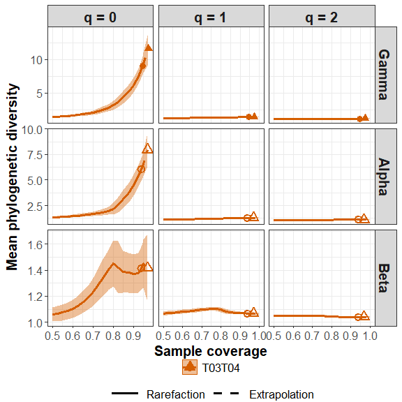

``` r
ggiNEXT_seq_Relative(out, type = "D")
```

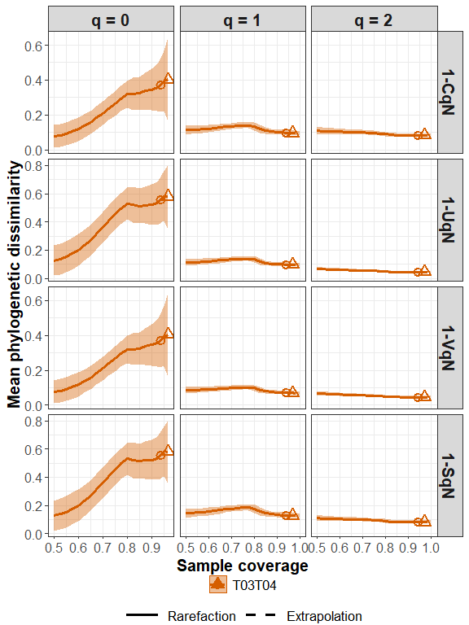

The following commands return the size-based R/E sampling curves for
gamma and alpha diversity:

``` r
out_size = iNEXT_seq_Relative(data = fungi[1], q = c(0, 1, 2), base = "size", 
                    nboot = 10, PDtree = fungi_tree, PDreftime = NULL)
ggiNEXT_seq_Relative(out_size)
```

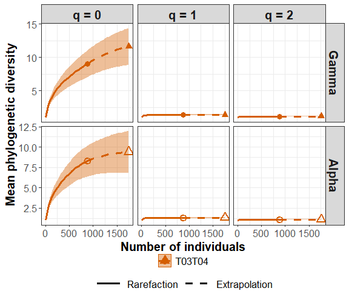

### MAIN FUNCTION: ObsAsyPD()

We first describe the main function `ObsAsyPD()` with default arguments:

``` r
ObsAsyPD(data, q = seq(0, 2, 0.2), weight = "size", nboot = 10, conf = 0.95,
         PDtree, type = "mle", decomposition = "relative")
```

The arguments of this function are briefly described below, and will be
explained in more details by illustrative examples in later text. This
main function computes observed and asymptotic diversity of order q
between 0 and 2 (in increments of 0.2) for multiple-assemblage
phylogenetic diversity; these values with different order q can be used
to depict a q-profile in the `ggObsAsyPD` function.

<table style="width:100%;">

<colgroup>

<col width="20%">

<col width="80%">

</colgroup>

<thead>

<tr class="header">

<th align="center">

Argument
</th>

<th align="left">

Description
</th>

</tr>

</thead>

<tbody>

<tr class="odd">

<td align="center">

<code>data</code>
</td>

<td align="left">

OTU count data can be input as a <code>matrix/data.frame</code> (species
by assemblages), or a list of <code>matrices/data.frames</code>, each
matrix represents species-by-assemblages abundance matrix.
</td>

</tr>

<tr class="even">

<td align="center">

<code>q</code>
</td>

<td align="left">

a numerical vector specifying the diversity orders. Default is
<code>seq(0, 2, 0.2)</code>.
</td>

</tr>

<tr class="odd">

<td align="center">

<code>weight</code>
</td>

<td align="left">

(required only when <code>type = “mle”</code> and <code>decomposition =
“relative”</code>) weight for relative decomposition empirical estimate.
Select size-weighted (<code>“size”</code>), equal-weighted
(<code>“equal”</code>) or a numerical vector for weight. Default is
<code>“size”</code>.
</td>

</tr>

<tr class="even">

<td align="center">

<code>nboot</code>
</td>

<td align="left">

a positive integer specifying the number of bootstrap replications when
assessing sampling uncertainty and constructing confidence intervals.
Bootstrap replications are generally time consuming. Enter
<code>0</code> to skip the bootstrap procedures. Default is
<code>10</code>. Note that large bootstrap replication needs more run
time.
</td>

</tr>

<tr class="odd">

<td align="center">

<code>conf</code>
</td>

<td align="left">

a positive number \< 1 specifying the level of confidence interval.
Default is <code>0.95</code>.
</td>

</tr>

<tr class="even">

<td align="center">

<code>PDtree</code>
</td>

<td align="left">

a <code>phylo</code>, a phylogenetic tree in Newick format for all
observed species in the pooled assemblage.
</td>

</tr>

<tr class="odd">

<td align="center">

<code>type</code>
</td>

<td align="left">

estimate type: empirical (<code>type = “mle”</code>) or asymptotic
estimate (<code>type = “est”</code>). Default is <code>“mle”</code>.
</td>

</tr>

<tr class="even">

<td align="center">

<code>decomposition</code>
</td>

<td align="left">

decomposition type: relative (<code>decomposition = “relative”</code>)
or absolute decomposition (<code>decomposition = “absolute”</code>).
Default is <code>“relative”</code>.
</td>

</tbody>

</table>

This function returns an `"ObsAsyPD"` object which can be further used
to make plots using the function `ggObsAsyPD()` to be described below.

#### Examples

Run the `ObsAsyPD()` function with `fungi` data to compute empirical
estimate for relative decomposition of multiple-assemblage phylogenetic
diversity. (Here we only show the first fourteen rows for output data
frame)

``` r
data("fungi")
data("fungi_tree")

ObsAsyPD_out = ObsAsyPD(data = fungi[1], q = seq(0, 2, 0.2), nboot = 10, 
                        PDtree = fungi_tree)
```

    #> $T03T04
    #>    Dataset Method Order.q Estimator Bootstrap S.E.    LCL    UCL Decomposition
    #> 1   T03T04  Gamma     0.0     6.862          2.493  1.976 11.749      relative
    #> 2   T03T04  Alpha     0.0     4.956          2.493  0.069  9.842      relative
    #> 3   T03T04   Beta     0.0     1.385          2.493 -3.502  6.271      relative
    #> 4   T03T04 1-CqN*     0.0     0.406          2.493 -4.480  5.292      relative
    #> 5   T03T04 1-UqN*     0.0     0.571          2.493 -4.315  5.457      relative
    #> 6   T03T04 1-VqN*     0.0     0.406          2.493 -4.480  5.292      relative
    #> 7   T03T04 1-SqN*     0.0     0.571          2.493 -4.315  5.457      relative
    #> 8   T03T04  Gamma     0.2     3.747          1.333  1.136  6.359      relative
    #> 9   T03T04  Alpha     0.2     2.920          1.333  0.308  5.531      relative
    #> 10  T03T04   Beta     0.2     1.284          1.333 -1.328  3.895      relative
    #> 11  T03T04 1-CqN*     0.2     0.307          1.333 -2.305  2.919      relative
    #> 12  T03T04 1-UqN*     0.2     0.433          1.333 -2.179  3.044      relative
    #> 13  T03T04 1-VqN*     0.2     0.293          1.333 -2.319  2.904      relative
    #> 14  T03T04 1-SqN*     0.2     0.449          1.333 -2.163  3.061      relative

The output contains a data frames, it includes the estimate
(`Estimator`) of diversity (`Gamma`, `Alpha` and `Beta`) and four types
dissimilarity measure (`1-CqN`, `1-UqN`, `1-VqN`, `1-SqN`), the
diversity order (`Order.q`), the standard error from bootstrap
replications (`Bootstrap S.E.`), the 95% lower and upper confidence
limits of diversity (`LCL`, `UCL`), beta diversity decomposition type
(`Decomposition`), and the name of data set (`Dataset`). These diversity
estimates with confidence intervals are used for plotting the diversity
curve.

### GRAPHIC DISPLAYS: FUNCTION ggObsAsyPD()

The function `ggObsAsyPD()`, which extends `ggplot2` to the `"ObsAsyPD"`
object with default arguments, is described as follows:

``` r
ggObsAsyPD(output, type = "B")  
```

<table style="width:100%;">

<colgroup>

<col width="20%">

<col width="80%">

</colgroup>

<thead>

<tr class="header">

<th align="center">

Argument
</th>

<th align="left">

Description
</th>

</tr>

</thead>

<tbody>

<tr class="odd">

<td align="center">

<code>output</code>
</td>

<td align="left">

the output of <code>ObsAsyPD</code>.
</td>

</tr>

<tr class="even">

<td align="center">

<code>type</code>
</td>

<td align="left">

selection of plot type: <code>type = “B”</code> for plotting the gamma,
alpha, and beta diversity; <code>type = “D”</code> for plotting 4
turnover dissimilarities.
</td>

</tbody>

</table>

The `ggObsAsyPD()` function is a wrapper around the `ggplot2` package to
create a q-profile using a single line of code. The resulting object is
of class `"ggplot"`, so it can be manipulated using the `ggplot2` tools.
Users can visualize the output of beta diversity or four dissimilarities
by setting the parameter <code>**type**</code>:

``` r
ObsAsyPD_out = ObsAsyPD(data = fungi[1], q = seq(0, 2, 0.2), nboot = 10, 
                        PDtree = fungi_tree)
ggObsAsyPD(ObsAsyPD_out, type = "B")
```

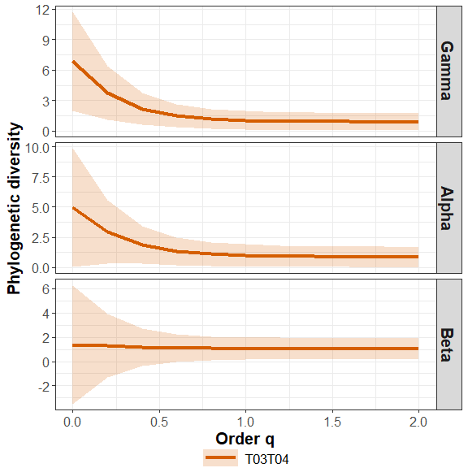

``` r
ggObsAsyPD(ObsAsyPD_out, type = "D")
```

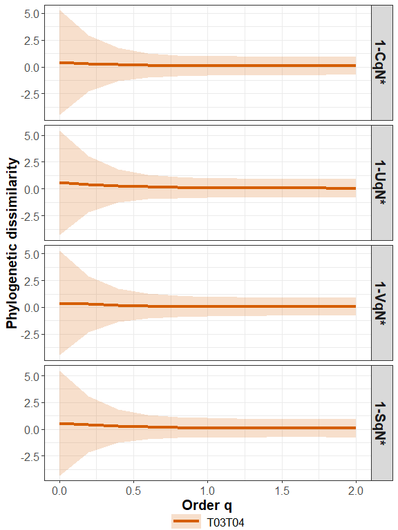

## ANALYSIS FOR HIERARCHICAL STRUCTURE DATA

### DATA INPUT FORMAT

#### Individual-based OTU count data

Input data for each data set with several assemblages/sites include
samples species abundances in an empirical sample of n individuals
(“reference sample”). When there are N assemblages in a data set, input
data consist of a list with an S by N abundance matrix.

A data set (a small example dataset from Chinese wetlands community) is
included in `iNEXT.seq` package for illustration. The data consist a
data.frames of five assemblages/habitats (“TRRsed1”, “TRRsed2”,
“TRRsed3”, “NP2” ,“NP3”,“SLEpi20M” and “LMEpi24M”).

Run the following code to `wetland` OTU count data: (Here we only show
the first ten rows for the matrix)

``` r
data("global")
global
```

    #>            TRRsed1 TRRsed2 TRRsed3 NP2 NP3 SLEpi20M LMEpi24M
    #> OTU_525863       0       0       0   0   0        0        1
    #> OTU_559617       2       2       5   4   0        1        0
    #> OTU_99331        0       2       0   0   0        0        0
    #> OTU_590151       0       6       4   0   0        0        0
    #> OTU_279253       9      82      27   0   0        0        0
    #> OTU_548078       2       1       0   0   0        1        0
    #> OTU_218062       2       4      16   0   0        0        0
    #> OTU_511714       0       0       0   0   0        1        0
    #> OTU_586263       0       1       0   0   0        0        0
    #> OTU_431743       0       0       0   1   0        0        0

#### Phylogenetic tree for phylogenetic diversity

To perform phylogenetic diversity analysis, the phylogenetic tree (in
Newick format) spanned by species observed in the pooled data is
required. For the data set `wetland`, the phylogenetic tree for all
observed species (including species in “TRRsed1”, “TRRsed2”, “TRRsed3”,
“NP2” ,“NP3”,“SLEpi20M” and “LMEpi24M”) is stored in the file
`wetland_tree`. A partial list of the tip labels and node labels (not
required) are shown below.

``` r
data("global_tree")
global_tree
```

    #> 
    #> Phylogenetic tree with 527 tips and 526 internal nodes.
    #> 
    #> Tip labels:
    #>   OTU_252853, OTU_512943, OTU_251993, OTU_62881, OTU_407348, OTU_79, ...
    #> 
    #> Rooted; includes branch length(s).

#### Structure matrix for hierarchical phylogenetic diversity

In addition to OTU count data and phylogenetic tree, a hierarchical
structure matrix of data is required. The structure of matrix is m x N
(number of hierarchical layers times number of assemblages). The
hierarchical structure matrix of data set `global` are shown below.

``` r
data("global_mat")
global_mat
```

    #>      [,1]       [,2]       [,3]       [,4]    [,5]    [,6]         [,7]        
    #> [1,] "All"      "All"      "All"      "All"   "All"   "All"        "All"       
    #> [2,] "Sediment" "Sediment" "Sediment" "Ocean" "Ocean" "Freshwater" "Freshwater"
    #> [3,] "TRRsed1"  "TRRsed2"  "TRRsed3"  "NP2"   "NP3 "  "SLEpi20M"   "LMEpi24M"

### MAIN FUNCTION: hierPD()

We first describe the main function `hierPD()` with default arguments:

``` r
hierPD(data, mat, q = seq(0, 2, 0.2), weight = "size", nboot = 10, conf = 0.95,
       PDtree, type = "mle", decomposition = "relative")
```

The arguments of this function are briefly described below, and will be
explained in more details by illustrative examples in later text. This
main function computes observed and asymptotic diversity of order q
between 0 and 2 (in increments of 0.2) for hierarchical phylogenetic
diversity; these values with different order q can be used to depict a
q-profile in the `gghierPD` function.

<table style="width:100%;">

<colgroup>

<col width="20%">

<col width="80%">

</colgroup>

<thead>

<tr class="header">

<th align="center">

Argument
</th>

<th align="left">

Description
</th>

</tr>

</thead>

<tbody>

<tr class="odd">

<td align="center">

<code>data</code>
</td>

<td align="left">

data should be input as a <code>matrix/data.frame</code> (species by
assemblages).
</td>

</tr>

<tr class="even">

<td align="center">

<code>mat</code>
</td>

<td align="left">

hierarchical structure of data should be input as a <code>matrix</code>.
</td>

</tr>

<tr class="odd">

<td align="center">

<code>q</code>
</td>

<td align="left">

a numerical vector specifying the diversity orders. Default is
<code>seq(0, 2, 0.2)</code>.
</td>

</tr>

<tr class="even">

<td align="center">

<code>weight</code>
</td>

<td align="left">

(required only when <code>type = “mle”</code> and <code>decomposition =
“relative”</code>) weight for relative decomposition empirical estimate.
Select size-weighted (<code>“size”</code>), equal-weighted
(<code>“equal”</code>) or a numerical vector for weight. Default is
<code>“size”</code>.
</td>

</tr>

<tr class="odd">

<td align="center">

<code>nboot</code>
</td>

<td align="left">

a positive integer specifying the number of bootstrap replications when
assessing sampling uncertainty and constructing confidence intervals.
Bootstrap replications are generally time consuming. Enter
<code>0</code> to skip the bootstrap procedures. Default is
<code>10</code>. Note that large bootstrap replication needs more run
time.
</td>

</tr>

<tr class="even">

<td align="center">

<code>conf</code>
</td>

<td align="left">

a positive number \< 1 specifying the level of confidence interval.
Default is <code>0.95</code>.
</td>

</tr>

<tr class="odd">

<td align="center">

<code>PDtree</code>
</td>

<td align="left">

a <code>phylo</code>, a phylogenetic tree in Newick format for all
observed species in the pooled assemblage.
</td>

</tr>

<tr class="even">

<td align="center">

<code>type</code>
</td>

<td align="left">

estimate type: empirical (<code>type = “mle”</code>) or asymptotic
estimate (<code>type = “est”</code>). Default is <code>“mle”</code>.
</td>

</tr>

<tr class="odd">

<td align="center">

<code>decomposition</code>
</td>

<td align="left">

decomposition type: relative (<code>decomposition = “relative”</code>)
or absolute decomposition (<code>decomposition = “absolute”</code>).
Default is <code>“relative”</code>.
</td>

</tbody>

</table>

This function returns an `"hierPD"` object which can be further used to
make plots using the function `gghierPD()` to be described below.

#### Examples

Run the `hierPD()` function with `global` data to compute empirical
estimate for relative decomposition of hierarchical phylogenetic
diversity. (Here we only show the first fifteen rows for output data
frame)

``` r
data("global")
data("global_mat")
data("global_tree")

hierPD_out = hierPD(data = global, mat = global_mat, q = seq(0, 2, 0.2), 
                    nboot = 10, PDtree = global_tree)
```

    #>            Method Order.q Estimator Bootstrap S.E.    LCL    UCL Decomposition
    #> 10     qPD_alpha1       0    13.188          0.105 12.982 13.394      relative
    #> 11     qPD_alpha2       0    14.319          0.264 13.801 14.837      relative
    #> 12      qPD_gamma       0    18.108          0.528 17.073 19.143      relative
    #> 13     qPD_Beta 1       0     1.086          0.021  1.044  1.127      relative
    #> 14     qPD_Beta 2       0     1.265          0.016  1.234  1.295      relative
    #> 15 qPD_Beta_max 1       0     2.172          0.012  2.148  2.197      relative
    #> 16 qPD_Beta_max 2       0     3.045          0.011  3.023  3.067      relative
    #> 17    1-CqN*(1|2)       0     0.073          0.017  0.040  0.106      relative
    #> 18    1-CqN*(2|3)       0     0.129          0.008  0.113  0.146      relative
    #> 19    1-UqN*(1|2)       0     0.146          0.027  0.094  0.199      relative
    #> 20    1-UqN*(2|3)       0     0.312          0.013  0.285  0.338      relative
    #> 21    1-VqN*(1|2)       0     0.073          0.017  0.040  0.106      relative
    #> 22    1-VqN*(2|3)       0     0.129          0.008  0.113  0.146      relative
    #> 23    1-SqN*(1|2)       0     0.146          0.027  0.094  0.199      relative
    #> 24    1-SqN*(2|3)       0     0.312          0.013  0.285  0.338      relative

The output contains a data frames, it includes the estimate
(`Estimator`) of hierarchical diversity (`qPD_gamma`, `qPD_alpha`,
`qPD_Beta` and `qPD_Beta_max`) and four types dissimilarity measure
(`1-CqN`, `1-UqN`, `1-VqN`, `1-SqN`), the diversity order (`Order.q`),
the standard error from bootstrap replications (`Bootstrap S.E.`), the
95% lower and upper confidence limits of diversity (`LCL`, `UCL`), and
beta diversity decomposition type (`Decomposition`). These diversity
estimates with confidence intervals are used for plotting the diversity
curve.

### GRAPHIC DISPLAYS: FUNCTION gghierPD()

The function `gghierPD()`, which extends `ggplot2` to the `"hierPD"`
object with default arguments, is described as follows:

``` r
gghierPD(output, type = "A")  
```

<table style="width:100%;">

<colgroup>

<col width="20%">

<col width="80%">

</colgroup>

<thead>

<tr class="header">

<th align="center">

Argument
</th>

<th align="left">

Description
</th>

</tr>

</thead>

<tbody>

<tr class="odd">

<td align="center">

<code>output</code>
</td>

<td align="left">

the output of <code>hierPD</code>.
</td>

</tr>

<tr class="even">

<td align="center">

<code>type</code>
</td>

<td align="left">

selection of plot type: (<code>type = “A”</code>) for alpha and gamma
diversity; (<code>type = “B”</code>) for beta diversity; (<code>type =
“D”</code>) for dissimilarity measure based on multiplicative
decomposition.
</td>

</tbody>

</table>

The `gghierPD()` function is a wrapper around the `ggplot2` package to
create a q-profile using a single line of code. The resulting object is
of class `"ggplot"`, so it can be manipulated using the `ggplot2` tools.
Users can visualize the output of beta diversity or four dissimilarities
by setting the parameter <code>**type**</code>:

``` r
hierPD_out = hierPD(data = wetland, mat = wetland_mat, q = seq(0, 2, 0.2), 
                    nboot = 10, PDtree = wetland_tree)
gghierPD(hierPD_out, type = "A")
```

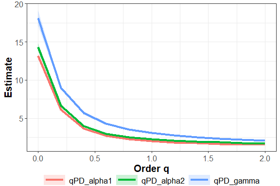

``` r
gghierPD(hierPD_out, type = "B")
```

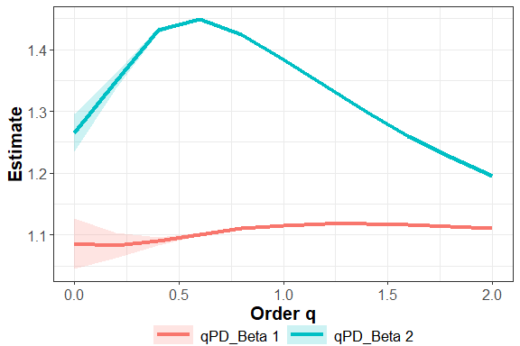

``` r
gghierPD(hierPD_out, type = "D")
```

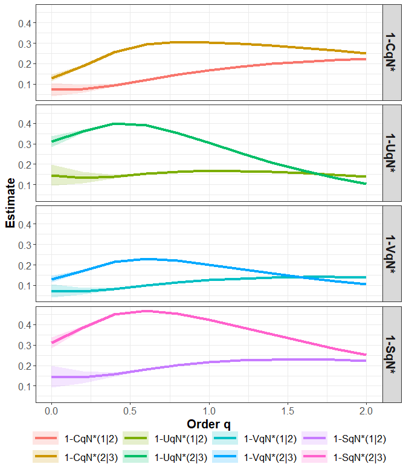

## References

- Chiu, C.-H., Jost, L. and Chao\*, A. (2014). Phylogenetic beta
  diversity, similarity, and differentiation measures based on Hill
  numbers. *Ecological Monographs*, 84, 21-44.
- Routledge, R. (1979). Diversity indices: which ones are admissible?
  *Journal of Theoretical Biology*, 76(4), 503-515.
